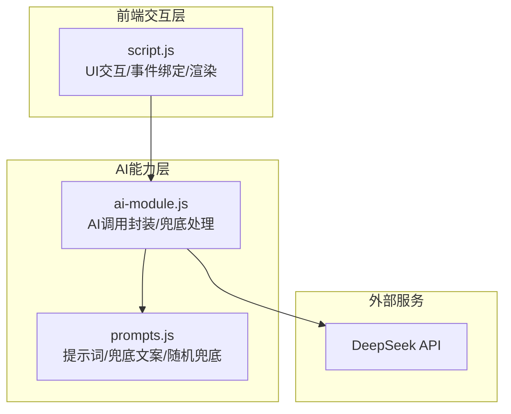
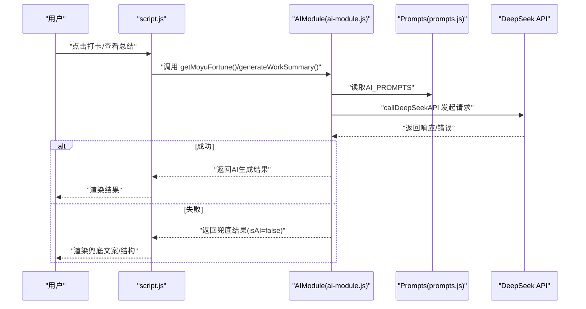
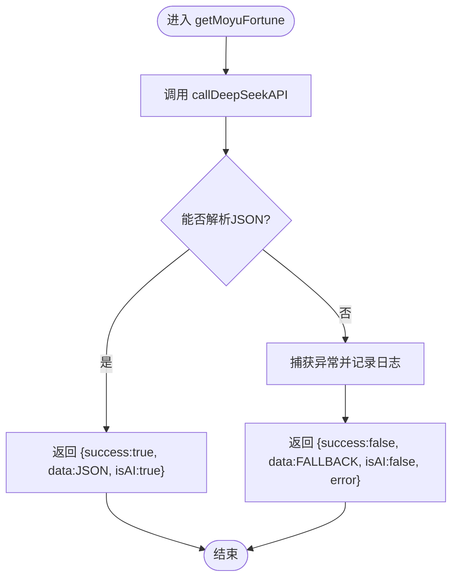
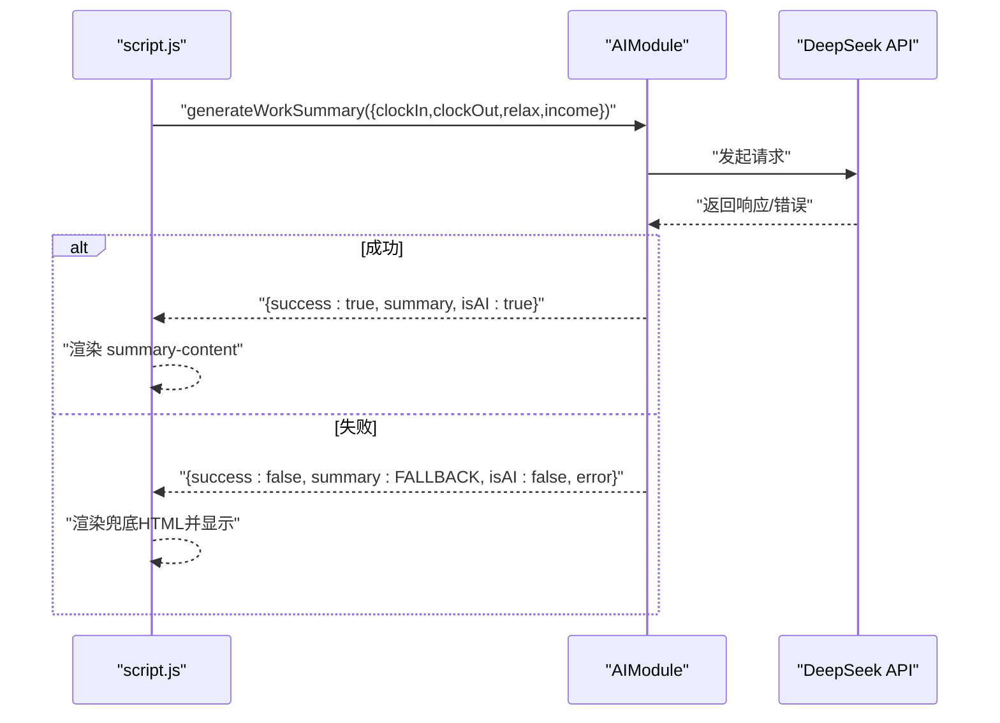
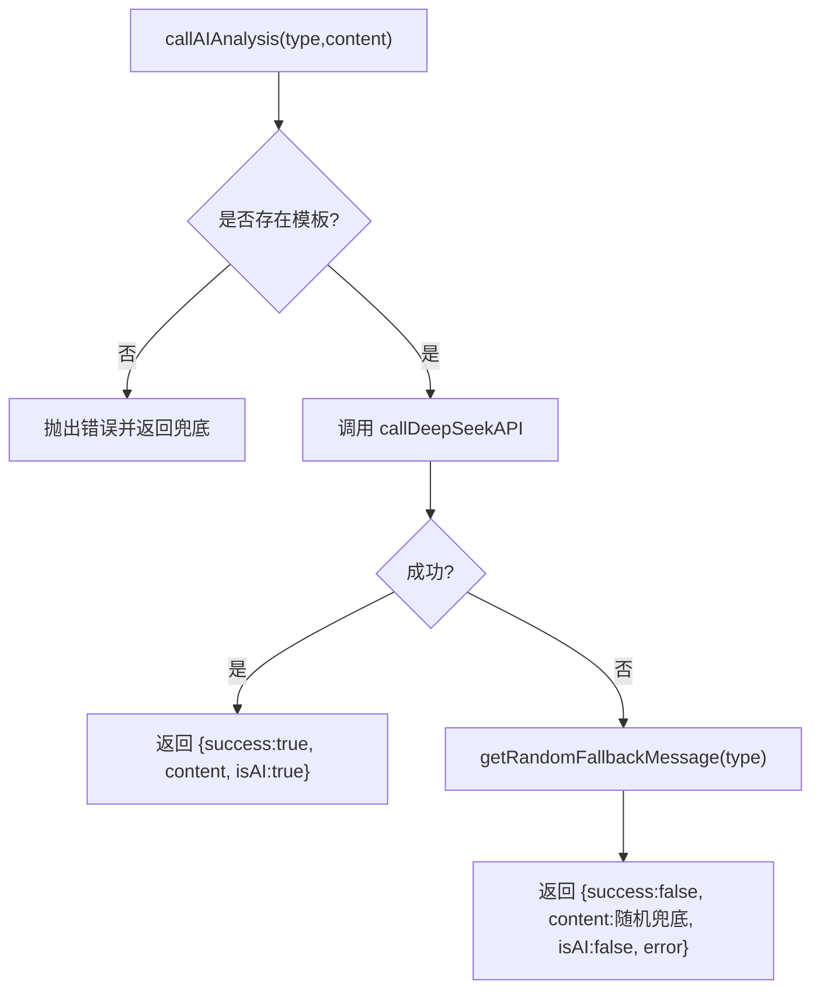
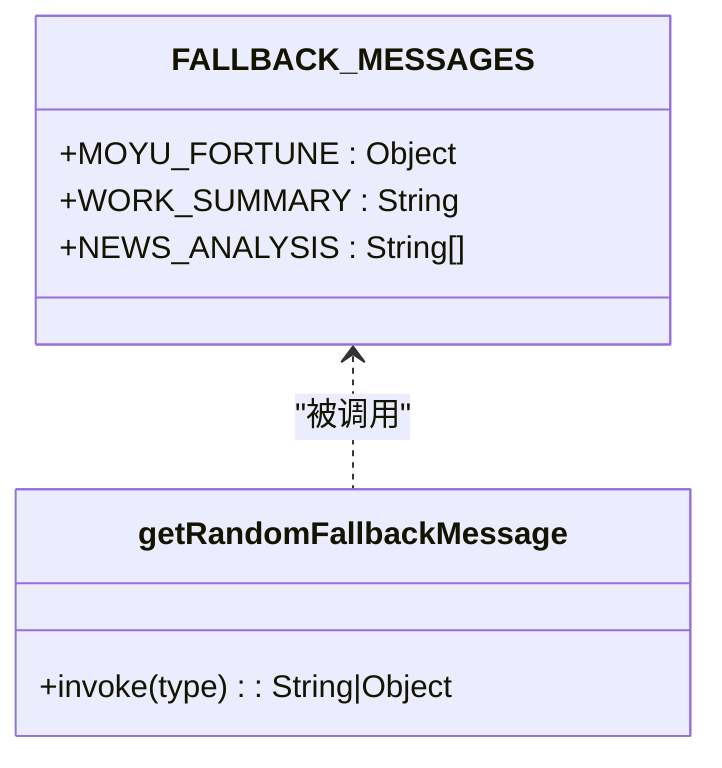
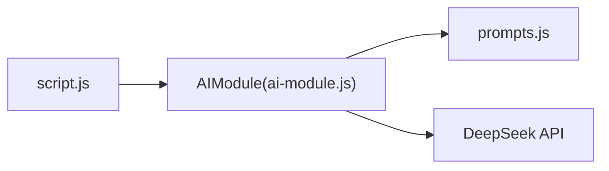

# AI兜底机制

<cite>
**本文引用的文件**
- [ai-module.js](file://ai-module.js)
- [prompts.js](file://prompts.js)
- [script.js](file://script.js)
</cite>

## 目录
1. [引言](#引言)
2. [项目结构](#项目结构)
3. [核心组件](#核心组件)
4. [架构总览](#架构总览)
5. [详细组件分析](#详细组件分析)
6. [依赖关系分析](#依赖关系分析)
7. [性能考量](#性能考量)
8. [故障排查指南](#故障排查指南)
9. [结论](#结论)

## 引言
本文件系统性阐述本项目的AI功能容错与兜底设计策略，重点说明当AI调用失败时，getMoyuFortune、generateWorkSummary等函数如何返回FALLBACK_MESSAGES中预设的默认内容，确保用户体验不中断；同时解析ai-module.js中的try-catch错误捕获机制与控制台日志输出的调试价值，解释prompts.js中FALLBACK_MESSAGES对象的结构设计，以及getRandomFallbackMessage如何按prompt类型动态返回随机兜底消息。通过这些机制，系统在AI服务不可用时仍能提供基本功能响应，显著提升稳定性与用户满意度。

## 项目结构
本项目围绕“打卡+AI”场景组织代码，AI相关逻辑集中在ai-module.js与prompts.js，前端交互与展示在script.js中调用。关键文件职责如下：
- ai-module.js：封装DeepSeek API调用、AI功能函数（含兜底）、导出至全局窗口对象
- prompts.js：统一管理AI提示词与兜底文案，导出至全局窗口对象
- script.js：负责UI交互、事件绑定、调用AIModule并渲染结果，包含日志输出与异常兜底

图表来源
- [ai-module.js](file://ai-module.js#L1-L216)
- [prompts.js](file://prompts.js#L1-L159)
- [script.js](file://script.js#L493-L732)

章节来源
- [ai-module.js](file://ai-module.js#L1-L216)
- [prompts.js](file://prompts.js#L1-L159)
- [script.js](file://script.js#L493-L732)

## 核心组件
- AI调用封装与兜底
  - callDeepSeekAPI：统一发起API请求，校验响应与错误，抛出异常供上层捕获
  - getMoyuFortune：调用AI生成摸鱼吉日签，解析JSON，失败时返回MOYU_FORTUNE兜底对象
  - generateWorkSummary：调用AI生成工作总结，失败时返回WORK_SUMMARY兜底文本
  - callAIAnalysis：通用分析入口，失败时返回随机兜底消息
- 兜底文案与随机选择
  - FALLBACK_MESSAGES：集中定义MOYU_FORTUNE（JSON结构）、WORK_SUMMARY（纯文本）、NEWS_ANALYSIS（多条随机文案）
  - getRandomFallbackMessage：按类型返回对应兜底，MOYU_FORTUNE/WORK_SUMMARY返回固定值，其他类型返回数组内随机文案
- 前端调用与展示
  - script.js在打卡流程中调用AIModule函数，监听错误并回退到兜底文案，同时输出控制台日志便于调试

章节来源
- [ai-module.js](file://ai-module.js#L14-L59)
- [ai-module.js](file://ai-module.js#L95-L127)
- [ai-module.js](file://ai-module.js#L129-L167)
- [ai-module.js](file://ai-module.js#L169-L204)
- [prompts.js](file://prompts.js#L122-L158)
- [script.js](file://script.js#L546-L728)

## 架构总览
下图展示了从用户触发到AI生成再到兜底回退的完整流程，以及各模块之间的依赖关系。

图表来源
- [script.js](file://script.js#L546-L728)
- [ai-module.js](file://ai-module.js#L95-L167)
- [prompts.js](file://prompts.js#L1-L121)

## 详细组件分析

### getMoyuFortune 兜底流程
- 调用路径：script.js -> AIModule.getMoyuFortune -> callDeepSeekAPI -> 解析JSON -> 成功返回结构化数据；失败捕获异常并返回FALLBACK_MESSAGES.MOYU_FORTUNE
- 兜底返回字段：success=false、isAI=false、data=FALLBACK_MESSAGES.MOYU_FORTUNE、error=原始错误信息
- 展示逻辑：script.js在收到非AI结果时，将错误信息写入界面并输出控制台警告，随后调用displayMoyuFortune渲染兜底卡片

图表来源
- [ai-module.js](file://ai-module.js#L95-L127)
- [prompts.js](file://prompts.js#L122-L139)
- [script.js](file://script.js#L636-L666)

章节来源
- [ai-module.js](file://ai-module.js#L95-L127)
- [prompts.js](file://prompts.js#L122-L139)
- [script.js](file://script.js#L636-L666)

### generateWorkSummary 兜底流程
- 调用路径：script.js -> AIModule.generateWorkSummary -> callDeepSeekAPI -> 成功返回文本；失败捕获异常并返回FALLBACK_MESSAGES.WORK_SUMMARY
- 兜底返回字段：success=false、isAI=false、summary=FALLBACK_MESSAGES.WORK_SUMMARY、error=原始错误信息
- 展示逻辑：script.js在FINISHED状态下调用displayWorkSummary，若生成失败则回退到固定HTML结构并渲染兜底文案

图表来源
- [ai-module.js](file://ai-module.js#L129-L167)
- [prompts.js](file://prompts.js#L122-L139)
- [script.js](file://script.js#L581-L614)
- [script.js](file://script.js#L3080-L3150)

章节来源
- [ai-module.js](file://ai-module.js#L129-L167)
- [prompts.js](file://prompts.js#L122-L139)
- [script.js](file://script.js#L581-L614)
- [script.js](file://script.js#L3080-L3150)

### callAIAnalysis 通用兜底与随机消息
- 用途：基于模板类型调用AI分析，失败时返回随机兜底消息
- 随机选择：getRandomFallbackMessage按类型返回固定兜底或数组内随机文案，保证多样化体验

图表来源
- [ai-module.js](file://ai-module.js#L169-L204)
- [prompts.js](file://prompts.js#L141-L151)

章节来源
- [ai-module.js](file://ai-module.js#L169-L204)
- [prompts.js](file://prompts.js#L141-L151)

### FALLBACK_MESSAGES 结构设计
- MOYU_FORTUNE：JSON对象，包含fortune、bestTime、tips数组，用于getMoyuFortune的兜底卡片渲染
- WORK_SUMMARY：纯文本，作为generateWorkSummary的兜底文案
- NEWS_ANALYSIS：字符串数组，用于callAIAnalysis的随机兜底消息池

图表来源
- [prompts.js](file://prompts.js#L122-L151)

章节来源
- [prompts.js](file://prompts.js#L122-L151)

### ai-module.js 错误捕获与调试日志
- callDeepSeekAPI：统一处理网络错误与响应异常，记录详细错误信息，便于定位问题
- getMoyuFortune/generateWorkSummary/callAIAnalysis：在各自try-catch块中记录console.error，同时返回包含error字段的结果，便于上层UI处理
- script.js：在收到非AI结果时，将错误信息写入界面并输出控制台warn，帮助用户理解当前处于兜底状态

章节来源
- [ai-module.js](file://ai-module.js#L14-L59)
- [ai-module.js](file://ai-module.js#L95-L127)
- [ai-module.js](file://ai-module.js#L129-L167)
- [ai-module.js](file://ai-module.js#L169-L204)
- [script.js](file://script.js#L636-L666)
- [script.js](file://script.js#L581-L614)

## 依赖关系分析
- 模块耦合
  - script.js依赖AIModule（全局导出），AIModule依赖prompts.js（全局导出）
  - AIModule内部依赖fetch与localStorage（API密钥），对外暴露统一接口
- 外部依赖
  - DeepSeek API：网络请求依赖，失败时触发兜底
- 循环依赖
  - 无循环依赖，依赖方向清晰：script.js -> AIModule -> prompts.js/DeepSeek

图表来源
- [script.js](file://script.js#L493-L732)
- [ai-module.js](file://ai-module.js#L1-L216)
- [prompts.js](file://prompts.js#L1-L159)

章节来源
- [script.js](file://script.js#L493-L732)
- [ai-module.js](file://ai-module.js#L1-L216)
- [prompts.js](file://prompts.js#L1-L159)

## 性能考量
- 兜底策略降低失败成本：在AI不可用时快速返回预设文案，避免长时间等待与重试风暴
- 前端渲染轻量化：兜底文案直接渲染，无需二次请求，减少网络与计算开销
- 日志输出仅在失败时发生，避免生产环境冗余日志
- 建议
  - 在网络层增加超时与重试上限，防止阻塞UI
  - 对频繁调用的AI接口增加本地缓存策略，进一步提升稳定性

## 故障排查指南
- 症状：AI调用失败，界面显示兜底文案
  - 排查步骤
    - 检查API密钥是否正确保存（localStorage中存在）
    - 查看控制台是否有DeepSeek API错误信息
    - 确认网络连通性与服务可用性
- 症状：getMoyuFortune返回结构不完整
  - 排查步骤
    - 确认AI返回内容符合JSON格式，或检查脚本是否正确提取JSON片段
    - 若解析失败，系统将自动回退到FALLBACK_MESSAGES.MOYU_FORTUNE
- 症状：generateWorkSummary返回纯文本兜底
  - 排查步骤
    - 检查提示词模板是否正确注入参数
    - 确认AI服务可用性，必要时重试或切换密钥

章节来源
- [ai-module.js](file://ai-module.js#L14-L59)
- [ai-module.js](file://ai-module.js#L95-L127)
- [ai-module.js](file://ai-module.js#L129-L167)
- [script.js](file://script.js#L636-L666)
- [script.js](file://script.js#L581-L614)

## 结论
本项目通过“明确的错误捕获 + 结构化的兜底文案 + 统一的随机消息池”的设计，在AI服务不稳定或不可用时，依然能够为用户提供一致、友好且具备娱乐性的体验。getMoyuFortune与generateWorkSummary在失败时返回FALLBACK_MESSAGES中的预设内容，配合前端UI的错误提示与日志输出，既保障了功能可用性，也提升了系统的可观测性与可维护性。这种设计在提升系统稳定性与用户满意度方面具有显著价值。