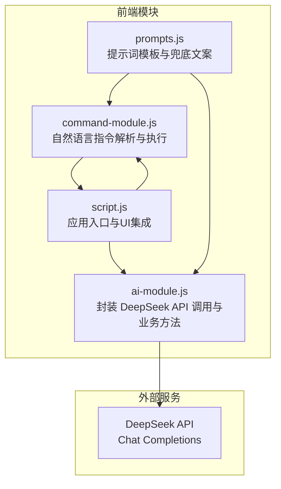
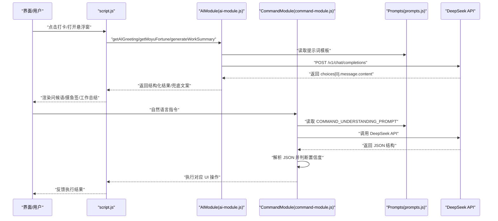
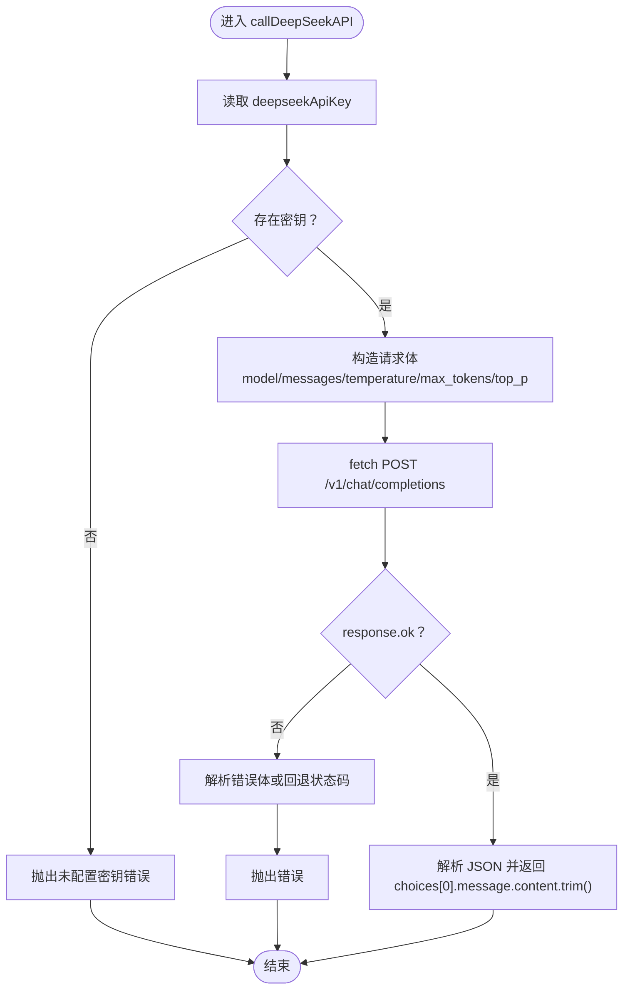
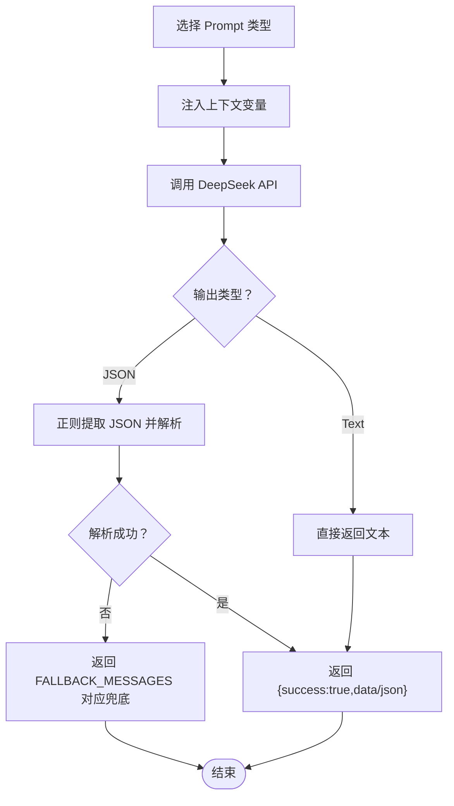
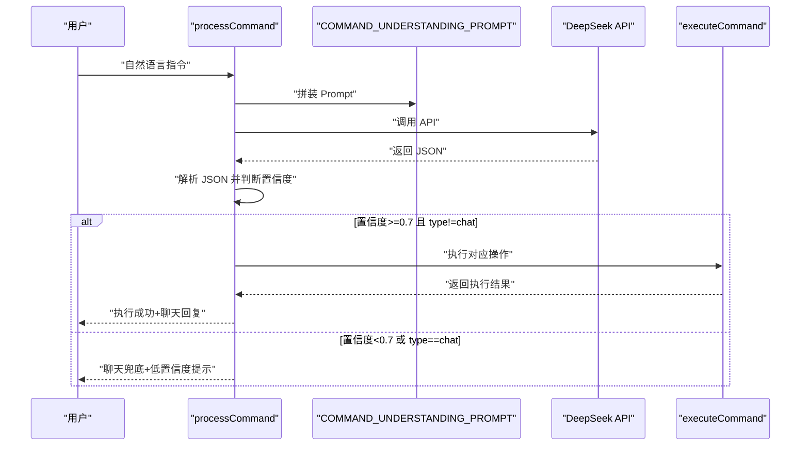
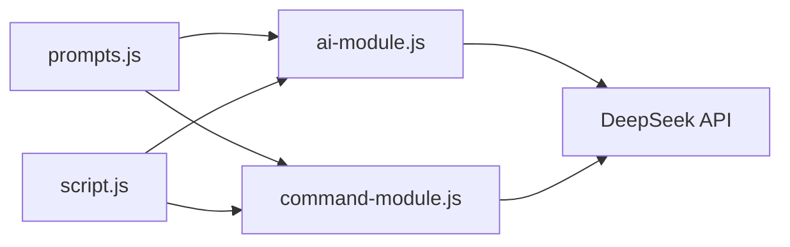

# AI功能与集成

<cite>
**本文引用的文件**
- [ai-module.js](file://ai-module.js)
- [prompts.js](file://prompts.js)
- [command-module.js](file://command-module.js)
- [script.js](file://script.js)
- [README.md](file://README.md)
</cite>

## 目录
1. [简介](#简介)
2. [项目结构](#项目结构)
3. [核心组件](#核心组件)
4. [架构总览](#架构总览)
5. [组件详解](#组件详解)
6. [依赖关系分析](#依赖关系分析)
7. [性能与调用参数](#性能与调用参数)
8. [故障排查指南](#故障排查指南)
9. [结论](#结论)
10. [附录](#附录)

## 简介
本文件面向开发者与产品人员，系统化梳理 Work Timer 中的 AI 功能与 DeepSeek API 的集成机制。重点覆盖：
- ai-module.js 中 AI 调用的请求构造、响应解析、错误处理与兜底策略
- prompts.js 中各类提示词模板的设计思路，尤其是 MOYU_FORTUNE 与 WORK_SUMMARY 的 JSON 结构设计
- command-module.js 如何利用 AI 实现自然语言指令解析与执行
- API 认证、调用频率、响应格式等技术参数
- 调试 AI 功能的实用建议

## 项目结构
AI 相关代码分布在三个模块文件中，配合主应用脚本完成端到端流程：
- ai-module.js：封装 DeepSeek API 调用、摸鱼吉日签、工作总结生成、通用 AI 分析等
- prompts.js：集中管理提示词模板与兜底文案
- command-module.js：将自然语言转为结构化指令，驱动 UI 操作
- script.js：应用入口与 UI 集成，包括 API Key 存取、测试、打卡流程触发与 AI 功能联动

图表来源
- [ai-module.js](file://ai-module.js#L1-L216)
- [prompts.js](file://prompts.js#L1-L159)
- [command-module.js](file://command-module.js#L1-L313)
- [script.js](file://script.js#L424-L995)

章节来源
- [README.md](file://README.md#L1-L125)

## 核心组件
- AI 调用封装：统一的 DeepSeek API 调用函数，负责鉴权、请求体构造、响应解析与错误处理
- 提示词模板：集中管理 MOYU_FORTUNE、WORK_SUMMARY、NEWS_ANALYSIS 等模板，以及兜底文案
- 指令解析模块：将自然语言转换为结构化指令，含置信度判断与聊天兜底
- 应用集成：设置页保存 API Key、测试连通性；打卡流程触发 AI 生成内容；悬浮窗 AI 助手

章节来源
- [ai-module.js](file://ai-module.js#L1-L216)
- [prompts.js](file://prompts.js#L1-L159)
- [command-module.js](file://command-module.js#L1-L313)
- [script.js](file://script.js#L424-L995)

## 架构总览
AI 功能在前端以模块化方式组织，通过 window 暴露全局接口，供主应用脚本调用。

图表来源
- [ai-module.js](file://ai-module.js#L1-L216)
- [prompts.js](file://prompts.js#L1-L159)
- [command-module.js](file://command-module.js#L1-L313)
- [script.js](file://script.js#L424-L995)

## 组件详解

### AI 调用封装（ai-module.js）
- 认证与请求构造
  - 从本地存储读取 API Key，缺失时报错
  - 使用 fetch 发起 POST 请求至 DeepSeek Chat Completions 接口
  - 请求体包含模型名、messages（role=user, content=prompt）、temperature、max_tokens、top_p
- 响应解析
  - 若响应非 OK，尝试解析错误体中的 message 字段，否则回退为状态码提示
  - 成功时返回 choices[0].message.content.trim()
- 兜底策略
  - getMoyuFortune：期望返回 JSON 文本，通过正则提取 JSON 并解析；失败时返回 FALLBACK_MESSAGES.MOYU_FORTUNE
  - generateWorkSummary：直接返回文本摘要；失败时返回 FALLBACK_MESSAGES.WORK_SUMMARY
  - callAIAnalysis：通用分析接口，失败时返回随机兜底文案
- 其他能力
  - getAIGreeting：不调用 AI，直接返回预设问候语集合，用于快速路径

图表来源
- [ai-module.js](file://ai-module.js#L14-L59)

章节来源
- [ai-module.js](file://ai-module.js#L14-L59)
- [ai-module.js](file://ai-module.js#L99-L127)
- [ai-module.js](file://ai-module.js#L134-L167)
- [ai-module.js](file://ai-module.js#L169-L204)

### 提示词模板与兜底（prompts.js）
- 设计原则
  - 明确角色与任务，限定输出格式（如 JSON 或纯文本）
  - 给定上下文变量占位符（如 CLOCK_IN_TIME、CLOCK_OUT_TIME 等），便于动态注入
  - 控制输出长度与风格，确保在 UI 中可读性良好
- 关键模板
  - MOYU_FORTUNE：要求返回包含 fortune、bestTime、tips 的 JSON 结构，风格幽默积极
  - WORK_SUMMARY：要求包含上班/下班时间、摸鱼次数、当日收入，长度控制在 80-120 字
  - NEWS_ANALYSIS：面向政策与经济分析，要求 Markdown 结构化输出
- 兜底文案
  - MOYU_FORTUNE：返回固定 JSON 结构，包含运势、最佳时间、锦囊
  - WORK_SUMMARY：返回固定文本
  - NEWS_ANALYSIS：返回随机提示语数组，用于占位与过渡

图表来源
- [prompts.js](file://prompts.js#L1-L159)

章节来源
- [prompts.js](file://prompts.js#L1-L159)

### 自然语言指令解析（command-module.js）
- 指令类型
  - 包括 clock_in、clock_out、start_pomodoro、pause_pomodoro、show_timeline、show_calendar、switch_tab、relax、show_settings、chat、unknown
- Prompt 设计
  - 明确操作清单与返回 JSON 结构，包含 type、confidence、params、chat_response
  - 强调只返回 JSON，避免多余文本
- 解析与执行
  - parseCommandResponse：从大模型返回文本中提取首个 JSON 片段并解析
  - processCommand：根据置信度阈值（0.7）决定执行操作或进入聊天兜底
  - executeCommand：根据指令类型触发对应 UI 行为（如点击按钮、切换标签页）
- 聊天兜底
  - 当置信度低或为 chat 模式时，返回友好的聊天回复，不执行操作

图表来源
- [command-module.js](file://command-module.js#L1-L313)

章节来源
- [command-module.js](file://command-module.js#L1-L313)

### 应用集成与 UI 协作（script.js）
- API Key 管理
  - 设置页保存/显示/测试 API Key，测试时临时写入 localStorage 并调用 AIModule.getAIGreeting
- 打卡流程
  - 上班：生成问候语、播放特效、生成摸鱼吉日签（JSON），显示并可再求一签
  - 下班：生成问候语、播放特效、生成工作总结（文本），并记录时间轴事件
- 悬浮窗 AI 助手
  - 输入自然语言，检查 API Key，调用 CommandModule.processCommand，显示执行状态与聊天回复

章节来源
- [script.js](file://script.js#L424-L491)
- [script.js](file://script.js#L494-L729)
- [script.js](file://script.js#L922-L995)

## 依赖关系分析
- 模块耦合
  - ai-module.js 依赖 prompts.js（读取模板）与浏览器环境（localStorage、fetch）
  - command-module.js 依赖 prompts.js（指令理解模板）与 AIModule（调用 DeepSeek API）
  - script.js 作为编排者，依赖 AIModule 与 CommandModule，并负责 UI 与存储
- 外部依赖
  - DeepSeek Chat Completions API：/v1/chat/completions
  - 浏览器特性：localStorage、fetch、DOM API

图表来源
- [ai-module.js](file://ai-module.js#L1-L216)
- [prompts.js](file://prompts.js#L1-L159)
- [command-module.js](file://command-module.js#L1-L313)
- [script.js](file://script.js#L424-L995)

## 性能与调用参数
- API 认证
  - 通过 localStorage 中的 deepseekApiKey 进行 Bearer 认证
- 请求参数
  - 模型：deepseek-chat
  - messages：单条 user 消息（content 为 prompt）
  - temperature：默认 1.2；不同业务场景采用不同温度（如摸鱼签 1.3、工作总结 1.4、指令解析 0.3）
  - max_tokens：默认 2000；根据不同任务调整（如摸鱼签 500、工作总结 300、指令解析 300、通用分析 2000）
  - top_p：默认 0.95
- 响应格式
  - 成功：返回 choices[0].message.content.trim()
  - 失败：解析错误体中的 message，否则回退为状态码
- 兜底策略
  - JSON 解析失败或业务解析失败时，返回 FALLBACK_MESSAGES 对应兜底
- 调用频率
  - 代码未显式限制并发或速率；建议在 UI 层做防抖与互斥（如悬浮窗发送按钮禁用）

章节来源
- [ai-module.js](file://ai-module.js#L14-L59)
- [ai-module.js](file://ai-module.js#L99-L127)
- [ai-module.js](file://ai-module.js#L134-L167)
- [ai-module.js](file://ai-module.js#L169-L204)
- [command-module.js](file://command-module.js#L182-L259)
- [prompts.js](file://prompts.js#L1-L159)

## 故障排查指南
- 未配置 API Key
  - 现象：调用 callDeepSeekAPI 抛错
  - 处理：在设置页保存密钥并测试连通性
- API 请求失败
  - 现象：response.ok 为 false，错误体解析失败时回退为状态码
  - 处理：检查网络、密钥有效性、模型名与参数
- JSON 解析失败
  - 现象：getMoyuFortune 无法提取 JSON，返回兜底
  - 处理：确认提示词模板要求返回 JSON，且大模型遵循格式；必要时降低 temperature 提高稳定性
- 指令解析失败
  - 现象：parseCommandResponse 返回空，processCommand 进入兜底聊天
  - 处理：检查 COMMAND_UNDERSTANDING_PROMPT 是否只返回 JSON；适当提高置信度阈值或调整提示词
- 悬浮窗无响应
  - 现象：点击发送按钮无反应
  - 处理：检查是否已配置 API Key；确认按钮禁用逻辑与 UI 状态更新

章节来源
- [ai-module.js](file://ai-module.js#L14-L59)
- [ai-module.js](file://ai-module.js#L99-L127)
- [command-module.js](file://command-module.js#L56-L72)
- [command-module.js](file://command-module.js#L182-L259)
- [script.js](file://script.js#L922-L995)

## 结论
本项目以模块化方式实现了与 DeepSeek API 的稳定集成：ai-module.js 提供统一的调用封装与兜底策略，prompts.js 统一管理提示词模板与兜底文案，command-module.js 将自然语言转化为可执行指令，script.js 负责 UI 集成与流程编排。通过合理的参数配置与错误处理，系统在保证用户体验的同时具备良好的健壮性与可维护性。

## 附录

### API 参数一览（基于实现）
- 端点：/v1/chat/completions
- 方法：POST
- 头部：Content-Type: application/json；Authorization: Bearer {deepseekApiKey}
- 请求体字段：
  - model: deepseek-chat
  - messages: [{ role: "user", content: "<prompt>" }]
  - temperature: 默认 1.2（可按场景调整）
  - max_tokens: 默认 2000（可按场景调整）
  - top_p: 默认 0.95
- 响应体字段：
  - choices[0].message.content: 返回文本

章节来源
- [ai-module.js](file://ai-module.js#L14-L59)

### 提示词模板要点（基于实现）
- MOYU_FORTUNE
  - 输出：JSON，包含 fortune、bestTime、tips
  - 风格：幽默积极，长度与结构受控
- WORK_SUMMARY
  - 输出：纯文本，包含上下文变量（上班/下班时间、摸鱼次数、收入）
  - 长度：80-120 字
- NEWS_ANALYSIS
  - 输出：Markdown 结构化文本，包含政策导向、影响分析、投资建议等
- 指令理解模板
  - 输出：JSON，包含 type、confidence、params、chat_response
  - 置信度阈值：0.7

章节来源
- [prompts.js](file://prompts.js#L1-L159)
- [command-module.js](file://command-module.js#L1-L313)