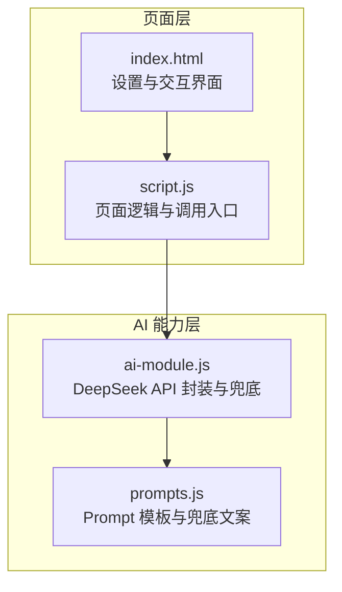
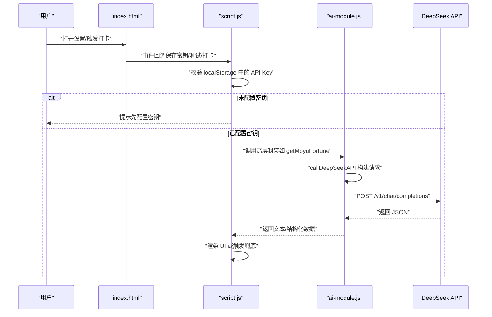
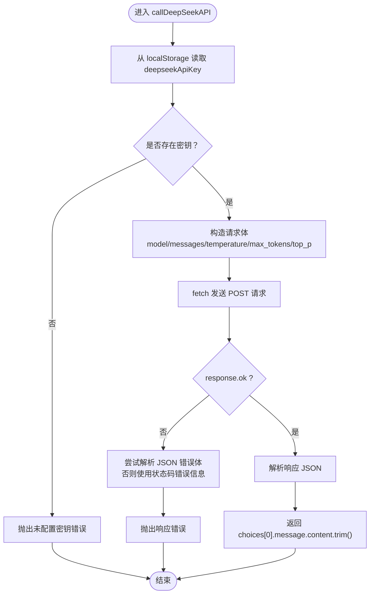
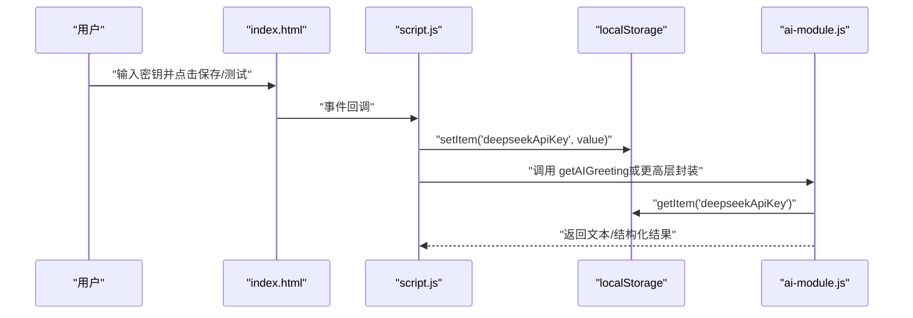
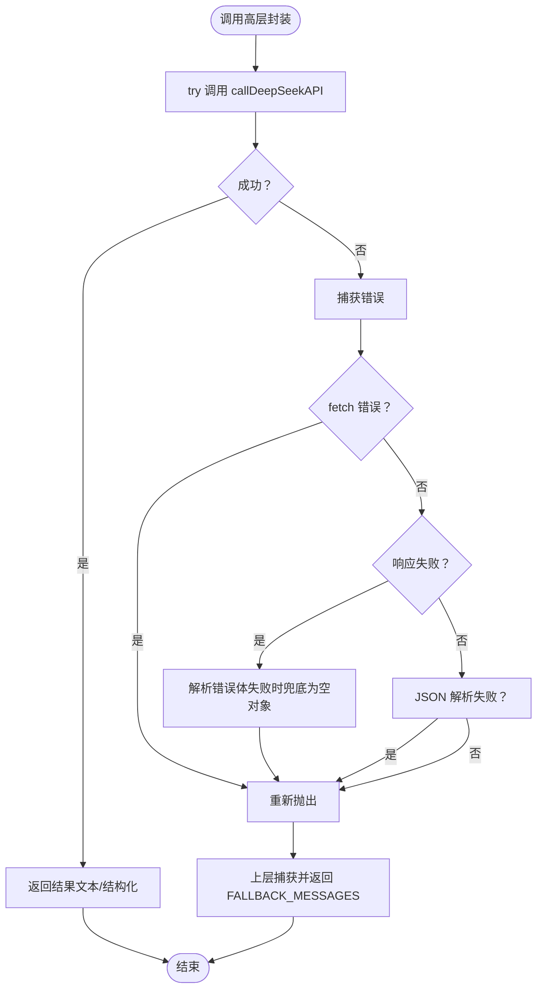
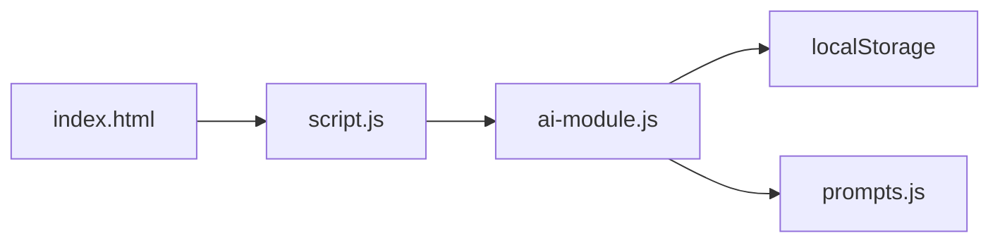

# DeepSeek API 集成

<cite>
**本文引用的文件**
- [ai-module.js](file://ai-module.js)
- [script.js](file://script.js)
- [prompts.js](file://prompts.js)
- [index.html](file://index.html)
</cite>

## 目录
1. [简介](#简介)
2. [项目结构](#项目结构)
3. [核心组件](#核心组件)
4. [架构总览](#架构总览)
5. [详细组件分析](#详细组件分析)
6. [依赖关系分析](#依赖关系分析)
7. [性能考量](#性能考量)
8. [故障排查指南](#故障排查指南)
9. [结论](#结论)
10. [附录](#附录)

## 简介
本文件围绕 DeepSeek API 在前端的集成实践展开，重点剖析 ai-module.js 中 callDeepSeekAPI 函数的实现机制，涵盖请求构造（请求头 Authorization、Content-Type、JSON 请求体字段）、密钥安全（localStorage 存取）、错误处理策略（网络异常、响应失败、JSON 解析失败）、降级与兜底逻辑、以及调用频率与响应时间优化建议。同时提供调用流程图与类图，帮助读者快速理解与正确使用该接口。

## 项目结构
本项目采用“功能模块化 + 页面脚本”的组织方式，AI 相关能力集中在独立模块中，页面脚本负责 UI 交互与调用入口。

图表来源
- [index.html](file://index.html#L430-L441)
- [script.js](file://script.js#L424-L491)
- [ai-module.js](file://ai-module.js#L1-L59)
- [prompts.js](file://prompts.js#L1-L159)

章节来源
- [index.html](file://index.html#L430-L441)
- [script.js](file://script.js#L424-L491)
- [ai-module.js](file://ai-module.js#L1-L59)
- [prompts.js](file://prompts.js#L1-L159)

## 核心组件
- DeepSeek API 封装：callDeepSeekAPI 负责构建请求、发送请求、解析响应并返回文本内容；同时提供 getAIGreeting、getMoyuFortune、generateWorkSummary、callAIAnalysis 等高层封装，均基于 callDeepSeekAPI 实现。
- Prompt 管理：prompts.js 统一维护各类 Prompt 模板与兜底文案，供上层调用。
- 页面交互：script.js 负责密钥设置、测试连接、打卡流程中对 AI 能力的调用与错误兜底。

章节来源
- [ai-module.js](file://ai-module.js#L1-L59)
- [ai-module.js](file://ai-module.js#L95-L167)
- [ai-module.js](file://ai-module.js#L169-L205)
- [prompts.js](file://prompts.js#L1-L159)
- [script.js](file://script.js#L424-L491)

## 架构总览
下图展示了从页面交互到 AI 能力调用的整体流程，以及错误与兜底路径。

图表来源
- [index.html](file://index.html#L430-L441)
- [script.js](file://script.js#L424-L491)
- [script.js](file://script.js#L547-L729)
- [ai-module.js](file://ai-module.js#L1-L59)
- [ai-module.js](file://ai-module.js#L95-L167)

## 详细组件分析

### callDeepSeekAPI 函数实现机制
- 请求目标与模型
  - 目标地址：https://api.deepseek.com/v1/chat/completions
  - 模型：deepseek-chat
- 请求方法与头部
  - 方法：POST
  - Content-Type：application/json
  - Authorization：Bearer + 从 localStorage 读取的 deepseekApiKey
- 请求体字段
  - model：指定模型
  - messages：数组，包含一条用户消息（role=user，content=传入的 prompt）
  - temperature：采样温度（默认 1.2）
  - max_tokens：最大生成长度（默认 2000）
  - top_p：核采样概率（默认 0.95）
- 响应处理
  - 若 response.ok 为 false：尝试解析 JSON 错误体，否则回退为状态码错误信息
  - 成功时解析 JSON，返回 choices[0].message.content.trim()
- 错误处理
  - 未配置密钥：抛出错误
  - fetch 异常：捕获并重新抛出
  - JSON 解析失败：在解析错误体时使用 .catch(() => ({})) 作为兜底

图表来源
- [ai-module.js](file://ai-module.js#L14-L59)

章节来源
- [ai-module.js](file://ai-module.js#L14-L59)

### API 密钥安全机制（localStorage）
- 存储位置：localStorage 中键名为 deepseekApiKey
- 读取时机：每次调用前从 localStorage 读取
- 设置入口：设置页提供输入框、显示/隐藏切换、保存按钮与测试连接按钮
- 测试流程：临时保存密钥后调用 getAIGreeting 进行连通性验证

图表来源
- [index.html](file://index.html#L430-L441)
- [script.js](file://script.js#L424-L491)
- [ai-module.js](file://ai-module.js#L14-L59)

章节来源
- [index.html](file://index.html#L430-L441)
- [script.js](file://script.js#L424-L491)
- [ai-module.js](file://ai-module.js#L14-L59)

### 错误处理策略
- 网络异常与 fetch 失败：在 callDeepSeekAPI 中捕获并重新抛出
- 响应失败（非 2xx）：尝试解析 JSON 错误体，若失败则回退为状态码错误信息
- JSON 解析失败：在解析错误体时使用 .catch(() => ({})) 作为兜底
- 上层兜底：getMoyuFortune 与 generateWorkSummary 在解析/调用失败时返回 FALLBACK_MESSAGES 并标记 isAI=false
- 交互提示：script.js 在测试连接与调用失败时向用户展示状态信息

图表来源
- [ai-module.js](file://ai-module.js#L14-L59)
- [ai-module.js](file://ai-module.js#L95-L167)
- [prompts.js](file://prompts.js#L122-L159)
- [script.js](file://script.js#L424-L491)

章节来源
- [ai-module.js](file://ai-module.js#L14-L59)
- [ai-module.js](file://ai-module.js#L95-L167)
- [prompts.js](file://prompts.js#L122-L159)
- [script.js](file://script.js#L424-L491)

### 降级与兜底逻辑
- getMoyuFortune：期望返回 JSON，若匹配不到或解析失败，则使用 FALLBACK_MESSAGES.MOYU_FORTUNE，并返回 isAI=false 与 error 字段
- generateWorkSummary：调用失败时返回 FALLBACK_MESSAGES.WORK_SUMMARY，并标记 isAI=false
- callAIAnalysis：解析失败或调用失败时返回对应类型随机兜底文案，并标记 isAI=false
- 页面层：在测试连接失败或调用失败时，向用户展示状态信息

章节来源
- [ai-module.js](file://ai-module.js#L95-L167)
- [prompts.js](file://prompts.js#L122-L159)
- [script.js](file://script.js#L424-L491)

### 调用示例与最佳实践
- 正确调用路径
  - 保存密钥：在设置页输入密钥并保存，或点击“测试连接”临时保存后验证
  - 触发调用：在打卡流程中调用 AIModule.getAIGreeting、getMoyuFortune、generateWorkSummary 等
  - 参数传递：通过 options 传入 temperature、maxTokens、topP 等参数
- 示例参考路径
  - 保存密钥与测试连接：[script.js](file://script.js#L424-L491)
  - 打卡流程中调用 AI：[script.js](file://script.js#L547-L729)
  - 调用高层封装（摸鱼吉日签）：[ai-module.js](file://ai-module.js#L95-L167)
  - 调用高层封装（工作总结）：[ai-module.js](file://ai-module.js#L134-L167)
  - 调用高层封装（AI 分析）：[ai-module.js](file://ai-module.js#L169-L205)
  - 构造请求与返回文本：[ai-module.js](file://ai-module.js#L14-L59)

章节来源
- [script.js](file://script.js#L424-L491)
- [script.js](file://script.js#L547-L729)
- [ai-module.js](file://ai-module.js#L95-L167)
- [ai-module.js](file://ai-module.js#L134-L167)
- [ai-module.js](file://ai-module.js#L169-L205)
- [ai-module.js](file://ai-module.js#L14-L59)

## 依赖关系分析
- ai-module.js 依赖
  - localStorage：读取/写入 deepseekApiKey
  - window.AI_PROMPTS：高层封装使用的 Prompt 模板
  - window.FALLBACK_MESSAGES：高层封装失败时的兜底文案
- script.js 依赖
  - index.html 的设置表单与按钮
  - window.AIModule：调用 AI 能力
- prompts.js 依赖
  - window：导出 AI_PROMPTS、FALLBACK_MESSAGES、getRandomFallbackMessage

图表来源
- [script.js](file://script.js#L424-L491)
- [ai-module.js](file://ai-module.js#L1-L59)
- [prompts.js](file://prompts.js#L1-L159)
- [index.html](file://index.html#L430-L441)

章节来源
- [script.js](file://script.js#L424-L491)
- [ai-module.js](file://ai-module.js#L1-L59)
- [prompts.js](file://prompts.js#L1-L159)
- [index.html](file://index.html#L430-L441)

## 性能考量
- 请求体大小与生成长度
  - max_tokens 默认 2000，可根据场景调整（如摸鱼吉日签 500，工作总结 300，AI 分析 2000），避免不必要的长文本生成
- 采样参数
  - temperature 默认 1.2，较高温度带来多样性但可能降低稳定性；对于需要稳定输出的任务（如命令解析）可降低温度
- 重试与节流
  - 当前实现未内置重试与节流，建议在高频调用场景下增加指数退避重试与调用频率限制，避免触发服务端限流
- 响应时间优化
  - 优先使用较小的 max_tokens 与合理的 temperature
  - 将非关键路径（如问候语）改为本地直出（getAIGreeting 已实现），减少网络往返
  - 对于 JSON 解析失败的场景，尽快回退到兜底文案，避免长时间等待

章节来源
- [ai-module.js](file://ai-module.js#L14-L59)
- [ai-module.js](file://ai-module.js#L95-L167)
- [ai-module.js](file://ai-module.js#L169-L205)

## 故障排查指南
- 未配置 API 密钥
  - 现象：调用立即抛错
  - 处理：在设置页输入并保存密钥，或点击“测试连接”临时保存后重试
  - 参考：[script.js](file://script.js#L424-L491)
- 网络异常或服务不可达
  - 现象：fetch 抛错被重新抛出
  - 处理：检查网络连通性，稍后重试
  - 参考：[ai-module.js](file://ai-module.js#L14-L59)
- 响应失败（非 2xx）
  - 现象：解析错误体或回退为状态码错误信息
  - 处理：根据错误信息修正密钥或请求参数
  - 参考：[ai-module.js](file://ai-module.js#L48-L51)
- JSON 解析失败
  - 现象：解析错误体或返回文本失败
  - 处理：检查返回格式，必要时调整 Prompt 使其严格返回所需格式
  - 参考：[ai-module.js](file://ai-module.js#L48-L51)
- 上层调用失败（摸鱼吉日签/工作总结）
  - 现象：返回 FALLBACK_MESSAGES 并标记 isAI=false
  - 处理：记录 error 字段，提示用户稍后重试
  - 参考：[ai-module.js](file://ai-module.js#L95-L167), [prompts.js](file://prompts.js#L122-L159)

章节来源
- [script.js](file://script.js#L424-L491)
- [ai-module.js](file://ai-module.js#L14-L59)
- [ai-module.js](file://ai-module.js#L95-L167)
- [prompts.js](file://prompts.js#L122-L159)

## 结论
本项目通过独立的 ai-module.js 将 DeepSeek API 的调用抽象为 callDeepSeekAPI，并在高层封装中实现严格的错误处理与兜底策略。配合 localStorage 的密钥管理与页面层的测试连接流程，实现了较为完善的前端集成方案。建议在生产环境中进一步引入重试与限流策略，以提升稳定性与用户体验。

## 附录
- 关键调用路径参考
  - 保存密钥与测试连接：[script.js](file://script.js#L424-L491)
  - 打卡流程中调用 AI：[script.js](file://script.js#L547-L729)
  - 调用高层封装（摸鱼吉日签）：[ai-module.js](file://ai-module.js#L95-L167)
  - 调用高层封装（工作总结）：[ai-module.js](file://ai-module.js#L134-L167)
  - 调用高层封装（AI 分析）：[ai-module.js](file://ai-module.js#L169-L205)
  - 构造请求与返回文本：[ai-module.js](file://ai-module.js#L14-L59)
  - Prompt 模板与兜底文案：[prompts.js](file://prompts.js#L1-L159)