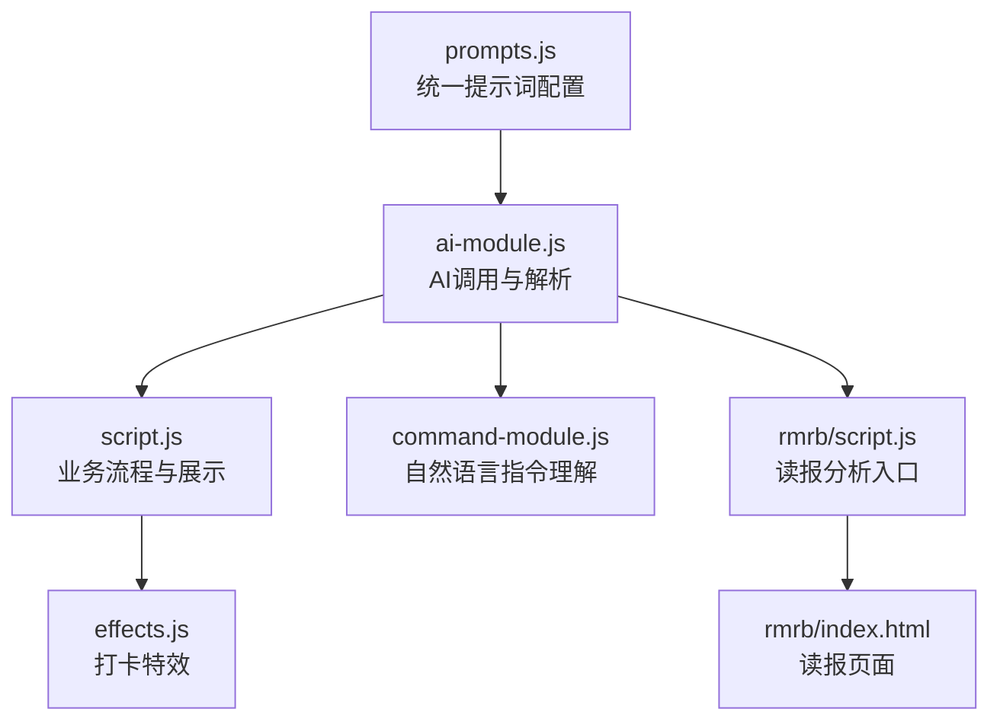
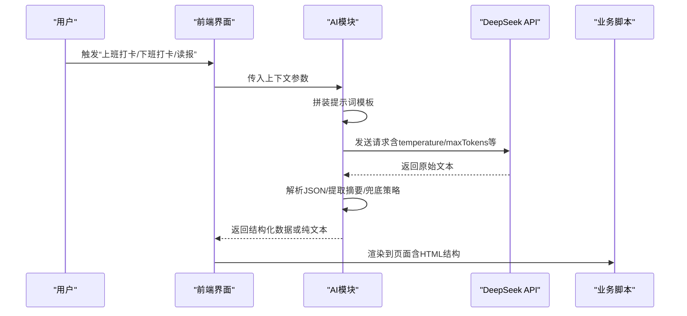
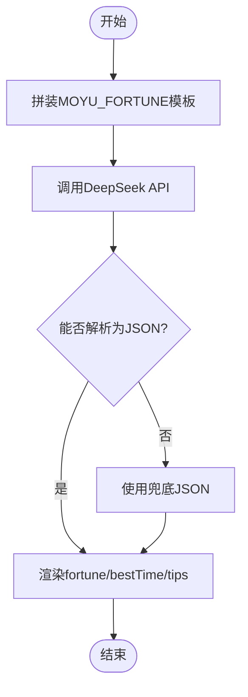
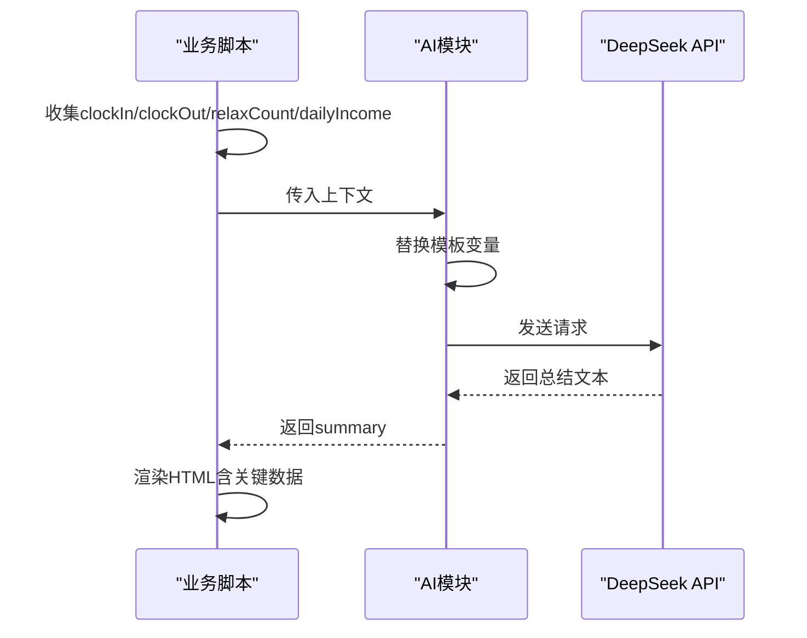
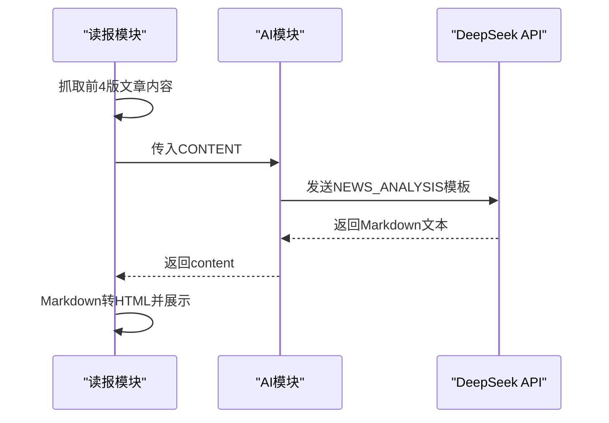
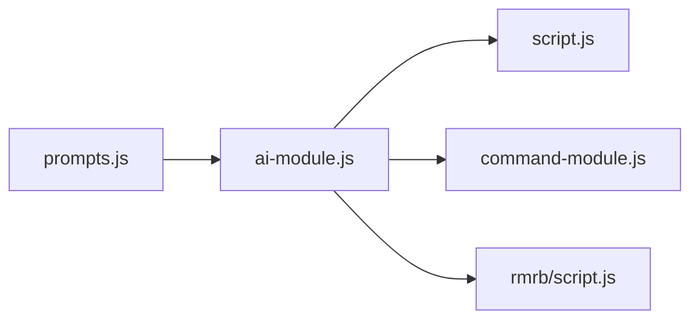
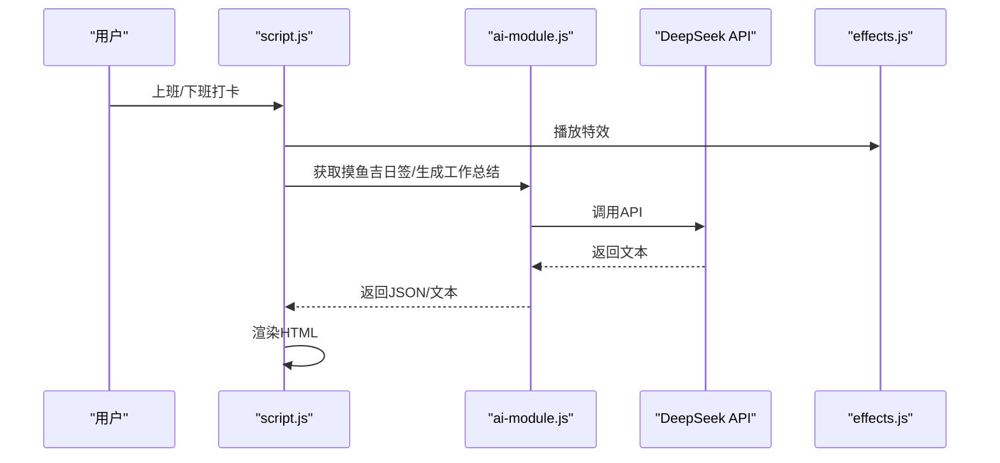

# 提示词工程设计

<cite>
**本文引用的文件**
- [prompts.js](file://prompts.js)
- [ai-module.js](file://ai-module.js)
- [script.js](file://script.js)
- [command-module.js](file://command-module.js)
- [effects.js](file://effects.js)
- [rmrb/script.js](file://rmrb/script.js)
- [rmrb/index.html](file://rmrb/index.html)
- [README.md](file://README.md)
</cite>

## 目录
1. [引言](#引言)
2. [项目结构](#项目结构)
3. [核心组件](#核心组件)
4. [架构总览](#架构总览)
5. [详细组件分析](#详细组件分析)
6. [依赖关系分析](#依赖关系分析)
7. [性能考量](#性能考量)
8. [故障排查指南](#故障排查指南)
9. [结论](#结论)
10. [附录](#附录)

## 引言
本文件围绕提示词工程体系展开，重点解析两类核心Prompt：MOYU_FORTUNE（摸鱼吉日签）与WORK_SUMMARY（下班工作总结），并补充说明NEWS_ANALYSIS（AI读报分析）的结构化输出设计。文档从提示词结构、生成规则、模板变量替换、输出格式约束、错误兜底与解析策略等方面进行系统化梳理，帮助读者理解提示词如何驱动AI生成稳定、可解析、可复用的文本内容，并在前端界面中正确呈现。

## 项目结构
提示词工程位于统一的提示词配置文件中，配合AI模块与业务脚本共同完成生成与展示流程。下图展示了与提示词工程相关的关键文件与职责分工。

图表来源
- [prompts.js](file://prompts.js#L1-L120)
- [ai-module.js](file://ai-module.js#L1-L216)
- [script.js](file://script.js#L540-L730)
- [command-module.js](file://command-module.js#L1-L120)
- [rmrb/script.js](file://rmrb/script.js#L358-L418)
- [effects.js](file://effects.js#L1-L120)
- [rmrb/index.html](file://rmrb/index.html#L1-L62)

章节来源
- [README.md](file://README.md#L32-L50)

## 核心组件
- 提示词配置：集中管理MOYU_FORTUNE、WORK_SUMMARY、NEWS_ANALYSIS等提示词模板，以及兜底文案。
- AI模块：封装DeepSeek API调用、提示词拼装、JSON解析与兜底回退。
- 业务脚本：负责收集上下文数据、调用AI生成、渲染界面。
- 自然语言指令模块：基于提示词理解用户意图，执行对应操作。
- 读报分析模块：抓取人民日报内容，调用AI进行结构化输出分析。

章节来源
- [prompts.js](file://prompts.js#L1-L120)
- [ai-module.js](file://ai-module.js#L1-L216)
- [script.js](file://script.js#L3026-L3151)
- [command-module.js](file://command-module.js#L1-L120)
- [rmrb/script.js](file://rmrb/script.js#L358-L418)

## 架构总览
提示词工程的端到端流程如下：前端触发（打卡/读报/指令），AI模块拼装提示词并调用API，解析器提取结构化内容或纯文本摘要，业务层渲染到页面，同时提供兜底策略与错误处理。

图表来源
- [ai-module.js](file://ai-module.js#L95-L167)
- [script.js](file://script.js#L3026-L3151)
- [rmrb/script.js](file://rmrb/script.js#L358-L418)

## 详细组件分析

### MOYU_FORTUNE（摸鱼吉日签）提示词设计
- 设计目标
  - 生成“今日摸鱼运势”“最佳摸鱼时间”“摸鱼锦囊”三项信息，风格幽默、积极、轻松。
- 输出格式与约束
  - 必须返回JSON，包含三个键：fortune、bestTime、tips。
  - fortune：一句话描述，长度约15-25字，可含星级表达。
  - bestTime：具体时间段与简短原因，格式为“时间段 - 原因”。
  - tips：数组，包含2-3条建议，每条15-30字。
  - 语气：幽默诙谐、积极向上；内容贴近办公场景；语言接地气。
- 生成规则
  - 由AI模块调用API，设置较高temperature与适中maxTokens，鼓励创意与多样性。
  - 解析策略：从返回文本中提取首个JSON片段并解析，若失败则使用兜底JSON。
- 兜底策略
  - 若AI调用失败或解析失败，使用预设兜底JSON，保证界面稳定显示。

图表来源
- [prompts.js](file://prompts.js#L1-L25)
- [ai-module.js](file://ai-module.js#L95-L127)

章节来源
- [prompts.js](file://prompts.js#L1-L25)
- [ai-module.js](file://ai-module.js#L95-L127)
- [script.js](file://script.js#L3026-L3061)

### WORK_SUMMARY（下班工作总结）提示词设计
- 数据来源与模板变量
  - 模板中包含四个占位符：{CLOCK_IN_TIME}、{CLOCK_OUT_TIME}、{RELAX_COUNT}、{DAILY_INCOME}。
  - 业务脚本在调用前完成变量替换，确保上下文完整。
- 输出格式与约束
  - 直接输出总结文字，不要JSON格式。
  - 语气积极、长度控制在80-120字，包含关键数据（上下班时间、摸鱼次数、今日收入）。
  - 可加入办公室梗或调侃，保持轻松幽默。
- 生成规则
  - 由AI模块调用API，设置较高temperature以增强创意，maxTokens适中。
  - 返回文本直接作为总结内容，业务层渲染到页面。
- 兜底策略
  - 若AI调用失败，使用兜底文本，保证页面可读性。

图表来源
- [ai-module.js](file://ai-module.js#L129-L167)
- [script.js](file://script.js#L3079-L3151)

章节来源
- [prompts.js](file://prompts.js#L27-L47)
- [ai-module.js](file://ai-module.js#L129-L167)
- [script.js](file://script.js#L3079-L3151)

### NEWS_ANALYSIS（AI读报分析）提示词设计
- 目标场景
  - 对人民日报前四版要闻进行经济导向与政策影响分析，输出结构化Markdown。
- 结构化输出设计
  - 使用Markdown标题层级、分节与分隔线，形成清晰的阅读结构。
  - 输出包含：整体政策导向、重点文章深度解读（含核心内容、经济导向、政策影响、未来趋势）、投资与决策建议、风险提示、总结与展望等板块。
- 应用流程
  - 读报模块抓取前若干版文章内容，拼装为统一文本，调用AI分析。
  - AI返回Markdown文本，前端将其转换为HTML并在模态框中展示。

图表来源
- [prompts.js](file://prompts.js#L49-L120)
- [rmrb/script.js](file://rmrb/script.js#L358-L418)

章节来源
- [prompts.js](file://prompts.js#L49-L120)
- [rmrb/script.js](file://rmrb/script.js#L358-L418)
- [rmrb/index.html](file://rmrb/index.html#L1-L62)

### 模板变量替换机制与调用链
- WORK_SUMMARY模板变量替换
  - 在AI模块中，使用字符串替换方法将{CLOCK_IN_TIME}、{CLOCK_OUT_TIME}、{RELAX_COUNT}、{DAILY_INCOME}分别替换为实际值。
  - 为避免冲突，同时提供带花括号与不带花括号两种匹配，确保兼容性。
- 调用链路
  - 业务脚本收集数据后调用AI模块的generateWorkSummary。
  - AI模块拼装提示词并调用API，返回纯文本摘要。
  - 业务脚本将摘要与关键数据组合渲染到页面。

章节来源
- [ai-module.js](file://ai-module.js#L134-L167)
- [script.js](file://script.js#L3079-L3151)

### 输出格式严格性与可解析性保障
- JSON格式严格性
  - MOYU_FORTUNE要求仅返回JSON，AI模块通过正则提取首个JSON片段并解析，确保即使AI输出包含额外文字也能稳定提取。
- 纯文本格式严格性
  - WORK_SUMMARY要求直接输出总结文字，不返回JSON；AI模块直接返回文本，业务层直接渲染。
- 兜底策略
  - 任一环节失败（API错误、解析失败、网络异常），均回退到预设兜底文案，保证用户体验与界面稳定性。
- 错误兜底配置
  - prompts.js中提供MOYU_FORTUNE、WORK_SUMMARY、NEWS_ANALYSIS三类兜底消息，其中MOYU_FORTUNE为JSON结构，WORK_SUMMARY为字符串，NEWS_ANALYSIS为字符串数组（随机选取）。

章节来源
- [prompts.js](file://prompts.js#L122-L159)
- [ai-module.js](file://ai-module.js#L95-L167)

### 与自然语言指令的集成
- 指令理解提示词
  - 命令模块提供指令理解模板，要求返回JSON，包含type、confidence、params、chat_response等字段。
  - AI模块解析响应时同样采用正则提取首个JSON片段，确保低温度下的确定性输出。
- 执行流程
  - 用户语音/文本输入经命令模块理解后，若置信度达标则执行对应操作；否则以聊天模式回复。

章节来源
- [command-module.js](file://command-module.js#L24-L54)
- [command-module.js](file://command-module.js#L182-L259)
- [ai-module.js](file://ai-module.js#L57-L73)

## 依赖关系分析
提示词工程的耦合与内聚情况如下：
- 耦合点
  - prompts.js与ai-module.js：提示词模板与调用逻辑紧密耦合，ai-module负责拼装与解析。
  - ai-module.js与业务脚本：业务脚本依赖ai-module提供的生成函数与解析策略。
  - 读报模块与ai-module.js：读报模块依赖callAIAnalysis统一接口。
- 内聚性
  - 提示词集中在prompts.js，便于维护与扩展；AI模块封装API细节，降低上层复杂度。
- 潜在风险
  - 若提示词变更导致字段名或结构变化，需同步更新解析与渲染逻辑。
  - 兜底文案需与界面结构保持一致，避免渲染异常。

图表来源
- [prompts.js](file://prompts.js#L1-L120)
- [ai-module.js](file://ai-module.js#L1-L216)
- [script.js](file://script.js#L540-L730)
- [command-module.js](file://command-module.js#L1-L120)
- [rmrb/script.js](file://rmrb/script.js#L358-L418)

## 性能考量
- API调用参数
  - 温度与最大token：MOYU_FORTUNE与WORK_SUMMARY分别设置较高温度与适中maxTokens，平衡创意与可控性。
- 解析策略
  - 使用正则提取首个JSON片段，避免全量解析带来的性能开销。
- 前端渲染
  - 读报分析采用简单Markdown转HTML，避免重型渲染库引入。
- 动画与交互
  - 打卡特效使用Canvas与requestAnimationFrame，注意在移动端的性能与内存占用。

章节来源
- [ai-module.js](file://ai-module.js#L14-L59)
- [ai-module.js](file://ai-module.js#L95-L167)
- [effects.js](file://effects.js#L136-L200)

## 故障排查指南
- API密钥缺失
  - 现象：调用API时报错。
  - 处理：在设置页保存有效密钥，或检查本地存储。
- AI返回非JSON
  - 现象：MOYU_FORTUNE解析失败。
  - 处理：确认提示词要求仅返回JSON；若AI输出包含额外文字，解析器会尝试提取首个JSON片段；必要时启用兜底。
- WORK_SUMMARY返回格式不符
  - 现象：返回内容不符合“直接输出总结文字”的要求。
  - 处理：检查提示词约束；若AI未遵守，启用兜底文本。
- 读报分析失败
  - 现象：无法获取文章内容或分析失败。
  - 处理：检查网络与CORS代理；确认已加载前4版文章；查看错误提示并重试。
- 兜底文案未生效
  - 现象：界面空白或显示异常。
  - 处理：确认兜底文案类型与界面结构一致；检查随机选择逻辑。

章节来源
- [ai-module.js](file://ai-module.js#L14-L59)
- [ai-module.js](file://ai-module.js#L95-L167)
- [prompts.js](file://prompts.js#L122-L159)
- [rmrb/script.js](file://rmrb/script.js#L358-L418)

## 结论
提示词工程通过严格的结构化约束与解析策略，确保AI输出在不同场景下具备可解析性与一致性。MOYU_FORTUNE强调JSON结构与字段规范，WORK_SUMMARY强调纯文本摘要与字数控制，NEWS_ANALYSIS强调Markdown结构化输出。配合统一的兜底策略与错误处理，系统在复杂业务场景中仍能保持稳定与可维护性。建议后续持续完善提示词模板与解析健壮性，以应对更多样化的业务需求。

## 附录
- 关键流程可视化（打卡与读报）

图表来源
- [script.js](file://script.js#L540-L730)
- [effects.js](file://effects.js#L1-L120)
- [ai-module.js](file://ai-module.js#L95-L167)