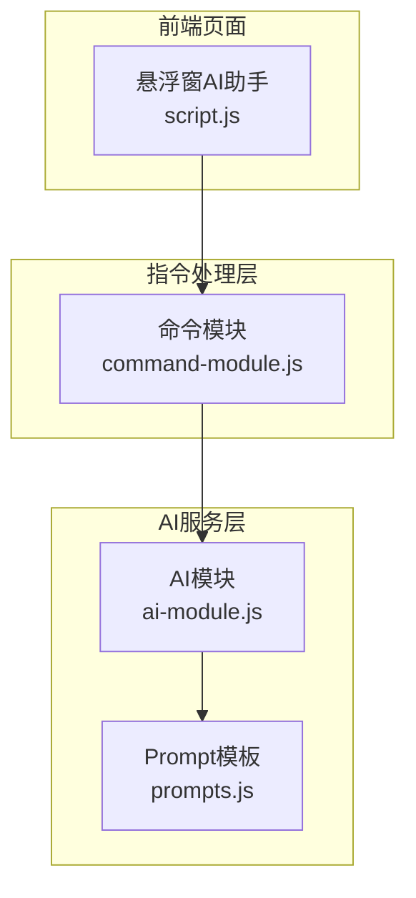
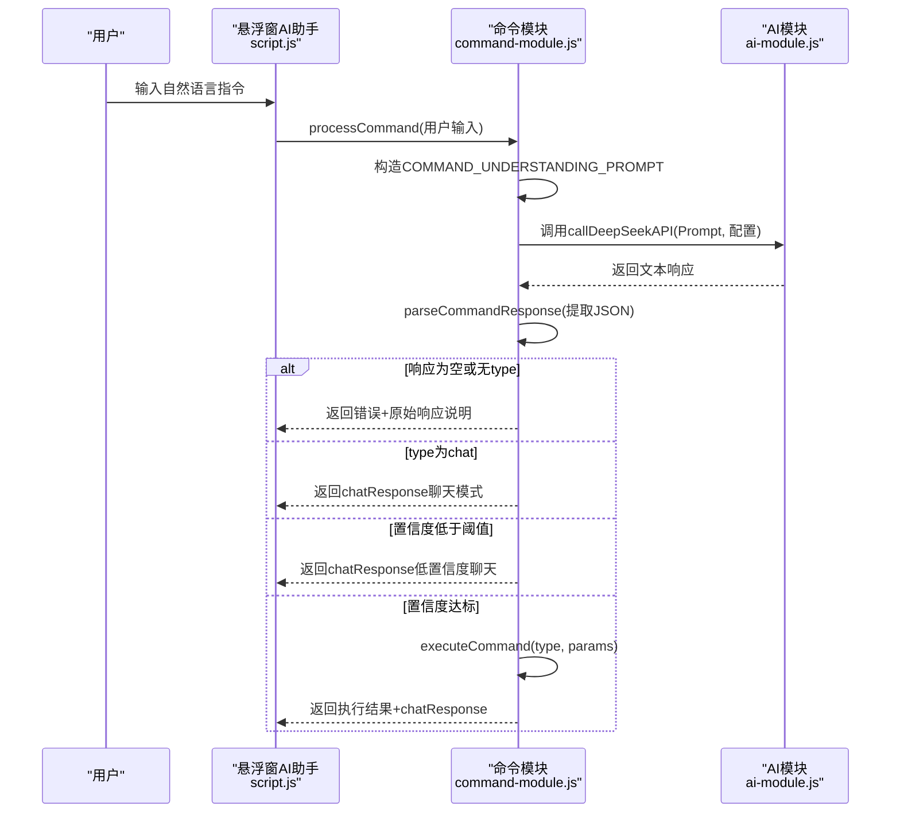
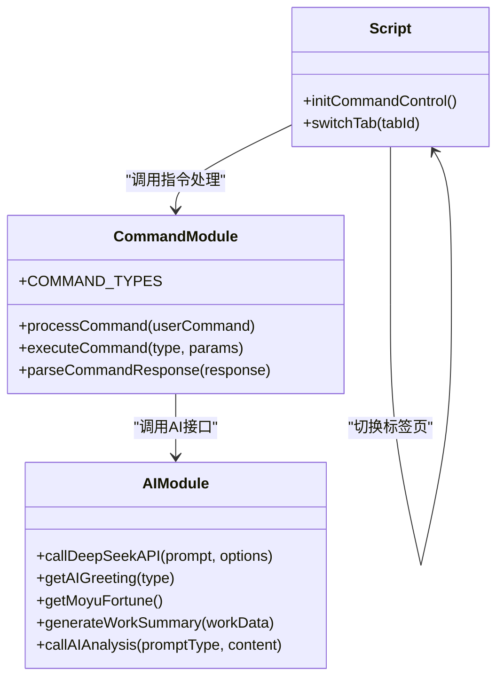
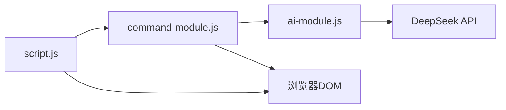

# 自然语言指令解析

<cite>
**本文引用的文件**
- [command-module.js](file://command-module.js)
- [ai-module.js](file://ai-module.js)
- [prompts.js](file://prompts.js)
- [script.js](file://script.js)
- [README.md](file://README.md)
</cite>

## 目录
1. [简介](#简介)
2. [项目结构](#项目结构)
3. [核心组件](#核心组件)
4. [架构总览](#架构总览)
5. [详细组件分析](#详细组件分析)
6. [依赖关系分析](#依赖关系分析)
7. [性能考量](#性能考量)
8. [故障排查指南](#故障排查指南)
9. [结论](#结论)

## 简介
本文件围绕 command-module.js 中的自然语言指令处理流程进行全面解析，重点说明：
- COMMAND_UNDERSTANDING_PROMPT 如何定义10种可执行操作类型及其触发关键词；
- 大模型如何基于用户输入判断意图并返回结构化JSON（包含type、confidence、params、chat_response）；
- parseCommandResponse 如何从AI响应中提取JSON对象；
- executeCommand 如何根据type与params执行对应的DOM操作（如模拟点击打卡按钮、切换标签页等）；
- 置信度机制（confidence）与 CONFIDENCE_THRESHOLD 阈值的作用，确保低置信度指令仅作为聊天响应而不执行实际操作；
- 结合代码示例说明 processCommand 的完整执行链路：用户输入→Prompt构造→AI调用→响应解析→指令执行或聊天反馈。

## 项目结构
本项目采用前端模块化组织，自然语言指令处理位于 command-module.js，AI调用封装位于 ai-module.js，Prompt模板集中于 prompts.js，页面入口与交互逻辑位于 script.js。

图表来源
- [script.js](file://script.js#L922-L1030)
- [command-module.js](file://command-module.js#L182-L259)
- [ai-module.js](file://ai-module.js#L1-L60)
- [prompts.js](file://prompts.js#L1-L40)

章节来源
- [README.md](file://README.md#L90-L120)
- [script.js](file://script.js#L922-L1030)
- [command-module.js](file://command-module.js#L1-L55)
- [ai-module.js](file://ai-module.js#L1-L60)
- [prompts.js](file://prompts.js#L1-L40)

## 核心组件
- 指令类型常量：定义10种可执行操作类型（clock_in、clock_out、start_pomodoro、pause_pomodoro、show_timeline、show_calendar、switch_tab、relax、show_settings、chat、unknown），用于统一识别与分支执行。
- 意图理解Prompt：在 COMMAND_UNDERSTANDING_PROMPT 中明确列出10种操作类型及典型触发关键词，要求AI返回结构化JSON并给出置信度，同时规定chat模式的适用范围与回复风格。
- 响应解析：parseCommandResponse 通过正则匹配与JSON.parse提取AI返回中的JSON片段，容错处理异常情况。
- 指令执行：executeCommand 根据type与params执行DOM操作，如点击按钮、切换标签页、记录摸鱼事件等；对不可用状态进行保护性返回。
- 指令处理主流程：processCommand 负责构造Prompt、调用AI、解析响应、判断置信度、执行或转聊天反馈，并汇总返回结果。

章节来源
- [command-module.js](file://command-module.js#L7-L19)
- [command-module.js](file://command-module.js#L21-L54)
- [command-module.js](file://command-module.js#L59-L72)
- [command-module.js](file://command-module.js#L77-L180)
- [command-module.js](file://command-module.js#L182-L259)

## 架构总览
自然语言指令处理的端到端流程如下：

图表来源
- [script.js](file://script.js#L971-L1021)
- [command-module.js](file://command-module.js#L182-L259)
- [ai-module.js](file://ai-module.js#L14-L59)

## 详细组件分析

### 指令类型与触发关键词
- 指令类型枚举：包含clock_in、clock_out、start_pomodoro、pause_pomodoro、show_timeline、show_calendar、switch_tab、relax、show_settings、chat、unknown。
- 触发关键词：COMMAND_UNDERSTANDING_PROMPT 中为每种类型提供了典型触发表达（如“上班了”、“开始番茄钟”、“切换到日历”等），用于引导AI准确识别意图。

章节来源
- [command-module.js](file://command-module.js#L7-L19)
- [command-module.js](file://command-module.js#L21-L54)

### Prompt构造与意图判断
- 构造策略：processCommand 将用户输入注入 COMMAND_UNDERSTANDING_PROMPT 的占位符，形成最终Prompt。
- 调用参数：processCommand 调用 AIModule.callDeepSeekAPI 时传入temperature、maxTokens等参数，以稳定输出结构化JSON。
- 输出约束：COMMAND_UNDERSTANDING_PROMPT 明确要求返回JSON，包含type、confidence、params、chat_response，并给出chat模式与高置信度的规则。

章节来源
- [command-module.js](file://command-module.js#L182-L204)
- [command-module.js](file://command-module.js#L21-L54)
- [ai-module.js](file://ai-module.js#L14-L59)

### 响应解析与结构化提取
- 解析流程：parseCommandResponse 使用正则匹配响应中的JSON片段，再通过JSON.parse解析为对象；若匹配失败或解析异常，返回null并记录错误。
- 容错设计：processCommand 在解析失败时返回错误说明与原始响应，避免中断流程。

章节来源
- [command-module.js](file://command-module.js#L59-L72)
- [command-module.js](file://command-module.js#L194-L204)

### 置信度机制与阈值控制
- 置信度含义：confidence为0-1之间的小数，表示AI对意图判断的确定程度。
- 阈值规则：CONFIDENCE_THRESHOLD 设为0.7。当confidence < 0.7时，系统判定为低置信度，仅返回chatResponse，不执行任何DOM操作。
- 行为差异：
  - chat模式：type为chat时直接返回chatResponse；
  - 低置信度：返回chatResponse并标记lowConfidence；
  - 高置信度：执行executeCommand并返回执行结果。

章节来源
- [command-module.js](file://command-module.js#L206-L231)
- [command-module.js](file://command-module.js#L218-L231)

### DOM操作执行与分支逻辑
- 执行映射：executeCommand 通过动作表(actions)将COMMAND_TYPES映射到具体DOM操作，包括：
  - 打卡：根据按钮dataset.type判断并模拟点击；
  - 番茄钟：打开模态框后延时点击开始按钮；
  - 时间轴：打开时间轴面板；
  - 日历/设置：调用switchTab切换标签页；
  - 摸鱼：点击第一个倒计时卡片；
  - unknown：返回“不理解”的友好提示。
- 条件保护：对按钮可见性、显示状态、tab函数存在性进行检查，失败时返回友好提示。

章节来源
- [command-module.js](file://command-module.js#L77-L180)
- [script.js](file://script.js#L1032-L1062)

### 完整执行链路与交互反馈
- 链路步骤：
  1) 用户在悬浮窗输入指令；
  2) initCommandControl 调用 CommandModule.processCommand；
  3) processCommand 构造Prompt并调用AIModule.callDeepSeekAPI；
  4) parseCommandResponse 提取JSON；
  5) 根据type与confidence决定执行或聊天；
  6) executeCommand 执行DOM操作；
  7) UI显示chatResponse与执行状态（成功/低置信度）。
- 交互细节：UI在发送按钮禁用期间显示“思考中...”，完成后恢复按钮状态；根据executed与lowConfidence显示不同状态提示。

章节来源
- [script.js](file://script.js#L971-L1021)
- [command-module.js](file://command-module.js#L182-L259)

### 类关系与职责划分

图表来源
- [command-module.js](file://command-module.js#L182-L259)
- [ai-module.js](file://ai-module.js#L14-L59)
- [script.js](file://script.js#L922-L1030)

## 依赖关系分析
- 模块耦合：
  - command-module.js 依赖 window.AIModule（ai-module.js）进行API调用；
  - command-module.js 依赖 window.switchTab（script.js）进行标签页切换；
  - command-module.js 依赖DOM元素ID与dataset属性（如clock-in-btn.dataset.type）；
  - ai-module.js 依赖localStorage中的API Key与DeepSeek服务端。
- 外部依赖：
  - DeepSeek Chat Completions API；
  - 浏览器DOM API（document、localStorage、fetch）。

图表来源
- [command-module.js](file://command-module.js#L182-L259)
- [ai-module.js](file://ai-module.js#L14-L59)
- [script.js](file://script.js#L922-L1030)

章节来源
- [command-module.js](file://command-module.js#L182-L259)
- [ai-module.js](file://ai-module.js#L14-L59)
- [script.js](file://script.js#L922-L1030)

## 性能考量
- 温度系数：processCommand 使用较低temperature（0.3）以提升意图判断稳定性，减少歧义输出。
- 响应解析：parseCommandResponse 采用正则匹配与JSON.parse，避免复杂解析逻辑带来的开销。
- DOM操作延迟：executeCommand 对“开始番茄钟”使用短延迟（约100ms）等待模态框打开后再点击开始，兼顾正确性与性能。
- 错误兜底：当API Key缺失或解析失败时，快速返回并提示，避免长时间阻塞。

章节来源
- [command-module.js](file://command-module.js#L188-L192)
- [command-module.js](file://command-module.js#L100-L108)
- [command-module.js](file://command-module.js#L59-L72)
- [script.js](file://script.js#L983-L992)

## 故障排查指南
- 未配置API Key
  - 现象：发送按钮被禁用，UI提示“请先在设置中配置DeepSeek API Key”，随后自动跳转到设置页。
  - 处理：在设置页保存有效API Key后重试。
- AI响应非JSON或结构不规范
  - 现象：processCommand 返回错误说明与原始响应，chatResponse提示“未能理解”。
  - 处理：调整输入表达，使其更贴近COMMAND_UNDERSTANDING_PROMPT中的触发关键词；或稍后重试。
- 低置信度指令
  - 现象：返回chatResponse并标记lowConfidence，不执行任何操作。
  - 处理：重新表述指令，使其更明确地指向某类操作。
- 打卡/番茄钟按钮不可用
  - 现象：executeCommand返回“当前不能执行/无法执行”等提示。
  - 处理：确认当前时间状态（如已下班、番茄钟未运行）与按钮可见性；必要时刷新页面后重试。
- 标签页切换失败
  - 现象：executeCommand返回“无法切换标签页”。
  - 处理：确认switchTab函数存在且tabId合法；检查页面是否存在对应tab内容。

章节来源
- [script.js](file://script.js#L983-L992)
- [command-module.js](file://command-module.js#L194-L204)
- [command-module.js](file://command-module.js#L216-L231)
- [command-module.js](file://command-module.js#L77-L180)

## 结论
command-module.js 通过明确的指令类型定义、严格的Prompt约束与稳健的响应解析机制，实现了从自然语言到DOM操作的闭环。置信度阈值与chat模式设计有效平衡了准确性与用户体验，确保低置信度指令仅作为聊天反馈，避免误操作。结合ai-module.js与script.js的协同，形成了清晰、可维护且具备良好扩展性的前端AI交互体系。