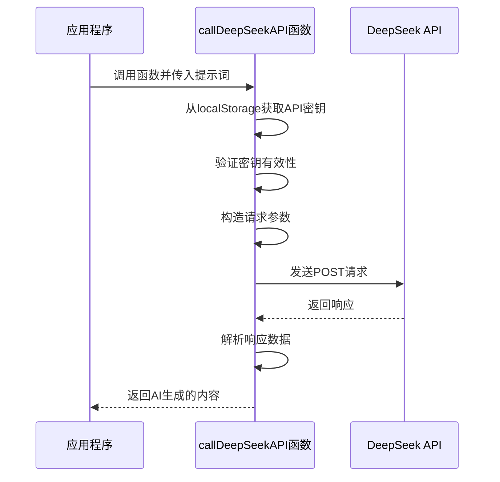
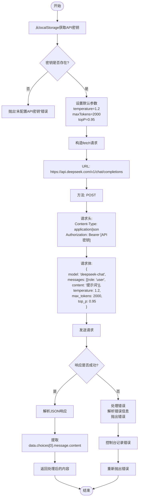
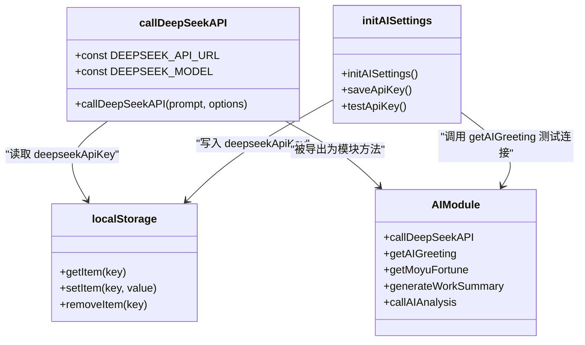
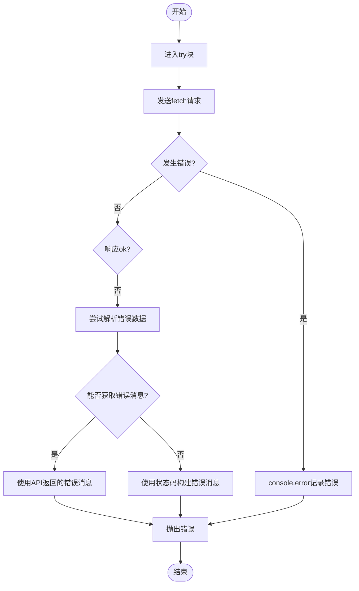
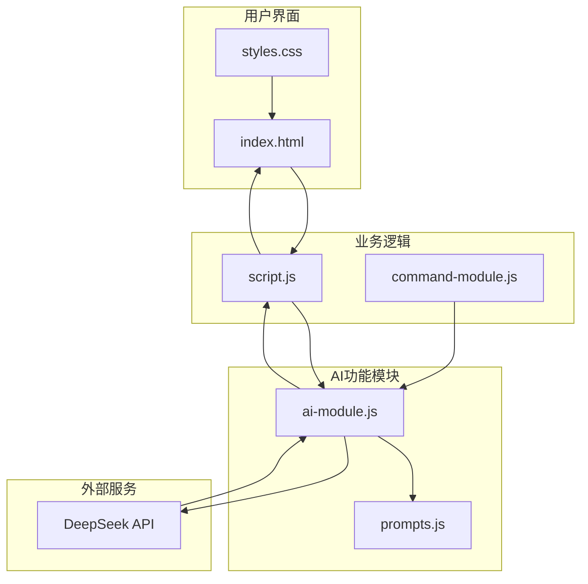

# AI API集成与认证

<cite>
**本文档引用的文件**
- [ai-module.js](file://ai-module.js)
- [prompts.js](file://prompts.js)
- [script.js](file://script.js)
- [index.html](file://index.html)
</cite>

## 目录
1. [简介](#简介)
2. [核心实现机制](#核心实现机制)
3. [API请求构造](#api请求构造)
4. [认证与密钥管理](#认证与密钥管理)
5. [错误处理机制](#错误处理机制)
6. [调用示例与常见问题](#调用示例与常见问题)
7. [集成应用分析](#集成应用分析)

## 简介
本文档详细说明了`ai-module.js`文件中`callDeepSeekAPI`函数的实现机制。该函数是整个AI功能模块的核心，负责与DeepSeek API进行通信，为应用程序提供AI能力支持。通过分析该函数的实现，我们可以深入了解如何在前端应用中安全、可靠地集成第三方AI服务。

**Section sources**
- [ai-module.js](file://ai-module.js#L1-L216)

## 核心实现机制
`callDeepSeekAPI`函数是一个异步函数，采用现代JavaScript的`async/await`语法，通过`fetch` API与DeepSeek服务进行通信。该函数的设计遵循了模块化和可复用的原则，为上层应用提供了简洁的API接口。

函数接收两个参数：`prompt`（提示词）和可选的`options`配置对象。其核心工作流程包括：从本地存储获取API密钥、验证密钥有效性、构造符合DeepSeek API规范的HTTP请求、发送请求并处理响应、以及在发生错误时进行适当的错误处理。

该函数被设计为可被多个上层功能调用，如生成摸鱼吉日签、生成工作总结等，体现了良好的分层架构设计。



**Diagram sources**
- [ai-module.js](file://ai-module.js#L14-L58)

**Section sources**
- [ai-module.js](file://ai-module.js#L14-L58)

## API请求构造
`callDeepSeekAPI`函数精心构造了符合DeepSeek API规范的HTTP请求。请求的构造过程包括URL、HTTP方法、请求头和请求体的设置。

### 请求URL与方法
函数使用常量`DEEPSEEK_API_URL`定义了API端点，该常量指向`https://api.deepseek.com/v1/chat/completions`。请求采用POST方法，这是与AI模型交互的标准方式。

### 请求头
请求头包含两个关键的键值对：
- `Content-Type`: 设置为`application/json`，表明请求体是JSON格式
- `Authorization`: 使用Bearer认证模式，将从localStorage获取的API密钥附加到请求头中

### 请求体结构
请求体是一个JSON对象，包含以下关键参数：
- `model`: 指定使用的模型，通过`DEEPSEEK_MODEL`常量定义为`deepseek-chat`
- `messages`: 包含用户提示的数组，每个消息对象包含`role`（角色）和`content`（内容）
- `temperature`: 控制生成文本的随机性，可由调用者通过options参数配置
- `max_tokens`: 限制生成文本的最大长度
- `top_p`: 控制生成文本的多样性



**Diagram sources**
- [ai-module.js](file://ai-module.js#L28-L46)

**Section sources**
- [ai-module.js](file://ai-module.js#L28-L46)

## 认证与密钥管理
`callDeepSeekAPI`函数实现了安全的API密钥管理机制，确保用户凭证的安全存储和使用。

### 密钥存储
API密钥通过浏览器的`localStorage`进行持久化存储，使用键名`deepseekApiKey`。这种存储方式允许用户在不同会话间保持认证状态，而无需重复输入密钥。

### 密钥获取与验证
函数首先通过`localStorage.getItem('deepseekApiKey')`尝试获取存储的密钥。如果密钥不存在（返回null或空字符串），函数会立即抛出一个错误，提示"未配置 API 密钥"。这种即时验证机制可以避免向API发送无效请求，提高用户体验。

### 用户界面集成
密钥管理与用户界面紧密集成。在`index.html`的设置页面中，提供了专门的输入框供用户输入和保存API密钥。`script.js`中的`initAISettings`函数负责处理密钥的保存和测试功能，为用户提供了直观的密钥管理体验。



**Diagram sources**
- [ai-module.js](file://ai-module.js#L1-L216)
- [script.js](file://script.js#L424-L491)
- [index.html](file://index.html#L429-L440)

**Section sources**
- [ai-module.js](file://ai-module.js#L15-L19)
- [script.js](file://script.js#L433-L457)
- [index.html](file://index.html#L432-L435)

## 错误处理机制
`callDeepSeekAPI`函数实现了全面的错误处理机制，确保在各种异常情况下都能提供有意义的反馈。

### try-catch结构
函数使用`try-catch`语句包裹整个API调用过程，捕获可能发生的异步错误，如网络连接问题、DNS解析失败等。

### 响应状态码检查
在收到响应后，函数立即检查`response.ok`属性。如果响应状态码表示请求失败（如4xx或5xx），函数会进入错误处理流程。

### 错误信息解析
对于失败的API调用，函数尝试通过`response.json()`解析返回的错误信息。为了防止JSON解析失败导致的二次错误，使用了`.catch(() => ({}))`来提供默认的空对象。函数优先使用API返回的错误消息，如果无法获取，则使用状态码构建通用错误信息。

### 错误日志与传播
捕获到的错误首先通过`console.error`记录到控制台，便于开发者调试。然后，错误被重新抛出，允许上层调用者根据需要进行进一步处理。



**Diagram sources**
- [ai-module.js](file://ai-module.js#L27-L58)

**Section sources**
- [ai-module.js](file://ai-module.js#L27-L58)

## 调用示例与常见问题
`callDeepSeekAPI`函数被设计为易于使用，同时提供了处理常见问题的机制。

### 正确调用示例
```javascript
// 基本调用
const result = await callDeepSeekAPI("你好，世界！");

// 带配置选项的调用
const result = await callDeepSeekAPI("写一首关于春天的诗", {
    temperature: 1.5,
    maxTokens: 500
});
```

### 常见错误场景及解决方案
**密钥缺失**
- **现象**: 抛出"未配置 API 密钥"错误
- **解决方案**: 用户需在设置页面输入并保存API密钥

**网络错误**
- **现象**: 抛出网络连接相关的错误
- **解决方案**: 检查网络连接，确认API服务是否可用

**API调用失败**
- **现象**: 抛出"API 请求失败"错误
- **解决方案**: 检查API密钥是否有效，确认请求参数是否符合规范

### 上层调用模式
该函数被多个上层函数调用，形成了一个健壮的AI功能调用链：
- `getMoyuFortune`: 获取摸鱼吉日签，使用`MOYU_FORTUNE`提示模板
- `generateWorkSummary`: 生成工作总结，使用`WORK_SUMMARY`提示模板
- `callAIAnalysis`: 通用AI分析，支持多种提示类型

这些上层函数都实现了"兜底"机制，当AI调用失败时，会返回预设的备用内容，确保用户体验不受影响。

**Section sources**
- [ai-module.js](file://ai-module.js#L100-L126)
- [ai-module.js](file://ai-module.js#L134-L166)
- [ai-module.js](file://ai-module.js#L175-L203)
- [prompts.js](file://prompts.js#L4-L119)

## 集成应用分析
`callDeepSeekAPI`函数在整体应用架构中扮演着关键角色，与其他组件紧密协作，共同实现了丰富的AI功能。

### 组件交互
该函数与多个组件协同工作：
- **prompts.js**: 提供标准化的提示词模板
- **script.js**: 实现用户界面逻辑和事件处理
- **index.html**: 提供用户交互界面
- **styles.css**: 定义相关UI元素的样式

### 功能流程
从用户交互到AI响应的完整流程如下：
1. 用户在设置页面输入API密钥并保存
2. 用户执行触发AI功能的操作（如上班打卡）
3. 相应的事件处理函数被调用
4. 事件处理函数调用`callDeepSeekAPI`并传入适当的提示词
5. `callDeepSeekAPI`与DeepSeek API通信并返回结果
6. 结果被处理并显示给用户

这种清晰的职责分离和模块化设计使得代码易于维护和扩展。



**Diagram sources**
- [ai-module.js](file://ai-module.js)
- [prompts.js](file://prompts.js)
- [script.js](file://script.js)
- [index.html](file://index.html)

**Section sources**
- [ai-module.js](file://ai-module.js)
- [prompts.js](file://prompts.js)
- [script.js](file://script.js)
- [index.html](file://index.html)