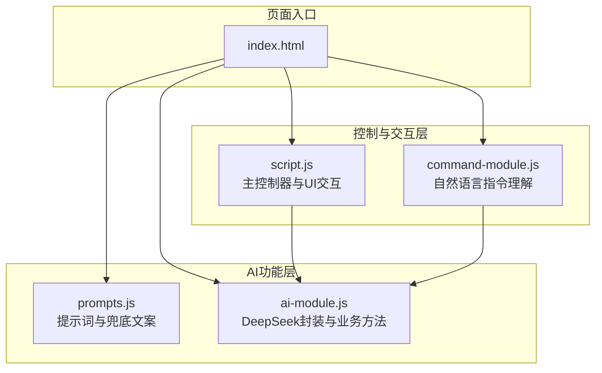
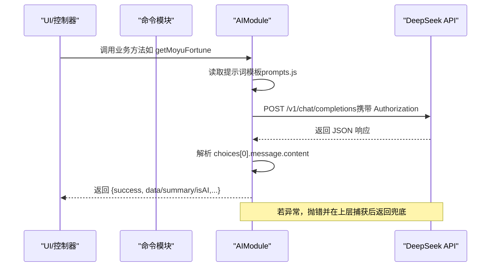
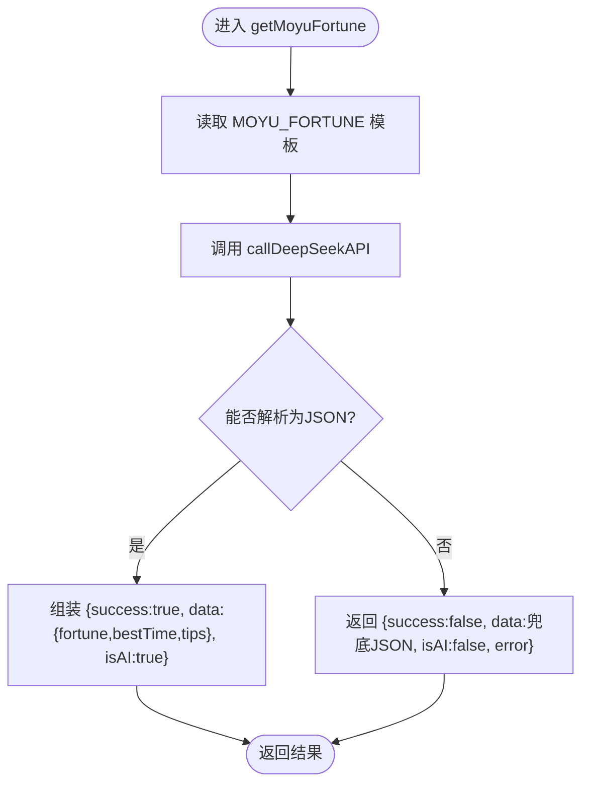
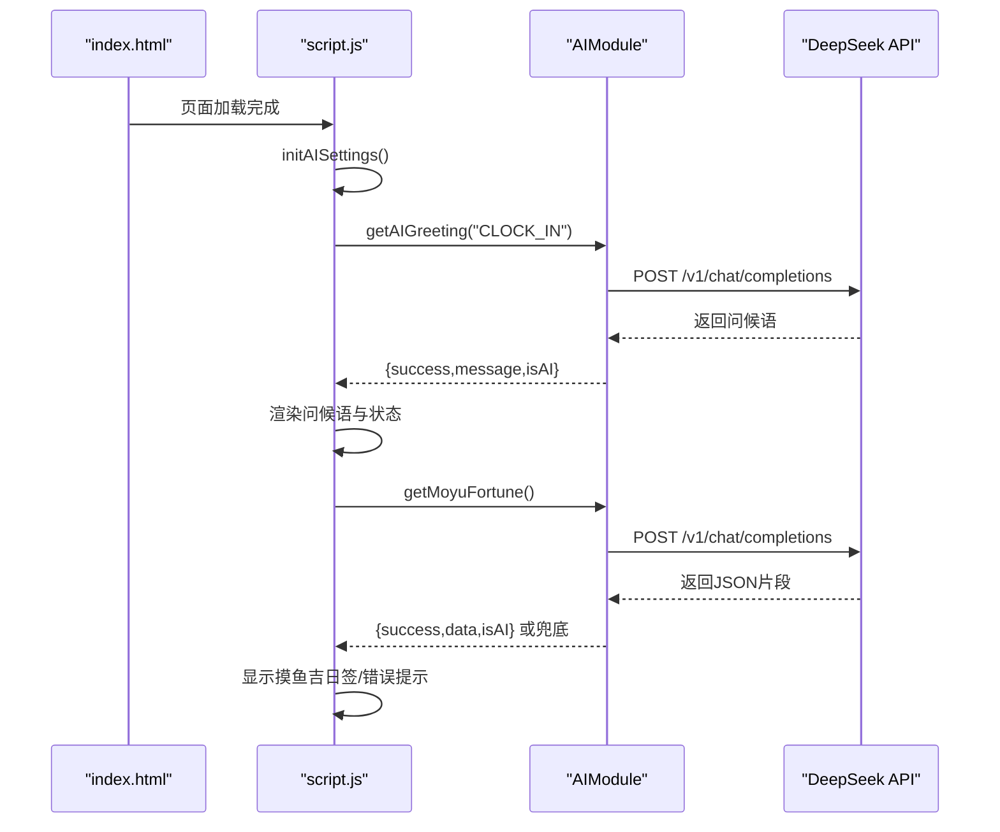
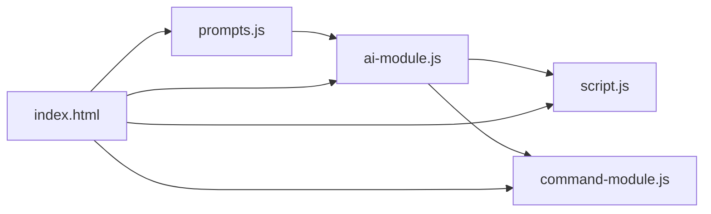

# AI功能模块

<cite>
**本文引用的文件**
- [ai-module.js](file://ai-module.js)
- [prompts.js](file://prompts.js)
- [script.js](file://script.js)
- [command-module.js](file://command-module.js)
- [index.html](file://index.html)
- [AI_COMMAND_DEMO.md](file://docs/AI_COMMAND_DEMO.md)
- [development_log.md](file://docs/development_log.md)
</cite>

## 目录
1. [简介](#简介)
2. [项目结构](#项目结构)
3. [核心组件](#核心组件)
4. [架构总览](#架构总览)
5. [详细组件分析](#详细组件分析)
6. [依赖关系分析](#依赖关系分析)
7. [性能考量](#性能考量)
8. [故障排查指南](#故障排查指南)
9. [结论](#结论)
10. [附录](#附录)

## 简介
本文件围绕 ai-module.js 的架构设计与实现细节展开，重点说明其作为 DeepSeek API 封装层的职责，包括：
- callDeepSeekAPI 函数的请求构造、认证处理、错误处理流程
- getMoyuFortune 和 generateWorkSummary 等业务方法如何利用 prompts.js 中的提示词模板生成符合预期的 AI 响应
- 兜底策略实现：当 API 调用失败时如何返回预设的默认内容
- 模块通过 window.AIModule 暴露接口供主控制器调用，并处理异步响应的数据流

同时，结合命令控制模块与主控制器脚本，解释自然语言指令如何驱动 AI 功能，以及 UI 层如何展示与反馈。

## 项目结构
AI 功能模块位于仓库根目录，与主控制器、提示词配置、命令模块共同协作：
- ai-module.js：DeepSeek API 封装与业务方法（问候、摸鱼吉日签、工作总结、通用分析）
- prompts.js：统一管理 AI 提示词与兜底文案
- script.js：主控制器，负责 UI 交互、事件绑定、调用 AIModule 并渲染结果
- command-module.js：自然语言指令理解与执行，内部调用 AIModule
- index.html：页面入口，按顺序加载 prompts.js、ai-module.js、command-module.js，再加载 script.js

图表来源
- [index.html](file://index.html#L1-L20)
- [ai-module.js](file://ai-module.js#L1-L40)
- [prompts.js](file://prompts.js#L1-L40)
- [command-module.js](file://command-module.js#L1-L40)
- [script.js](file://script.js#L922-L1030)

章节来源
- [index.html](file://index.html#L1-L20)

## 核心组件
- DeepSeek API 封装：callDeepSeekAPI 负责构建请求、携带认证头、序列化参数、解析响应、抛出错误
- 业务方法：
  - getAIGreeting：快速返回固定问候（不调用 AI）
  - getMoyuFortune：基于提示词生成 JSON 结构的摸鱼吉日签，并进行 JSON 解析兜底
  - generateWorkSummary：基于模板替换生成工作总结文本
  - callAIAnalysis：通用分析入口，支持多种 Prompt 类型
- 提示词与兜底：prompts.js 统一管理 AI_PROMPTS、FALLBACK_MESSAGES 与随机兜底函数
- 接口暴露：window.AIModule 将上述方法挂载到全局，供主控制器与命令模块调用

章节来源
- [ai-module.js](file://ai-module.js#L14-L59)
- [ai-module.js](file://ai-module.js#L66-L93)
- [ai-module.js](file://ai-module.js#L99-L167)
- [ai-module.js](file://ai-module.js#L169-L204)
- [prompts.js](file://prompts.js#L1-L159)

## 架构总览
AI 功能模块采用“封装层 + 业务层 + 配置层”的三层结构：
- 封装层：callDeepSeekAPI 统一处理认证、请求、错误与响应解析
- 业务层：各业务方法基于 prompts.js 的模板与参数，调用封装层并返回标准化结果对象
- 配置层：prompts.js 提供提示词模板与兜底文案，统一管理与随机选择

图表来源
- [ai-module.js](file://ai-module.js#L14-L59)
- [ai-module.js](file://ai-module.js#L99-L167)
- [prompts.js](file://prompts.js#L1-L159)

## 详细组件分析

### callDeepSeekAPI：请求构造、认证与错误处理
- 请求构造
  - URL：固定常量指向 DeepSeek Chat Completions 接口
  - 模型：固定常量指向 deepseek-chat
  - 消息：以用户角色传入 prompt
  - 参数：temperature、max_tokens、top_p 可通过 options 注入
- 认证处理
  - 从 localStorage 读取 API Key，若缺失则抛错
  - 通过 Authorization: Bearer 方式注入
- 错误处理
  - 非 OK 状态码：尝试解析 JSON 错误信息，否则回退为状态码提示
  - 异常捕获：统一抛出，供上层业务方法兜底
- 返回值
  - 成功：返回 choices[0].message.content.trim()

章节来源
- [ai-module.js](file://ai-module.js#L14-L59)

### getAIGreeting：快速问候（不调用 AI）
- 用途：在打卡场景下快速返回固定文案，避免不必要的 API 调用
- 返回：包含 success、message、isAI 字段的标准结果对象

章节来源
- [ai-module.js](file://ai-module.js#L66-L93)

### getMoyuFortune：摸鱼吉日签（带兜底）
- 输入：无参数，内部读取 MOYU_FORTUNE 模板
- 处理：
  - 调用 callDeepSeekAPI 生成响应
  - 使用正则匹配 JSON 片段并解析，得到 fortune、bestTime、tips
  - 若解析失败或异常，返回 {success:false, data:FALLBACK_MESSAGES.MOYU_FORTUNE, isAI:false, error}
- 输出：标准结果对象，包含 success、data、isAI、error

图表来源
- [ai-module.js](file://ai-module.js#L99-L167)
- [prompts.js](file://prompts.js#L1-L40)
- [prompts.js](file://prompts.js#L123-L139)

章节来源
- [ai-module.js](file://ai-module.js#L99-L167)
- [prompts.js](file://prompts.js#L1-L40)
- [prompts.js](file://prompts.js#L123-L139)

### generateWorkSummary：工作总结（带兜底）
- 输入：workData（包含 clockInTime、clockOutTime、relaxCount、dailyIncome）
- 处理：
  - 从 WORK_SUMMARY 模板读取
  - 使用字符串替换将占位符替换为实际数据
  - 调用 callDeepSeekAPI 生成总结文本
  - 异常时返回 {success:false, summary:FALLBACK_MESSAGES.WORK_SUMMARY, isAI:false, error}
- 输出：标准结果对象，包含 success、summary、isAI

章节来源
- [ai-module.js](file://ai-module.js#L129-L167)
- [prompts.js](file://prompts.js#L27-L47)
- [prompts.js](file://prompts.js#L123-L139)

### callAIAnalysis：通用分析（带兜底）
- 输入：promptType（如 NEWS_ANALYSIS）、content
- 处理：
  - 从 AI_PROMPTS 中读取模板并插入 {CONTENT}
  - 调用 callDeepSeekAPI 生成分析文本
  - 异常时返回 {success:false, content:随机兜底消息, isAI:false, error}
- 输出：标准结果对象，包含 success、content、isAI

章节来源
- [ai-module.js](file://ai-module.js#L169-L204)
- [prompts.js](file://prompts.js#L49-L119)
- [prompts.js](file://prompts.js#L141-L151)

### 提示词与兜底策略
- 提示词集中管理：AI_PROMPTS 提供 MOYU_FORTUNE、WORK_SUMMARY、NEWS_ANALYSIS 等模板
- 兜底文案：FALLBACK_MESSAGES 提供默认 JSON 或文本
- 随机兜底：getRandomFallbackMessage 根据类型返回随机兜底消息

章节来源
- [prompts.js](file://prompts.js#L1-L159)

### window.AIModule 暴露与主控制器调用
- 暴露接口：在浏览器环境下将 callDeepSeekAPI、getAIGreeting、getMoyuFortune、generateWorkSummary、callAIAnalysis 挂载到 window.AIModule
- 主控制器调用：
  - 初始化 AI 设置：保存/测试 API Key，测试连接调用 getAIGreeting
  - 打卡流程：根据按钮状态调用 getAIGreeting、getMoyuFortune、generateWorkSummary，并渲染 UI
  - 命令控制：processCommand 内部调用 callDeepSeekAPI 理解用户意图，再执行对应操作

图表来源
- [index.html](file://index.html#L1-L20)
- [script.js](file://script.js#L424-L491)
- [script.js](file://script.js#L493-L732)
- [ai-module.js](file://ai-module.js#L66-L93)
- [ai-module.js](file://ai-module.js#L99-L167)

章节来源
- [index.html](file://index.html#L1-L20)
- [script.js](file://script.js#L424-L491)
- [script.js](file://script.js#L493-L732)
- [ai-module.js](file://ai-module.js#L206-L216)

### 命令模块与自然语言指令
- 指令理解：processCommand 构造 COMMAND_UNDERSTANDING_PROMPT，调用 AIModule.callDeepSeekAPI 获取结构化意图
- 执行动作：parseCommandResponse 解析 JSON，executeCommand 根据类型触发 UI 操作
- 与 AIModule 的关系：processCommand 直接调用 AIModule.callDeepSeekAPI，形成闭环

章节来源
- [command-module.js](file://command-module.js#L1-L72)
- [command-module.js](file://command-module.js#L182-L259)
- [AI_COMMAND_DEMO.md](file://docs/AI_COMMAND_DEMO.md#L45-L63)

## 依赖关系分析
- 模块间依赖
  - ai-module.js 依赖 prompts.js（读取模板与兜底）
  - script.js 依赖 ai-module.js（调用业务方法）
  - command-module.js 依赖 ai-module.js（调用 callDeepSeekAPI 理解指令）
  - index.html 顺序加载各模块，保证全局对象可用
- 外部依赖
  - DeepSeek API：通过 fetch 调用 /v1/chat/completions
  - localStorage：存储 API Key 与业务数据

图表来源
- [index.html](file://index.html#L1-L20)
- [ai-module.js](file://ai-module.js#L1-L40)
- [prompts.js](file://prompts.js#L1-L40)
- [command-module.js](file://command-module.js#L1-L40)
- [script.js](file://script.js#L922-L1030)

章节来源
- [index.html](file://index.html#L1-L20)
- [ai-module.js](file://ai-module.js#L1-L40)
- [prompts.js](file://prompts.js#L1-L40)
- [command-module.js](file://command-module.js#L1-L40)
- [script.js](file://script.js#L922-L1030)

## 性能考量
- 请求参数调优：temperature、max_tokens、top_p 通过 options 注入，业务方法按需设置，平衡创意与稳定性
- 兜底策略：API 失败立即返回预设文案，避免长时间等待与阻塞 UI
- UI 交互：主控制器在调用前显示加载动画，调用后根据 isAI 字段决定是否展示错误提示
- 模块化收益：将 AI 功能独立为模块，降低耦合，便于扩展与维护

## 故障排查指南
- API Key 未配置
  - 现象：调用 callDeepSeekAPI 抛错
  - 处理：在设置页保存 API Key，或在测试按钮中验证连接
- API 请求失败
  - 现象：非 OK 状态码或网络异常
  - 处理：查看错误信息；业务方法会返回兜底内容与 error 字段
- JSON 解析失败（摸鱼吉日签）
  - 现象：AI 返回非 JSON 文本
  - 处理：自动回退到 FALLBACK_MESSAGES.MOYU_FORTUNE
- 指令理解失败（自然语言）
  - 现象：parseCommandResponse 无法解析 JSON
  - 处理：processCommand 返回 chatResponse 并提示重新表述

章节来源
- [ai-module.js](file://ai-module.js#L14-L59)
- [ai-module.js](file://ai-module.js#L99-L167)
- [command-module.js](file://command-module.js#L56-L72)
- [script.js](file://script.js#L424-L491)

## 结论
ai-module.js 通过清晰的封装与业务拆分，实现了对 DeepSeek API 的稳定调用与丰富的业务能力：
- callDeepSeekAPI 提供统一的请求、认证与错误处理
- 业务方法基于 prompts.js 模板与参数，生成结构化或文本化结果
- 兜底策略确保在 API 失败时仍能提供良好用户体验
- 通过 window.AIModule 暴露接口，与主控制器和命令模块无缝协作

## 附录
- 开发日志要点：模块化改造、AI功能独立、API Key配置与测试、打卡与读报功能集成
- 指令控制演示：展示了从输入到执行的完整链路与 UI 反馈

章节来源
- [development_log.md](file://docs/development_log.md#L500-L540)
- [development_log.md](file://docs/development_log.md#L534-L574)
- [AI_COMMAND_DEMO.md](file://docs/AI_COMMAND_DEMO.md#L45-L63)