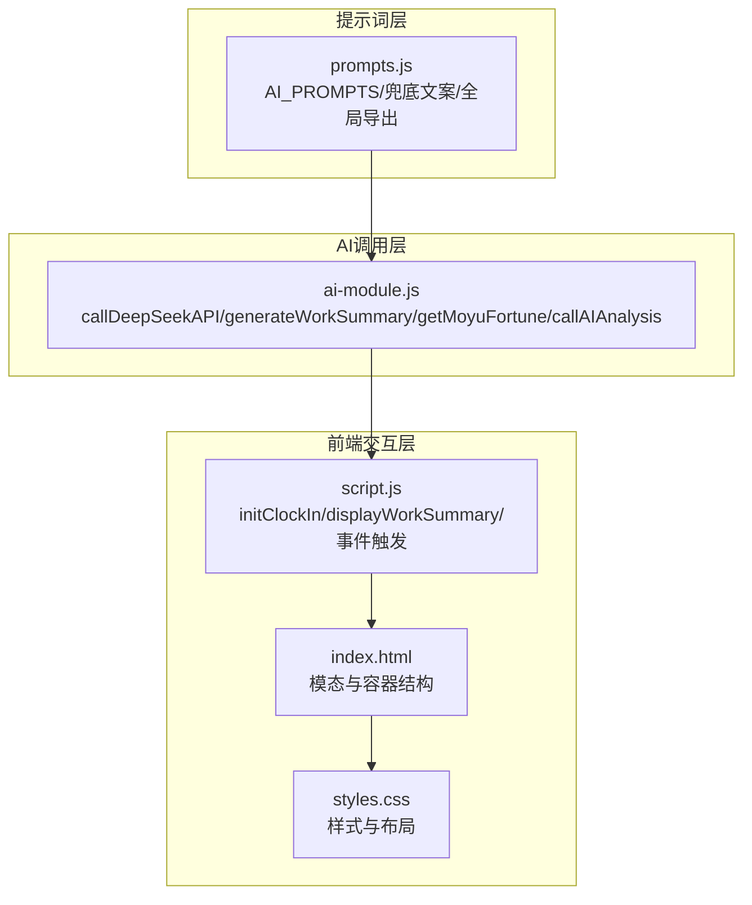
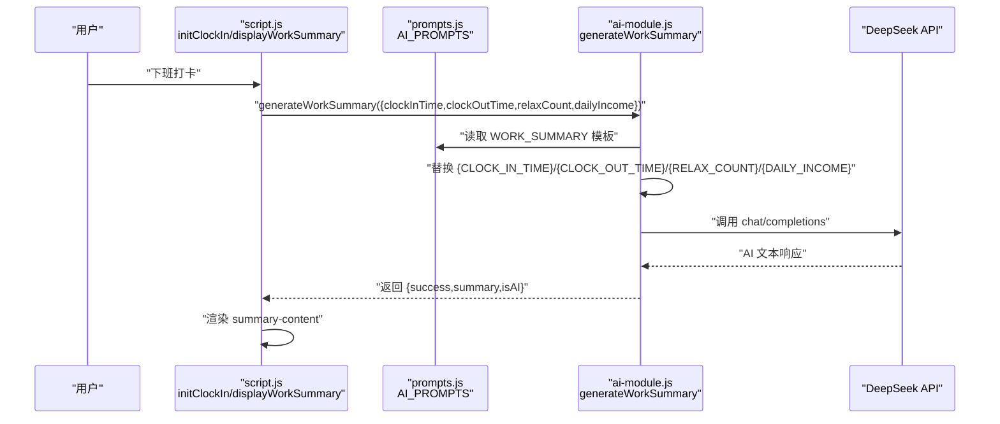
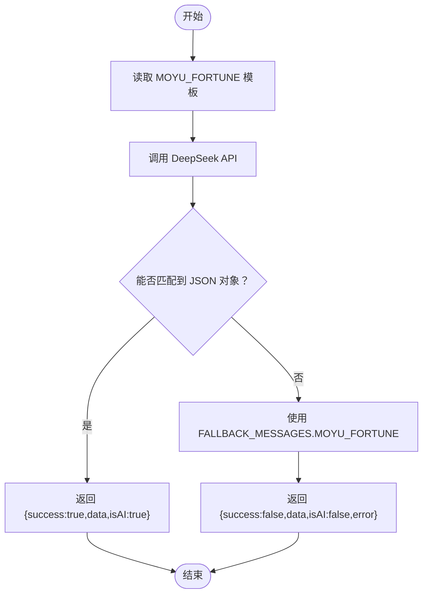
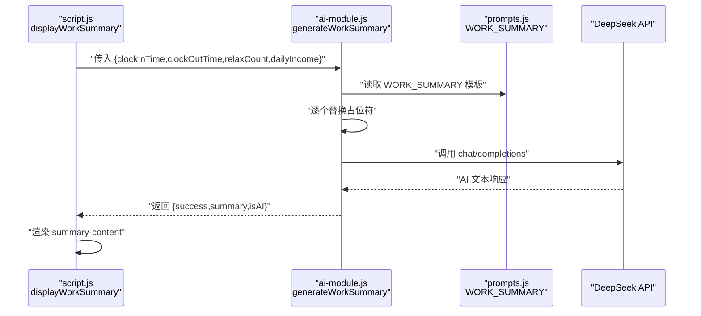
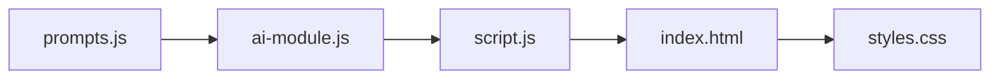

# 提示词工程与模板管理

<cite>
**本文引用的文件**
- [prompts.js](file://prompts.js)
- [ai-module.js](file://ai-module.js)
- [script.js](file://script.js)
- [index.html](file://index.html)
- [styles.css](file://styles.css)
- [README.md](file://README.md)
</cite>

## 目录
1. [简介](#简介)
2. [项目结构](#项目结构)
3. [核心组件](#核心组件)
4. [架构总览](#架构总览)
5. [详细组件分析](#详细组件分析)
6. [依赖关系分析](#依赖关系分析)
7. [性能考量](#性能考量)
8. [故障排查指南](#故障排查指南)
9. [结论](#结论)

## 简介
本文件围绕 prompts.js 中的 AI 提示词设计与使用方式进行系统化说明，重点剖析以下模板：
- MOYU_FORTUNE：摸鱼吉日签（JSON 输出约束）
- WORK_SUMMARY：下班工作总结（变量注入与长度约束）
- NEWS_ANALYSIS：人民日报要闻分析（Markdown 结构化输出）

同时解释：
- 如何通过 window.AI_PROMPTS 全局对象暴露提示词配置，供 ai-module.js 调用
- generateWorkSummary 函数如何将实际工作数据注入模板并调用 AI
- 提示词如何引导 AI 产出符合预期格式（JSON、Markdown、字数与风格）
- 兜底文案与错误回退策略
- 提示词优化对响应质量的影响

## 项目结构
提示词工程位于 prompts.js，AI 调用封装位于 ai-module.js，前端交互与触发逻辑位于 script.js，页面结构与样式位于 index.html 与 styles.css。

图表来源
- [prompts.js](file://prompts.js#L1-L159)
- [ai-module.js](file://ai-module.js#L1-L216)
- [script.js](file://script.js#L493-L800)
- [index.html](file://index.html#L130-L160)
- [styles.css](file://styles.css#L2000-L2197)

章节来源
- [README.md](file://README.md#L32-L49)

## 核心组件
- 提示词配置对象：统一管理 MOYU_FORTUNE、WORK_SUMMARY、NEWS_ANALYSIS 三类模板
- 全局导出：window.AI_PROMPTS、window.FALLBACK_MESSAGES、window.getRandomFallbackMessage
- AI 调用模块：封装 DeepSeek API 调用、参数配置、错误处理与兜底回退
- 业务触发：script.js 中的打卡流程与工作总结展示逻辑

章节来源
- [prompts.js](file://prompts.js#L1-L159)
- [ai-module.js](file://ai-module.js#L1-L216)
- [script.js](file://script.js#L493-L800)

## 架构总览
提示词工程采用“模板+注入+调用”的三层架构：
- 模板层：在 prompts.js 中定义结构化提示词，明确输出格式、风格与约束
- 注入层：在 ai-module.js 中将业务数据注入模板占位符
- 调用层：通过统一的 API 封装调用模型，解析/兜底并返回结果

图表来源
- [script.js](file://script.js#L3079-L3150)
- [ai-module.js](file://ai-module.js#L129-L167)
- [prompts.js](file://prompts.js#L27-L47)

## 详细组件分析

### MOYU_FORTUNE 模板设计
- 角色与任务：扮演“摸鱼大师”，生成今日摸鱼吉日签
- 输出格式：严格要求 JSON，包含 fortune、bestTime、tips 三项
- 风格与长度：幽默风趣、积极向上；tips 每条 15-30 字；fortune 15-25 字
- 结构约束：必须返回 JSON，不得附加其他文字
- 兜底策略：若 AI 无法解析 JSON，使用 FALLBACK_MESSAGES.MOYU_FORTUNE

图表来源
- [ai-module.js](file://ai-module.js#L95-L127)
- [prompts.js](file://prompts.js#L1-L26)
- [prompts.js](file://prompts.js#L122-L139)

章节来源
- [prompts.js](file://prompts.js#L1-L26)
- [ai-module.js](file://ai-module.js#L95-L127)

### WORK_SUMMARY 模板设计
- 数据注入：通过 {CLOCK_IN_TIME}、{CLOCK_OUT_TIME}、{RELAX_COUNT}、{DAILY_INCOME} 四个占位符注入当日数据
- 输出格式：直接输出总结文本，不返回 JSON
- 长度约束：80-120 字，鼓励幽默与正向表达
- 风格要求：风趣幽默、积极向上、可加入办公室梗或调侃

图表来源
- [script.js](file://script.js#L3079-L3150)
- [ai-module.js](file://ai-module.js#L129-L167)
- [prompts.js](file://prompts.js#L27-L47)

章节来源
- [prompts.js](file://prompts.js#L27-L47)
- [ai-module.js](file://ai-module.js#L129-L167)
- [script.js](file://script.js#L3079-L3150)

### NEWS_ANALYSIS 模板设计
- 输入：{CONTENT} 占位符注入人民日报前四版要闻原文
- 输出：Markdown 结构化分析，包含整体政策导向、重点文章解读、投资与决策建议、风险提示、总结与展望
- 结构化要求：使用标题层级与分隔线，便于阅读与后续展示
- 兜底策略：若调用失败，返回 FALLBACK_MESSAGES.NEWS_ANALYSIS 中的随机提示语

章节来源
- [prompts.js](file://prompts.js#L49-L119)
- [ai-module.js](file://ai-module.js#L169-L204)

### 全局对象与兜底机制
- window.AI_PROMPTS：暴露全部提示词模板，供各模块按需读取
- window.FALLBACK_MESSAGES：提供各类兜底文案
- window.getRandomFallbackMessage：按类型随机返回兜底消息
- ai-module.js 中的 getMoyuFortune、generateWorkSummary、callAIAnalysis 均使用这些全局对象

章节来源
- [prompts.js](file://prompts.js#L122-L159)
- [ai-module.js](file://ai-module.js#L95-L204)

### 页面与样式集成
- index.html 中定义了模态与容器结构（摸鱼吉日签卡片、下班总结区域）
- styles.css 中定义了卡片、列表、按钮、加载动画等样式，确保渲染一致

章节来源
- [index.html](file://index.html#L130-L160)
- [styles.css](file://styles.css#L2000-L2197)

## 依赖关系分析
- prompts.js 与 ai-module.js：ai-module.js 依赖 prompts.js 的模板常量与兜底文案
- ai-module.js 与 script.js：script.js 在用户交互时调用 AIModule 的方法
- script.js 与 index.html/styles.css：负责渲染与交互

图表来源
- [prompts.js](file://prompts.js#L1-L159)
- [ai-module.js](file://ai-module.js#L1-L216)
- [script.js](file://script.js#L493-L800)
- [index.html](file://index.html#L130-L160)
- [styles.css](file://styles.css#L2000-L2197)

## 性能考量
- API 参数调优：不同场景使用不同的 temperature、max_tokens，平衡创意与稳定性
- 兜底策略：在网络不稳定或模型返回异常时，快速返回预设文案，保证用户体验
- 模板复用：统一的模板与占位符命名，降低维护成本与拼写错误风险

章节来源
- [ai-module.js](file://ai-module.js#L14-L59)
- [ai-module.js](file://ai-module.js#L95-L127)
- [ai-module.js](file://ai-module.js#L129-L167)
- [ai-module.js](file://ai-module.js#L169-L204)

## 故障排查指南
- API 密钥缺失：调用 API 前检查本地存储中的密钥是否存在
- JSON 解析失败（MOYU_FORTUNE）：确认模板要求严格返回 JSON，必要时增加“只返回 JSON”提示
- 占位符未替换（WORK_SUMMARY）：检查 generateWorkSummary 是否正确替换四个占位符
- 错误回退：若调用失败，AIModule 会返回包含兜底文案的对象，前端应显示兜底内容并提示错误

章节来源
- [ai-module.js](file://ai-module.js#L14-L59)
- [ai-module.js](file://ai-module.js#L95-L127)
- [ai-module.js](file://ai-module.js#L129-L167)
- [ai-module.js](file://ai-module.js#L169-L204)

## 结论
- prompts.js 将提示词模板化、结构化与全局化，形成可维护、可扩展的提示词工程体系
- ai-module.js 通过统一的 API 封装与兜底策略，确保在复杂业务场景下仍能稳定产出高质量结果
- script.js 将提示词与业务数据有效结合，实现从“打卡”到“总结”的完整闭环
- 通过严格的输出格式约束（JSON、Markdown、字数与风格）与合理的参数调优，显著提升了 AI 响应质量与一致性