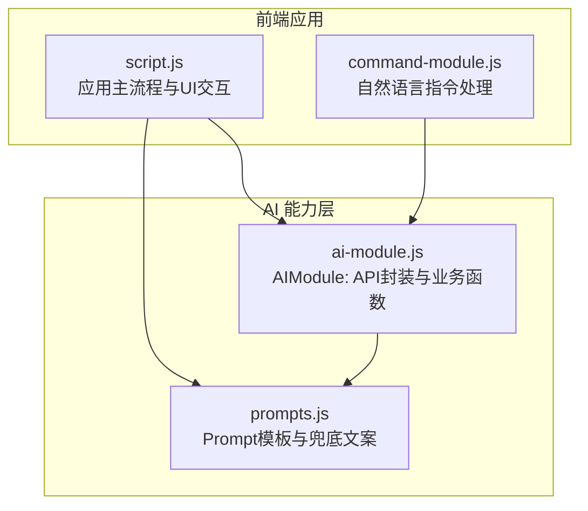
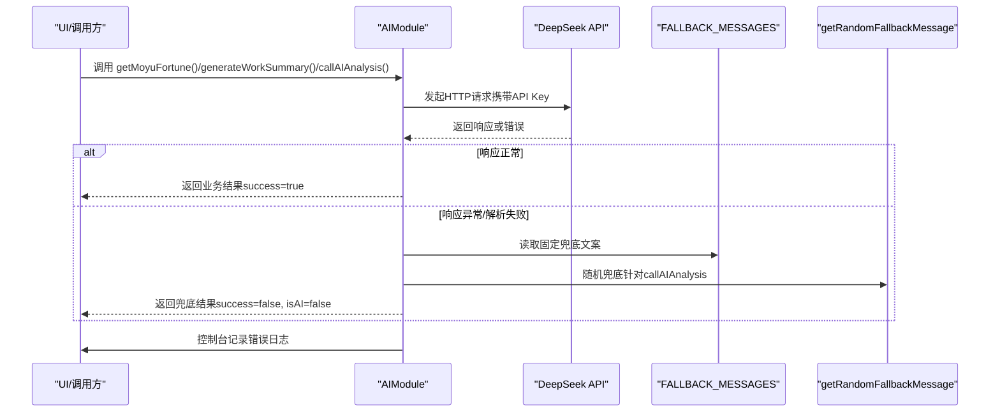
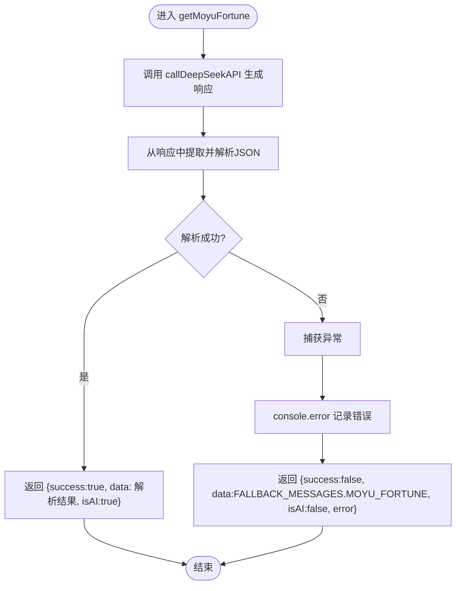
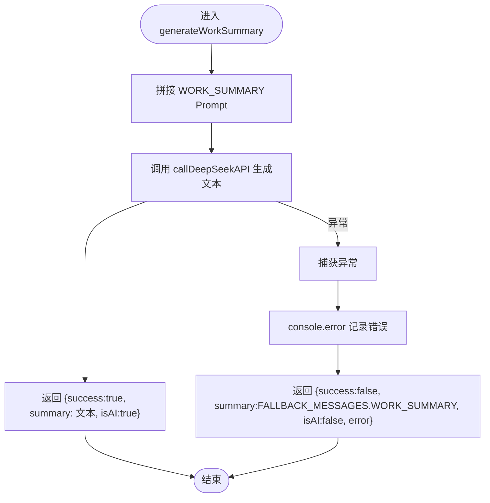
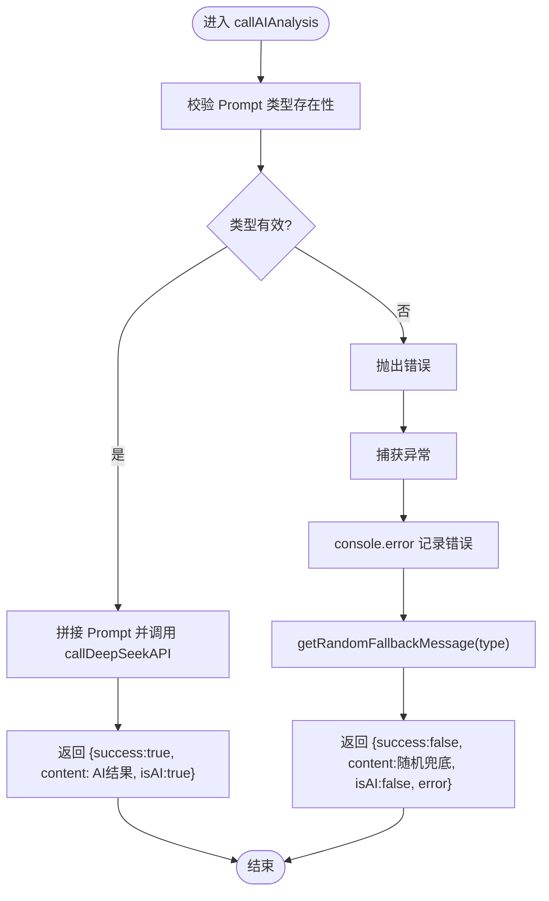
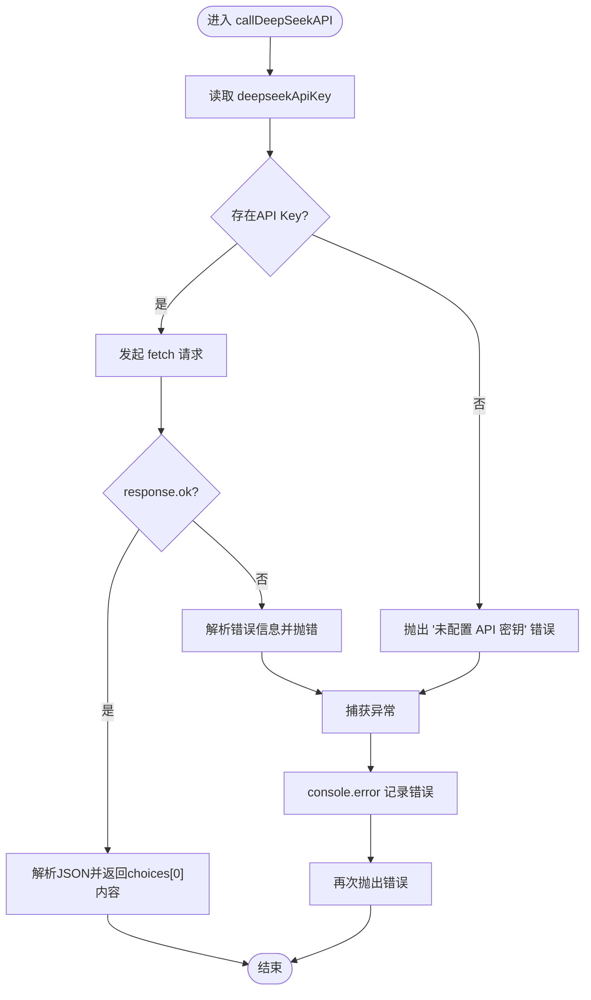
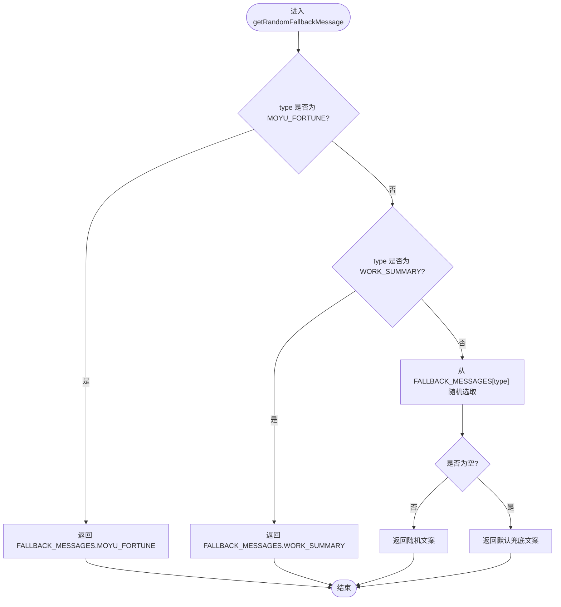
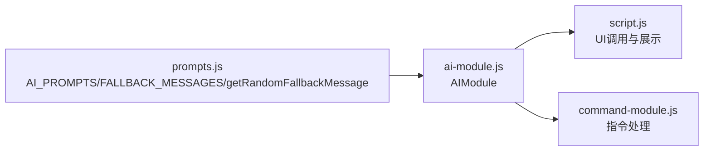

# 错误处理与兜底策略

<cite>
**本文引用的文件**
- [ai-module.js](file://ai-module.js)
- [prompts.js](file://prompts.js)
- [script.js](file://script.js)
- [command-module.js](file://command-module.js)
</cite>

## 目录
1. [简介](#简介)
2. [项目结构](#项目结构)
3. [核心组件](#核心组件)
4. [架构总览](#架构总览)
5. [详细组件分析](#详细组件分析)
6. [依赖关系分析](#依赖关系分析)
7. [性能考量](#性能考量)
8. [故障排查指南](#故障排查指南)
9. [结论](#结论)

## 简介
本文件围绕 AI 模块的错误处理机制与兜底策略展开，重点说明以下函数如何通过 try-catch 捕获 API 调用异常，并在失败时返回预设的默认内容：
- getMoyuFortune：获取“摸鱼吉日签”，在解析失败或 API 异常时返回 FALLBACK_MESSAGES 中的默认 JSON 结构。
- generateWorkSummary：生成“今日工作总结”，在 API 异常时返回 FALLBACK_MESSAGES 中的默认文本。
- callAIAnalysis：通用 AI 分析入口，在异常时返回由 getRandomFallbackMessage 选择的随机兜底文案。
同时，文档解释 getRandomFallbackMessage 如何为不同场景提供随机兜底消息；结合代码路径说明错误信息如何被记录到控制台并返回给调用方；最后讨论兜底策略如何保障用户体验连续性，避免因 AI 服务不可用导致功能中断，并给出 API 密钥无效、网络超时、响应格式错误等场景的具体处理流程。

## 项目结构
AI 相关能力主要分布在以下文件：
- ai-module.js：封装 DeepSeek API 调用与多个 AI 功能函数（包括 getMoyuFortune、generateWorkSummary、callAIAnalysis 等），并导出 AIModule。
- prompts.js：统一管理 Prompt 模板、兜底文案 FALLBACK_MESSAGES，以及随机兜底消息函数 getRandomFallbackMessage。
- script.js：应用主逻辑，负责调用 AIModule 的函数并在 UI 层展示结果；在调用链路中也包含错误日志与兜底回退。
- command-module.js：自然语言指令处理模块，内部同样调用 AIModule.callDeepSeekAPI 并在异常时返回兜底文案。

图表来源
- [script.js](file://script.js#L424-L995)
- [command-module.js](file://command-module.js#L182-L259)
- [ai-module.js](file://ai-module.js#L1-L215)
- [prompts.js](file://prompts.js#L1-L159)

章节来源
- [ai-module.js](file://ai-module.js#L1-L215)
- [prompts.js](file://prompts.js#L1-L159)
- [script.js](file://script.js#L424-L995)
- [command-module.js](file://command-module.js#L182-L259)

## 核心组件
- AIModule.callDeepSeekAPI：统一的 DeepSeek API 调用封装，负责鉴权、参数组装、响应校验与错误抛出。
- getMoyuFortune：基于 AI 生成 JSON 格式的摸鱼吉日签，失败时返回 FALLBACK_MESSAGES.MOYU_FORTUNE。
- generateWorkSummary：基于 AI 生成“今日工作总结”文本，失败时返回 FALLBACK_MESSAGES.WORK_SUMMARY。
- callAIAnalysis：通用分析入口，失败时返回由 getRandomFallbackMessage 选择的随机兜底文案。
- FALLBACK_MESSAGES：集中存放各场景的兜底文案与结构化数据。
- getRandomFallbackMessage：按场景返回随机兜底文案或固定兜底对象。

章节来源
- [ai-module.js](file://ai-module.js#L1-L215)
- [prompts.js](file://prompts.js#L122-L158)

## 架构总览
下图展示了从 UI 到 AI 能力层的调用链与错误处理路径，以及兜底策略的触发点。

图表来源
- [ai-module.js](file://ai-module.js#L1-L215)
- [prompts.js](file://prompts.js#L122-L158)

## 详细组件分析

### getMoyuFortune：摸鱼吉日签的错误处理与兜底
- 处理流程要点
  - 通过 AIModule.callDeepSeekAPI 获取 AI 响应。
  - 使用正则匹配从响应中提取 JSON 片段并解析；若无法解析，抛出错误。
  - try-catch 捕获异常，记录控制台错误，并返回包含 success=false、isAI=false 的结果对象，data 字段使用 FALLBACK_MESSAGES.MOYU_FORTUNE。
- 兜底策略
  - FALLBACK_MESSAGES.MOYU_FORTUNE 是结构化的 JSON，包含 fortune、bestTime、tips，保证 UI 可直接渲染。
- 错误信息记录
  - 在函数内部使用 console.error 记录错误详情，便于调试与追踪。
- 调用方行为
  - 调用方在收到 isAI=false 时，可根据 error 字段决定是否在 UI 上显示错误提示，或直接使用兜底数据。

图表来源
- [ai-module.js](file://ai-module.js#L95-L133)
- [prompts.js](file://prompts.js#L122-L139)

章节来源
- [ai-module.js](file://ai-module.js#L95-L133)
- [prompts.js](file://prompts.js#L122-L139)

### generateWorkSummary：工作总结的错误处理与兜底
- 处理流程要点
  - 将工作数据注入到 WORK_SUMMARY Prompt 模板，调用 AIModule.callDeepSeekAPI 生成文本。
  - try-catch 捕获异常，记录控制台错误，并返回包含 success=false、isAI=false 的结果对象，summary 字段使用 FALLBACK_MESSAGES.WORK_SUMMARY。
- 兜底策略
  - FALLBACK_MESSAGES.WORK_SUMMARY 是一段固定文本，保证 UI 可直接显示。
- 错误信息记录
  - 在函数内部使用 console.error 记录错误详情。

图表来源
- [ai-module.js](file://ai-module.js#L134-L167)
- [prompts.js](file://prompts.js#L122-L139)

章节来源
- [ai-module.js](file://ai-module.js#L134-L167)
- [prompts.js](file://prompts.js#L122-L139)

### callAIAnalysis：通用分析的错误处理与随机兜底
- 处理流程要点
  - 校验 Prompt 类型是否存在；不存在则抛错。
  - 将内容插入模板后调用 AIModule.callDeepSeekAPI。
  - try-catch 捕获异常，记录控制台错误，并返回包含 success=false、isAI=false 的结果对象。
  - content 字段使用 getRandomFallbackMessage(promptType) 选择随机兜底文案。
- 兜底策略
  - 对于 MOYU_FORTUNE 和 WORK_SUMMARY 场景，返回对应固定兜底对象或文本；
  - 对于其他类型（如 NEWS_ANALYSIS），返回 FALLBACK_MESSAGES[type] 数组中的随机文案。
- 错误信息记录
  - 在函数内部使用 console.error 记录错误详情。

图表来源
- [ai-module.js](file://ai-module.js#L169-L204)
- [prompts.js](file://prompts.js#L141-L158)

章节来源
- [ai-module.js](file://ai-module.js#L169-L204)
- [prompts.js](file://prompts.js#L141-L158)

### callDeepSeekAPI：统一的 API 调用与错误抛出
- 关键点
  - 从本地存储读取 API Key；若缺失，立即抛错。
  - 发送 POST 请求至 DeepSeek 接口，校验 response.ok；失败时解析错误信息并抛错。
  - 成功时返回 choices[0].message.content.trim()。
  - 捕获异常后记录 console.error 并再次抛出，以便上层函数进行兜底处理。
- 场景覆盖
  - API 密钥无效：在读取 API Key 为空时直接抛错。
  - 网络超时/连接失败：fetch 抛错，上层捕获并兜底。
  - 响应格式错误：response.ok 为 false 或 JSON 解析失败，抛错并上层兜底。

图表来源
- [ai-module.js](file://ai-module.js#L1-L59)

章节来源
- [ai-module.js](file://ai-module.js#L1-L59)

### FALLBACK_MESSAGES 与 getRandomFallbackMessage：随机兜底消息
- FALLBACK_MESSAGES
  - MOYU_FORTUNE：结构化 JSON，包含 fortune、bestTime、tips。
  - WORK_SUMMARY：固定文本。
  - NEWS_ANALYSIS：数组形式的多条随机文案。
- getRandomFallbackMessage
  - 针对 MOYU_FORTUNE：返回固定 JSON。
  - 针对 WORK_SUMMARY：返回固定文本。
  - 其他类型：从 FALLBACK_MESSAGES[type] 数组中随机选取一条；若数组为空，返回默认兜底文案。

图表来源
- [prompts.js](file://prompts.js#L122-L158)

章节来源
- [prompts.js](file://prompts.js#L122-L158)

## 依赖关系分析
- AIModule 依赖 prompts.js 中的 AI_PROMPTS、FALLBACK_MESSAGES 与 getRandomFallbackMessage。
- script.js 与 command-module.js 在调用 AIModule 的函数时，均通过 try-catch 捕获异常并记录控制台错误，随后根据返回的 success/isAI 字段决定 UI 行为与兜底展示。
- 调用链中，错误信息会逐层传递并最终在 UI 层呈现兜底文案或错误提示。

图表来源
- [ai-module.js](file://ai-module.js#L1-L215)
- [prompts.js](file://prompts.js#L1-L159)
- [script.js](file://script.js#L424-L995)
- [command-module.js](file://command-module.js#L182-L259)

章节来源
- [ai-module.js](file://ai-module.js#L1-L215)
- [prompts.js](file://prompts.js#L1-L159)
- [script.js](file://script.js#L424-L995)
- [command-module.js](file://command-module.js#L182-L259)

## 性能考量
- 兜底策略在异常时避免重复请求与复杂计算，减少 UI 卡顿与等待时间。
- 对于 callAIAnalysis，随机兜底文案来自内存数组，访问成本低。
- 建议在 UI 层对频繁失败的场景增加节流或重试间隔，避免短时间内大量错误日志刷屏。

## 故障排查指南
- API 密钥无效
  - 现象：调用 callDeepSeekAPI 立即抛错，控制台输出“未配置 API 密钥”。
  - 处理：在设置页保存有效密钥后重试；或在 UI 层检测到错误时引导用户前往设置。
  - 参考路径
    - [ai-module.js](file://ai-module.js#L14-L20)
    - [script.js](file://script.js#L464-L490)
- 网络超时/连接失败
  - 现象：fetch 抛错，上层捕获并返回兜底结果；控制台记录错误。
  - 处理：检查网络连通性与代理设置；稍后重试。
  - 参考路径
    - [ai-module.js](file://ai-module.js#L27-L59)
    - [script.js](file://script.js#L597-L613)
- 响应格式错误（无法解析 JSON）
  - 现象：getMoyuFortune 无法从响应中提取 JSON，抛错并返回 FALLBACK_MESSAGES.MOYU_FORTUNE。
  - 处理：确认 Prompt 输出格式符合预期；必要时调整 Prompt。
  - 参考路径
    - [ai-module.js](file://ai-module.js#L99-L127)
    - [prompts.js](file://prompts.js#L122-L139)
- 指令解析失败（自然语言指令）
  - 现象：command-module.js 的 parseCommandResponse 无法解析 JSON，processCommand 返回兜底聊天回复。
  - 处理：优化 Prompt 以提升稳定性；或在 UI 层提示用户重新表述。
  - 参考路径
    - [command-module.js](file://command-module.js#L59-L72)
    - [command-module.js](file://command-module.js#L182-L259)

章节来源
- [ai-module.js](file://ai-module.js#L14-L59)
- [prompts.js](file://prompts.js#L122-L158)
- [script.js](file://script.js#L464-L613)
- [command-module.js](file://command-module.js#L59-L72)

## 结论
本项目的 AI 错误处理与兜底策略通过“统一 API 封装 + 业务函数兜底 + 随机/固定兜底文案”的组合，实现了在多种异常场景下的稳定体验：
- API 密钥无效、网络超时、响应格式错误等异常均被捕获并记录，随后返回预设兜底内容，避免功能中断。
- getMoyuFortune 与 generateWorkSummary 采用结构化/文本兜底，确保 UI 可直接渲染；callAIAnalysis 通过 getRandomFallbackMessage 提供多样化兜底文案，增强可读性与趣味性。
- 调用方在收到 success=false、isAI=false 时，可选择在 UI 上显示错误提示或直接使用兜底数据，从而保障用户体验的连续性。