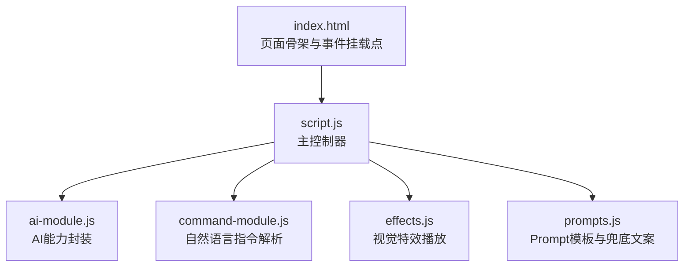
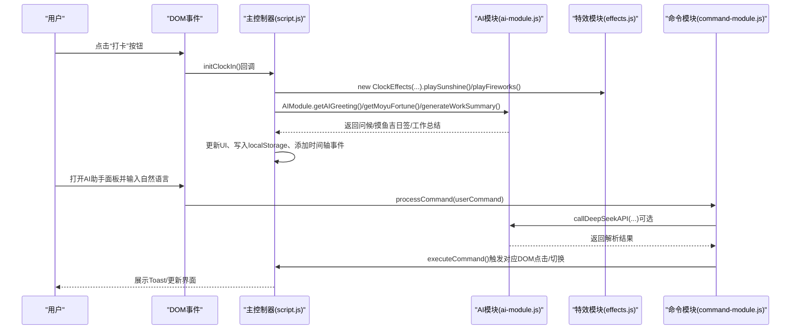
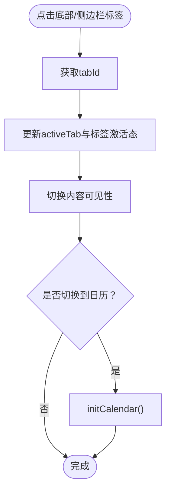
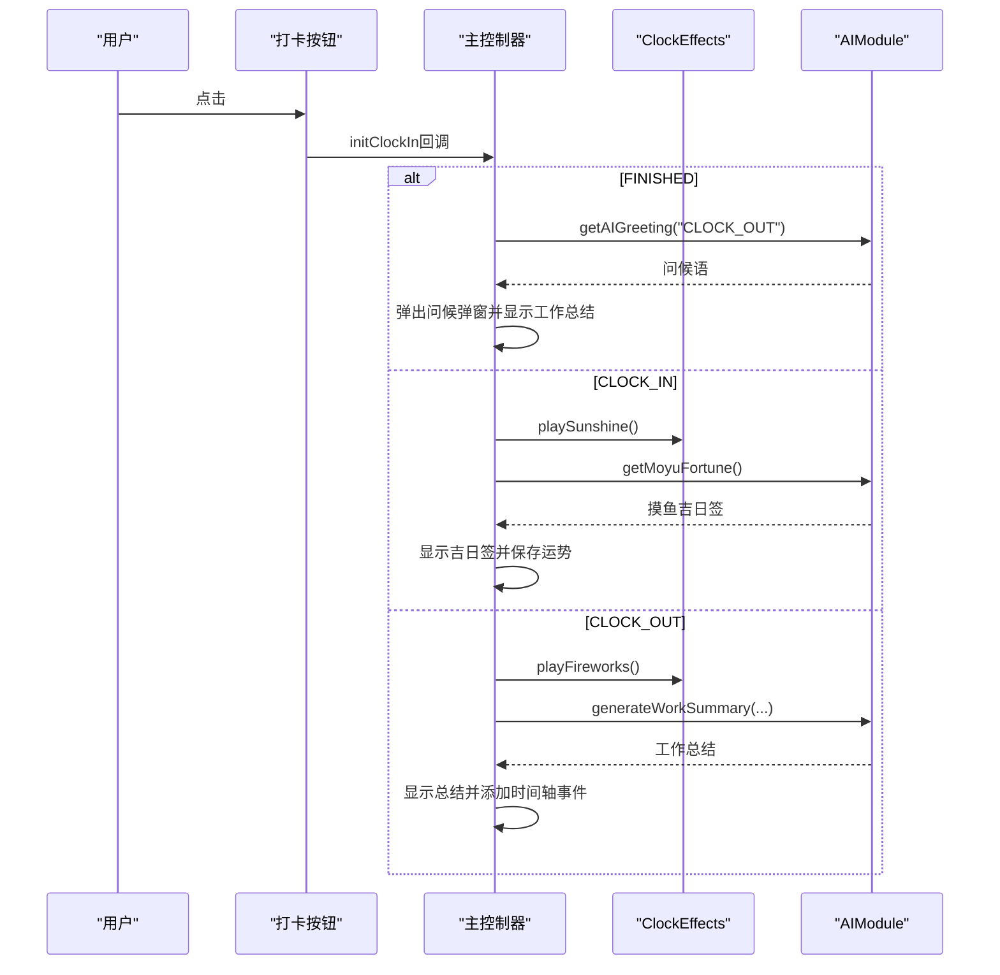
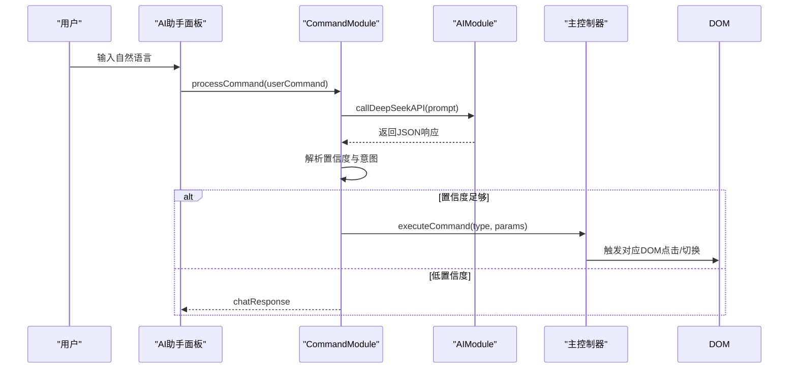
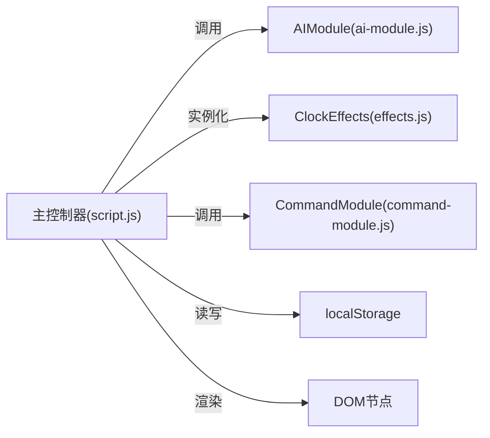

# 主控制器模块

<cite>
**本文引用的文件**
- [script.js](file://script.js)
- [ai-module.js](file://ai-module.js)
- [command-module.js](file://command-module.js)
- [effects.js](file://effects.js)
- [prompts.js](file://prompts.js)
- [index.html](file://index.html)
</cite>

## 目录
1. [简介](#简介)
2. [项目结构](#项目结构)
3. [核心组件](#核心组件)
4. [架构总览](#架构总览)
5. [详细组件分析](#详细组件分析)
6. [依赖关系分析](#依赖关系分析)
7. [性能考量](#性能考量)
8. [故障排查指南](#故障排查指南)
9. [结论](#结论)

## 简介
本文件面向“主控制器模块”（script.js），系统性阐述其作为应用状态中枢的职责与实现方式。重点说明：
- 如何通过DOM事件监听（如打卡按钮点击、标签页切换、侧边栏导航、番茄钟控制、AI助手交互等）驱动应用状态流转；
- 与各功能模块的集成方式：调用window.AIModule进行AI交互、实例化window.ClockEffects播放视觉特效、响应window.CommandModule的指令解析结果；
- 结合initClockIn、initAISettings等初始化函数，说明应用启动时的模块协同流程；
- 作为状态中枢的角色，如何管理localStorage中的工作时间、工资、打卡记录等数据，并在不同UI组件间同步状态。

## 项目结构
主控制器位于根目录的script.js，配合AI模块、命令模块、特效模块与Prompt配置共同构成前端功能闭环；index.html提供页面骨架与事件挂载点。

图表来源
- [index.html](file://index.html#L1-L120)
- [script.js](file://script.js#L94-L132)
- [ai-module.js](file://ai-module.js#L1-L60)
- [command-module.js](file://command-module.js#L1-L60)
- [effects.js](file://effects.js#L1-L40)
- [prompts.js](file://prompts.js#L1-L40)

章节来源
- [index.html](file://index.html#L1-L120)
- [script.js](file://script.js#L94-L132)

## 核心组件
- 主控制器（script.js）：负责页面生命周期、标签页切换、侧边栏导航、打卡流程、番茄钟、时间轴、AI设置、快捷功能、日历事件、开发者模式、Toast提示等；统一协调localStorage与UI状态。
- AI模块（ai-module.js）：封装DeepSeek API调用、问候语、摸鱼吉日签、工作总结、通用分析等能力，并暴露window.AIModule给全局使用。
- 命令模块（command-module.js）：解析自然语言指令，判断意图与置信度，执行对应动作（如打卡、启动番茄钟、切换标签页、摸鱼等），并支持聊天模式。
- 特效模块（effects.js）：提供ClockEffects类，封装Canvas粒子系统，分别支持“上班打卡阳光特效”和“下班打卡烟花特效”，并在主控制器中按需播放。
- Prompt配置（prompts.js）：集中管理AI Prompt模板与兜底文案，供AI模块与主控制器调用。

章节来源
- [script.js](file://script.js#L94-L132)
- [ai-module.js](file://ai-module.js#L1-L60)
- [command-module.js](file://command-module.js#L1-L60)
- [effects.js](file://effects.js#L1-L40)
- [prompts.js](file://prompts.js#L1-L40)

## 架构总览
主控制器在DOMContentLoaded阶段完成初始化，随后通过事件监听驱动状态变化；同时与AI模块、命令模块、特效模块形成松耦合协作。

图表来源
- [script.js](file://script.js#L493-L732)
- [effects.js](file://effects.js#L1-L120)
- [ai-module.js](file://ai-module.js#L61-L167)
- [command-module.js](file://command-module.js#L182-L259)

## 详细组件分析

### 1) 初始化与启动流程（initApp、initClockIn、initAISettings）
- 页面加载时，DOMContentLoaded事件触发主控制器初始化：
  - 加载今日时间轴、检查首次访问、初始化标签页、侧边栏、番茄钟、AI设置、打卡、时间轴、AI指令控制、快捷功能、日历事件等。
- initApp负责：
  - 从localStorage读取工作时间、工资、发薪日等配置，更新全局变量与工作时间配置对象；
  - 从localStorage加载自定义事件、添加预设事件、渲染事件并绑定主卡片事件；
  - 初始化存钱罐、每秒更新倒计时、设置开发者模式与自定义时间输入框；
  - 加载今日留言、初始化节假日与周末上班配置。
- initClockIn负责：
  - 根据本地存储的lastClockInType与lastClockInDate动态更新按钮状态（上班/下班/已完成）；
  - 点击后弹出问候弹窗，按类型调用AIModule生成问候语/摸鱼吉日签/工作总结；
  - 上班打卡播放阳光特效，下班打卡播放烟花特效；
  - 添加时间轴事件（上班/下班），并保存打卡时间与摸鱼运势到localStorage。
- initAISettings负责：
  - 加载/保存DeepSeek API Key；
  - 提供测试连接功能，调用AIModule.getAIGreeting验证连通性；
  - 通过status提示反馈测试结果。

章节来源
- [script.js](file://script.js#L94-L132)
- [script.js](file://script.js#L1064-L1205)
- [script.js](file://script.js#L493-L732)
- [script.js](file://script.js#L424-L491)
- [ai-module.js](file://ai-module.js#L61-L167)

### 2) 标签页与侧边栏切换（initTabs、initSidebar、switchTab）
- initTabs：为底部标签与页面内tab按钮绑定点击事件，调用switchTab切换活动标签，必要时初始化日历。
- initSidebar：为菜单按钮、关闭按钮、遮罩层与导航项绑定事件，点击导航项后切换标签页并关闭侧边栏。
- switchTab：维护activeTab状态，更新底部标签与内容区可见性；切换到日历标签时初始化日历。

图表来源
- [script.js](file://script.js#L2312-L2355)
- [script.js](file://script.js#L247-L287)
- [script.js](file://script.js#L1032-L1062)

章节来源
- [script.js](file://script.js#L2312-L2355)
- [script.js](file://script.js#L247-L287)
- [script.js](file://script.js#L1032-L1062)

### 3) 打卡流程与视觉特效（initClockIn + ClockEffects）
- 打卡按钮点击事件：
  - FINISHED状态：直接弹出问候弹窗并显示工作总结；
  - CLOCK_IN状态：播放阳光特效，生成摸鱼吉日签，支持再求一签与保存；
  - CLOCK_OUT状态：播放烟花特效，生成今日工作总结，添加时间轴事件。
- ClockEffects类：
  - playSunshine：创建大量光点与光晕粒子，模拟阳光洒落；
  - playFireworks：创建多处烟花爆炸，带尾迹与重力效果；
  - clear/cancel动画帧，避免内存泄漏。

图表来源
- [script.js](file://script.js#L493-L732)
- [effects.js](file://effects.js#L1-L120)
- [ai-module.js](file://ai-module.js#L61-L167)

章节来源
- [script.js](file://script.js#L493-L732)
- [effects.js](file://effects.js#L1-L120)
- [ai-module.js](file://ai-module.js#L61-L167)

### 4) 自然语言指令解析与执行（initCommandControl + CommandModule）
- 主控制器通过AI助手浮动面板接收用户输入，调用CommandModule.processCommand(userCommand)：
  - 构造指令理解Prompt，调用AIModule.callDeepSeekAPI获取JSON响应；
  - 解析置信度，低于阈值则走聊天模式，否则执行对应动作；
  - 动作包括：上班/下班打卡、启动/暂停番茄钟、查看时间轴/日历、切换标签页、摸鱼、打开设置等；
  - 通过executeCommand触发对应DOM点击或switchTab，最终由主控制器统一更新UI与状态。
- 该流程使主控制器成为“自然语言到UI动作”的桥接中枢。

图表来源
- [command-module.js](file://command-module.js#L182-L259)
- [command-module.js](file://command-module.js#L74-L181)
- [ai-module.js](file://ai-module.js#L170-L206)
- [script.js](file://script.js#L2312-L2355)

章节来源
- [command-module.js](file://command-module.js#L1-L60)
- [command-module.js](file://command-module.js#L182-L259)
- [command-module.js](file://command-module.js#L74-L181)
- [ai-module.js](file://ai-module.js#L170-L206)
- [script.js](file://script.js#L2312-L2355)

### 5) 数据持久化与状态同步（localStorage）
- 主控制器集中管理以下localStorage键：
  - 工作时间：workStartTime、lunchStartTime、lunchEndTime、workEndTime；
  - 工资与发薪日：monthlySalary、salaryType、salaryDay；
  - 开发者模式：developerMode、customTime；
  - 打卡状态：lastClockInType、lastClockInDate、clockInTime_{today}；
  - 摸鱼运势：moyuFortune_{today}；
  - 今日时间轴：timeline_{today}；
  - 节假日与周末上班：holidays、weekendsWork；
  - 自定义事件：events（序列化存储）。
- 主控制器在initApp中从localStorage读取并更新全局变量与UI输入框；在initClockIn中写入打卡时间与状态；在addTimelineEvent中追加事件并持久化。

章节来源
- [script.js](file://script.js#L1-L20)
- [script.js](file://script.js#L1064-L1205)
- [script.js](file://script.js#L493-L732)
- [script.js](file://script.js#L36-L47)

### 6) 与其他模块的集成点
- 与AI模块（window.AIModule）：
  - 获取问候语、摸鱼吉日签、生成工作总结、通用分析；
  - 在initAISettings中测试API连通性；
  - 在displayWorkSummary中汇总数据并调用generateWorkSummary。
- 与命令模块（window.CommandModule）：
  - 接收自然语言输入，解析并执行对应动作；
  - 通过executeCommand触发DOM点击或switchTab，回到主控制器统一处理。
- 与特效模块（window.ClockEffects）：
  - 上班打卡播放阳光特效，下班打卡播放烟花特效；
  - 弹窗关闭时清理特效动画，避免资源泄露。

章节来源
- [script.js](file://script.js#L493-L732)
- [script.js](file://script.js#L3079-L3150)
- [ai-module.js](file://ai-module.js#L61-L167)
- [command-module.js](file://command-module.js#L74-L181)
- [effects.js](file://effects.js#L1-L120)

## 依赖关系分析
- 主控制器对AI模块、命令模块、特效模块采用“弱依赖、强契约”方式：
  - 通过window命名空间调用，避免直接导入，降低耦合；
  - 通过事件驱动与回调机制，保证模块边界清晰。
- 主控制器对DOM的依赖集中在初始化与事件绑定阶段，职责明确、易于测试替换。

图表来源
- [script.js](file://script.js#L94-L132)
- [ai-module.js](file://ai-module.js#L207-L216)
- [command-module.js](file://command-module.js#L305-L313)
- [effects.js](file://effects.js#L275-L279)

章节来源
- [script.js](file://script.js#L94-L132)
- [ai-module.js](file://ai-module.js#L207-L216)
- [command-module.js](file://command-module.js#L305-L313)
- [effects.js](file://effects.js#L275-L279)

## 性能考量
- 动画与特效：
  - ClockEffects使用requestAnimationFrame驱动，粒子数量可控，避免过度绘制；
  - clear/cancel在弹窗关闭与切换标签时及时清理，防止动画残留。
- 定时任务：
  - initApp中每秒更新倒计时与事件绑定，建议在非活跃标签页或后台时减少刷新频率（可通过visibility API优化）。
- API调用：
  - AIModule对DeepSeek API的调用应避免频繁触发，建议在UI层做防抖与节流。
- 本地存储：
  - 大量时间轴事件序列化存储，建议限制事件数量或分页存储，避免localStorage膨胀。

## 故障排查指南
- 打卡按钮状态异常：
  - 检查lastClockInDate是否为当日；若跨日需重置状态。
  - 参考路径：[script.js](file://script.js#L539-L563)
- 打卡弹窗不显示或特效不播放：
  - 确认Canvas元素存在且尺寸正确；检查ClockEffects构造与playSunshine/playFireworks调用链。
  - 参考路径：[script.js](file://script.js#L556-L568), [effects.js](file://effects.js#L1-L40)
- AI设置测试失败：
  - 确认已保存API Key；检查status提示；必要时重新测试。
  - 参考路径：[script.js](file://script.js#L424-L491), [ai-module.js](file://ai-module.js#L14-L59)
- 自然语言指令无响应：
  - 检查CommandModule.parseCommandResponse是否解析到有效JSON；确认置信度阈值与executeCommand分支。
  - 参考路径：[command-module.js](file://command-module.js#L56-L72), [command-module.js](file://command-module.js#L182-L259)
- 时间轴不更新：
  - 确认addTimelineEvent调用与saveTodayTimeline；检查localStorage键timeline_{today}。
  - 参考路径：[script.js](file://script.js#L36-L47)

章节来源
- [script.js](file://script.js#L539-L563)
- [script.js](file://script.js#L556-L568)
- [effects.js](file://effects.js#L1-L40)
- [script.js](file://script.js#L424-L491)
- [ai-module.js](file://ai-module.js#L14-L59)
- [command-module.js](file://command-module.js#L56-L72)
- [command-module.js](file://command-module.js#L182-L259)
- [script.js](file://script.js#L36-L47)

## 结论
主控制器（script.js）以“事件驱动 + 状态中枢”的方式，串联起标签页切换、侧边栏导航、打卡流程、视觉特效、AI交互与自然语言指令解析等核心功能。通过统一管理localStorage与DOM状态，实现了跨模块协作与UI同步；借助window命名空间的弱依赖设计，既保证了模块解耦，又便于扩展与维护。建议在后续迭代中进一步优化后台刷新策略、API调用节流与时间轴存储容量，以提升整体性能与用户体验。