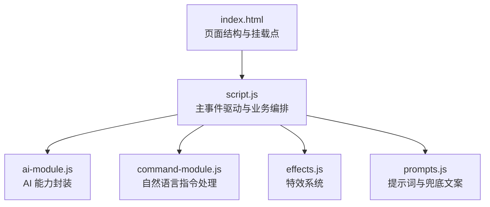
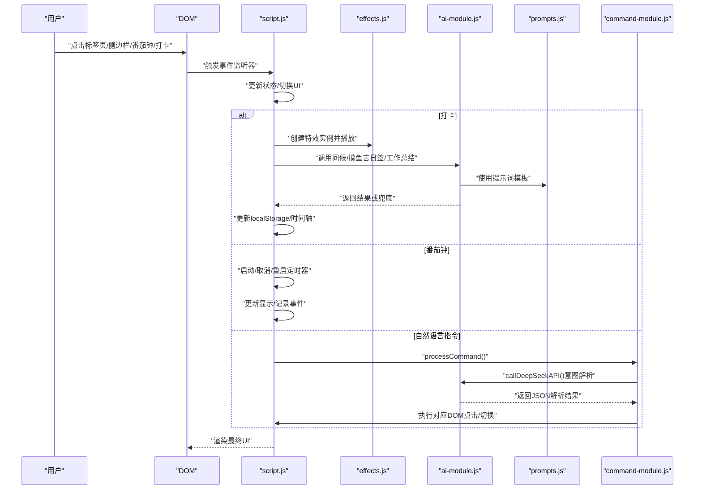
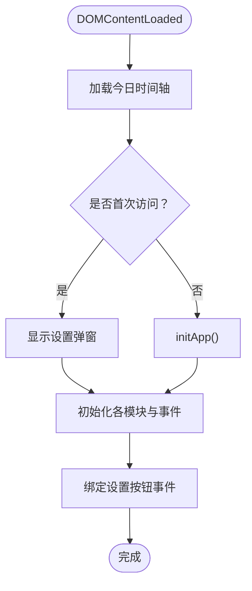
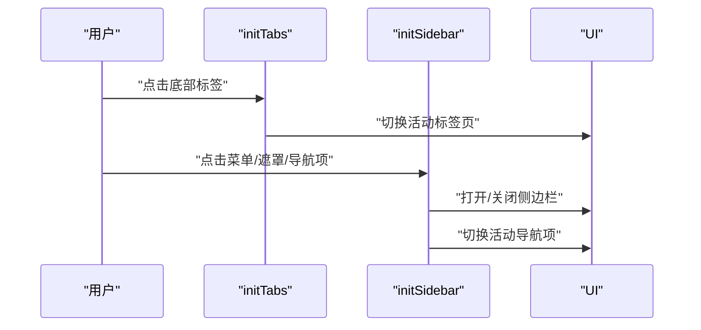
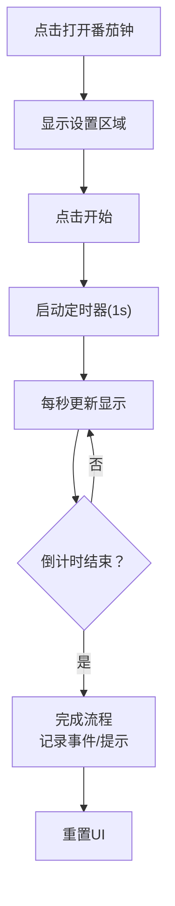
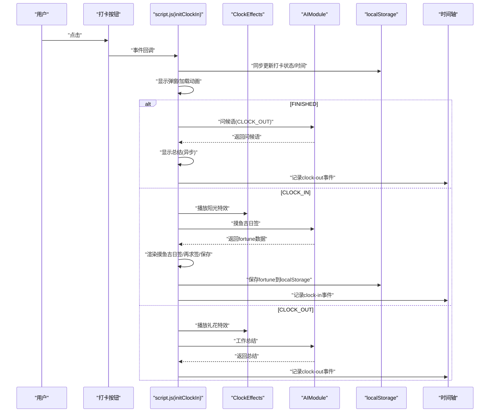
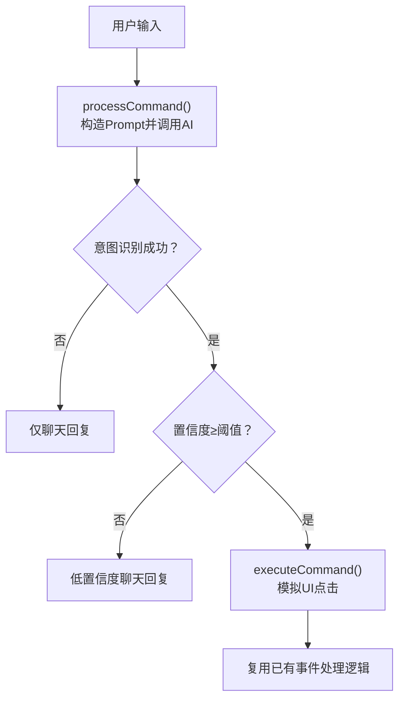
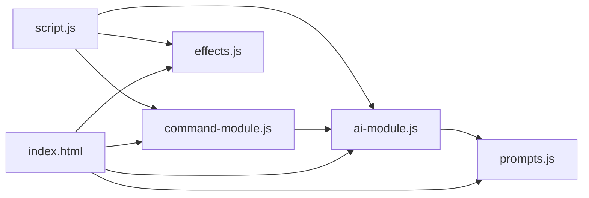

# 事件处理

<cite>
**本文引用的文件**
- [script.js](file://script.js)
- [ai-module.js](file://ai-module.js)
- [command-module.js](file://command-module.js)
- [effects.js](file://effects.js)
- [prompts.js](file://prompts.js)
- [index.html](file://index.html)
</cite>

## 目录
1. [引言](#引言)
2. [项目结构](#项目结构)
3. [核心组件](#核心组件)
4. [架构总览](#架构总览)
5. [详细组件分析](#详细组件分析)
6. [依赖关系分析](#依赖关系分析)
7. [性能考量](#性能考量)
8. [故障排查指南](#故障排查指南)
9. [结论](#结论)

## 引言
本文件围绕前端脚本中的事件驱动架构展开，重点说明以下方面：
- DOMContentLoaded 事件触发的初始化流程
- 标签页切换、侧边栏交互、番茄钟控制等用户交互事件的监听与响应机制
- 初始化函数 initTabs、initSidebar、initClockIn 的事件绑定方式
- 事件回调如何协调状态更新、UI 渲染与模块调用
- 结合打卡流程，解释异步操作（如 AI 调用）与同步操作（如 localStorage 更新）的协调策略，并提供错误处理最佳实践

## 项目结构
本仓库采用“按功能模块划分”的组织方式，核心入口脚本位于根目录的 script.js，AI 相关能力封装于 ai-module.js，自然语言指令解析与执行位于 command-module.js，特效系统位于 effects.js，统一的 AI 提示词与兜底文案位于 prompts.js。页面结构由 index.html 提供，脚本通过 DOM 选择器与事件监听器与 UI 交互。

图表来源
- [index.html](file://index.html#L1-L200)
- [script.js](file://script.js#L95-L155)
- [ai-module.js](file://ai-module.js#L1-L216)
- [command-module.js](file://command-module.js#L1-L313)
- [effects.js](file://effects.js#L1-L279)
- [prompts.js](file://prompts.js#L1-L159)

章节来源
- [index.html](file://index.html#L1-L200)
- [script.js](file://script.js#L95-L155)

## 核心组件
- 事件总线与初始化
  - 页面加载完成后，DOMContentLoaded 事件触发主初始化流程，依次加载时间轴、检查首次访问、初始化标签页、侧边栏、番茄钟、AI 设置、打卡、时间轴、指令控制、快捷功能、日历事件等；同时绑定若干设置按钮事件。
- 标签页与侧边栏
  - initTabs：为底部导航与侧边栏导航绑定点击事件，切换活动标签页并更新 UI。
  - initSidebar：为菜单开关、遮罩层、导航项绑定点击事件，实现抽屉式导航。
- 番茄钟
  - initPomodoro：为打开/关闭模态、快捷时长、开始/取消/重启按钮绑定事件；startPomodoro 控制倒计时与 UI 切换；completePomodoro 完成后记录时间轴事件并提示。
- 打卡流程
  - initClockIn：为打卡按钮绑定点击事件；根据按钮状态区分“上班打卡”“下班打卡”“已下班”三类路径；在弹窗中展示问候语、AI 生成的摸鱼吉日签或下班总结；同步更新 localStorage 并记录时间轴事件；使用 ClockEffects 播放特效。
- AI 与自然语言指令
  - ai-module.js：封装 DeepSeek API 调用、问候语、摸鱼吉日签、工作总结、新闻分析等；提供兜底策略与错误处理。
  - command-module.js：解析用户自然语言，判断意图与置信度，执行对应动作（如打卡、启动番茄钟、切换标签页等），并通过 DOM 事件模拟触发对应 UI 行为。
- 特效系统
  - effects.js：ClockEffects 类封装 Canvas 动画，支持“阳光”和“礼花”两类特效，用于打卡场景的视觉反馈。

章节来源
- [script.js](file://script.js#L95-L155)
- [script.js](file://script.js#L230-L287)
- [script.js](file://script.js#L289-L423)
- [script.js](file://script.js#L493-L732)
- [ai-module.js](file://ai-module.js#L1-L216)
- [command-module.js](file://command-module.js#L1-L313)
- [effects.js](file://effects.js#L1-L279)

## 架构总览
下图展示了事件驱动的关键路径：页面加载 -> 初始化 -> 用户交互 -> 异步/同步处理 -> UI 更新 -> 状态持久化。

图表来源
- [script.js](file://script.js#L95-L155)
- [script.js](file://script.js#L230-L287)
- [script.js](file://script.js#L289-L423)
- [script.js](file://script.js#L493-L732)
- [ai-module.js](file://ai-module.js#L1-L216)
- [command-module.js](file://command-module.js#L182-L259)
- [effects.js](file://effects.js#L1-L279)
- [prompts.js](file://prompts.js#L1-L159)

## 详细组件分析

### 初始化流程（DOMContentLoaded）
- 触发时机：页面 DOMContentLoaded 事件
- 主要职责：
  - 加载今日时间轴
  - 首次访问检测与设置弹窗
  - 初始化标签页、侧边栏、番茄钟、AI 设置、打卡、时间轴、指令控制、快捷功能、日历事件
  - 绑定设置面板中的按钮事件（如清空缓存）

图表来源
- [script.js](file://script.js#L95-L155)

章节来源
- [script.js](file://script.js#L95-L155)

### 标签页与侧边栏（initTabs / initSidebar）
- initTabs
  - 为底部导航与侧边栏导航项绑定点击事件，通过 switchTab 切换活动标签页
  - 默认切换到 countdown
- initSidebar
  - 打开/关闭侧边栏：菜单按钮、遮罩层、关闭按钮
  - 导航项点击：更新活动状态、切换标签页、关闭侧边栏

图表来源
- [script.js](file://script.js#L230-L287)

章节来源
- [script.js](file://script.js#L230-L287)

### 番茄钟（initPomodoro / startPomodoro / completePomodoro）
- 事件绑定
  - 打开/关闭模态、快捷时长、开始/取消/重启按钮
- 逻辑要点
  - startPomodoro：计算总秒数，启动定时器，每秒更新显示；倒计时结束时清理定时器并完成流程
  - completePomodoro：格式化时长，更新完成消息，记录时间轴事件，显示提示
  - resetPomodoroUI：重置 UI 状态

图表来源
- [script.js](file://script.js#L289-L423)

章节来源
- [script.js](file://script.js#L289-L423)

### 打卡流程（initClockIn）
- 事件绑定
  - 打卡按钮点击事件
  - 弹窗关闭事件（包括点击遮罩与关闭按钮）
- 状态与 UI 协调
  - updateClockInButton：根据 localStorage 中的上次打卡类型与日期，动态更新按钮文本、状态与样式
  - 每分钟轮询更新按钮状态
- 业务分支
  - FINISHED（已下班）：直接显示问候语与工作总结，异常时回退兜底
  - CLOCK_IN（上班打卡）：生成问候语，播放阳光特效，显示并可再求签的摸鱼吉日签，保存到 localStorage 并记录时间轴事件
  - CLOCK_OUT（下班打卡）：播放礼花特效，显示工作总结，记录时间轴事件
- 异步与同步协调
  - 同步：立即更新 localStorage、按钮状态、弹窗显示
  - 异步：AI 问候语、摸鱼吉日签、工作总结；均在弹窗中展示加载与错误提示
- 错误处理
  - AI 调用失败时使用兜底文案
  - 异常捕获后回退到默认总结文案

图表来源
- [script.js](file://script.js#L493-L732)
- [effects.js](file://effects.js#L1-L279)
- [ai-module.js](file://ai-module.js#L1-L216)

章节来源
- [script.js](file://script.js#L493-L732)
- [effects.js](file://effects.js#L1-L279)
- [ai-module.js](file://ai-module.js#L1-L216)

### 自然语言指令（command-module.js）
- processCommand
  - 将用户输入交给 AIModule.callDeepSeekAPI，使用预设 Prompt 判断意图与置信度
  - 若置信度低于阈值，仅聊天不执行操作
  - 否则通过 executeCommand 执行对应动作（如点击按钮、切换标签页、摸鱼等）
- executeCommand
  - 通过 DOM 查询与 click() 触发对应 UI 事件，从而复用现有事件处理逻辑

图表来源
- [command-module.js](file://command-module.js#L182-L259)
- [command-module.js](file://command-module.js#L74-L181)
- [ai-module.js](file://ai-module.js#L170-L205)

章节来源
- [command-module.js](file://command-module.js#L1-L313)
- [ai-module.js](file://ai-module.js#L1-L216)

### AI 模块与提示词（ai-module.js / prompts.js）
- ai-module.js
  - callDeepSeekAPI：封装 fetch 调用，校验响应与错误
  - getAIGreeting：返回问候语（可配置是否走 AI）
  - getMoyuFortune / generateWorkSummary：调用 AI 生成摸鱼吉日签与工作总结，失败时返回兜底文案
  - callAIAnalysis：对内容进行分析，失败时返回兜底文案
- prompts.js
  - 统一管理提示词模板与兜底文案，供 AI 模块使用

章节来源
- [ai-module.js](file://ai-module.js#L1-L216)
- [prompts.js](file://prompts.js#L1-L159)

## 依赖关系分析
- 脚本加载顺序
  - index.html 中按顺序引入 prompts.js、ai-module.js、command-module.js、effects.js，确保全局对象在 script.js 使用前已就绪
- 模块间耦合
  - script.js 作为事件中枢，依赖 effects.js（特效）、ai-module.js（AI 能力）、prompts.js（提示词）、command-module.js（指令）
  - command-module.js 依赖 ai-module.js 进行意图解析与执行
- 事件耦合
  - 打卡、标签页、侧边栏、番茄钟等 UI 事件均由 script.js 绑定，形成集中式事件处理
  - 自然语言指令通过 DOM 事件复用既有行为，降低重复逻辑

图表来源
- [index.html](file://index.html#L1-L20)
- [script.js](file://script.js#L95-L155)
- [ai-module.js](file://ai-module.js#L1-L216)
- [command-module.js](file://command-module.js#L1-L313)
- [effects.js](file://effects.js#L1-L279)
- [prompts.js](file://prompts.js#L1-L159)

章节来源
- [index.html](file://index.html#L1-L20)
- [script.js](file://script.js#L95-L155)

## 性能考量
- 事件绑定与解绑
  - 番茄钟与打卡弹窗在关闭时清理定时器与特效，避免内存泄漏
- 异步与同步分离
  - localStorage 更新与 UI 切换为同步，AI 调用为异步，减少阻塞
- 轮询与节流
  - 打卡按钮状态每分钟更新一次，避免频繁读取与计算
- 动画优化
  - Canvas 动画在特效结束后清理帧循环与粒子，降低 CPU/GPU 占用

[本节为通用指导，无需列出具体文件来源]

## 故障排查指南
- 打卡按钮状态异常
  - 检查 localStorage 中 lastClockInType 与 lastClockInDate 是否正确；确认 updateClockInButton 的逻辑与定时器是否生效
- AI 调用失败
  - 确认 deepseekApiKey 是否已保存；检查网络与 API 返回状态；查看 ai-module.js 的错误处理与兜底文案
- 特效不显示
  - 确认 Canvas 元素存在且尺寸正确；检查 effects.js 的 resize 与 animate 循环是否被清理
- 自然语言指令无效
  - 检查 command-module.js 的置信度阈值与 executeCommand 的 DOM 查询是否正确；确认 AIModule 可用

章节来源
- [script.js](file://script.js#L493-L732)
- [ai-module.js](file://ai-module.js#L1-L216)
- [effects.js](file://effects.js#L1-L279)
- [command-module.js](file://command-module.js#L1-L313)

## 结论
本项目以 script.js 为核心，构建了清晰的事件驱动架构：DOMContentLoaded 触发初始化，随后各模块通过事件监听器响应用户交互；在打卡流程中，同步与异步操作协同，配合特效与 AI 能力，实现了良好的用户体验。通过 prompts.js 与 ai-module.js 的统一提示词与兜底策略，保证了在异常情况下的稳定性。command-module.js 将自然语言指令与现有 UI 事件解耦，进一步提升了可扩展性与可维护性。