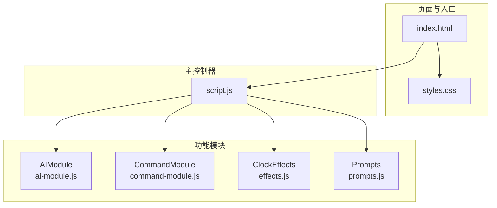
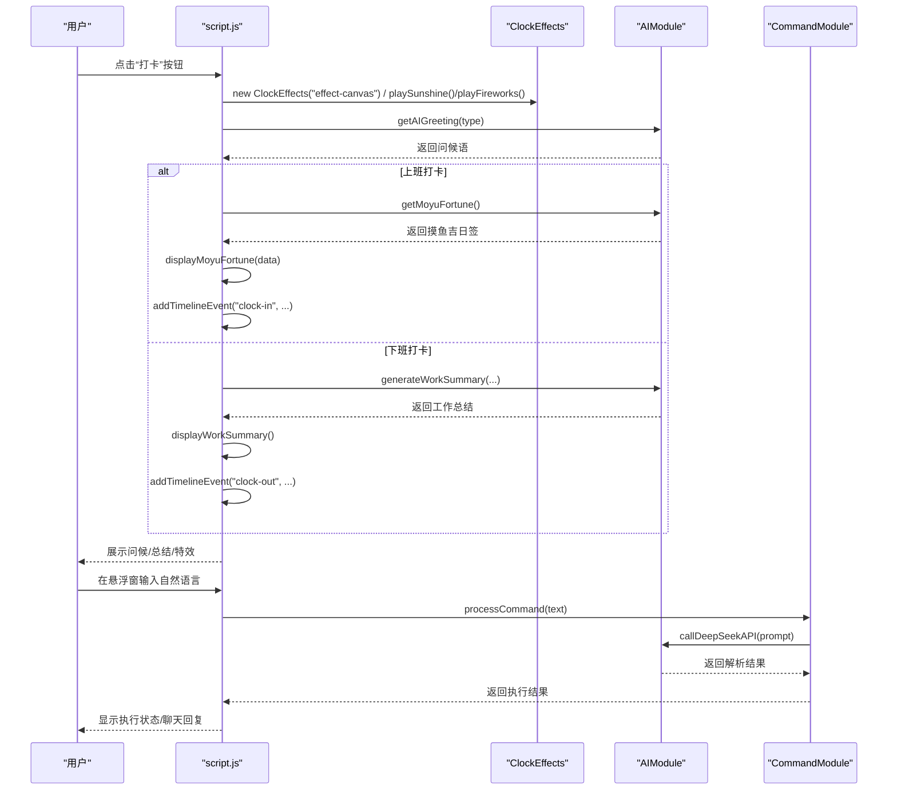
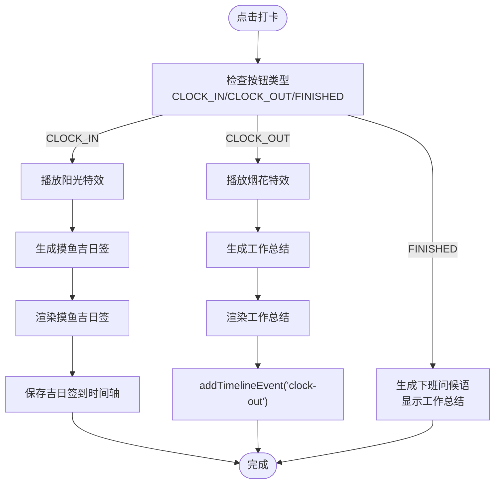
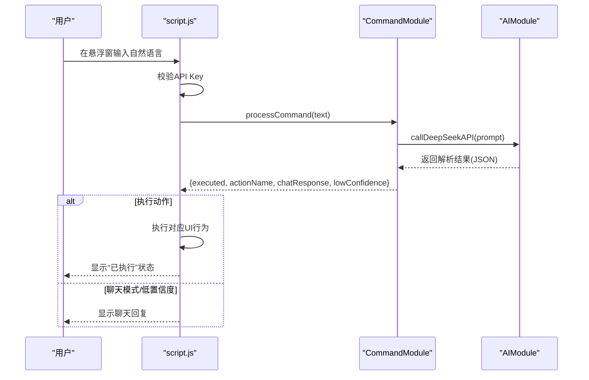
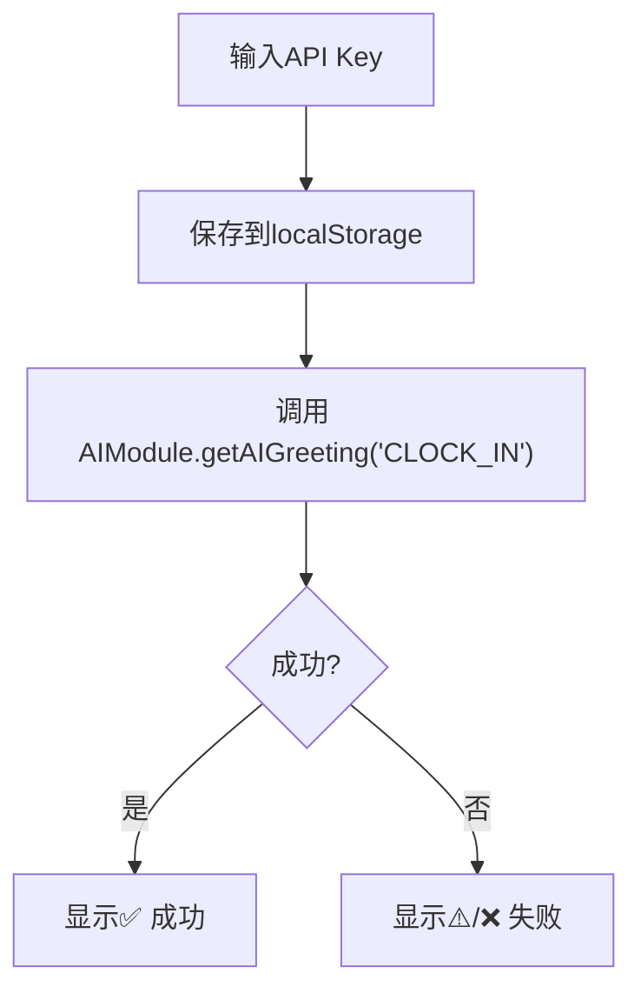
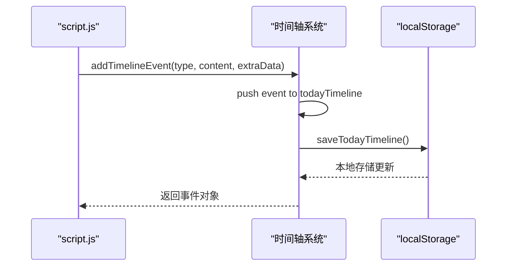
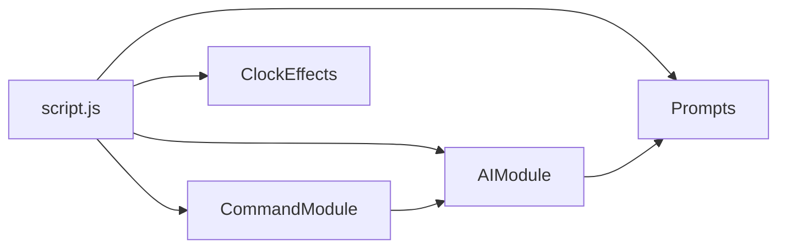

# 模块集成

<cite>
**本文引用的文件**
- [script.js](file://script.js)
- [ai-module.js](file://ai-module.js)
- [command-module.js](file://command-module.js)
- [effects.js](file://effects.js)
- [prompts.js](file://prompts.js)
- [index.html](file://index.html)
- [styles.css](file://styles.css)
</cite>

## 目录
1. [引言](#引言)
2. [项目结构](#项目结构)
3. [核心组件](#核心组件)
4. [架构总览](#架构总览)
5. [详细组件分析](#详细组件分析)
6. [依赖关系分析](#依赖关系分析)
7. [性能考量](#性能考量)
8. [故障排查指南](#故障排查指南)
9. [结论](#结论)
10. [附录](#附录)

## 引言
本文件围绕 script.js 作为主控制器的角色，系统梳理其如何集成 AIModule、ClockEffects、CommandModule 等全局模块，重点解释 initAISettings、initClockIn、initCommandControl 等函数如何建立模块间的通信桥梁；并结合“打卡”场景，说明主控制器如何协调 AI 问候语生成、视觉特效播放与指令解析的协同工作，阐述 addTimelineEvent 如何将事件数据同步到时间轴系统，最后讨论模块解耦设计的优势与潜在改进空间。

## 项目结构
该项目采用“主控制器 + 多功能模块”的前端架构：
- 主控制器：script.js，负责页面生命周期、初始化、事件绑定、跨模块调度与数据同步。
- 功能模块：
  - AIModule（ai-module.js）：封装 DeepSeek API 调用、问候语生成、摸鱼吉日签、工作总结等。
  - CommandModule（command-module.js）：解析自然语言指令，驱动 UI 行为。
  - ClockEffects（effects.js）：提供 Canvas 特效（阳光/烟花），用于打卡场景的视觉反馈。
  - Prompts（prompts.js）：集中管理 AI Prompt 模板与兜底文案。
- 页面与样式：index.html 定义 DOM 结构，styles.css 提供样式与交互态。

图表来源
- [index.html](file://index.html#L1-L120)
- [script.js](file://script.js#L90-L135)
- [ai-module.js](file://ai-module.js#L206-L216)
- [command-module.js](file://command-module.js#L305-L313)
- [effects.js](file://effects.js#L275-L279)
- [prompts.js](file://prompts.js#L153-L159)

章节来源
- [index.html](file://index.html#L1-L120)
- [script.js](file://script.js#L90-L135)

## 核心组件
- 主控制器（script.js）
  - 页面加载初始化：loadTodayTimeline、initApp、initTabs、initSidebar、initPomodoro、initAISettings、initClockIn、initTimeline、initCommandControl、initShortcuts、initCalendarEvents。
  - 数据与状态：全局 events、todayTimeline、工作时间配置、开发者模式与自定义时间、节假日与串休配置。
  - 事件同步：addTimelineEvent 将事件持久化到本地存储并触发 UI 更新。
  - 打卡流程：initClockIn 负责按钮状态、问候弹窗、AI 生成、特效播放、时间轴记录与总结展示。
  - 指令控制：initCommandControl 提供悬浮窗 AI 助手，调用 CommandModule.processCommand 并反馈执行状态。
  - AI 设置：initAISettings 负责 API Key 存取、显示/隐藏切换、测试连接（调用 AIModule）。
- AIModule（ai-module.js）
  - 提供 getAIGreeting、getMoyuFortune、generateWorkSummary、callAIAnalysis 等接口，统一调用 DeepSeek API。
  - 通过 window.AIModule 暴露给全局使用。
- CommandModule（command-module.js）
  - 提供 processCommand、executeCommand、COMMAND_TYPES 等，解析自然语言并驱动 UI 行为。
  - 通过 window.CommandModule 暴露给全局使用。
- ClockEffects（effects.js）
  - 提供 ClockEffects 类，支持 playSunshine（上班打卡）与 playFireworks（下班打卡）特效。
  - 通过 window.ClockEffects 暴露给全局使用。
- Prompts（prompts.js）
  - 提供 AI_PROMPTS、FALLBACK_MESSAGES、getRandomFallbackMessage，集中管理 Prompt 模板与兜底文案。
  - 通过 window.AI_PROMPTS、window.FALLBACK_MESSAGES、window.getRandomFallbackMessage 暴露给全局使用。

章节来源
- [script.js](file://script.js#L1-L120)
- [ai-module.js](file://ai-module.js#L1-L216)
- [command-module.js](file://command-module.js#L1-L313)
- [effects.js](file://effects.js#L1-L279)
- [prompts.js](file://prompts.js#L1-L159)

## 架构总览
主控制器通过 DOM 事件与全局模块接口建立松耦合协作：
- initClockIn 中创建 ClockEffects 实例，按打卡类型播放特效；
- 调用 window.AIModule 生成问候语、摸鱼吉日签、工作总结；
- 通过 addTimelineEvent 将事件写入 todayTimeline 并持久化；
- initCommandControl 通过 window.CommandModule 解析自然语言，驱动 UI 行为；
- initAISettings 通过 window.AIModule.getAIGreeting 进行 API Key 测试。

图表来源
- [script.js](file://script.js#L493-L732)
- [script.js](file://script.js#L3026-L3151)
- [script.js](file://script.js#L922-L1030)
- [ai-module.js](file://ai-module.js#L61-L167)
- [command-module.js](file://command-module.js#L182-L259)
- [effects.js](file://effects.js#L25-L141)

## 详细组件分析

### 主控制器：initClockIn 与打卡场景协同
- 按钮状态与历史记录：根据 lastClockInType/lastClockInDate 切换“上班/下班/已完成”状态，支持 FINISHED 场景直接展示总结。
- 特效播放：new ClockEffects('effect-canvas') 创建特效实例；上班打卡播放阳光特效，下班打卡播放烟花特效。
- AI 生成：
  - 上班：getAIGreeting(type) 生成问候语；getMoyuFortune() 生成摸鱼吉日签，displayMoyuFortune() 渲染；再通过 addTimelineEvent 记录。
  - 下班：getAIGreeting(type) 生成问候语；generateWorkSummary(...) 生成总结，displayWorkSummary() 渲染；addTimelineEvent 记录。
- 事件同步：addTimelineEvent 将事件写入 todayTimeline 并持久化到 localStorage，保证跨会话可见。

图表来源
- [script.js](file://script.js#L493-L732)
- [script.js](file://script.js#L3026-L3151)

章节来源
- [script.js](file://script.js#L493-L732)
- [script.js](file://script.js#L3026-L3151)

### 主控制器：initCommandControl 与自然语言指令解析
- UI 交互：悬浮窗开关、输入框、发送按钮、消息面板、状态提示。
- 流程：
  - 校验 API Key 是否配置；
  - 调用 window.CommandModule.processCommand(text)；
  - 若为聊天模式，仅返回聊天回复；若置信度达标，执行对应动作并反馈执行状态；
  - 通过 showToast 统一提示。
- 指令执行：CommandModule.executeCommand 根据 COMMAND_TYPES 调用对应 UI 行为（如点击打卡、打开时间轴、切换标签页、开始/暂停番茄钟、摸鱼记录等）。

图表来源
- [script.js](file://script.js#L922-L1030)
- [command-module.js](file://command-module.js#L182-L259)
- [ai-module.js](file://ai-module.js#L141-L167)

章节来源
- [script.js](file://script.js#L922-L1030)
- [command-module.js](file://command-module.js#L1-L313)

### 主控制器：initAISettings 与 API Key 管理
- 功能：加载/保存 API Key、切换显示/隐藏、测试连接（调用 window.AIModule.getAIGreeting）。
- 流程：输入密钥 -> 保存到 localStorage -> 临时保存用于测试 -> 调用 AIModule.getAIGreeting -> 展示测试结果。

图表来源
- [script.js](file://script.js#L424-L491)
- [ai-module.js](file://ai-module.js#L61-L93)

章节来源
- [script.js](file://script.js#L424-L491)
- [ai-module.js](file://ai-module.js#L61-L93)

### 模块间通信与数据传递机制
- addTimelineEvent：构建事件对象（含 id、time、type、content、extraData），追加到 todayTimeline，调用 saveTodayTimeline 持久化；返回事件对象以便后续消费。
- 时间轴渲染：initTimeline + showTimeline 从 todayTimeline 读取并排序，按类型映射为 UI 展示。
- 事件来源：
  - 打卡：addTimelineEvent('clock-in'/'clock-out', ...)；
  - 番茄钟：completePomodoro 调用 addTimelineEvent('pomodoro', ...)；
  - 点击卡片：bindMainCardEvents 调用 addTimelineEvent('relax', ...)。

图表来源
- [script.js](file://script.js#L18-L47)
- [script.js](file://script.js#L802-L908)

章节来源
- [script.js](file://script.js#L18-L47)
- [script.js](file://script.js#L802-L908)

### 模块解耦设计与优势
- 通过 window.AIModule、window.CommandModule、window.ClockEffects、window.AI_PROMPTS 等全局命名空间暴露接口，主控制器仅依赖这些接口，不直接依赖具体实现细节，降低耦合度。
- 模块职责清晰：
  - AIModule：AI 服务封装与兜底策略；
  - CommandModule：自然语言理解与 UI 驱动；
  - ClockEffects：纯渲染与动画；
  - Prompts：Prompt 与兜底文案集中管理。
- 优势：
  - 易于替换/扩展：如更换 AI 供应商、替换特效引擎、新增 Prompt。
  - 易于测试：各模块可通过独立单元测试验证。
  - 易于维护：变更集中在模块内部，不影响主控制器。
- 潜在改进：
  - 可引入依赖注入或工厂模式，减少对全局命名空间的直接依赖，提升可测试性与可替换性。
  - 对外接口可进一步标准化（如统一返回 Promise/Result 结构），便于错误处理与可观测性。

章节来源
- [ai-module.js](file://ai-module.js#L206-L216)
- [command-module.js](file://command-module.js#L305-L313)
- [effects.js](file://effects.js#L275-L279)
- [prompts.js](file://prompts.js#L153-L159)

## 依赖关系分析
- script.js 依赖：
  - DOM 事件与 UI 组件（index.html）；
  - 全局模块：window.AIModule、window.CommandModule、window.ClockEffects、window.AI_PROMPTS、window.FALLBACK_MESSAGES、window.getRandomFallbackMessage。
- 模块间依赖：
  - CommandModule 依赖 AIModule（callDeepSeekAPI）；
  - AIModule 依赖 Prompts（AI_PROMPTS、FALLBACK_MESSAGES）与 localStorage；
  - ClockEffects 依赖 Canvas API。

图表来源
- [script.js](file://script.js#L90-L135)
- [command-module.js](file://command-module.js#L182-L259)
- [ai-module.js](file://ai-module.js#L141-L167)
- [prompts.js](file://prompts.js#L1-L159)

章节来源
- [script.js](file://script.js#L90-L135)
- [command-module.js](file://command-module.js#L182-L259)
- [ai-module.js](file://ai-module.js#L141-L167)
- [prompts.js](file://prompts.js#L1-L159)

## 性能考量
- Canvas 动画：ClockEffects 使用 requestAnimationFrame 控制帧率，粒子过滤与清理需在动画结束后执行，避免内存泄漏。
- API 调用：AIModule 对 DeepSeek API 的调用应避免频繁触发，建议在 UI 层做防抖/节流。
- 本地存储：addTimelineEvent/saveTodayTimeline 为 O(n) 写入，建议批量写入或延迟合并，减少主线程阻塞。
- 事件渲染：showTimeline 对 todayTimeline 排序与渲染，建议在数据量较大时采用虚拟滚动或分页。

## 故障排查指南
- API Key 未配置：initCommandControl 发送消息前校验 localStorage 中 deepseekApiKey，未配置时引导跳转设置页并提示。
- AI 调用失败：AIModule 对 callDeepSeekAPI 的异常进行捕获与兜底，返回 FALLBACK_MESSAGES 或抛出错误；CommandModule/processCommand 对解析失败/低置信度进行降级处理。
- 特效异常：ClockEffects.clear/cancelAnimationFrame 保证动画资源释放；playSunshine/playFireworks 前确保 canvas 可用。
- 事件丢失：确认 addTimelineEvent 是否被调用、localStorage 是否可用、loadTodayTimeline 是否在页面加载时执行。

章节来源
- [script.js](file://script.js#L922-L1030)
- [ai-module.js](file://ai-module.js#L141-L167)
- [command-module.js](file://command-module.js#L182-L259)
- [effects.js](file://effects.js#L262-L273)

## 结论
script.js 作为主控制器，通过全局模块接口实现了对 AI、特效与指令系统的统一编排。initClockIn、initCommandControl、initAISettings 三大初始化函数分别承担了“打卡协同”“自然语言控制”“AI 设置”的桥接职责。addTimelineEvent 将事件数据同步到时间轴系统，形成闭环。模块解耦设计提升了系统的可维护性与可扩展性，未来可在依赖注入与接口标准化方面进一步优化。

## 附录
- 页面入口与脚本加载顺序：index.html 中按顺序引入 prompts.js、ai-module.js、command-module.js、effects.js，确保全局命名空间在 script.js 初始化前可用。
- 样式与交互：styles.css 定义了悬浮窗、模态框、Toast、日历等 UI 组件的基础样式与动画。

章节来源
- [index.html](file://index.html#L1-L120)
- [styles.css](file://styles.css#L1-L200)