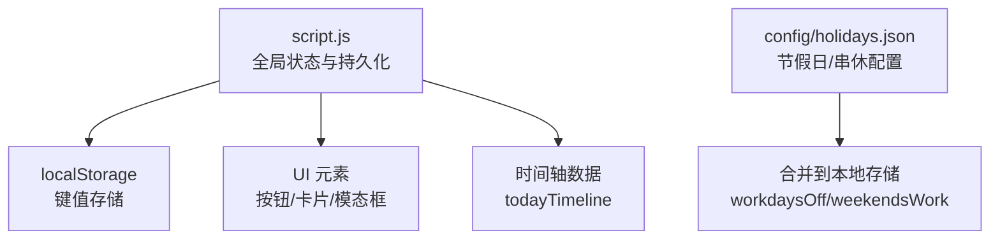
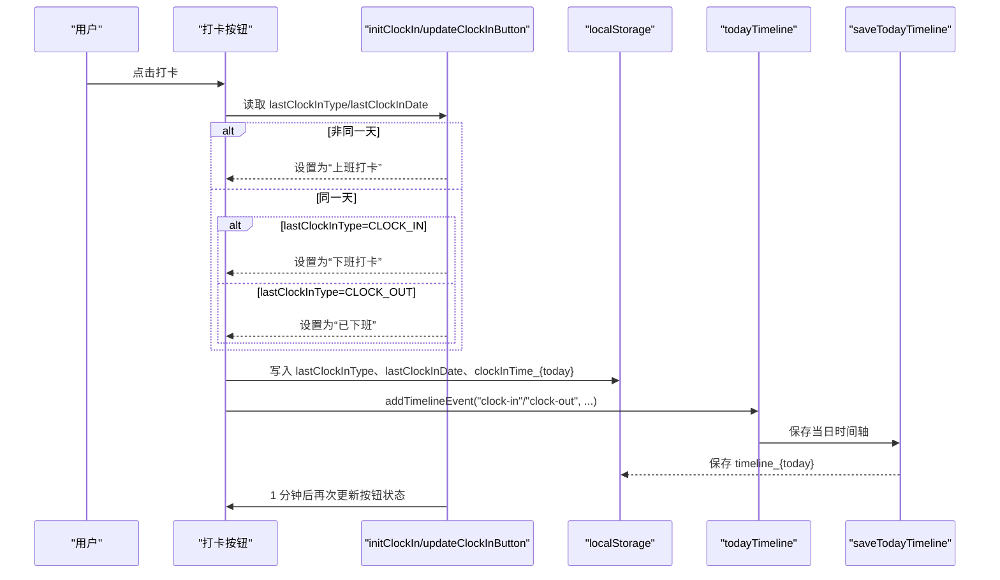
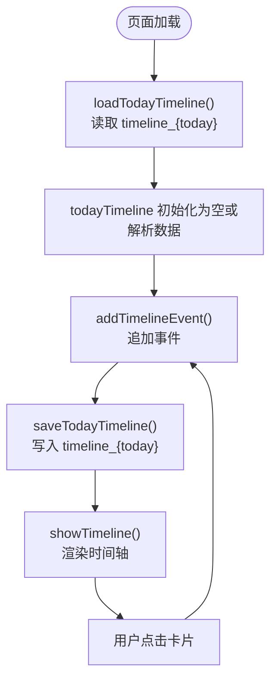
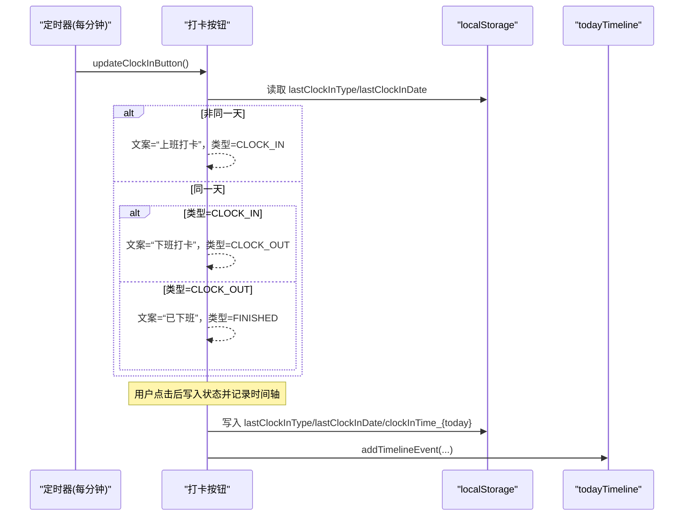
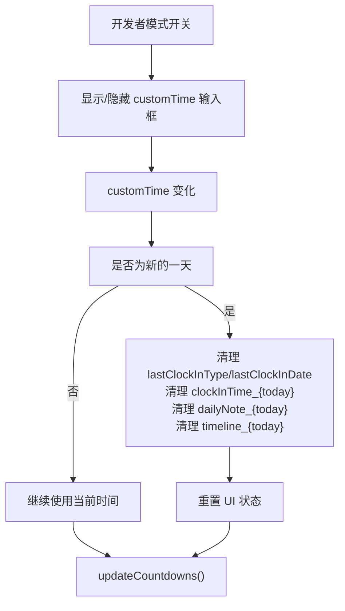
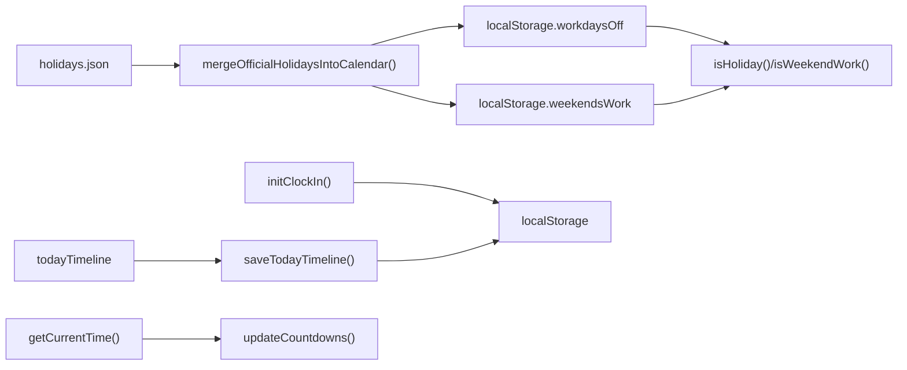

# 状态管理

<cite>
**本文引用的文件**
- [script.js](file://script.js)
- [holidays.json](file://config/holidays.json)
</cite>

## 目录
1. [简介](#简介)
2. [项目结构](#项目结构)
3. [核心组件](#核心组件)
4. [架构总览](#架构总览)
5. [详细组件分析](#详细组件分析)
6. [依赖关系分析](#依赖关系分析)
7. [性能考量](#性能考量)
8. [故障排查指南](#故障排查指南)
9. [结论](#结论)

## 简介
本文件聚焦于 script.js 中通过全局变量与 localStorage 实现的应用状态持久化管理，重点覆盖以下方面：
- 核心状态变量：workStartTime、workEndTime、holidays、todayTimeline 等的初始化、读取与更新机制
- 状态与 UI 的同步方式：打卡按钮状态如何依据 lastClockInType 与 lastClockInDate 动态更新
- 时间轴数据生命周期：loadTodayTimeline 与 saveTodayTimeline 的职责与调用链
- 开发者模式下 customTime 对状态与 UI 的影响路径
- 提供状态变更的完整流程示例与可视化图示，帮助读者快速理解与定位问题

## 项目结构
该仓库包含多个页面脚本与配置文件，其中与本主题最相关的是根目录下的 script.js 以及 config/holidays.json。前者集中实现了状态持久化、UI 同步与时间轴生命周期管理；后者提供节假日与串休上班日的基础数据来源。

图表来源
- [script.js](file://script.js#L1-L120)
- [holidays.json](file://config/holidays.json#L1-L46)

章节来源
- [script.js](file://script.js#L1-L120)
- [holidays.json](file://config/holidays.json#L1-L46)

## 核心组件
- 全局状态变量
  - 工作时间配置：workStartTime、lunchStartTime、lunchEndTime、workEndTime
  - 本地节假日与串休：holidays、workdaysOff、weekendsWork
  - 开发者模式：developerMode、customTime
  - 时间轴：todayTimeline
- 本地存储键
  - 配置类：workStartTime、lunchStartTime、lunchEndTime、workEndTime、monthlySalary、salaryType、salaryDay、officialHolidays、officialWeekendWorkdays
  - 打卡状态：lastClockInType、lastClockInDate、clockInTime_{today}、moyuFortune_{today}
  - 时间轴：timeline_{today}
  - 日历事件：calendarEvents
  - AI 密钥：deepseekApiKey
  - 自定义事件：customEvents
  - 开发者设置：developerMode、customTime
- 关键函数
  - loadTodayTimeline/saveTodayTimeline/addTimelineEvent：时间轴生命周期管理
  - initClockIn/updateClockInButton：打卡按钮状态同步
  - getCurrentTime：统一时间源（支持开发者模式）
  - initApp：应用初始化与状态重载
  - mergeOfficialHolidaysIntoCalendar：节假日与串休合并到本地存储

章节来源
- [script.js](file://script.js#L1-L120)
- [script.js](file://script.js#L1828-L1858)
- [script.js](file://script.js#L493-L732)
- [script.js](file://script.js#L1132-L1205)
- [script.js](file://script.js#L1297-L1322)

## 架构总览
下面的时序图展示了“打卡”这一关键状态变更的端到端流程，包括 UI 触发、状态写入、UI 同步与时间轴记录。

图表来源
- [script.js](file://script.js#L493-L732)
- [script.js](file://script.js#L1828-L1858)

章节来源
- [script.js](file://script.js#L493-L732)
- [script.js](file://script.js#L1828-L1858)

## 详细组件分析

### 1) 全局状态变量与初始化
- 初始化来源
  - 页面加载时，从 localStorage 读取工作时间、节假日、串休、开发者模式与自定义时间等键值，若缺失则采用默认值
  - 初始化后，应用会重新加载事件、渲染 UI 并启动定时器
- 关键点
  - 工作时间配置 workTimeConfig 基于 workStartTime/workEndTime 等解析生成
  - holidays、workdaysOff、weekendsWork 用于工作日判定（是否为假日、串休上班日）
  - developerMode 与 customTime 由 getCurrentTime 统一生效，使 UI 倒计时与业务逻辑基于自定义时间

章节来源
- [script.js](file://script.js#L1-L120)
- [script.js](file://script.js#L1065-L1131)
- [script.js](file://script.js#L86-L92)

### 2) 时间轴数据生命周期管理
- 数据结构
  - todayTimeline：数组，按时间顺序记录当日事件
- 生命周期
  - 加载：loadTodayTimeline 依据当前日期拼接键名 timeline_{today} 读取并赋值给 todayTimeline
  - 更新：addTimelineEvent 追加事件并立即调用 saveTodayTimeline
  - 保存：saveTodayTimeline 将 todayTimeline 序列化后写入 localStorage
- 与 UI 的关系
  - showTimeline 会读取 todayTimeline 并渲染为时间轴面板
  - 用户点击卡片会触发 addTimelineEvent 记录“点击卡片”事件，形成闭环

图表来源
- [script.js](file://script.js#L18-L47)
- [script.js](file://script.js#L831-L907)

章节来源
- [script.js](file://script.js#L18-L47)
- [script.js](file://script.js#L831-L907)

### 3) 打卡按钮状态与 UI 同步
- 状态来源
  - lastClockInType：上次打卡类型（CLOCK_IN/CLOCK_OUT/FINISHED）
  - lastClockInDate：上次打卡日期（字符串）
- 同步策略
  - initClockIn 中的 updateClockInButton 每分钟读取上述两项，结合当前日期决定按钮文案、类型与可用性
  - 点击后立即写入 lastClockInType、lastClockInDate，必要时写入 clockInTime_{today}，并触发 addTimelineEvent 记录事件
- 与时间轴联动
  - 上班打卡：记录“上班打卡+摸鱼吉日签”事件
  - 下班打卡：记录“下班打卡”事件，并弹窗展示工作总结

图表来源
- [script.js](file://script.js#L493-L732)

章节来源
- [script.js](file://script.js#L493-L732)

### 4) 开发者模式与 customTime 的影响
- 开启方式
  - 在设置页勾选开发者模式，显示 customTime 输入框
- 生效机制
  - getCurrentTime 优先返回 customTime（若启用），否则返回真实时间
  - initApp 中监听 customTime 变化，若切换为新的一天，将清理 lastClockInType/lastClockInDate、clockInTime_{today}、dailyNote_{today}、timeline_{today}，并重置 UI
- 对 UI 的影响
  - 倒计时、卡片提示、日历标注等均基于 getCurrentTime 计算，从而体现“自定义时间”的效果

图表来源
- [script.js](file://script.js#L1132-L1205)
- [script.js](file://script.js#L86-L92)
- [script.js](file://script.js#L1828-L1858)

章节来源
- [script.js](file://script.js#L1132-L1205)
- [script.js](file://script.js#L86-L92)
- [script.js](file://script.js#L1828-L1858)

### 5) 与节假日/串休相关的状态
- 数据来源
  - config/holidays.json 提供官方节假日与串休上班日
  - mergeOfficialHolidaysIntoCalendar 将其合并到 workdaysOff 与 weekendsWork，并持久化到 localStorage
- 用途
  - isWeekend/isHoliday/isWeekendWork 用于工作日判定，影响倒计时与 UI 样式（如日历中标注）

章节来源
- [holidays.json](file://config/holidays.json#L1-L46)
- [script.js](file://script.js#L1297-L1322)
- [script.js](file://script.js#L61-L84)

## 依赖关系分析
- 外部依赖
  - config/holidays.json：节假日与串休配置
  - localStorage：所有状态持久化的唯一来源
- 内部依赖
  - initClockIn 依赖 localStorage 的 lastClockInType/lastClockInDate/clockInTime_{today}/moyuFortune_{today}
  - 时间轴依赖 localStorage 的 timeline_{today}
  - UI 倒计时依赖 getCurrentTime 与工作时间配置
  - 日历依赖 workdaysOff/weekendsWork 与官方节假日配置

图表来源
- [script.js](file://script.js#L1297-L1322)
- [script.js](file://script.js#L493-L732)
- [script.js](file://script.js#L1828-L1858)
- [script.js](file://script.js#L86-L92)

章节来源
- [script.js](file://script.js#L1297-L1322)
- [script.js](file://script.js#L493-L732)
- [script.js](file://script.js#L1828-L1858)
- [script.js](file://script.js#L86-L92)

## 性能考量
- 读写频率
  - 打卡按钮状态每分钟更新一次，属于轻量级轮询
  - 时间轴写入发生在 addTimelineEvent，通常在用户交互后触发，频率可控
- 存储体积
  - 以天为单位的 timeline_{today}，单日事件数量有限，localStorage 写入成本低
- 计算复杂度
  - 工作日判定与倒计时计算在主线程执行，但仅涉及少量日期运算与数组过滤，性能开销较小

## 故障排查指南
- 打卡按钮状态异常
  - 检查 lastClockInDate 是否与当前日期一致；若不一致，按钮应显示“上班打卡”
  - 确认 localStorage 中 lastClockInType/lastClockInDate 是否被意外清理
- 时间轴未更新
  - 确认 addTimelineEvent 是否被调用；确认 saveTodayTimeline 是否成功写入 timeline_{today}
- 开发者模式无效
  - 确认 developerMode 已开启且 customTime 已设置
  - 若切换为新的一天，确认是否触发了清理逻辑（lastClockInType/lastClockInDate、clockInTime_{today}、timeline_{today}）
- 节假日/串休不生效
  - 确认 mergeOfficialHolidaysIntoCalendar 已执行并将数据写入 localStorage
  - 确认 isHoliday/isWeekendWork 的日期匹配逻辑

章节来源
- [script.js](file://script.js#L493-L732)
- [script.js](file://script.js#L18-L47)
- [script.js](file://script.js#L1132-L1205)
- [script.js](file://script.js#L1297-L1322)

## 结论
本项目通过全局变量与 localStorage 的组合，实现了稳定的状态持久化与 UI 同步。核心要点如下：
- 核心状态变量在页面加载时从 localStorage 初始化，应用运行期间通过统一入口更新并持久化
- 打卡按钮状态与时间轴事件紧密耦合，保证用户行为与数据记录的一致性
- 开发者模式下的 customTime 通过 getCurrentTime 影响全站时间相关逻辑，便于调试与演示
- 节假日与串休通过配置文件合并到本地存储，提升跨页面一致性与可维护性