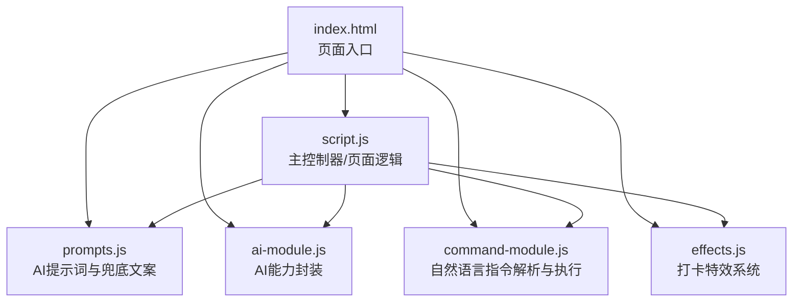
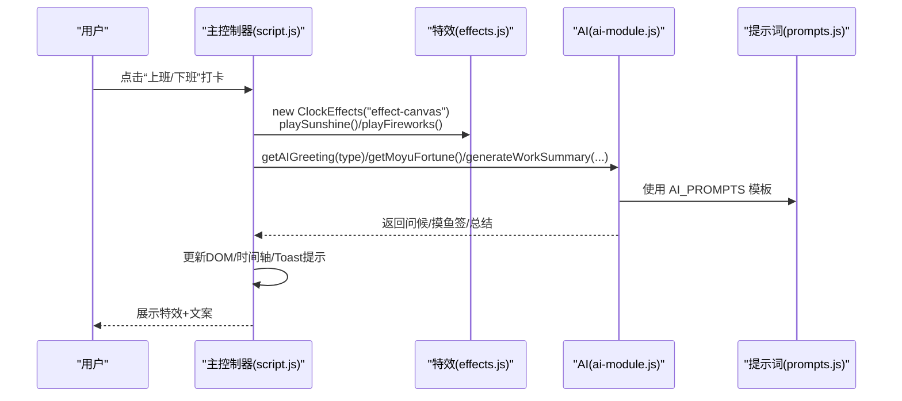
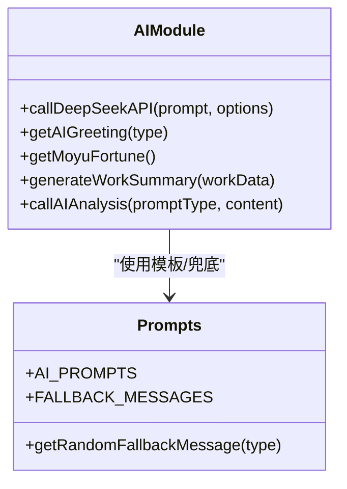
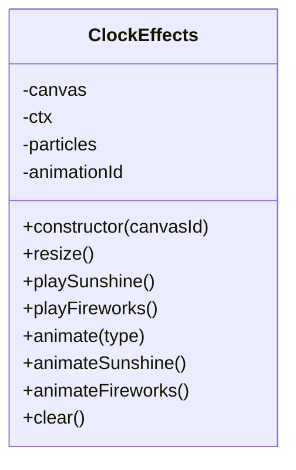
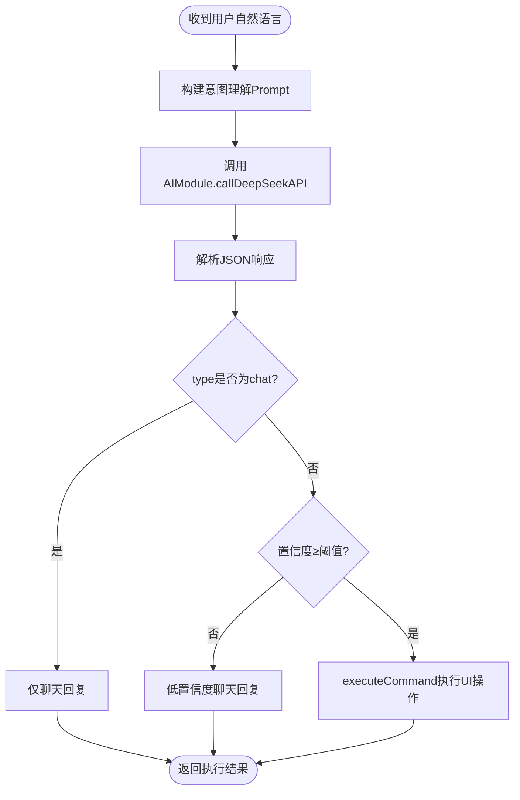
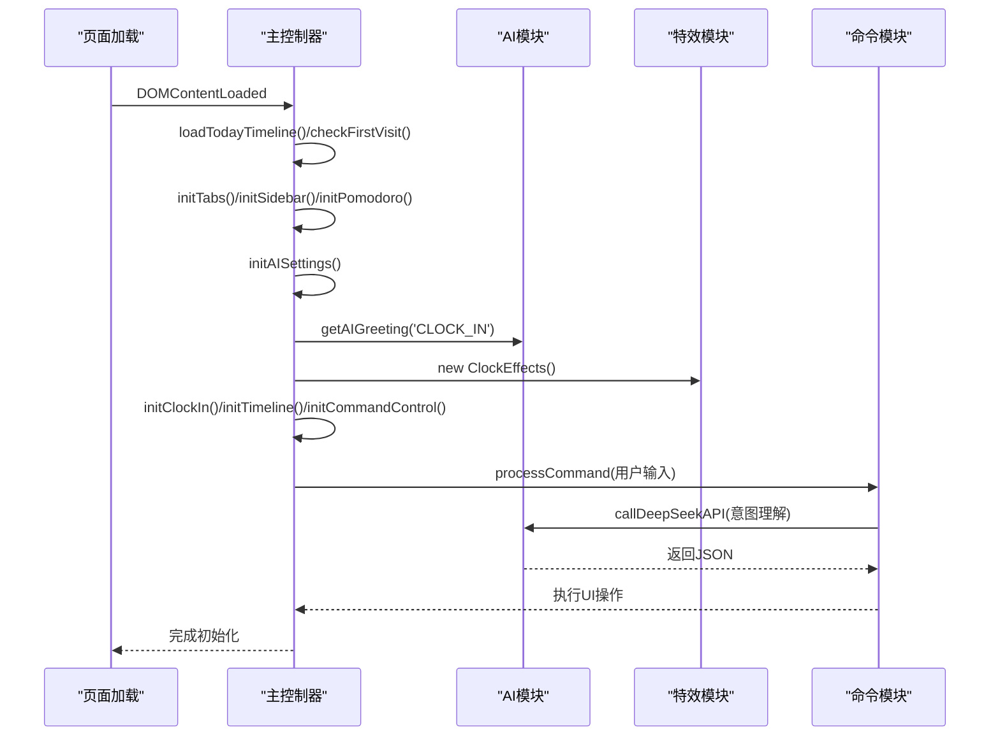
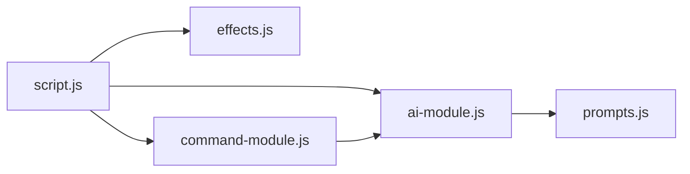

# 代码结构与模块职责

<cite>
**本文引用的文件**
- [index.html](file://index.html)
- [script.js](file://script.js)
- [ai-module.js](file://ai-module.js)
- [effects.js](file://effects.js)
- [command-module.js](file://command-module.js)
- [prompts.js](file://prompts.js)
- [styles.css](file://styles.css)
- [README.md](file://README.md)
</cite>

## 目录
1. [引言](#引言)
2. [项目结构](#项目结构)
3. [核心组件](#核心组件)
4. [架构总览](#架构总览)
5. [详细组件分析](#详细组件分析)
6. [依赖关系分析](#依赖关系分析)
7. [性能考量](#性能考量)
8. [故障排查指南](#故障排查指南)
9. [结论](#结论)
10. [附录](#附录)

## 引言
本项目是一个集工作倒计时、日历、打卡、AI互动与特效于一体的前端应用。本文档聚焦于主控制器 script.js 如何协调 ai-module.js、effects.js 和 command-module.js 三个功能模块，解释通过 window 对象暴露接口的通信机制、事件驱动的调用关系，以及模块初始化流程（如 initClockIn、initAISettings 等）与数据流传递方式，帮助新开发者快速理解系统架构与模块边界。

## 项目结构
项目采用“页面 + 多模块脚本”的组织方式：
- index.html 作为入口页面，按顺序引入 prompts.js、ai-module.js、command-module.js、effects.js，最后引入主控制器 script.js。
- 各功能模块独立封装，通过 window 对象对外暴露 API，形成松耦合的模块化结构。
- 样式集中于 styles.css，页面结构与交互逻辑集中在 script.js 中。

图表来源
- [index.html](file://index.html#L1-L12)
- [script.js](file://script.js#L1-L155)

章节来源
- [index.html](file://index.html#L1-L12)
- [README.md](file://README.md#L90-L125)

## 核心组件
- 主控制器 script.js
  - 负责页面生命周期初始化、标签页与侧边栏切换、番茄钟、打卡弹窗、时间轴、快捷功能、日历事件、开发者设置与缓存清理等。
  - 通过 window 对象调用 AI 模块与特效模块，实现事件驱动的功能编排。
- AI 模块 ai-module.js
  - 封装 DeepSeek API 调用、问候语生成、摸鱼吉日签、工作总结生成、通用分析调用等。
  - 通过 window.AIModule 暴露方法，供主控制器与命令模块调用。
- 特效模块 effects.js
  - 提供 ClockEffects 类，负责 Canvas 动画特效（阳光/礼花），通过 window.ClockEffects 暴露类构造器。
- 命令模块 command-module.js
  - 定义可执行指令类型、意图理解 Prompt、解析模型返回 JSON、执行对应 UI 操作。
  - 通过 window.CommandModule 暴露 processCommand、executeCommand、COMMAND_TYPES。
- 提示词与兜底文案 prompts.js
  - 统一管理 AI Prompt 模板与兜底文案，通过 window.AI_PROMPTS、window.FALLBACK_MESSAGES、window.getRandomFallbackMessage 暴露。

章节来源
- [script.js](file://script.js#L94-L155)
- [ai-module.js](file://ai-module.js#L206-L216)
- [effects.js](file://effects.js#L275-L279)
- [command-module.js](file://command-module.js#L305-L313)
- [prompts.js](file://prompts.js#L153-L159)

## 架构总览
主控制器以事件驱动的方式协调三大模块：
- 页面加载完成后，依次初始化标签页、侧边栏、番茄钟、AI 设置、打卡、时间轴、命令控制、快捷功能、日历事件等。
- 打卡流程中，主控制器创建特效实例，调用 AI 模块生成问候语、摸鱼吉日签或工作总结，再通过 DOM 更新与时间轴记录完成闭环。
- 命令模块通过自然语言理解用户意图，解析后调用主控制器中的 UI 操作（如点击按钮、切换标签页、记录摸鱼事件等）。

图表来源
- [script.js](file://script.js#L546-L732)
- [effects.js](file://effects.js#L5-L141)
- [ai-module.js](file://ai-module.js#L61-L167)
- [prompts.js](file://prompts.js#L1-L120)

## 详细组件分析

### 主控制器 script.js：模块协调与事件驱动
- 初始化流程
  - 页面加载：DOMContentLoaded -> 加载时间轴 -> 首次访问检查 -> initApp -> initTabs -> initSidebar -> initPomodoro -> initAISettings -> initClockIn -> initTimeline -> initCommandControl -> initShortcuts -> initCalendarEvents。
  - 打卡流程：initClockIn 中根据按钮状态决定 CLOCK_IN/CLOCK_OUT/FINISHED；分别调用 AI 生成问候语、摸鱼吉日签或工作总结；播放特效；记录时间轴事件；更新 header 今日留言。
  - AI 设置：initAISettings 读取/保存 API Key，测试连接，通过 window.AIModule.getAIGreeting 进行连通性验证。
  - 命令控制：initCommandControl 初始化 AI 助手浮动面板，绑定发送事件，调用 window.CommandModule.processCommand 处理自然语言指令。
  - 番茄钟：initPomodoro 绑定打开/关闭/开始/取消/重启事件，维护倒计时状态并在完成时记录时间轴事件。
  - 时间轴：initTimeline 打开/关闭模态框，加载当日事件并渲染。
  - 快捷功能：initShortcuts 注册快捷键，触发对应 UI 操作。
  - 日历事件：initCalendarEvents 初始化日历与事件管理。
- 数据流
  - 本地存储：工作时间、节假日、加班日、开发者模式、自定义时间、打卡状态、摸鱼签、时间轴等均通过 localStorage 保存与读取。
  - DOM 更新：通过查询选择器获取元素，更新文本、样式与可见性，配合 Toast 提示与模态框展示。
  - 事件驱动：按钮点击、定时器、模态框关闭、侧边栏开关等均以事件回调驱动后续逻辑。

章节来源
- [script.js](file://script.js#L94-L155)
- [script.js](file://script.js#L230-L287)
- [script.js](file://script.js#L289-L423)
- [script.js](file://script.js#L424-L491)
- [script.js](file://script.js#L493-L732)
- [script.js](file://script.js#L3026-L3061)
- [script.js](file://script.js#L3079-L3150)

### AI 模块 ai-module.js：统一的 AI 能力封装
- 能力清单
  - callDeepSeekAPI：封装 DeepSeek API 调用，读取 localStorage 中的 API Key，处理错误与响应。
  - getAIGreeting：返回预设问候语（非 AI）。
  - getMoyuFortune：基于 PROMPT 生成摸鱼吉日签，解析 JSON 并兜底。
  - generateWorkSummary：基于模板生成工作总结，兜底文案。
  - callAIAnalysis：通用分析调用，按 Prompt 类型拼装内容。
- 通信机制
  - 通过 window.AIModule 暴露方法，供主控制器与命令模块调用。
  - 依赖 prompts.js 中的 AI_PROMPTS 与 FALLBACK_MESSAGES。
- 错误处理
  - API 调用失败、JSON 解析失败、Prompt 类型无效等情况均有兜底返回，保证 UI 不中断。

图表来源
- [ai-module.js](file://ai-module.js#L1-L216)
- [prompts.js](file://prompts.js#L1-L159)

章节来源
- [ai-module.js](file://ai-module.js#L1-L216)
- [prompts.js](file://prompts.js#L1-L159)

### 特效模块 effects.js：Canvas 动画特效
- 职责边界
  - ClockEffects 类负责创建全屏 Canvas，响应窗口尺寸变化，提供 playSunshine（上班）与 playFireworks（下班）两种动画。
  - 动画基于 requestAnimationFrame 与粒子系统，具备重力、摩擦、渐隐等物理效果。
- 通信机制
  - 通过 window.ClockEffects 暴露类，主控制器在打卡时创建实例并调用对应特效方法。
- 生命周期
  - clear() 清理动画与画布，cancelAnimationFrame，避免内存泄漏。

图表来源
- [effects.js](file://effects.js#L1-L279)

章节来源
- [effects.js](file://effects.js#L1-L279)

### 命令模块 command-module.js：自然语言指令解析与执行
- 职责边界
  - 定义 COMMAND_TYPES，构建意图理解 Prompt，解析模型返回的 JSON，执行对应 UI 操作（如打卡、启动番茄钟、切换标签页、记录摸鱼等）。
  - 对低置信度或聊天模式进行降级处理，返回友好回复。
- 通信机制
  - 通过 window.CommandModule 暴露 processCommand、executeCommand、COMMAND_TYPES。
  - processCommand 内部调用 window.AIModule.callDeepSeekAPI 获取意图，再调用 executeCommand 执行 UI 操作。
- 事件驱动
  - 依赖主控制器提供的 DOM 元素 ID 与已有事件绑定，避免直接操作 DOM，降低耦合。

图表来源
- [command-module.js](file://command-module.js#L182-L259)
- [command-module.js](file://command-module.js#L74-L181)

章节来源
- [command-module.js](file://command-module.js#L1-L313)

### 模块初始化流程与数据流

#### 初始化流程（以关键函数为例）
- initAISettings
  - 读取/保存 API Key，测试连接，通过 window.AIModule.getAIGreeting 验证连通性。
- initClockIn
  - 根据本地存储与当前日期更新按钮状态；点击后弹出模态框，创建特效实例，调用 AI 生成问候/摸鱼签/总结；记录时间轴事件；更新 header 今日留言。
- initCommandControl
  - 绑定 AI 助手浮动面板的发送按钮，调用 window.CommandModule.processCommand，根据返回结果更新消息面板与状态。
- initPomodoro
  - 绑定打开/关闭/开始/取消/重启事件，维护倒计时状态并在完成时记录时间轴事件。
- initTimeline
  - 打开/关闭模态框，加载当日事件并渲染。
- initShortcuts
  - 注册快捷键，触发对应 UI 操作。
- initCalendarEvents
  - 初始化日历与事件管理。

图表来源
- [script.js](file://script.js#L94-L155)
- [script.js](file://script.js#L424-L491)
- [script.js](file://script.js#L493-L732)
- [command-module.js](file://command-module.js#L182-L259)
- [ai-module.js](file://ai-module.js#L61-L93)

章节来源
- [script.js](file://script.js#L94-L155)
- [script.js](file://script.js#L424-L491)
- [script.js](file://script.js#L493-L732)
- [command-module.js](file://command-module.js#L182-L259)

## 依赖关系分析
- 模块间依赖
  - script.js 依赖 window.AIModule、window.ClockEffects、window.CommandModule、window.AI_PROMPTS、window.FALLBACK_MESSAGES。
  - ai-module.js 依赖 prompts.js 的 AI_PROMPTS 与 FALLBACK_MESSAGES。
  - command-module.js 依赖 ai-module.js 的 callDeepSeekAPI 与 AIModule 的方法。
  - effects.js 与 script.js 通过 DOM 与 window 对象交互，无直接 import 依赖。
- 耦合与内聚
  - 通过 window 对象暴露接口，降低模块间直接依赖，提高内聚性。
  - 主控制器承担协调职责，事件驱动的调用链清晰，便于扩展与维护。
- 循环依赖
  - 未发现循环依赖迹象；模块间为单向依赖（主控制器 -> 各模块）。

图表来源
- [index.html](file://index.html#L1-L12)
- [script.js](file://script.js#L1-L155)
- [ai-module.js](file://ai-module.js#L1-L216)
- [command-module.js](file://command-module.js#L1-L313)
- [prompts.js](file://prompts.js#L1-L159)

章节来源
- [index.html](file://index.html#L1-L12)
- [script.js](file://script.js#L1-L155)
- [ai-module.js](file://ai-module.js#L1-L216)
- [command-module.js](file://command-module.js#L1-L313)
- [prompts.js](file://prompts.js#L1-L159)

## 性能考量
- Canvas 动画
  - 使用 requestAnimationFrame 控制帧率，粒子过滤与清空避免多余绘制；在特效结束后及时 clear，防止内存泄漏。
- API 调用
  - 通过 localStorage 缓存 API Key，减少重复输入；错误时使用兜底文案，避免长时间等待。
- DOM 更新
  - 仅在必要时更新特定元素，避免整页重绘；模态框与遮罩层的显示/隐藏通过类名切换与样式控制。
- 事件绑定
  - 一次性初始化事件监听，避免重复绑定；模态框关闭时统一清理特效与样式。

[本节为通用指导，无需列出具体文件来源]

## 故障排查指南
- API Key 未配置或测试失败
  - 现象：AI 设置测试按钮显示失败或警告。
  - 排查：确认已保存 API Key；检查网络与服务端状态；查看 status 区域提示。
  - 参考路径：[script.js](file://script.js#L424-L491)
- 打卡弹窗无法关闭或特效不消失
  - 现象：模态框关闭后仍有动画残留。
  - 排查：确保 close 事件绑定在显示前；调用 effects.clear() 清理动画。
  - 参考路径：[script.js](file://script.js#L546-L732)，[effects.js](file://effects.js#L262-L273)
- 摸鱼吉日签解析失败
  - 现象：AI 返回非 JSON 或解析失败。
  - 排查：检查 prompts.js 中的模板格式；查看兜底文案是否生效。
  - 参考路径：[ai-module.js](file://ai-module.js#L95-L127)，[prompts.js](file://prompts.js#L1-L120)
- 自然语言指令未执行
  - 现象：低置信度或聊天模式导致仅回复不执行。
  - 排查：检查 COMMAND_TYPES 与 executeCommand 的映射；确认 DOM 元素存在且可点击。
  - 参考路径：[command-module.js](file://command-module.js#L182-L259)，[command-module.js](file://command-module.js#L74-L181)

章节来源
- [script.js](file://script.js#L424-L491)
- [script.js](file://script.js#L546-L732)
- [effects.js](file://effects.js#L262-L273)
- [ai-module.js](file://ai-module.js#L95-L127)
- [prompts.js](file://prompts.js#L1-L120)
- [command-module.js](file://command-module.js#L182-L259)
- [command-module.js](file://command-module.js#L74-L181)

## 结论
本项目通过主控制器 script.js 协调 ai-module.js、effects.js 与 command-module.js，借助 window 对象实现松耦合的模块通信。事件驱动的初始化流程与清晰的数据流（localStorage + DOM 更新）使系统易于扩展与维护。新开发者可从主控制器入手，理解模块职责边界与调用关系，再逐步深入各模块的实现细节。

[本节为总结性内容，无需列出具体文件来源]

## 附录
- 页面结构与样式
  - index.html 定义了侧边栏、AI 助手浮动面板、模态框、标签页与各功能区域。
  - styles.css 提供响应式布局、模态框样式、特效画布样式与组件样式。
- 使用建议
  - 新增功能优先通过 window 对象扩展接口，避免直接修改主控制器。
  - 对外暴露的 API 应保持幂等与可回退，确保 UI 稳定性。

章节来源
- [index.html](file://index.html#L1-L485)
- [styles.css](file://styles.css#L1-L200)
- [styles.css](file://styles.css#L2005-L2082)