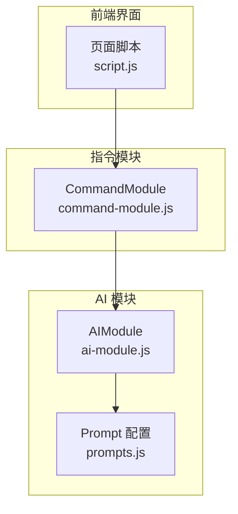
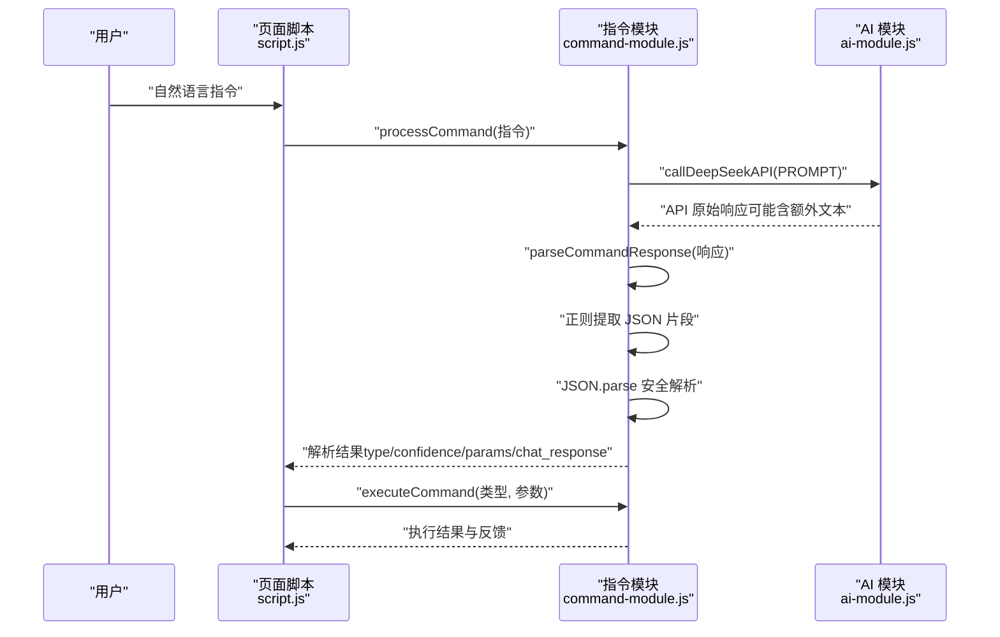
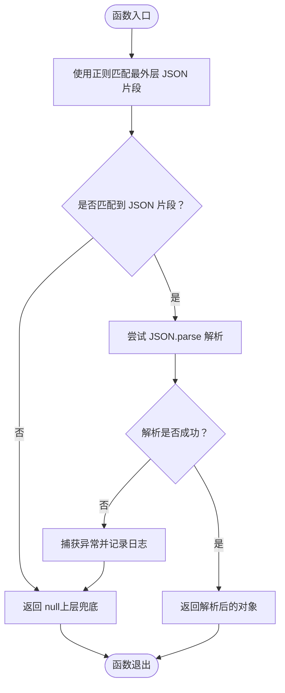
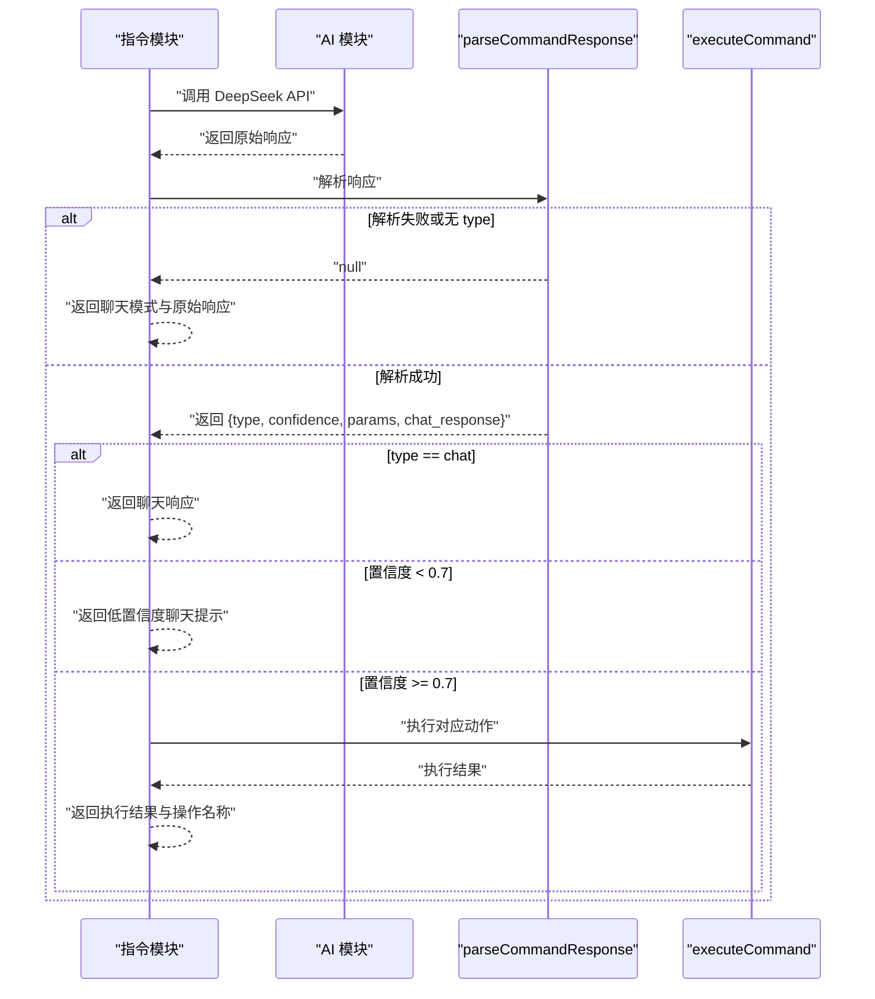
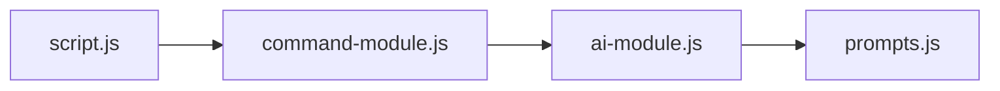

# 指令响应解析

<cite>
**本文引用的文件**
- [command-module.js](file://command-module.js)
- [ai-module.js](file://ai-module.js)
- [prompts.js](file://prompts.js)
- [script.js](file://script.js)
</cite>

## 目录
1. [简介](#简介)
2. [项目结构](#项目结构)
3. [核心组件](#核心组件)
4. [架构总览](#架构总览)
5. [详细组件分析](#详细组件分析)
6. [依赖关系分析](#依赖关系分析)
7. [性能考量](#性能考量)
8. [故障排查指南](#故障排查指南)
9. [结论](#结论)

## 简介
本文件围绕 parseCommandResponse 函数如何从 DeepSeek API 的原始响应中提取 JSON 数据展开，重点解释正则表达式 /\{[\s\S]*\}/ 在处理可能夹杂额外文本的 AI 响应时的作用机制，并通过示例路径展示当 API 返回形如“好的，已为您准备打卡{ "type": "clock_in", "confidence": 0.9 }”这类混合文本时，如何精准提取 JSON 片段并进行安全解析。同时说明 try-catch 异常处理在应对格式错误响应时的重要性，并阐述解析失败后的降级处理策略，确保系统鲁棒性。

## 项目结构
本项目采用前端模块化组织，AI 相关能力集中在独立模块中，自然语言指令解析与执行位于另一个模块，二者通过统一的 API 调用接口协同工作。

图表来源
- [script.js](file://script.js#L1-L120)
- [ai-module.js](file://ai-module.js#L1-L60)
- [prompts.js](file://prompts.js#L1-L60)
- [command-module.js](file://command-module.js#L1-L80)

章节来源
- [script.js](file://script.js#L1-L120)
- [ai-module.js](file://ai-module.js#L1-L60)
- [prompts.js](file://prompts.js#L1-L60)
- [command-module.js](file://command-module.js#L1-L80)

## 核心组件
- 指令解析与执行：负责将用户自然语言转换为结构化指令，调用 AI 并执行对应动作。
- AI 能力封装：封装 DeepSeek API 调用、Prompt 模板与兜底策略。
- Prompt 配置：集中管理各类 Prompt 模板与兜底文案。

章节来源
- [command-module.js](file://command-module.js#L1-L80)
- [ai-module.js](file://ai-module.js#L1-L60)
- [prompts.js](file://prompts.js#L1-L60)

## 架构总览
下面的序列图展示了从用户输入到指令执行的关键流程，包括 parseCommandResponse 的 JSON 提取与安全解析环节。

图表来源
- [command-module.js](file://command-module.js#L182-L259)
- [ai-module.js](file://ai-module.js#L14-L59)
- [script.js](file://script.js#L493-L732)

章节来源
- [command-module.js](file://command-module.js#L182-L259)
- [ai-module.js](file://ai-module.js#L14-L59)
- [script.js](file://script.js#L493-L732)

## 详细组件分析

### parseCommandResponse：从原始响应中提取并安全解析 JSON
- 目标：从可能包含额外文本的 AI 响应中提取最外层 JSON 对象，避免因多余字符导致解析失败。
- 实现要点：
  - 使用正则表达式 /\{[\s\S]*\}/ 进行贪婪匹配，确保能捕获从第一个左花括号到最近一个右花括号之间的全部内容（包括换行与空白）。
  - 若匹配成功，调用 JSON.parse 安全解析；若失败或无匹配，返回空值，以便上层做兜底处理。
  - 通过 try-catch 包裹解析过程，防止异常传播至调用方，保证系统稳定性。

图表来源
- [command-module.js](file://command-module.js#L59-L72)

章节来源
- [command-module.js](file://command-module.js#L59-L72)

### 示例：当 API 返回“好的，已为您准备打卡{ "type": "clock_in", "confidence": 0.9 }”
- 场景说明：AI 响应中混入了自然语言描述与 JSON 结构，需要从响应中提取 JSON 片段并解析。
- 正则匹配机制：
  - 正则 /\{[\s\S]*\}/ 会从第一个出现的左花括号开始，尽可能向后匹配，直到最后一个右花括号结束，从而完整捕获最外层 JSON 对象。
  - 即使响应中存在换行、空格、引号等字符，也能被 [\s\S]* 匹配到，确保不会截断 JSON。
- 安全解析与异常处理：
  - 匹配到 JSON 字符串后，调用 JSON.parse 进行解析。
  - 若解析失败（例如 JSON 语法错误、非标准格式），try-catch 会捕获异常并返回 null，避免影响后续流程。
- 上层降级策略：
  - 当 parseCommandResponse 返回 null 或解析失败时，上层 processCommand 会回退到聊天模式或提示用户重新表述，保证交互连续性。

章节来源
- [command-module.js](file://command-module.js#L59-L72)
- [command-module.js](file://command-module.js#L182-L259)

### 指令处理主流程：置信度与执行
- 调用 AI：processCommand 通过 AIModule 调用 DeepSeek API，传入预设的 COMMAND_UNDERSTANDING_PROMPT。
- 解析响应：parseCommandResponse 从原始响应中提取 JSON。
- 判定模式：
  - 若解析失败或缺少 type 字段，返回聊天模式提示与原始响应，便于调试与回溯。
  - 若 type 为 chat，直接返回聊天响应。
  - 若置信度低于阈值（0.7），返回低置信度聊天提示，避免误执行。
  - 否则执行对应动作并返回执行结果与操作名称。

图表来源
- [command-module.js](file://command-module.js#L182-L259)

章节来源
- [command-module.js](file://command-module.js#L182-L259)

### AI 能力封装与兜底策略
- API 调用：callDeepSeekAPI 负责构造请求、校验响应、返回纯文本内容。
- 兜底策略：当 AI 调用失败或解析失败时，AIModule 会返回包含 isAI:false 与 error 字段的对象，调用方可据此选择兜底文案或降级行为。
- Prompt 管理：prompts.js 统一管理各类 Prompt 模板与兜底文案，便于维护与扩展。

章节来源
- [ai-module.js](file://ai-module.js#L14-L59)
- [ai-module.js](file://ai-module.js#L100-L127)
- [prompts.js](file://prompts.js#L1-L60)
- [prompts.js](file://prompts.js#L120-L159)

## 依赖关系分析
- 指令模块依赖 AI 模块提供的 callDeepSeekAPI 与兜底能力。
- AI 模块依赖 prompts.js 中的 Prompt 模板与兜底文案。
- 页面脚本负责初始化与调用，协调 UI 与模块间的数据流转。

图表来源
- [command-module.js](file://command-module.js#L1-L80)
- [ai-module.js](file://ai-module.js#L1-L60)
- [prompts.js](file://prompts.js#L1-L60)
- [script.js](file://script.js#L1-L120)

章节来源
- [command-module.js](file://command-module.js#L1-L80)
- [ai-module.js](file://ai-module.js#L1-L60)
- [prompts.js](file://prompts.js#L1-L60)
- [script.js](file://script.js#L1-L120)

## 性能考量
- 正则匹配复杂度：/\{[\s\S]*\}/ 在最坏情况下可能需要扫描整个响应字符串，但通常只需一次线性扫描即可定位最外层 JSON，整体开销较小。
- JSON.parse：解析单个 JSON 对象的开销极低，远小于网络 I/O 与 UI 渲染成本。
- 兜底策略：在解析失败时快速回退到聊天模式，避免不必要的重试与资源消耗。

## 故障排查指南
- 症状：parseCommandResponse 返回 null
  - 可能原因：AI 响应中未包含 JSON，或 JSON 语法不合法。
  - 排查步骤：
    - 检查上层 processCommand 是否正确传入原始响应。
    - 查看 parseCommandResponse 的日志输出，确认是否触发异常分支。
    - 核对 Prompt 模板是否要求返回纯 JSON。
- 症状：置信度低于阈值但未执行
  - 可能原因：AI 对用户意图判断不确定。
  - 排查步骤：调整 Prompt 模板或降低温度参数，提升确定性。
- 症状：API 调用失败
  - 可能原因：未配置 API 密钥、网络异常、服务端错误。
  - 排查步骤：检查本地存储中的密钥、网络连通性与服务端状态码。

章节来源
- [command-module.js](file://command-module.js#L59-L72)
- [command-module.js](file://command-module.js#L182-L259)
- [ai-module.js](file://ai-module.js#L14-L59)

## 结论
parseCommandResponse 通过正则表达式从可能夹带额外文本的 AI 响应中提取最外层 JSON，并以 try-catch 保护解析过程，确保系统在面对格式不规范响应时仍能稳定运行。结合上层的置信度判定与兜底策略，实现了从自然语言到结构化指令的稳健转化，提升了用户体验与系统的鲁棒性。