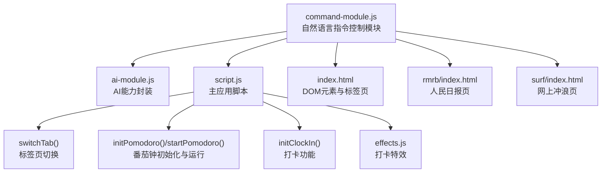
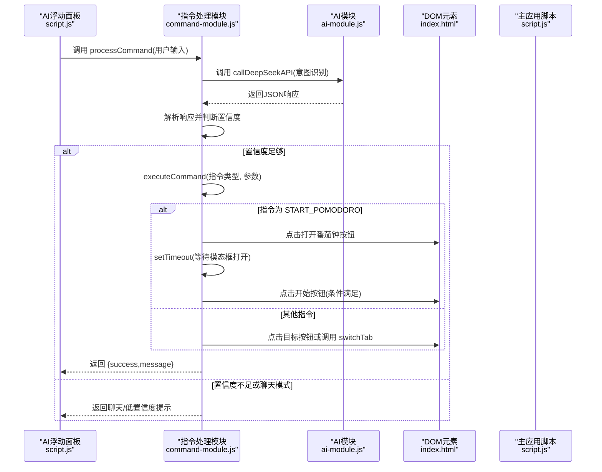
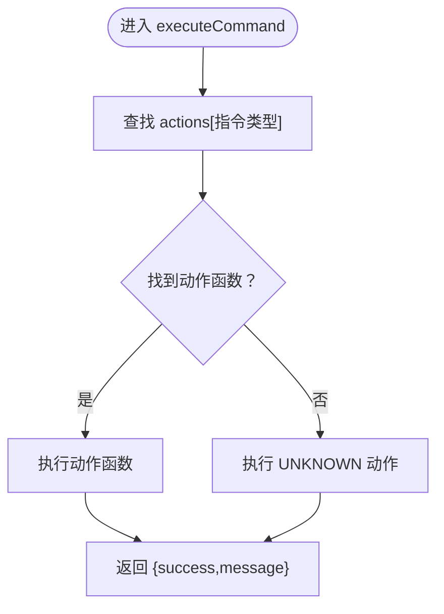
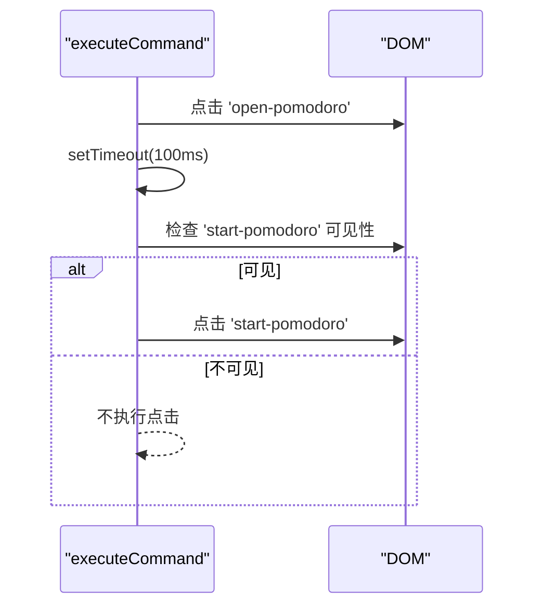
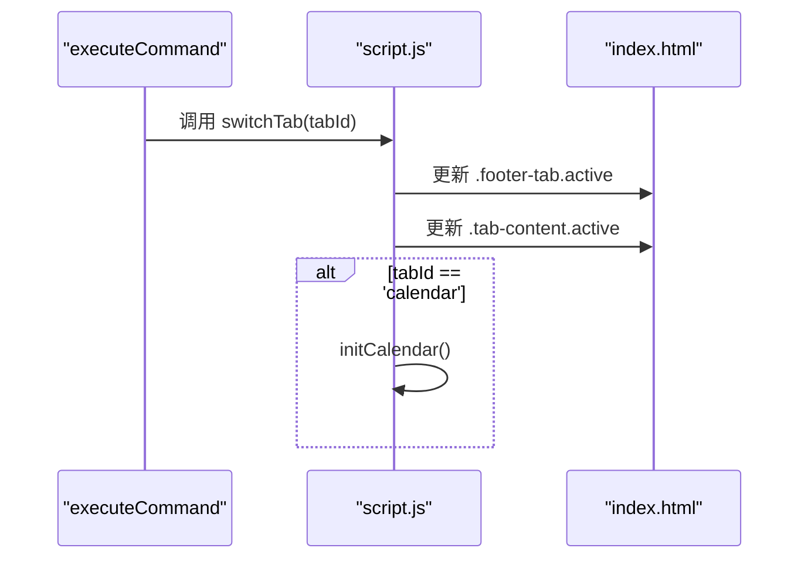
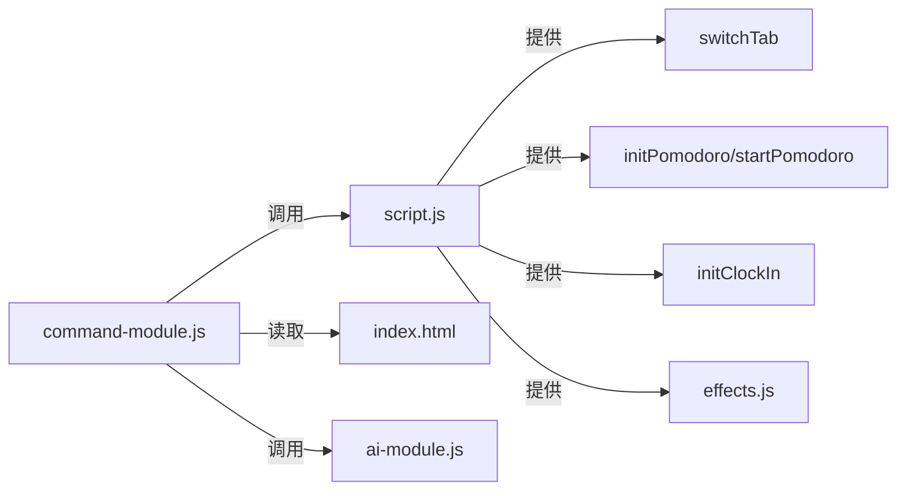

# 指令执行机制

<cite>
**本文引用的文件**
- [command-module.js](file://command-module.js)
- [script.js](file://script.js)
- [ai-module.js](file://ai-module.js)
- [effects.js](file://effects.js)
- [index.html](file://index.html)
- [rmrb/index.html](file://rmrb/index.html)
- [surf/index.html](file://surf/index.html)
</cite>

## 目录
1. [引言](#引言)
2. [项目结构](#项目结构)
3. [核心组件](#核心组件)
4. [架构总览](#架构总览)
5. [详细组件分析](#详细组件分析)
6. [依赖关系分析](#依赖关系分析)
7. [性能考量](#性能考量)
8. [故障排查指南](#故障排查指南)
9. [结论](#结论)

## 引言
本文件围绕自然语言指令控制模块中的 executeCommand 函数展开，系统性解析其执行逻辑与架构设计。文档聚焦以下目标：
- 基于 COMMAND_TYPES 枚举，逐项说明各指令类型的 DOM 操作实现（如 CLOCK_IN 通过点击 id 为 'clock-in-btn' 的按钮触发打卡；SWITCH_TAB 调用全局 switchTab 实现页面切换）。
- 深入阐述 actions 对象如何作为命令模式的实现，将指令类型映射到具体执行函数。
- 结合 START_POMODORO 中 setTimeout 延迟执行的特殊处理，解释异步操作的协调机制。
- 说明当目标元素不存在时的优雅降级策略，并给出各指令执行结果的 success/message 结构设计原理。

## 项目结构
该仓库采用按功能模块划分的组织方式，核心与指令执行相关的文件包括：
- command-module.js：自然语言指令解析与执行的核心模块，包含 COMMAND_TYPES、executeCommand、processCommand 等。
- script.js：主应用脚本，包含页面初始化、标签页切换 switchTab、番茄钟初始化与运行等。
- ai-module.js：AI 能力封装，提供 DeepSeek API 调用与兜底能力。
- effects.js：打卡特效模块，用于上班/下班时的视觉反馈。
- index.html、rmrb/index.html、surf/index.html：页面结构，承载各类交互元素与标签页。

图表来源
- [command-module.js](file://command-module.js#L1-L180)
- [script.js](file://script.js#L922-L1030)
- [ai-module.js](file://ai-module.js#L1-L216)
- [effects.js](file://effects.js#L1-L279)
- [index.html](file://index.html#L1-L485)
- [rmrb/index.html](file://rmrb/index.html#L1-L62)
- [surf/index.html](file://surf/index.html#L1-L54)

章节来源
- [command-module.js](file://command-module.js#L1-L180)
- [script.js](file://script.js#L922-L1030)
- [index.html](file://index.html#L1-L485)

## 核心组件
- COMMAND_TYPES：定义可执行的指令类型常量，涵盖打卡、番茄钟、时间轴、日历、标签页切换、摸鱼、设置、聊天模式与未知指令。
- actions 对象：以 COMMAND_TYPES 为键，将每种指令映射到对应的执行函数。该对象体现了命令模式的“请求封装”思想，将“意图”与“执行”解耦。
- executeCommand：根据传入的指令类型与参数，选择对应动作并返回统一的 { success, message } 结果对象。
- processCommand：整合 AI 意图识别、置信度判断与 executeCommand 执行，输出统一的处理结果对象，便于 UI 展示。

章节来源
- [command-module.js](file://command-module.js#L1-L180)
- [command-module.js](file://command-module.js#L182-L312)

## 架构总览
自然语言指令从 UI 浮动面板进入，经过 AI 意图识别与置信度评估后，由 executeCommand 执行具体 DOM 操作。部分操作涉及异步 UI 更新（如番茄钟模态框打开），通过 setTimeout 协调后续点击。

图表来源
- [script.js](file://script.js#L922-L1030)
- [command-module.js](file://command-module.js#L182-L312)
- [ai-module.js](file://ai-module.js#L1-L216)
- [index.html](file://index.html#L1-L485)

## 详细组件分析

### executeCommand 函数与命令模式
- 设计要点
  - 命令模式实现：actions 对象将指令类型与执行函数绑定，调用方仅需传入类型与参数，无需关心具体实现。
  - 统一返回结构：每个动作返回 { success, message }，便于 UI 展示与错误处理。
  - 优雅降级：若目标元素不存在或状态不满足条件，返回 { success: false, message }，避免异常中断。
- 关键行为
  - CLOCK_IN/CLOCK_OUT：检测按钮的 dataset.type 与当前状态，满足条件则触发 click，否则提示不可执行。
  - START_POMODORO：先点击打开模态框，再通过 setTimeout 在 UI 更新后点击“开始”，体现异步协调。
  - PAUSE_POMODORO：检查暂停按钮可见性，满足条件才点击。
  - SHOW_TIMELINE：点击“打开时间轴”按钮。
  - SHOW_CALENDAR/SHOW_SETTINGS/SWITCH_TAB：调用全局 switchTab，支持目标标签页切换。
  - RELAX：点击第一个倒计时卡片，触发摸鱼事件记录。
  - UNKNOWN：返回默认提示。

图表来源
- [command-module.js](file://command-module.js#L74-L180)

章节来源
- [command-module.js](file://command-module.js#L74-L180)

### COMMAND_TYPES 与 DOM 操作映射
- CLOCK_IN
  - 目标：id 为 'clock-in-btn' 的按钮。
  - 条件：按钮的 dataset.type 为 'CLOCK_IN'。
  - 行为：点击按钮并返回成功提示；否则返回不可执行提示。
- CLOCK_OUT
  - 目标：id 为 'clock-in-btn' 的按钮。
  - 条件：按钮的 dataset.type 为 'CLOCK_OUT'。
  - 行为：点击按钮并返回成功提示；否则返回不可执行提示。
- START_POMODORO
  - 目标：id 为 'open-pomodoro' 的按钮。
  - 行为：点击打开模态框；随后 setTimeout 等待模态框打开，再点击 id 为 'start-pomodoro' 的按钮（需可见）。
- PAUSE_POMODORO
  - 目标：id 为 'pause-pomodoro' 的按钮。
  - 条件：按钮可见（style.display !== 'none'）。
  - 行为：点击按钮并返回成功提示；否则提示未在运行。
- SHOW_TIMELINE
  - 目标：id 为 'open-timeline' 的按钮。
  - 行为：点击按钮并返回成功提示；否则提示无法打开。
- SHOW_CALENDAR
  - 目标：调用全局 switchTab('calendar')。
  - 行为：成功返回成功提示；否则提示无法打开。
- SWITCH_TAB
  - 目标：调用全局 switchTab(tabName)，tabName 默认 'countdown'。
  - 行为：成功返回成功提示；否则提示无法切换。
- RELAX
  - 目标：点击第一个类名为 '.countdown-card' 的卡片。
  - 行为：点击成功并返回提示；否则提示无法记录。
- SHOW_SETTINGS
  - 目标：调用全局 switchTab('settings')。
  - 行为：成功返回成功提示；否则提示无法打开。
- UNKNOWN
  - 行为：返回默认提示。

章节来源
- [command-module.js](file://command-module.js#L74-L180)
- [index.html](file://index.html#L1-L485)

### 异步协调机制：START_POMODORO 的 setTimeout 处理
- 问题背景
  - 点击 'open-pomodoro' 后，模态框需要一定时间渲染并显示，直接点击 'start-pomodoro' 可能因元素尚未可见而失败。
- 解决方案
  - 在点击 'open-pomodoro' 后，使用 setTimeout 延迟一小段时间（示例中为 100ms），再检查 'start-pomodoro' 是否可见并进行点击。
- 影响与建议
  - 该策略有效提升成功率，但存在硬编码延时的风险。更稳健的做法是监听模态框显示状态或使用 MutationObserver/visibilitychange 等事件，而非固定延时。

图表来源
- [command-module.js](file://command-module.js#L97-L109)

章节来源
- [command-module.js](file://command-module.js#L97-L109)

### 优雅降级策略
- 元素存在性检查
  - 对于按钮类操作，先通过 getElementById 获取并判断是否存在。
- 可见性检查
  - 对于 'pause-pomodoro'，检查按钮 style.display !== 'none'。
- 函数存在性检查
  - 对于 switchTab 相关操作，先判断 typeof switchTab === 'function'。
- 返回结构化结果
  - 成功时返回 { success: true, message }；失败时返回 { success: false, message }，UI 可据此展示不同状态。

章节来源
- [command-module.js](file://command-module.js#L74-L180)

### success/message 结构设计原理
- 设计目标
  - 统一接口：无论成功与否，调用方都能以一致的方式处理返回值。
  - 易于 UI 展示：message 字段用于提示文本，success 字段用于状态判定。
  - 与 processCommand 协作：processCommand 将 executeCommand 的 message 与 AI 的 chatResponse 组合，形成最终的 UI 输出。
- 与 processCommand 的协作
  - 当 executed 为 true 时，UI 展示已执行状态与 actionName。
  - 当 lowConfidence 为 true 时，UI 展示聊天模式提示。
  - 当 success 为 false 时，UI 展示失败状态与错误信息。

章节来源
- [command-module.js](file://command-module.js#L182-L312)
- [script.js](file://script.js#L922-L1030)

### 全局 switchTab 的实现与集成
- 调用路径
  - executeCommand 中的 SWITCH_TAB/SHOW_CALENDAR/SHOW_SETTINGS 均调用全局 switchTab。
- 脚本中的实现
  - script.js 中定义了 switchTab，负责更新底部标签与内容区的 active 状态，并在切换到 calendar 时初始化日历。
- 与 DOM 的关系
  - index.html 中 footer 的 .footer-tab 与 .tab-content 通过 switchTab 的逻辑进行切换。

图表来源
- [command-module.js](file://command-module.js#L131-L171)
- [script.js](file://script.js#L1032-L1062)
- [index.html](file://index.html#L460-L479)

章节来源
- [script.js](file://script.js#L1032-L1062)
- [index.html](file://index.html#L460-L479)

### 打卡流程与 DOM 交互（CLOCK_IN/CLOCK_OUT）
- 初始化与状态管理
  - script.js 中的 initClockIn 负责按钮状态更新与点击事件处理，依据本地存储与按钮 dataset.type 决定展示文案与行为。
- 与 executeCommand 的关系
  - executeCommand 的 CLOCK_IN/CLOCK_OUT 仅负责触发按钮点击；实际的问候语、摸鱼吉日签、工作总结等由 initClockIn 完成。
- 效果联动
  - 上班打卡时播放阳光特效，下班打卡时播放礼花特效，均由 effects.js 提供。

章节来源
- [command-module.js](file://command-module.js#L74-L110)
- [script.js](file://script.js#L493-L732)
- [effects.js](file://effects.js#L1-L279)
- [index.html](file://index.html#L1-L485)

### 番茄钟流程与 DOM 交互（START_POMODORO/PAUSE_POMODORO）
- 初始化
  - script.js 中的 initPomodoro 负责打开/关闭模态框、快捷按钮、开始/取消/再来一次等交互。
- 与 executeCommand 的关系
  - executeCommand 的 START_POMODORO 仅负责打开模态框与触发“开始”点击；实际倒计时与完成逻辑由 startPomodoro 完成。
- PAUSE_POMODORO
  - 通过检查暂停按钮可见性，避免在非运行状态下误触。

章节来源
- [command-module.js](file://command-module.js#L97-L120)
- [script.js](file://script.js#L295-L423)
- [index.html](file://index.html#L1-L485)

### 标签页与外部页面（SWITCH_TAB）
- 内置标签页
  - countdown、calendar、settings 由 index.html 提供。
- 外部页面
  - rmrb 与 surf 通过 iframe 嵌入，SWITCH_TAB 仍通过 switchTab 切换至对应 tab，由 script.js 的 setActiveTab/switchTab 控制显示。
- 注意事项
  - 若外部页面未加载完成，可能影响某些交互；建议在切换前确保 iframe ready 或增加超时保护。

章节来源
- [command-module.js](file://command-module.js#L139-L153)
- [script.js](file://script.js#L2311-L2369)
- [index.html](file://index.html#L352-L359)
- [rmrb/index.html](file://rmrb/index.html#L1-L62)
- [surf/index.html](file://surf/index.html#L1-L54)

## 依赖关系分析
- 模块间依赖
  - command-module.js 依赖：
    - DOM 元素（index.html）：按钮、模态框、标签页等。
    - 全局函数：switchTab（script.js）、showToast（command-module.js 导出）。
    - AI 能力：processCommand 通过 window.AIModule 调用 DeepSeek API。
- 耦合与内聚
  - executeCommand 对 DOM 的耦合集中在元素 ID 与可见性检查，保持了较好的内聚性。
  - 通过 actions 对象实现命令与实现的解耦，降低模块间的直接依赖。
- 潜在风险
  - 固定延时（START_POMODORO）可能受页面性能影响；建议以事件驱动替代硬编码延时。
  - switchTab 依赖 DOM 结构，若结构变化需同步更新。

图表来源
- [command-module.js](file://command-module.js#L1-L180)
- [script.js](file://script.js#L922-L1030)
- [ai-module.js](file://ai-module.js#L1-L216)
- [index.html](file://index.html#L1-L485)

章节来源
- [command-module.js](file://command-module.js#L1-L180)
- [script.js](file://script.js#L922-L1030)

## 性能考量
- DOM 查询与可见性检查
  - executeCommand 中多次使用 getElementById 与 style.display 判断，建议在高频场景下缓存查询结果或减少重复查询。
- 异步协调
  - START_POMODORO 的 setTimeout 为硬编码延时，建议改为基于模态框显示事件或轮询可见性的策略，以提升稳定性与性能。
- UI 渲染
  - 打卡特效（effects.js）在大量粒子时可能影响帧率，建议在移动端或低端设备上降低粒子数量或帧率。

## 故障排查指南
- 常见问题与定位
  - 指令未执行：检查 COMMAND_TYPES 是否匹配；确认 DOM 元素是否存在；检查 switchTab 是否定义。
  - 番茄钟未开始：确认 'open-pomodoro' 已点击且 'start-pomodoro' 可见；检查 setTimeout 延时是否过短。
  - 打卡按钮无反应：检查 initClockIn 中按钮状态与 dataset.type；确认本地存储与日期逻辑。
  - AI 无法理解：检查 API Key 是否配置；确认 AIModule 调用链路正常。
- 建议的日志与提示
  - 在 executeCommand 中对关键步骤添加日志；在 processCommand 中区分 success/executed/lowConfidence 三种状态，便于前端展示与调试。

章节来源
- [command-module.js](file://command-module.js#L182-L312)
- [script.js](file://script.js#L922-L1030)
- [ai-module.js](file://ai-module.js#L1-L216)

## 结论
- executeCommand 通过 actions 对象实现了清晰的命令模式，将自然语言指令映射为具体的 DOM 操作，具备良好的扩展性与可维护性。
- START_POMODORO 的 setTimeout 体现了对异步 UI 更新的必要协调，但建议以事件驱动替代硬编码延时，提升健壮性。
- 优雅降级策略通过存在性与可见性检查，保证在元素缺失或状态异常时仍能返回结构化的结果，便于 UI 与用户反馈。
- 与全局 switchTab 的集成使得标签页切换逻辑集中化，配合 DOM 结构实现一致的用户体验。