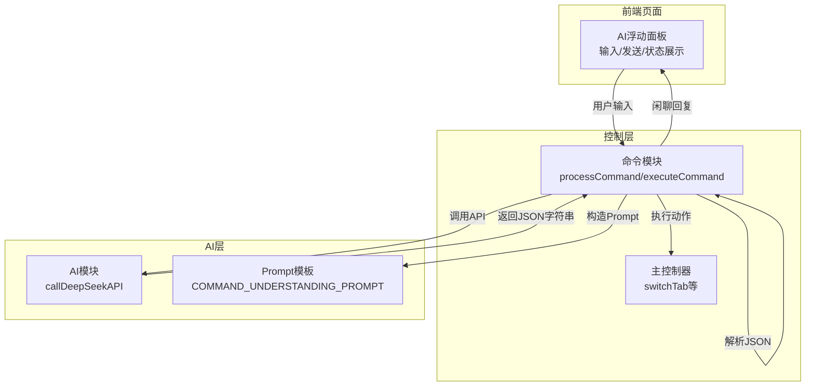
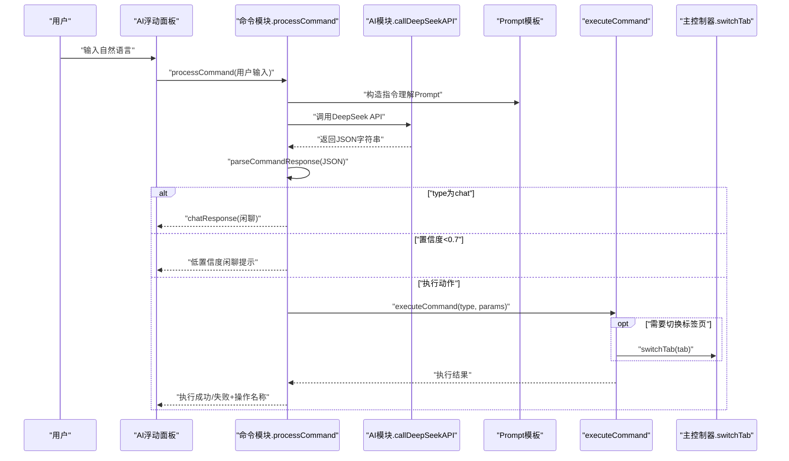
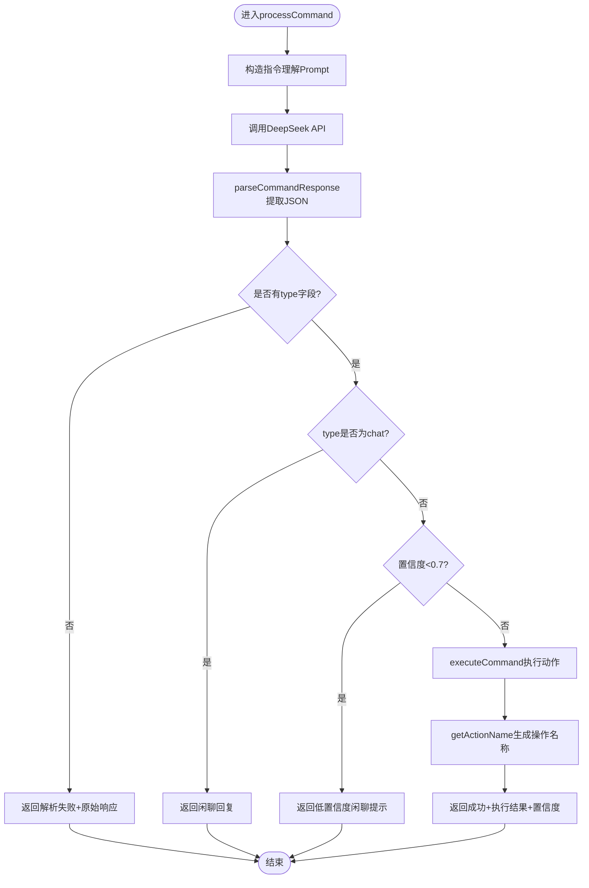
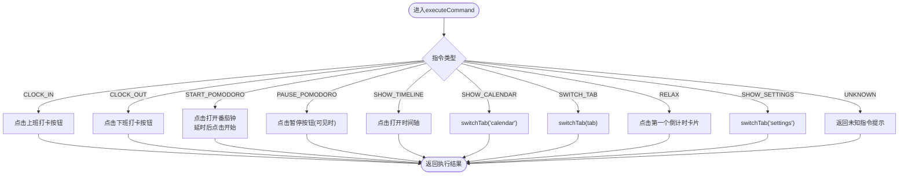
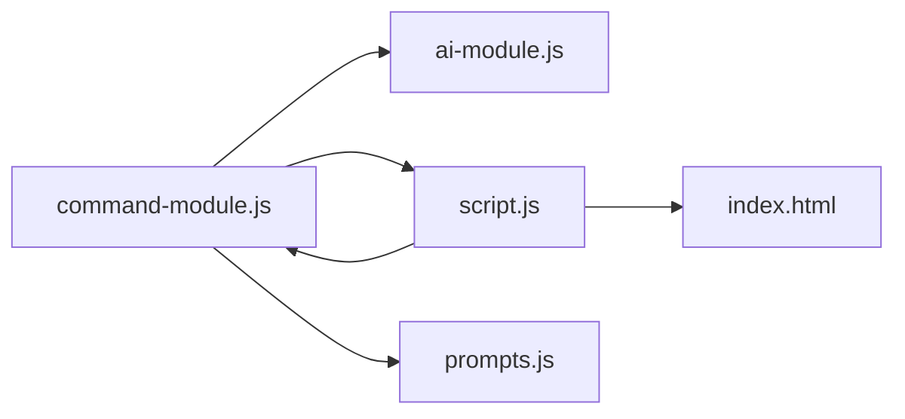

# 指令控制模块

<cite>
**本文引用的文件**
- [command-module.js](file://command-module.js)
- [ai-module.js](file://ai-module.js)
- [prompts.js](file://prompts.js)
- [script.js](file://script.js)
- [index.html](file://index.html)
</cite>

## 目录
1. [简介](#简介)
2. [项目结构](#项目结构)
3. [核心组件](#核心组件)
4. [架构总览](#架构总览)
5. [详细组件分析](#详细组件分析)
6. [依赖关系分析](#依赖关系分析)
7. [性能考量](#性能考量)
8. [故障排查指南](#故障排查指南)
9. [结论](#结论)

## 简介
本文件围绕指令控制模块（command-module.js）的自然语言处理流程展开，重点说明：
- processCommand 如何通过向 DeepSeek API 发送预定义的“指令理解”Prompt 来解析用户意图；
- parseCommandResponse 如何从 AI 的 JSON 响应中提取结构化数据；
- executeCommand 如何依据解析出的指令类型（如 CLOCK_IN、SWITCH_TAB）执行相应的 DOM 操作或调用主控制器函数；
- 结合 COMMAND_TYPES 枚举，解释模块支持的指令集及其执行逻辑；
- 如何通过置信度阈值区分操作指令与闲聊。

## 项目结构
指令控制模块位于前端工程中，与 AI 能力模块、页面脚本、Prompt 配置共同协作，形成“自然语言输入 → AI 意图解析 → 结构化解析 → 执行动作/闲聊回复”的闭环。

图表来源
- [index.html](file://index.html#L48-L66)
- [script.js](file://script.js#L922-L1030)
- [command-module.js](file://command-module.js#L182-L259)
- [ai-module.js](file://ai-module.js#L14-L59)
- [prompts.js](file://prompts.js#L1-L26)

章节来源
- [index.html](file://index.html#L48-L66)
- [script.js](file://script.js#L922-L1030)
- [command-module.js](file://command-module.js#L1-L55)
- [ai-module.js](file://ai-module.js#L1-L59)
- [prompts.js](file://prompts.js#L1-L26)

## 核心组件
- COMMAND_TYPES：定义可执行的指令类型集合，包括打卡、番茄钟、时间轴、日历、标签页切换、摸鱼、设置、聊天、未知等。
- COMMAND_UNDERSTANDING_PROMPT：预定义的 Prompt 模板，指导 AI 判断用户意图、输出 JSON 并给出置信度。
- parseCommandResponse：从 AI 返回文本中提取 JSON，容错处理。
- processCommand：主流程函数，串联 Prompt 构造、API 调用、JSON 解析、意图判断、置信度阈值、执行动作或闲聊回复。
- executeCommand：根据指令类型执行 DOM 操作或调用主控制器函数（如 switchTab），并返回执行结果。
- getActionName/getTabName：用于状态显示的人类可读操作名称。
- showToast：通用提示接口，兼容页面全局提示。

章节来源
- [command-module.js](file://command-module.js#L7-L19)
- [command-module.js](file://command-module.js#L21-L55)
- [command-module.js](file://command-module.js#L59-L72)
- [command-module.js](file://command-module.js#L182-L259)
- [command-module.js](file://command-module.js#L261-L304)

## 架构总览
下面的序列图展示了从用户输入到执行动作或闲聊回复的关键调用链路。

图表来源
- [script.js](file://script.js#L922-L1030)
- [command-module.js](file://command-module.js#L182-L259)
- [ai-module.js](file://ai-module.js#L14-L59)
- [prompts.js](file://prompts.js#L1-L26)

## 详细组件分析

### 指令类型与执行逻辑（COMMAND_TYPES）
- CLOCK_IN：触发上班打卡按钮点击，若当前允许打卡则执行，否则提示不可打卡。
- CLOCK_OUT：触发下班打卡按钮点击，若当前允许打卡则执行，否则提示不可打卡。
- START_POMODORO：点击“打开番茄钟”按钮；延时等待模态框打开后，点击“开始专注”按钮（若可见）。
- PAUSE_POMODORO：点击“暂停番茄钟”按钮（仅当按钮可见时）。
- SHOW_TIMELINE：点击“打开时间轴”按钮。
- SHOW_CALENDAR：调用主控制器 switchTab('calendar')。
- SWITCH_TAB：调用主控制器 switchTab(tab)，tab 名称映射到“倒计时/日历/人民日报/网上冲浪/设置”。
- RELAX：点击第一个倒计时卡片，记录摸鱼事件。
- SHOW_SETTINGS：调用主控制器 switchTab('settings')。
- CHAT：闲聊模式，不执行任何操作。
- UNKNOWN：未知指令，返回“不太理解”的提示。

章节来源
- [command-module.js](file://command-module.js#L77-L180)
- [command-module.js](file://command-module.js#L261-L304)
- [script.js](file://script.js#L1033-L1062)

### processCommand 自然语言处理流程
- 构造 Prompt：将用户输入注入到 COMMAND_UNDERSTANDING_PROMPT 中。
- 调用 API：通过 window.AIModule.callDeepSeekAPI 发起请求，温度参数较低以获得更确定的结果。
- 解析响应：parseCommandResponse 从返回文本中提取 JSON。
- 意图判断：
  - 若 type 为 chat，直接返回闲聊回复；
  - 若置信度低于 0.7，返回低置信度闲聊提示；
  - 否则执行对应指令。
- 执行动作：executeCommand 返回执行结果，getActionName 生成人类可读操作名称，最终返回包含 success/executed/actionName/chatResponse/details 的结果对象。

图表来源
- [command-module.js](file://command-module.js#L182-L259)
- [command-module.js](file://command-module.js#L59-L72)

章节来源
- [command-module.js](file://command-module.js#L182-L259)

### parseCommandResponse JSON 解析
- 采用正则匹配提取首个 JSON 对象，避免 AI 返回多余文本；
- 使用 try/catch 包裹 JSON.parse，失败时返回空并记录错误；
- 作为 processCommand 的前置步骤，确保后续流程稳定。

章节来源
- [command-module.js](file://command-module.js#L59-L72)

### executeCommand DOM 操作与主控制器调用
- 通过 document.getElementById 获取按钮/模态框元素，模拟用户点击；
- 对于番茄钟，采用延时策略等待模态框渲染后再点击“开始”；
- 对于标签页切换，直接调用主控制器 switchTab(tab)，并在执行前做存在性检查；
- 对于摸鱼，点击倒计时卡片并记录时间轴事件；
- 统一返回 { success, message }，供上层 processCommand 组装最终结果。

图表来源
- [command-module.js](file://command-module.js#L77-L180)
- [script.js](file://script.js#L1033-L1062)

章节来源
- [command-module.js](file://command-module.js#L77-L180)
- [script.js](file://script.js#L1033-L1062)

### 置信度阈值与闲聊模式
- Prompt 指导 AI 仅在明确操作请求时设置高置信度（>0.7）；
- processCommand 在解析到非 chat 且置信度低于阈值时，返回低置信度闲聊提示，避免误执行；
- chat 模式下不执行任何操作，仅返回友好的聊天回复。

章节来源
- [command-module.js](file://command-module.js#L217-L231)
- [command-module.js](file://command-module.js#L206-L215)
- [command-module.js](file://command-module.js#L21-L55)

### 与主控制器的集成
- 主控制器 switchTab 负责标签页切换与内容区激活；
- 通过 window.CommandModule 暴露 processCommand、executeCommand、COMMAND_TYPES，供页面脚本调用；
- 页面脚本 initCommandControl 负责 UI 交互、API Key 校验、状态提示与结果展示。

章节来源
- [script.js](file://script.js#L922-L1030)
- [script.js](file://script.js#L1033-L1062)
- [index.html](file://index.html#L48-L66)

## 依赖关系分析
- 命令模块依赖：
  - window.AIModule.callDeepSeekAPI：发起 DeepSeek API 请求；
  - 主控制器 switchTab：用于标签页切换；
  - 全局 showToast：用于提示信息展示；
  - 全局 window.CommandModule：模块导出接口。
- AI 模块依赖：
  - localStorage 中的 deepseekApiKey；
  - DeepSeek API URL 与模型；
  - fetch 请求与响应解析。
- Prompt 模块提供 COMMAND_UNDERSTANDING_PROMPT 模板，作为 processCommand 的输入。

图表来源
- [command-module.js](file://command-module.js#L182-L259)
- [ai-module.js](file://ai-module.js#L14-L59)
- [script.js](file://script.js#L922-L1030)
- [index.html](file://index.html#L48-L66)

章节来源
- [command-module.js](file://command-module.js#L182-L259)
- [ai-module.js](file://ai-module.js#L14-L59)
- [script.js](file://script.js#L922-L1030)
- [index.html](file://index.html#L48-L66)

## 性能考量
- API 调用参数：
  - temperature 设为较低值，有助于获得更稳定的意图判断；
  - maxTokens 控制响应长度，避免过长文本增加解析成本。
- JSON 解析：
  - 采用正则提取首个 JSON 对象，减少不必要的字符串处理；
  - try/catch 保护，避免异常中断流程。
- DOM 操作：
  - 番茄钟启动采用延时点击，避免 UI 未渲染导致的点击失败；
  - 对可见性进行检查（如暂停按钮 display），降低无效点击。
- 闲聊优先：
  - 低置信度直接走闲聊路径，避免无意义的动作执行。

[本节为通用性能讨论，无需列出章节来源]

## 故障排查指南
- API Key 未配置
  - 现象：AI浮动面板提示请先配置 API Key，并自动跳转到设置页；
  - 处理：在设置页保存 DeepSeek API Key 后重试。
- API 请求失败
  - 现象：processCommand 返回错误信息；
  - 处理：检查网络、API Key 是否正确、服务端状态码。
- JSON 解析失败
  - 现象：parseCommandResponse 返回空，processCommand 返回解析失败提示；
  - 处理：确认 AI 返回格式符合 JSON 规范，或调整 Prompt 以强制返回 JSON。
- 动作执行失败
  - 现象：executeCommand 返回“当前不能执行/无法执行”；
  - 处理：检查按钮状态（如打卡按钮类型）、DOM 是否存在、标签页是否已初始化。
- 低置信度
  - 现象：返回闲聊提示；
  - 处理：优化自然语言表达，使其更贴近 Prompt 中的示例。

章节来源
- [script.js](file://script.js#L983-L1021)
- [command-module.js](file://command-module.js#L182-L259)
- [command-module.js](file://command-module.js#L59-L72)

## 结论
指令控制模块通过“预定义 Prompt + 低温度 API + 结构化 JSON + 置信度阈值”的组合，实现了从自然语言到可执行动作的稳健转化。其设计兼顾准确性与用户体验：高置信度时精准执行，低置信度或闲聊时友好兜底。配合主控制器的标签页切换与 DOM 操作，形成完整的人机交互闭环。