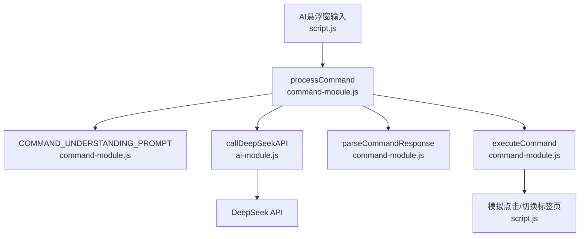
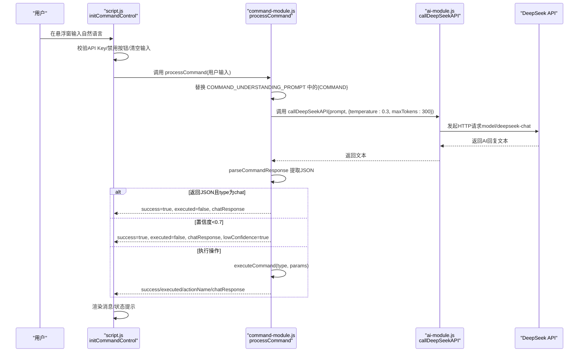
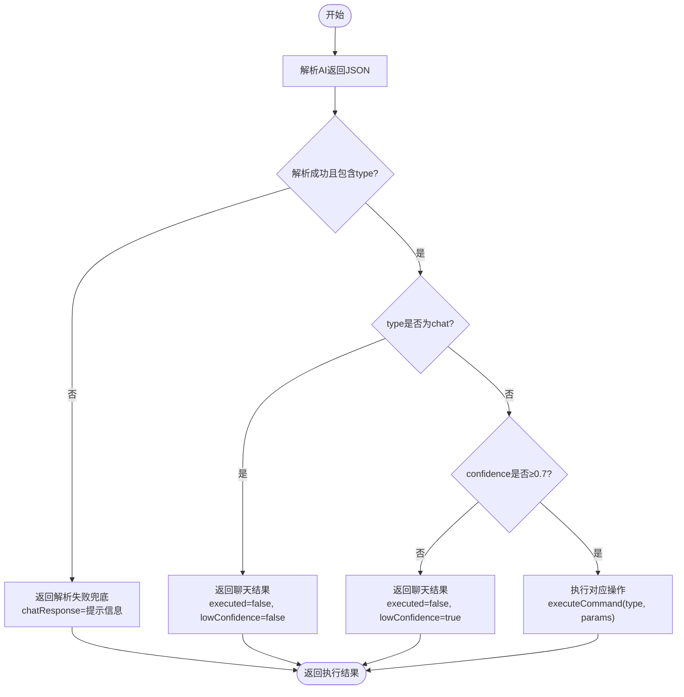
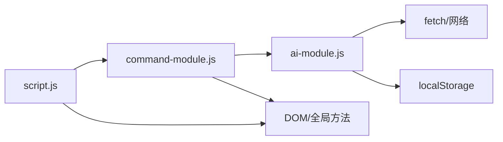

# 指令理解流程

<cite>
**本文引用的文件**
- [command-module.js](file://command-module.js)
- [ai-module.js](file://ai-module.js)
- [prompts.js](file://prompts.js)
- [script.js](file://script.js)
- [README.md](file://README.md)
- [docs/AI_COMMAND_DEMO.md](file://docs/AI_COMMAND_DEMO.md)
</cite>

## 目录
1. [简介](#简介)
2. [项目结构](#项目结构)
3. [核心组件](#核心组件)
4. [架构总览](#架构总览)
5. [详细组件分析](#详细组件分析)
6. [依赖关系分析](#依赖关系分析)
7. [性能考量](#性能考量)
8. [故障排查指南](#故障排查指南)
9. [结论](#结论)
10. [附录](#附录)

## 简介
本文件围绕 command-module.js 中的 processCommand 函数，系统性说明其自然语言处理流程。重点包括：
- 如何通过 COMMAND_UNDERSTANDING_PROMPT 模板将用户输入构造为 AI 请求；
- 该 Prompt 如何定义 10 种可执行操作与聊天模式识别规则；
- 置信度阈值（CONFIDENCE_THRESHOLD=0.7）在区分操作指令与闲聊中的关键作用；
- 结合示例“我要下班了”说明系统如何通过 DeepSeek API 返回 clock_out 指令并携带高置信度；
- temperature=0.3 等 API 参数对输出稳定性的意义；
- 错误处理机制的实现细节。

## 项目结构
与指令理解流程直接相关的文件与职责如下：
- command-module.js：定义可执行指令类型、构建并下发理解 Prompt、解析 AI 返回、执行对应操作、处理置信度与聊天模式分支、错误兜底。
- ai-module.js：封装 DeepSeek API 调用，提供 callDeepSeekAPI 方法，统一温度、最大 token 等参数。
- prompts.js：集中管理各类 AI Prompt 模板（非本流程使用的模板），为其他 AI 功能提供支撑。
- script.js：前端入口，初始化 AI 指令控制面板，调用 CommandModule.processCommand 并渲染反馈。
- README.md 与 docs/AI_COMMAND_DEMO.md：提供产品背景、功能说明与演示样例，辅助理解流程。

图表来源
- [command-module.js](file://command-module.js#L182-L259)
- [ai-module.js](file://ai-module.js#L14-L59)
- [script.js](file://script.js#L922-L1030)

章节来源
- [command-module.js](file://command-module.js#L1-L313)
- [ai-module.js](file://ai-module.js#L1-L216)
- [script.js](file://script.js#L922-L1030)
- [README.md](file://README.md#L1-L125)
- [docs/AI_COMMAND_DEMO.md](file://docs/AI_COMMAND_DEMO.md#L1-L148)

## 核心组件
- 可执行指令类型常量：定义了 CLOCK_IN、CLOCK_OUT、START_POMODORO、PAUSE_POMODORO、SHOW_TIMELINE、SHOW_CALENDAR、SWITCH_TAB、RELAX、SHOW_SETTINGS、CHAT、UNKNOWN 等类型，作为后续执行与 UI 行为的依据。
- COMMAND_UNDERSTANDING_PROMPT 模板：明确列出 10 种可执行操作及其典型示例；要求 AI 返回 JSON，包含 type、confidence、params、chat_response；并强调“只有明确的操作请求才设置高置信度（>0.7）”、“闲聊设为 chat 模式”的规则。
- processCommand 主流程：拼装 Prompt → 调用 AI → 解析 JSON → 判断 chat 或低置信度 → 执行操作 → 返回结果与状态。
- executeCommand：根据指令类型模拟点击或切换标签页等 UI 操作。
- parseCommandResponse：从大模型返回文本中提取 JSON 片段并解析，失败时返回 null 并记录错误。
- 置信度阈值：CONFIDENCE_THRESHOLD=0.7，低于阈值则仅聊天不执行操作。
- API 参数：processCommand 中显式传入 temperature=0.3、maxTokens=300；ai-module.js 默认 temperature=1.2、maxTokens=2000，但 processCommand 覆盖为更稳定的参数组合。

章节来源
- [command-module.js](file://command-module.js#L7-L19)
- [command-module.js](file://command-module.js#L21-L54)
- [command-module.js](file://command-module.js#L182-L259)
- [command-module.js](file://command-module.js#L59-L72)
- [command-module.js](file://command-module.js#L77-L180)
- [ai-module.js](file://ai-module.js#L14-L59)

## 架构总览
下面的序列图展示了从用户输入到执行操作的关键调用链路，映射到实际源码文件：

图表来源
- [script.js](file://script.js#L922-L1030)
- [command-module.js](file://command-module.js#L182-L259)
- [ai-module.js](file://ai-module.js#L14-L59)

## 详细组件分析

### Prompt 模板与意图识别规则
- 模板内容要点：
  - 明确列出 10 种可执行操作（clock_in/clock_out/start_pomodoro/pause_pomodoro/show_timeline/show_calendar/switch_tab/relax/show_settings/chat/unknown）；
  - 为每类操作提供典型示例，帮助模型理解；
  - 要求返回严格 JSON，字段包括 type、confidence、params（含 tab）、chat_response；
  - 强调“只有明确的操作请求才设置高置信度（>0.7）”、“闲聊设为 chat 模式”、“只返回JSON，不要有其他文字”。

- 意图识别规则：
  - 若 AI 返回 type=chat，则进入聊天模式，不执行任何操作；
  - 若 confidence < 0.7，则视为不确定，进入聊天模式并提示“不太确定你是想让我做什么，随便聊聊吧！”；
  - 否则，按 type 执行对应操作。

章节来源
- [command-module.js](file://command-module.js#L21-L54)
- [command-module.js](file://command-module.js#L182-L259)

### 置信度阈值与聊天模式判定
- 阈值设定：CONFIDENCE_THRESHOLD=0.7；
- 判定逻辑：
  - type=chat：直接走聊天分支；
  - confidence < 0.7：走聊天分支，lowConfidence=true；
  - confidence ≥ 0.7：执行操作分支。

图表来源
- [command-module.js](file://command-module.js#L182-L259)

章节来源
- [command-module.js](file://command-module.js#L182-L259)

### API 参数与稳定性
- processCommand 中显式传入：
  - temperature=0.3：降低随机性，使输出更稳定、更确定；
  - maxTokens=300：限制输出长度，避免过长响应导致成本与延迟上升。
- ai-module.js 默认参数：
  - temperature=1.2、maxTokens=2000，用于其他 AI 功能；
  - 本流程通过 processCommand 覆盖为更稳定的组合，有利于意图识别与 JSON 结构的稳定性。

章节来源
- [command-module.js](file://command-module.js#L188-L192)
- [ai-module.js](file://ai-module.js#L14-L59)

### 执行操作与 UI 交互
- executeCommand 根据指令类型模拟点击或切换标签页：
  - clock_in/clock_out：点击对应按钮并返回成功/失败消息；
  - start_pomodoro：打开模态框并延时点击开始；
  - pause_pomodoro：若运行中则暂停；
  - show_timeline：打开时间轴；
  - show_calendar/switch_tab/show_settings：调用 switchTab 或返回失败消息；
  - relax：点击第一个倒计时卡片记录摸鱼事件；
  - unknown：返回“不太理解”的提示。
- getActionName/getTabName：用于状态显示与用户反馈。

章节来源
- [command-module.js](file://command-module.js#L77-L180)
- [command-module.js](file://command-module.js#L261-L292)

### 错误处理与兜底
- parseCommandResponse：
  - 从返回文本中匹配并解析 JSON；
  - 解析失败返回 null，并记录错误日志。
- processCommand：
  - 解析失败：返回 success=false, executed=false, chatResponse=提示信息；
  - type=chat：success=true, executed=false；
  - confidence<0.7：success=true, executed=false, lowConfidence=true；
  - executeCommand 失败：返回 success=false；
  - 其他异常：捕获错误，返回 success=false, executed=false, chatResponse=错误提示。
- script.js 中的 initCommandControl：
  - 发送前校验 API Key；
  - 成功/失败/低置信度分别显示不同状态提示；
  - finally 恢复按钮状态。

章节来源
- [command-module.js](file://command-module.js#L59-L72)
- [command-module.js](file://command-module.js#L182-L259)
- [script.js](file://script.js#L971-L1030)

### 示例：用户输入“我要下班了”
- 输入被注入到 COMMAND_UNDERSTANDING_PROMPT 的 {COMMAND} 位置；
- 模型识别到“下班打卡”意图，返回 type=clock_out 且 confidence 高；
- processCommand 判断 confidence≥0.7，进入执行分支；
- executeCommand 点击“下班打卡”按钮，返回“正在为您下班打卡...”；
- script.js 渲染状态提示“✅ 已执行：下班打卡”。

章节来源
- [command-module.js](file://command-module.js#L21-L54)
- [command-module.js](file://command-module.js#L182-L259)
- [script.js](file://script.js#L971-L1030)

## 依赖关系分析
- command-module.js 依赖：
  - ai-module.js：调用 callDeepSeekAPI；
  - DOM/全局方法：通过模拟点击与 switchTab 实现 UI 交互；
  - 全局常量：COMMAND_TYPES。
- ai-module.js 依赖：
  - fetch API：发起 HTTP 请求；
  - localStorage：读取 API Key；
  - 全局常量：DEEPSEEK_API_URL、DEEPSEEK_MODEL。
- script.js 依赖：
  - CommandModule：调用 processCommand；
  - DOM：悬浮窗元素、Toast 提示；
  - 全局方法：switchTab、showToast。

图表来源
- [command-module.js](file://command-module.js#L182-L259)
- [ai-module.js](file://ai-module.js#L14-L59)
- [script.js](file://script.js#L922-L1030)

章节来源
- [command-module.js](file://command-module.js#L1-L313)
- [ai-module.js](file://ai-module.js#L1-L216)
- [script.js](file://script.js#L922-L1030)

## 性能考量
- 温度参数（temperature=0.3）降低输出随机性，提高意图识别与 JSON 结构稳定性，减少解析失败概率；
- 限制 maxTokens（300）有助于缩短响应时间、降低成本；
- DOM 操作集中在 executeCommand 中，尽量避免重复查询与渲染；
- UI 状态提示在 script.js 中统一管理，避免频繁 DOM 更新。

[本节为通用指导，无需特定文件引用]

## 故障排查指南
- API Key 未配置：
  - 现象：发送按钮被禁用，提示“请先在设置中配置DeepSeek API Key”，并自动跳转设置页；
  - 处理：在设置页保存 API Key 后重试。
- AI 返回解析失败：
  - 现象：返回“未能理解你的意思，请重新表述”；
  - 处理：简化输入、使用示例中的关键词，或稍后重试。
- 低置信度：
  - 现象：返回“不太确定你是想让我做什么，随便聊聊吧！”；
  - 处理：使用更明确的表达（如“开始番茄钟”而非“我要专注一下”）。
- 执行失败：
  - 现象：返回“当前不能执行/无法打开/无法切换”等；
  - 处理：检查页面状态（如是否已下班、按钮是否可见），稍后重试。
- 网络异常：
  - 现象：抛出错误并提示；
  - 处理：检查网络与 API Key，重试或查看服务状态。

章节来源
- [script.js](file://script.js#L971-L1030)
- [command-module.js](file://command-module.js#L182-L259)
- [ai-module.js](file://ai-module.js#L14-L59)

## 结论
- COMMAND_UNDERSTANDING_PROMPT 通过明确的 10 种操作类型与聊天模式规则，为模型提供了清晰的输出约束；
- CONFIDENCE_THRESHOLD=0.7 有效区分“明确操作意图”与“闲聊”，避免误执行；
- temperature=0.3 与 maxTokens=300 的组合提升了稳定性与响应效率；
- 整体流程从 UI 到 AI 再到 DOM 交互，具备完善的错误处理与用户反馈。

[本节为总结，无需特定文件引用]

## 附录
- 使用建议与常见误区可参考 docs/AI_COMMAND_DEMO.md 中的“最佳实践/常见误区/提升体验”部分。

章节来源
- [docs/AI_COMMAND_DEMO.md](file://docs/AI_COMMAND_DEMO.md#L1-L148)