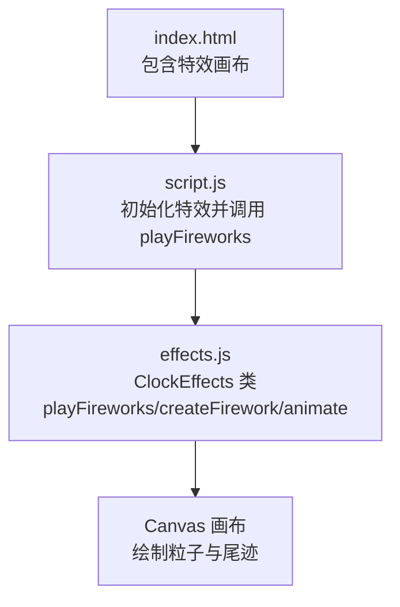
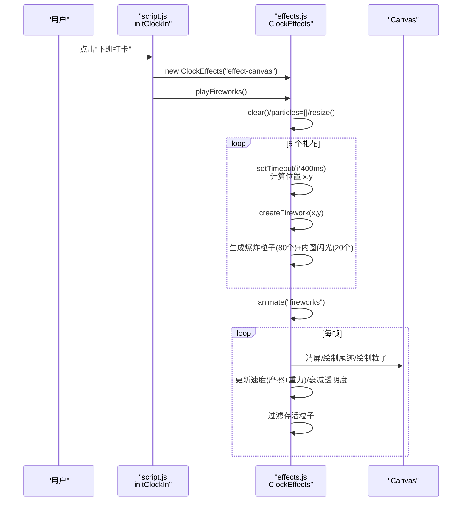
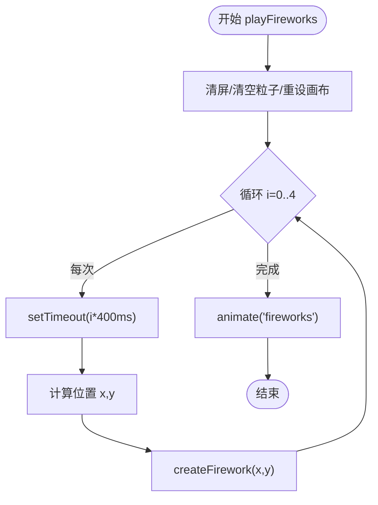
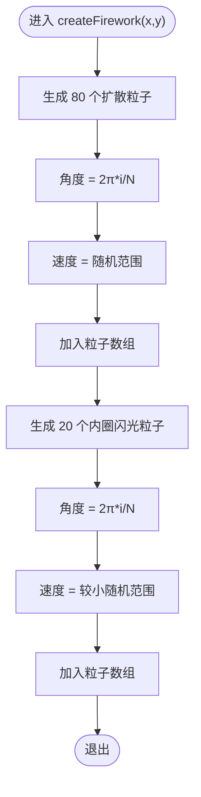
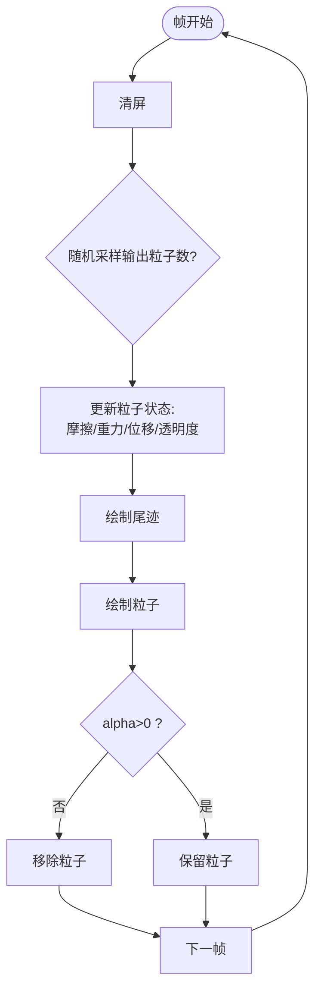
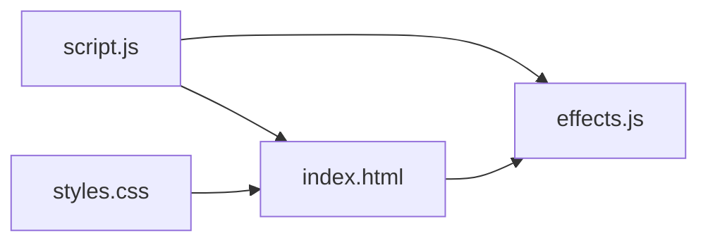

# 礼花特效

<cite>
**本文引用的文件**
- [effects.js](file://effects.js)
- [script.js](file://script.js)
- [index.html](file://index.html)
- [styles.css](file://styles.css)
- [README.md](file://README.md)
</cite>

## 目录
1. [简介](#简介)
2. [项目结构](#项目结构)
3. [核心组件](#核心组件)
4. [架构总览](#架构总览)
5. [详细组件分析](#详细组件分析)
6. [依赖关系分析](#依赖关系分析)
7. [性能考量](#性能考量)
8. [故障排查指南](#故障排查指南)
9. [结论](#结论)

## 简介
本节聚焦于下班打卡时的“礼花特效”。该特效通过 Canvas 实现全屏粒子爆炸动画，包含以下关键点：
- 异步触发：使用定时器实现 5 个礼花错时绽放，每个礼花在不同位置调用创建方法生成粒子。
- 粒子系统：每朵礼花生成两类粒子，共约 100 个；包含初始速度向量、重力、摩擦、生命周期衰减等物理属性。
- 动画循环：基于 requestAnimationFrame 的高性能渲染，逐帧更新粒子状态、绘制运动尾迹与粒子，并通过过滤器管理生命周期。
- 调试与视觉：控制台日志输出关键信息；使用 HSLA 颜色模型生成多彩爆炸效果；画布尺寸随窗口变化。

**章节来源**
- file://README.md#L50-L55

## 项目结构
与礼花特效直接相关的文件与职责如下：
- effects.js：特效类与动画循环实现，包含“礼花特效”“阳光特效”“动画循环”等。
- script.js：应用入口脚本，在下班打卡时实例化特效并调用 playFireworks。
- index.html：页面包含特效画布元素，用于承载 Canvas 动画。
- styles.css：特效画布样式，绝对定位、全屏覆盖、禁止交互事件。
- README.md：产品文档，简述特效功能与实现要点。

**图表来源**
- [index.html](file://index.html#L120-L163)
- [script.js](file://script.js#L690-L728)
- [effects.js](file://effects.js#L64-L133)

**章节来源**
- file://index.html#L120-L163
- file://script.js#L690-L728
- file://effects.js#L64-L133

## 核心组件
- ClockEffects 类：封装特效生命周期、粒子数组、动画循环与画布尺寸适配。
- playFireworks：异步触发 5 个礼花，错时调用 createFirework 并启动动画循环。
- createFirework：在指定位置生成两类粒子（爆炸扩散粒子与内圈闪光粒子），设置初始速度、颜色与物理属性。
- animateFireworks：动画循环，逐帧更新粒子状态、绘制尾迹与粒子、处理透明度与生命周期。

**章节来源**
- file://effects.js#L5-L23
- file://effects.js#L64-L133
- file://effects.js#L203-L260

## 架构总览
下图展示了下班打卡到礼花特效的调用链路与数据流。

**图表来源**
- [script.js](file://script.js#L690-L728)
- [effects.js](file://effects.js#L64-L133)
- [effects.js](file://effects.js#L203-L260)

## 详细组件分析

### playFireworks 协同工作机制
- 触发时机：下班打卡时由应用入口调用。
- 清理与初始化：清空画布与粒子数组，重设画布尺寸。
- 错时触发：使用 5 次定时器，间隔 400ms，分别在不同水平位置调用 createFirework。
- 启动动画：统一启动“fireworks”动画循环。

**图表来源**
- [effects.js](file://effects.js#L64-L86)

**章节来源**
- file://effects.js#L64-L86

### createFirework 粒子生成策略
- 爆炸扩散粒子（80 个）：
  - 分布：围绕中心均匀分布的角度采样。
  - 初始速度：根据角度与随机速度合成二维速度向量。
  - 物理属性：重力、摩擦、初始透明度、初始大小、颜色范围。
- 内圈闪光粒子（20 个）：
  - 分布：围绕中心均匀分布的角度采样。
  - 初始速度：较小的速度范围。
  - 物理属性：较小重力、较大摩擦、更大初始透明度、更大初始大小。
- 颜色模型：使用 HSLA，色调在 0-360° 范围内随机，饱和度与亮度有波动，形成多彩爆炸效果。

**图表来源**
- [effects.js](file://effects.js#L88-L133)

**章节来源**
- file://effects.js#L88-L133

### animateFireworks 动画循环与生命周期管理
- 清屏与调试：每帧清屏；以一定概率输出当前粒子数量到控制台，便于调试。
- 状态更新：
  - 摩擦：速度按比例衰减。
  - 重力：垂直方向叠加恒定加速度。
  - 位移：基于速度更新位置。
  - 生命周期：透明度随生命值线性衰减。
- 绘制：
  - 尾迹：从当前位置向前绘制一段线段，体现运动轨迹。
  - 粒子：绘制圆点，透明度与生命值一致。
  - 内圈闪光：单独绘制径向渐变的高亮圆环。
- 生命周期过滤：仅保留 alpha>0 的粒子，实现资源回收与性能优化。

**图表来源**
- [effects.js](file://effects.js#L203-L260)

**章节来源**
- file://effects.js#L203-L260

### 物理属性设计与参数说明
- 初始速度向量：由角度与速度合成，确保粒子呈辐射状扩散。
- 重力加速度：0.15（扩散粒子）与 0.1（内圈闪光粒子），使粒子轨迹呈现自然下坠感。
- 摩擦系数：0.98（扩散粒子）与 0.95（内圈闪光粒子），模拟空气阻力，速度逐步衰减。
- 生命周期衰减：每帧减少固定量，透明度与生命值保持一致，实现淡出消失。
- 颜色模型：HSLA，色调在 0-360° 随机，饱和度与亮度有波动，形成多色爆炸效果。

**章节来源**
- file://effects.js#L96-L133
- file://effects.js#L211-L221

### 控制台日志与调试策略
- 礼花开始与画布信息：输出特效开始标志、画布元素与尺寸。
- 礼花数量与位置：输出将创建的礼花数量与每个礼花的位置坐标。
- createFirework 调用：输出被调用位置与生成粒子数量、色调。
- 动画调试：以一定概率输出当前粒子数量，便于观察内存占用与性能。
- 下班打卡入口：在调用特效前后输出日志，便于定位问题。

**章节来源**
- file://effects.js#L66-L86
- file://effects.js#L88-L95
- file://effects.js#L206-L209
- file://script.js#L690-L728

### HSLA 颜色模型与视觉效果
- 色调（Hue）：每朵礼花随机选择一个起始色调，随后在小范围内抖动，形成彩虹爆炸效果。
- 饱和度（Saturation）与亮度（Lightness）：在一定范围内随机波动，增强色彩层次与活力。
- 透明度（Alpha）：随生命周期线性衰减，实现自然的消失过渡。

**章节来源**
- file://effects.js#L92-L112
- file://effects.js#L115-L131
- file://effects.js#L219-L221

### requestAnimationFrame 与高性能渲染
- 使用 requestAnimationFrame 驱动动画循环，避免使用低精度定时器导致的掉帧。
- 在每帧中仅对存活粒子进行更新与绘制，配合生命周期过滤，降低 CPU/GPU 压力。
- 画布尺寸随窗口变化而调整，确保在不同分辨率下均能全屏覆盖。

**章节来源**
- file://effects.js#L19-L23
- file://effects.js#L198-L201
- file://effects.js#L257-L260

## 依赖关系分析
- 依赖关系：
  - script.js 依赖 effects.js 中的 ClockEffects 类。
  - index.html 提供特效画布元素，供 effects.js 操作。
  - styles.css 为特效画布提供全屏覆盖与交互禁用样式。
- 调用链：
  - initClockIn -> new ClockEffects -> playFireworks -> createFirework -> animateFireworks。

**图表来源**
- [script.js](file://script.js#L690-L728)
- [effects.js](file://effects.js#L64-L133)
- [index.html](file://index.html#L120-L163)
- [styles.css](file://styles.css#L1984-L1993)

**章节来源**
- file://script.js#L690-L728
- file://effects.js#L64-L133
- file://index.html#L120-L163
- file://styles.css#L1984-L1993

## 性能考量
- 粒子数量控制：每朵礼花约 100 个粒子，5 朵共约 500 个，属于中等规模粒子系统。
- 摩擦与重力：适度的摩擦与重力可减少速度峰值，降低绘制压力。
- 生命周期过滤：每帧过滤 alpha<=0 的粒子，避免无效绘制。
- 渲染优化：仅绘制存活粒子，使用简单几何图形（线段与圆），避免复杂阴影与滤镜。
- 画布尺寸：全屏画布，建议在低端设备上适当降低粒子数量或透明度衰减速率。

[本节为通用性能建议，无需特定文件引用]

## 故障排查指南
- 画布未显示：
  - 检查特效画布元素是否存在且样式正确（全屏、禁止交互）。
  - 确认页面加载完成后才实例化特效对象。
- 特效不触发：
  - 确认下班打卡路径已调用 playFireworks。
  - 查看控制台日志，确认“特效开始”“画布尺寸”等信息输出。
- 粒子数量异常：
  - 观察动画帧中的粒子数量输出，若持续下降过快，检查透明度衰减与摩擦参数。
- 性能问题：
  - 降低粒子数量或透明度衰减速率；减少内圈闪光粒子数量；在低端设备上禁用部分绘制细节。

**章节来源**
- file://index.html#L120-L163
- file://styles.css#L1984-L1993
- file://script.js#L690-L728
- file://effects.js#L66-L86
- file://effects.js#L206-L209

## 结论
- 礼花特效通过 playFireworks 与 createFirework 的协同，实现了 5 朵错时绽放的全屏粒子爆炸。
- animateFireworks 以 requestAnimationFrame 驱动，结合摩擦、重力与透明度衰减，构建了自然的物理动画。
- HSLA 颜色模型与生命周期过滤共同保证了视觉效果与性能平衡。
- 控制台日志提供了清晰的调试线索，便于定位问题与优化参数。