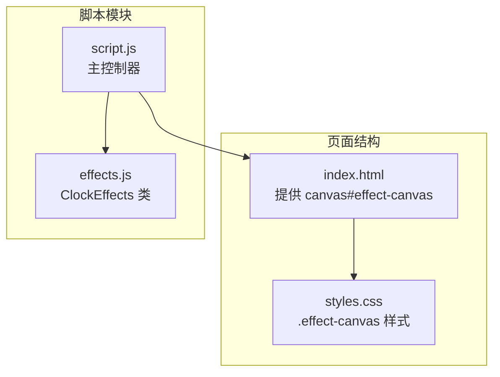
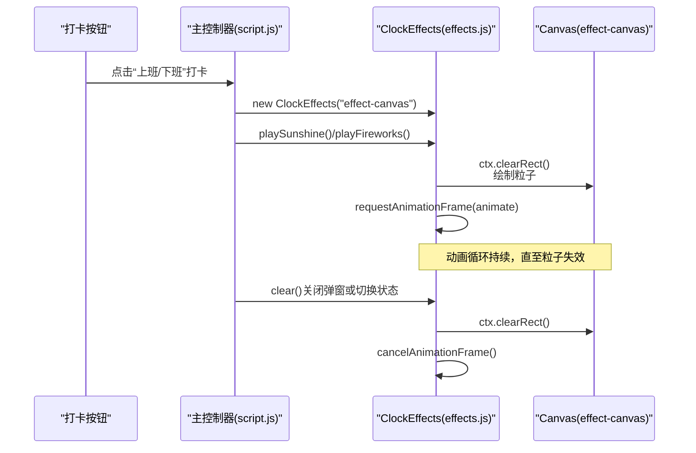
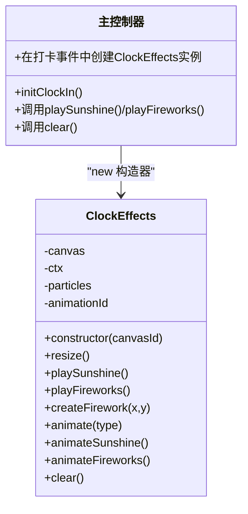

# 视觉特效模块

<cite>
**本文引用的文件**
- [effects.js](file://effects.js)
- [script.js](file://script.js)
- [index.html](file://index.html)
- [styles.css](file://styles.css)
- [README.md](file://README.md)
</cite>

## 目录
1. [简介](#简介)
2. [项目结构](#项目结构)
3. [核心组件](#核心组件)
4. [架构总览](#架构总览)
5. [详细组件分析](#详细组件分析)
6. [依赖关系分析](#依赖关系分析)
7. [性能考量](#性能考量)
8. [故障排查指南](#故障排查指南)
9. [结论](#结论)

## 简介
本文件聚焦于 effects.js 中 ClockEffects 类的设计与实现，围绕其基于 Canvas 的粒子系统，系统性解析以下主题：
- 构造函数如何初始化 Canvas 上下文并绑定窗口大小调整事件
- playSunshine 和 playFireworks 两大核心方法的粒子属性定义、动画循环机制与渲染优化
- clear 方法如何正确清理动画帧与画布内容，避免内存泄漏
- 该模块通过 window.ClockEffects 暴露类构造器，主控制器在打卡时动态创建特效实例

同时，结合 README.md 的功能说明与主控制器 script.js 的调用流程，帮助读者从整体到细节全面理解该模块的职责与集成方式。

## 项目结构
- 效果模块位于 effects.js，提供 ClockEffects 类，负责全屏 Canvas 动画
- 主控制器在 script.js 中初始化并调用特效类
- 页面结构在 index.html 中提供特效画布元素 effect-canvas
- 样式 styles.css 为特效画布提供绝对定位与层级控制

图表来源
- [index.html](file://index.html#L120-L165)
- [styles.css](file://styles.css#L1984-L1993)
- [effects.js](file://effects.js#L1-L279)
- [script.js](file://script.js#L546-L732)

章节来源
- [index.html](file://index.html#L120-L165)
- [styles.css](file://styles.css#L1984-L1993)
- [effects.js](file://effects.js#L1-L279)
- [script.js](file://script.js#L546-L732)

## 核心组件
- ClockEffects 类：封装 Canvas 动画生命周期、粒子系统与渲染逻辑
- 主控制器：在打卡事件中创建 ClockEffects 实例，并根据打卡类型选择播放特效

关键职责
- 初始化与生命周期管理：构造函数、resize、clear
- 阳光特效：playSunshine 创建大量光点粒子，模拟飘落与闪烁
- 礼花特效：playFireworks 创建多组爆炸粒子，带重力与摩擦
- 渲染优化：requestAnimationFrame 循环、滤除失效粒子、渐隐透明度

章节来源
- [effects.js](file://effects.js#L1-L279)
- [script.js](file://script.js#L546-L732)

## 架构总览
ClockEffects 作为独立的 Canvas 动画引擎，被主控制器在打卡时动态实例化。其与页面结构的关系如下：

图表来源
- [script.js](file://script.js#L546-L732)
- [effects.js](file://effects.js#L1-L279)
- [index.html](file://index.html#L120-L165)

章节来源
- [script.js](file://script.js#L546-L732)
- [effects.js](file://effects.js#L1-L279)
- [index.html](file://index.html#L120-L165)

## 详细组件分析

### ClockEffects 类设计与实现
- 构造函数
  - 通过传入的 canvasId 获取 Canvas 元素，获取 2D 上下文
  - 初始化粒子数组与动画帧 ID
  - 调用 resize 将画布尺寸设为全屏，并监听 window.resize 事件以动态适配
- resize
  - 将画布宽度与高度设置为窗口宽高，确保全屏覆盖
- clear
  - 若存在动画帧 ID，则取消动画帧，防止后台持续渲染
  - 清空画布内容
  - 重置粒子数组，避免残留引用导致内存泄漏

章节来源
- [effects.js](file://effects.js#L1-L279)

### playSunshine：阳光粒子系统
- 初始化
  - 清理现有动画与粒子
  - 创建两类粒子：
    - 小光点：随机位置、速度、大小、透明度、闪烁相位与色相范围
    - 大光晕：少量大尺寸粒子，带 isGlow 标记，使用径向渐变绘制光晕
- 动画循环 animateSunshine
  - 每帧更新粒子位置与相位，计算闪烁透明度
  - 对 isGlow 粒子绘制从内到外的径向渐变矩形，形成柔和光晕
  - 对普通粒子绘制外层光晕与核心亮点，增强层次感
  - 过滤掉超出可视范围的粒子，仅保留有效粒子
  - 若仍有粒子存活，继续下一帧 requestAnimationFrame

渲染优化要点
- 使用径向渐变绘制光晕，避免逐像素填充，降低 CPU/GPU 压力
- 通过滤除失效粒子，减少每帧绘制对象数量
- 采用 requestAnimationFrame 控制帧率，避免阻塞主线程

章节来源
- [effects.js](file://effects.js#L25-L201)

### playFireworks：礼花粒子系统
- 初始化
  - 清理现有动画与粒子
  - 在多个位置依次创建多组爆炸粒子，使用定时器错峰触发，形成连贯的多点爆炸效果
  - 每组爆炸包含：
    - 外围爆炸粒子：围绕中心均匀分布的角度与速度，带重力与摩擦
    - 内圈闪光粒子：较小但亮度更高的核心粒子，突出爆炸中心
- 动画循环 animateFireworks
  - 每帧对每个粒子施加重力与摩擦，更新速度与位置
  - 绘制粒子尾迹线段，体现运动轨迹
  - 绘制粒子与内圈闪光粒子，使用透明度随寿命衰减，营造渐隐效果
  - 过滤 alpha <= 0 的粒子，回收资源
  - 若仍有粒子存活，继续下一帧 requestAnimationFrame

渲染优化要点
- 尾迹线段使用圆角端点，视觉上更顺滑
- 重力与摩擦参数平衡，使爆炸轨迹自然
- 通过 alpha 与半径控制绘制成本，避免过度绘制

章节来源
- [effects.js](file://effects.js#L64-L273)

### clear 方法：动画与画布清理
- 取消当前动画帧，防止后续回调继续执行
- 清空画布内容，释放渲染缓冲
- 重置粒子数组为空，断开对旧粒子对象的引用，避免内存泄漏

章节来源
- [effects.js](file://effects.js#L262-L273)

### 类构造器暴露与主控制器集成
- 模块导出
  - 在浏览器环境下，将 ClockEffects 暴露至 window.ClockEffects，供外部使用
- 主控制器使用
  - 在打卡事件中，通过 new ClockEffects("effect-canvas") 创建实例
  - 根据打卡类型调用 playSunshine 或 playFireworks
  - 在关闭弹窗或切换状态时调用 clear，确保动画与画布被及时清理

章节来源
- [effects.js](file://effects.js#L275-L279)
- [script.js](file://script.js#L546-L732)
- [index.html](file://index.html#L120-L165)

## 依赖关系分析
- 外部依赖
  - DOM：通过 document.getElementById 获取 canvas 元素
  - Canvas API：getContext('2d')、clearRect、createRadialGradient、fillRect、beginPath、arc、stroke 等
  - 浏览器 API：requestAnimationFrame、cancelAnimationFrame、window.resize
- 内部耦合
  - ClockEffects 与主控制器 script.js 通过构造器与方法调用耦合
  - 与页面结构 index.html 的 effect-canvas 强耦合（ID 一致）

图表来源
- [effects.js](file://effects.js#L1-L279)
- [script.js](file://script.js#L546-L732)

章节来源
- [effects.js](file://effects.js#L1-L279)
- [script.js](file://script.js#L546-L732)

## 性能考量
- 帧率控制
  - 使用 requestAnimationFrame 驱动动画循环，避免固定间隔造成的卡顿
- 粒子回收
  - 每帧过滤失效粒子，减少绘制对象数量
- 渐隐与透明度
  - 通过 alpha 与半径控制绘制成本，避免过度绘制
- 渲染路径
  - 使用径向渐变一次性绘制光晕，减少多次绘制
- 画布尺寸
  - resize 将画布尺寸与窗口一致，避免缩放带来的额外计算

章节来源
- [effects.js](file://effects.js#L136-L201)
- [effects.js](file://effects.js#L203-L273)

## 故障排查指南
- 现象：特效不显示或显示异常
  - 检查 effect-canvas 是否存在于 DOM，ID 是否与构造函数参数一致
  - 检查样式 .effect-canvas 是否生效，z-index 是否足够高
- 现象：页面切换后仍残留动画
  - 确认在关闭弹窗或切换状态时调用了 clear
  - 确认未遗漏取消动画帧与清空画布
- 现象：内存占用上升
  - 确认每次播放前调用 clear，重置粒子数组
  - 确认未在回调中持有对旧粒子对象的引用
- 现象：窗口尺寸变化后特效错位
  - 确认 resize 事件已绑定，且在构造函数中调用过一次

章节来源
- [index.html](file://index.html#L120-L165)
- [styles.css](file://styles.css#L1984-L1993)
- [effects.js](file://effects.js#L1-L279)
- [script.js](file://script.js#L546-L732)

## 结论
ClockEffects 通过简洁的类设计与 Canvas API，实现了高性能的粒子动画系统。其核心优势在于：
- 明确的生命周期管理：构造、resize、clear
- 两套互补的粒子系统：阳光与礼花，分别对应上班与下班场景
- 渲染优化：渐变绘制、尾迹线段、透明度衰减与粒子回收
- 与主控制器解耦：通过 window.ClockEffects 暴露构造器，便于在业务流程中按需创建与销毁

该模块为打卡流程提供了即时、愉悦的视觉反馈，提升了用户体验，同时保持良好的性能与可维护性。