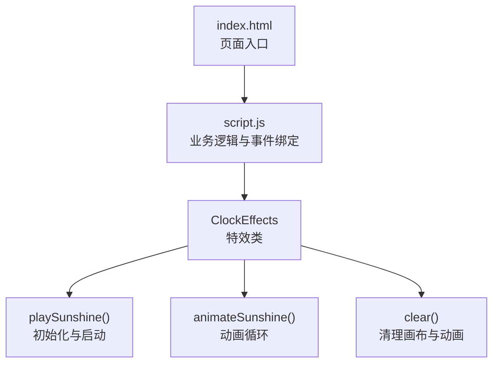
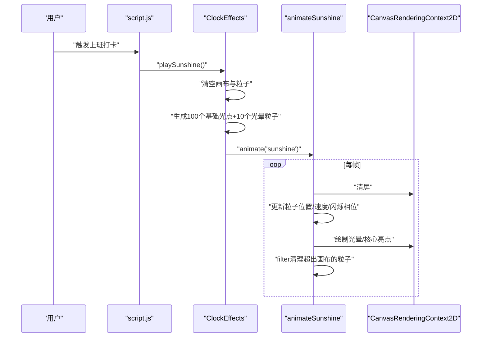
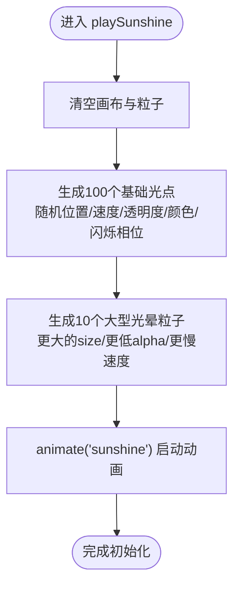
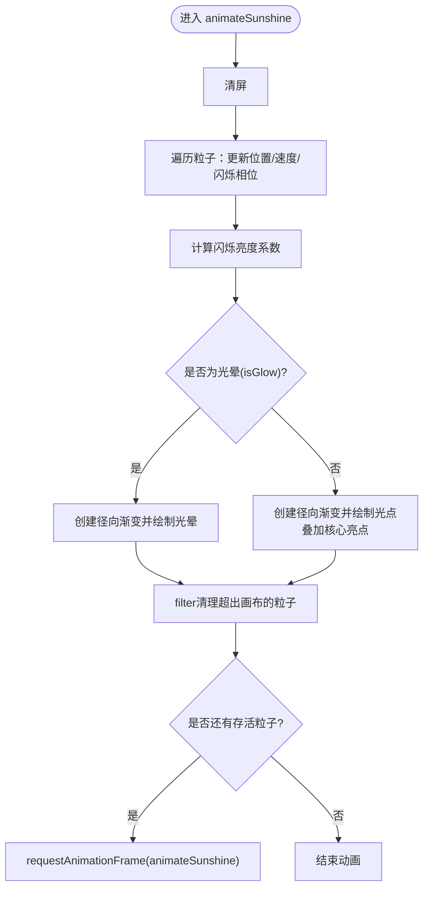
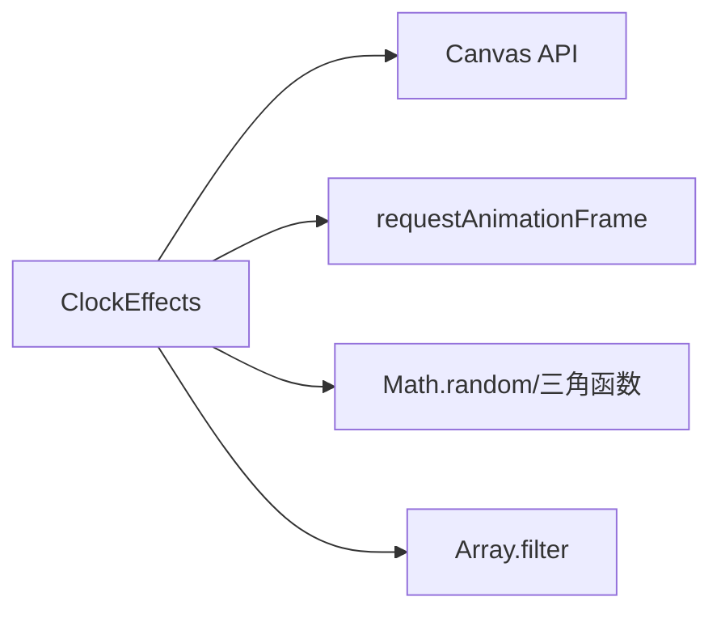

# 阳光特效

<cite>
**本文引用的文件**
- [effects.js](file://effects.js)
- [index.html](file://index.html)
- [script.js](file://script.js)
</cite>

## 目录
1. [简介](#简介)
2. [项目结构](#项目结构)
3. [核心组件](#核心组件)
4. [架构总览](#架构总览)
5. [详细组件分析](#详细组件分析)
6. [依赖关系分析](#依赖关系分析)
7. [性能考量](#性能考量)
8. [故障排查指南](#故障排查指南)
9. [结论](#结论)
10. [附录](#附录)

## 简介
本文件围绕 effects.js 中的 playSunshine 方法展开，系统性解析“上班打卡”阳光特效的实现机制。重点覆盖：
- 阳光粒子系统的初始化策略：100个基础光点与10个大型光晕粒子的生成逻辑与属性设计
- animateSunshine 动画循环如何通过 requestAnimationFrame 驱动，实现粒子下落、闪烁与渐隐
- 利用 filter 方法自动清理超出画布范围的粒子
- 使用 createRadialGradient 构建光晕与核心亮点的视觉效果
- 通过正弦函数实现亮度的周期性闪烁
- 全屏 Canvas 渲染如何营造温暖明亮的上班氛围，提升用户打卡体验

## 项目结构
- effects.js 提供 ClockEffects 类，封装打卡特效（阳光与礼花）与通用画布管理
- index.html 作为入口页面，加载脚本并挂载 Canvas
- script.js 负责业务交互，调用 ClockEffects.playSunshine 触发阳光特效

图表来源
- [index.html](file://index.html)
- [script.js](file://script.js)
- [effects.js](file://effects.js)

章节来源
- [effects.js](file://effects.js#L1-L279)
- [index.html](file://index.html)
- [script.js](file://script.js)

## 核心组件
- ClockEffects 类：负责画布尺寸适配、粒子数组管理、动画调度与清理
- playSunshine 方法：构建100个基础光点与10个大型光晕粒子，启动阳光动画
- animateSunshine 方法：单帧更新与绘制，包含闪烁、光晕与核心亮点渲染，以及基于画布边界的过滤清理

章节来源
- [effects.js](file://effects.js#L1-L279)

## 架构总览
阳光特效采用“初始化—动画循环—渲染”的分层架构：
- 初始化阶段：在 playSunshine 中批量生成粒子，设置初始位置、速度、透明度、颜色与闪烁相位
- 动画阶段：animateSunshine 每帧更新粒子状态，使用 radial gradient 实现光晕与核心高亮
- 清理阶段：通过 filter 返回存活粒子集合，自动移除超出画布或已失效的粒子

图表来源
- [effects.js](file://effects.js#L25-L201)

章节来源
- [effects.js](file://effects.js#L25-L201)

## 详细组件分析

### playSunshine 初始化流程
- 清空与重置：先调用 clear() 清理画布与动画，重置粒子数组
- 100个基础光点生成：
  - 位置：x 随机分布在画布宽度；y 在画布上方随机偏移，确保从上而下飘落
  - 大小：随机范围限定，保证视觉层次
  - 下落速度：speedY 随机分布，形成自然的飘落节奏
  - 水平漂移：speedX 小幅随机，模拟微风
  - 透明度：alpha 随机，营造轻盈感
  - 颜色：HSLA 颜色，色调集中在暖黄色区间，饱和度与亮度有轻微波动
  - 闪烁：twinkle 初始化为随机相位，用于 sin 闪烁
- 10个大型光晕粒子生成：
  - 与基础光点类似，但 size 更大，speedY 更慢，alpha 更低，营造“光晕”而非“光点”
  - isGlow 标记用于区分绘制路径，强调径向渐变与更大半径的光晕
- 启动动画：调用 animate('sunshine') 进入动画循环

图表来源
- [effects.js](file://effects.js#L25-L62)

章节来源
- [effects.js](file://effects.js#L25-L62)

### animateSunshine 动画循环与渲染
- 清屏：每帧开始清空画布，避免残影累积
- 粒子更新：
  - 位置更新：y 增加 speedY；x 增加 speedX
  - 闪烁相位推进：twinkle 线性递增，用于 sin 函数计算亮度波动
  - 亮度合成：通过 sin(twinkle) 计算亮度系数，与粒子原始 alpha 相乘，得到最终 alpha
- 绘制策略：
  - isGlow 为真：使用 createRadialGradient 创建从中心高亮到边缘透明的径向渐变，填充矩形区域以实现光晕
  - 非光晕：同样创建径向渐变，但绘制为圆形光点，并叠加一个更亮的核心圆，突出焦点
- 自动清理：
  - 使用 filter 仅保留仍在画布范围内的粒子（y 小于画布高度+安全阈值），超出即被移除
- 循环控制：
  - 若仍有存活粒子，则继续 requestAnimationFrame 调用 animateSunshine

图表来源
- [effects.js](file://effects.js#L144-L201)

章节来源
- [effects.js](file://effects.js#L144-L201)

### 颜色与闪烁设计原理
- 颜色模型：采用 HSLA，色调集中在暖黄色区间，饱和度与亮度有轻微随机波动，营造自然且丰富的色彩层次
- 闪烁机制：通过 twinkle 相位线性递增，sin(twinkle) 输出 [-1,1] 的波形，经缩放与平移后映射到 [0.4,1.4] 的亮度系数，再与粒子 alpha 相乘，实现柔和的呼吸式闪烁
- 光晕与核心：光晕使用较大的径向渐变半径与更淡的边缘，核心亮点使用更小半径与更高亮度，形成“光晕包裹核心”的视觉焦点

章节来源
- [effects.js](file://effects.js#L31-L62)
- [effects.js](file://effects.js#L144-L201)

### 全屏 Canvas 渲染与体验
- 画布适配：构造函数监听窗口 resize，将画布尺寸设为全屏，确保特效覆盖整个视窗
- 渲染策略：每帧清屏后重绘所有粒子，利用径向渐变与核心高亮构建温暖明亮的视觉效果
- 用户体验：100个基础光点提供细腻的飘落质感，10个大型光晕强化整体氛围，配合闪烁与渐隐，营造积极向上的上班氛围

章节来源
- [effects.js](file://effects.js#L19-L23)
- [effects.js](file://effects.js#L144-L201)

## 依赖关系分析
- ClockEffects 依赖浏览器 Canvas API（getContext、createRadialGradient、fillRect、arc、clearRect）
- animateSunshine 依赖 requestAnimationFrame 实现流畅动画
- playSunshine 依赖 Math.random 与三角函数生成随机与周期性效果
- 清理逻辑依赖 Array.filter 对粒子进行原地筛选

图表来源
- [effects.js](file://effects.js#L1-L279)

章节来源
- [effects.js](file://effects.js#L1-L279)

## 性能考量
- 粒子数量：100个基础光点+10个光晕粒子，数量适中，适合全屏渲染
- 更新复杂度：每帧对粒子执行常数次数学运算（加法、乘法、三角函数），开销可控
- 渲染复杂度：径向渐变绘制与清屏操作在现代浏览器中优化良好
- 清理策略：filter 在每帧执行，但只保留存活粒子，避免无限增长
- 建议：
  - 控制画布尺寸变化频率，减少 resize 事件触发
  - 如需更高帧率，可考虑降低闪烁频率或减少光晕粒子数量
  - 在低端设备上可适度降低粒子数量或增大 size 以换取更佳性能

## 故障排查指南
- 无特效显示
  - 检查 Canvas 是否成功获取与尺寸是否正确
  - 确认 playSunshine 已被调用且未被 clear() 取消
- 特效不消失
  - 检查 animateSunshine 中的 filter 条件是否合理（y 阈值）
  - 确认 requestAnimationFrame 是否持续触发
- 颜色异常
  - 检查 HSLA 颜色参数范围与拼接格式
  - 确认 alpha 与闪烁系数相乘后的取值范围
- 闪烁不明显
  - 检查 twinkle 是否递增，sin 是否正确参与亮度计算

章节来源
- [effects.js](file://effects.js#L19-L23)
- [effects.js](file://effects.js#L144-L201)

## 结论
playSunshine 通过精心设计的粒子生成策略与高效的动画循环，实现了温暖明亮的全屏阳光特效。100个基础光点与10个大型光晕粒子的组合，辅以径向渐变与正弦闪烁，营造出自然且富有活力的视觉体验。借助 filter 的自动清理与 requestAnimationFrame 的驱动，系统在保证流畅度的同时维持了良好的资源占用。

## 附录
- 使用示例（参考路径）
  - 在业务逻辑中调用：[script.js](file://script.js)
  - 初始化与启动：[effects.js](file://effects.js#L25-L62)
  - 动画循环与绘制：[effects.js](file://effects.js#L144-L201)
  - 画布适配与清理：[effects.js](file://effects.js#L19-L23), [effects.js](file://effects.js#L262-L273)