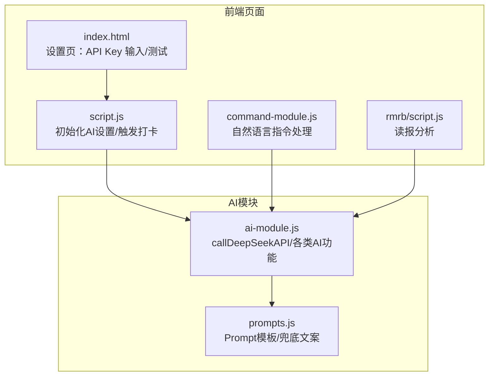
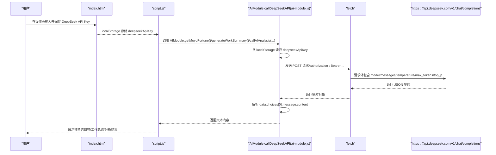
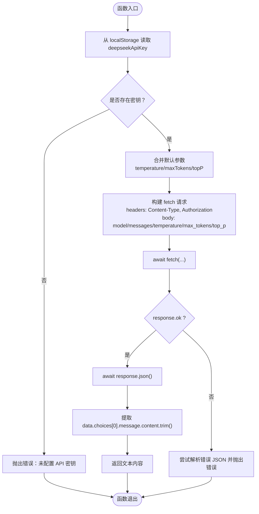
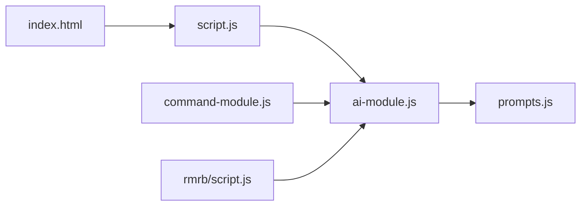

# AI API调用流程

<cite>
**本文引用的文件**
- [ai-module.js](file://ai-module.js)
- [prompts.js](file://prompts.js)
- [script.js](file://script.js)
- [index.html](file://index.html)
- [command-module.js](file://command-module.js)
- [rmrb/script.js](file://rmrb/script.js)
- [README.md](file://README.md)
</cite>

## 目录
1. [简介](#简介)
2. [项目结构](#项目结构)
3. [核心组件](#核心组件)
4. [架构总览](#架构总览)
5. [详细组件分析](#详细组件分析)
6. [依赖关系分析](#依赖关系分析)
7. [性能考量](#性能考量)
8. [故障排查指南](#故障排查指南)
9. [结论](#结论)
10. [附录](#附录)

## 简介
本文件围绕 ai-module.js 中的 callDeepSeekAPI 函数，系统梳理其从 localStorage 读取 DeepSeek API 密钥、构造 Authorization 头并使用 fetch 向 https://api.deepseek.com/v1/chat/completions 发起 POST 请求的完整流程；解释请求体中 model、messages、temperature、max_tokens、top_p 等参数的作用与配置方式；说明成功响应后的 JSON 解析与返回值提取；并结合实际调用场景，阐述网络错误、API 限流或认证失败时的异常捕获机制与错误日志记录的重要性。最后提供一个完整的调用示例与最佳实践建议。

## 项目结构
该项目采用前端单页应用结构，AI 能力集中在 ai-module.js 中，通过全局 window.AIModule 暴露给其他模块使用。关键文件与职责如下：
- ai-module.js：封装 DeepSeek API 调用、AI 功能（摸鱼吉日签、工作总结、通用分析等），导出 AIModule
- prompts.js：集中管理 AI Prompt 模板与兜底文案
- script.js：应用主逻辑，初始化 AI 设置、触发打卡与 AI 交互
- index.html：设置页包含 DeepSeek API Key 输入与测试按钮
- command-module.js：自然语言指令理解与执行，内部调用 AIModule.callDeepSeekAPI
- rmrb/script.js：读报模块，调用 AIModule.callAIAnalysis 进行新闻分析
- README.md：产品功能说明，体现 v1.3.3 新增的 AI 能力

图表来源
- [index.html](file://index.html#L429-L441)
- [script.js](file://script.js#L424-L491)
- [command-module.js](file://command-module.js#L185-L259)
- [rmrb/script.js](file://rmrb/script.js#L359-L418)
- [ai-module.js](file://ai-module.js#L1-L60)
- [prompts.js](file://prompts.js#L1-L159)

章节来源
- [README.md](file://README.md#L32-L55)
- [index.html](file://index.html#L429-L441)
- [script.js](file://script.js#L424-L491)

## 核心组件
- callDeepSeekAPI：封装 DeepSeek Chat Completions API 调用，负责密钥读取、请求构造、响应解析与错误处理
- AIModule：统一导出的模块对象，包含 callDeepSeekAPI、getAIGreeting、getMoyuFortune、generateWorkSummary、callAIAnalysis 等
- Prompt 模板与兜底文案：通过 prompts.js 统一管理，确保 AI 输出格式与降级策略一致

章节来源
- [ai-module.js](file://ai-module.js#L1-L60)
- [prompts.js](file://prompts.js#L1-L159)

## 架构总览
下面的序列图展示了从页面设置保存 API Key，到脚本触发调用，再到 DeepSeek API 返回并解析的完整链路。

图表来源
- [index.html](file://index.html#L429-L441)
- [script.js](file://script.js#L424-L491)
- [ai-module.js](file://ai-module.js#L14-L59)
- [prompts.js](file://prompts.js#L1-L159)

## 详细组件分析

### callDeepSeekAPI 函数调用流程
- 密钥获取：从 localStorage 读取 deepseekApiKey，若不存在则抛出错误
- 参数合并：options 支持 temperature、maxTokens、topP，默认值分别为 1.2、2000、0.95
- 请求构造：使用 fetch 发送 POST，设置 Content-Type 与 Authorization 头，请求体包含 model、messages、temperature、max_tokens、top_p
- 响应处理：若 response.ok 为 false，尝试解析 JSON 错误信息并抛出错误；否则解析 JSON 并返回 choices[0].message.content.trim()
- 异常处理：捕获所有错误，记录控制台日志并重新抛出

图表来源
- [ai-module.js](file://ai-module.js#L14-L59)

章节来源
- [ai-module.js](file://ai-module.js#L14-L59)

### 请求体参数说明与配置方式
- model：固定使用 DEEPSEEK_MODEL（来自 ai-module.js 常量），用于指定模型
- messages：数组，包含一条用户消息，content 来自上层调用传入的 prompt
- temperature：采样温度，默认 1.2，越大越随机，越小越稳定
- max_tokens：最大生成长度，默认 2000
- top_p：核采样概率质量，默认 0.95

章节来源
- [ai-module.js](file://ai-module.js#L21-L46)

### 成功响应解析与返回值
- 若响应非 2xx，尝试解析 JSON 错误信息并抛出；否则解析 JSON，取 choices[0].message.content.trim() 作为最终返回值
- 上层调用（如 getMoyuFortune、generateWorkSummary、callAIAnalysis）会基于返回值做进一步处理（如 JSON 解析、兜底文案）

章节来源
- [ai-module.js](file://ai-module.js#L48-L54)

### 错误处理与异常捕获
- 认证失败/密钥缺失：未配置 API 密钥或 Authorization 头无效导致的 4xx/5xx
- 网络错误：fetch 抛出异常，统一在 try/catch 中记录错误日志并重新抛出
- API 限流：响应非 2xx 时解析错误 JSON 并抛出，便于上层识别与降级
- 兜底策略：getMoyuFortune 与 generateWorkSummary/callAIAnalysis 在捕获异常时返回兜底文案或 fallback 数据

章节来源
- [ai-module.js](file://ai-module.js#L14-L59)
- [prompts.js](file://prompts.js#L122-L159)

### 实际调用场景与最佳实践
- 摸鱼吉日签：getMoyuFortune 调用 callDeepSeekAPI，解析返回的 JSON 字符串并校验格式
- 工作总结：generateWorkSummary 调用 callDeepSeekAPI，直接使用返回文本
- 读报分析：rmrb/script.js 调用 AIModule.callAIAnalysis，内部再次调用 callDeepSeekAPI
- 自然语言指令：command-module.js 调用 AIModule.callDeepSeekAPI 进行意图理解，使用较低 temperature 以获得更稳定的 JSON 输出

章节来源
- [ai-module.js](file://ai-module.js#L95-L204)
- [rmrb/script.js](file://rmrb/script.js#L359-L418)
- [command-module.js](file://command-module.js#L185-L259)

## 依赖关系分析
- ai-module.js 依赖 localStorage 存储的 deepseekApiKey
- 调用链路：index.html -> script.js -> AIModule -> fetch -> DeepSeek API
- 上层模块：command-module.js、rmrb/script.js、script.js 均通过 window.AIModule 调用 callDeepSeekAPI
- Prompt 模板：AIModule 内部使用 window.AI_PROMPTS 与 window.FALLBACK_MESSAGES

图表来源
- [index.html](file://index.html#L429-L441)
- [script.js](file://script.js#L424-L491)
- [command-module.js](file://command-module.js#L185-L259)
- [rmrb/script.js](file://rmrb/script.js#L359-L418)
- [ai-module.js](file://ai-module.js#L1-L60)
- [prompts.js](file://prompts.js#L1-L159)

章节来源
- [index.html](file://index.html#L429-L441)
- [script.js](file://script.js#L424-L491)
- [command-module.js](file://command-module.js#L185-L259)
- [rmrb/script.js](file://rmrb/script.js#L359-L418)
- [ai-module.js](file://ai-module.js#L1-L60)
- [prompts.js](file://prompts.js#L1-L159)

## 性能考量
- 请求参数默认值已针对稳定性与可读性平衡：temperature 1.2、max_tokens 2000、top_p 0.95
- 上层调用可根据场景微调：如读报分析使用更高 max_tokens，自然语言指令使用较低 temperature
- fetch 为浏览器原生 API，注意避免频繁并发请求，必要时增加节流或队列控制
- 响应解析与 JSON 提取应在上层做好边界检查，防止异常输入导致解析失败

[本节为通用指导，无需特定文件来源]

## 故障排查指南
- 未配置 API 密钥
  - 现象：调用立即抛出错误
  - 处理：在设置页保存密钥并确认 localStorage 中存在 deepseekApiKey
- 认证失败/401
  - 现象：响应非 2xx，解析错误 JSON 并抛出
  - 处理：检查密钥有效性、网络连通性、服务端状态
- 网络超时/断网
  - 现象：fetch 抛出异常，控制台记录错误
  - 处理：重试、检查网络、确认代理或 CORS 配置
- API 限流/配额不足
  - 现象：响应非 2xx 或返回限流错误
  - 处理：降低请求频率、增加重试与退避策略、检查账户状态
- 上层 JSON 解析失败
  - 现象：getMoyuFortune 无法匹配并解析 JSON
  - 处理：检查 Prompt 模板、温度与长度设置，必要时启用兜底文案

章节来源
- [ai-module.js](file://ai-module.js#L14-L59)
- [prompts.js](file://prompts.js#L122-L159)

## 结论
callDeepSeekAPI 以最小封装实现了从密钥读取、请求构造、响应解析到错误处理的完整链路。通过合理的默认参数与上层模块化的调用方式，既能满足多样化场景（摸鱼吉日签、工作总结、读报分析、自然语言指令），又能通过兜底策略与错误日志保障用户体验与可维护性。建议在生产环境中配合重试、限流与可观测性监控，持续优化调用质量与稳定性。

[本节为总结性内容，无需特定文件来源]

## 附录

### 完整调用示例（步骤说明）
- 在设置页保存 DeepSeek API Key（localStorage 存储 deepseekApiKey）
- 在脚本中调用 AIModule.getAIGreeting/getMoyuFortune/generateWorkSummary/callAIAnalysis
- 上层函数内部调用 AIModule.callDeepSeekAPI，传入 prompt 与可选 options（temperature、maxTokens、topP）
- callDeepSeekAPI 从 localStorage 读取密钥，构造 Authorization 头与请求体，使用 fetch 发送请求
- 成功时解析 JSON 并返回 choices[0].message.content.trim()，失败时抛出错误并记录日志
- 上层根据返回值进行后续处理（如 JSON 解析、展示、兜底）

章节来源
- [index.html](file://index.html#L429-L441)
- [script.js](file://script.js#L424-L491)
- [ai-module.js](file://ai-module.js#L14-L59)
- [prompts.js](file://prompts.js#L1-L159)