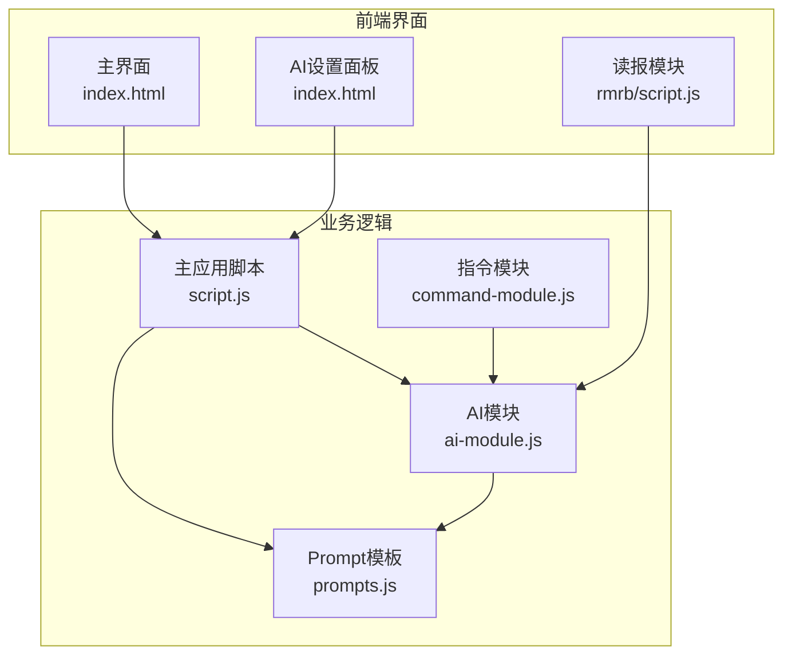
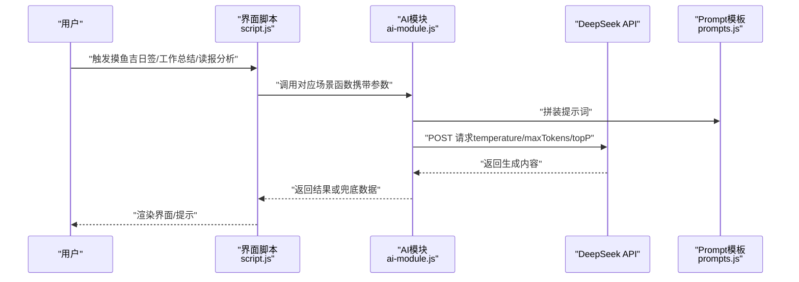
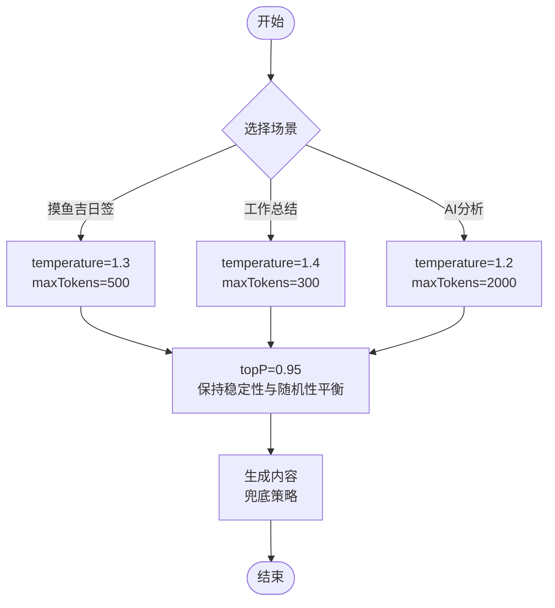
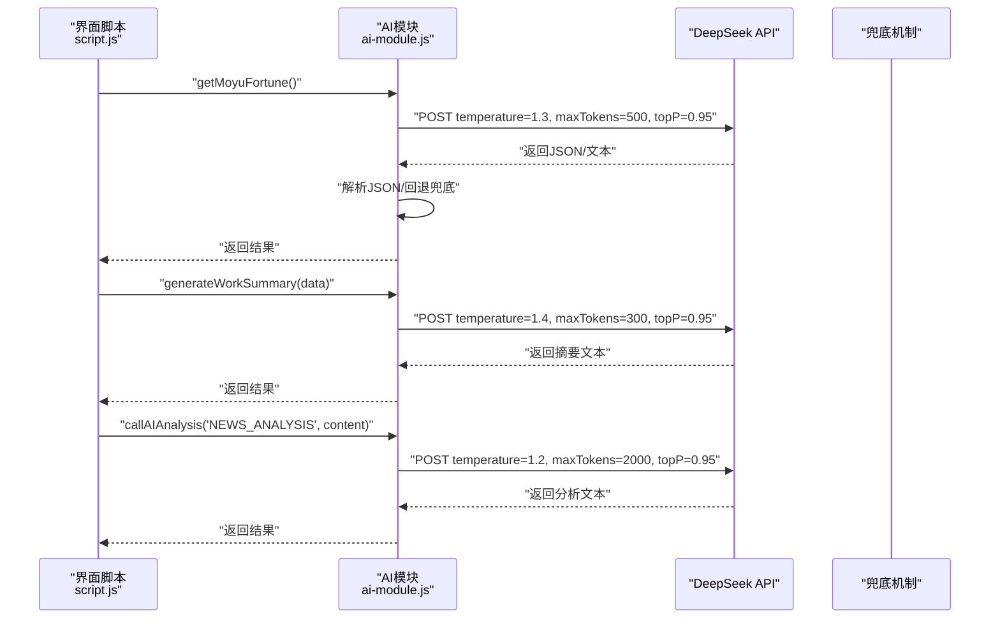
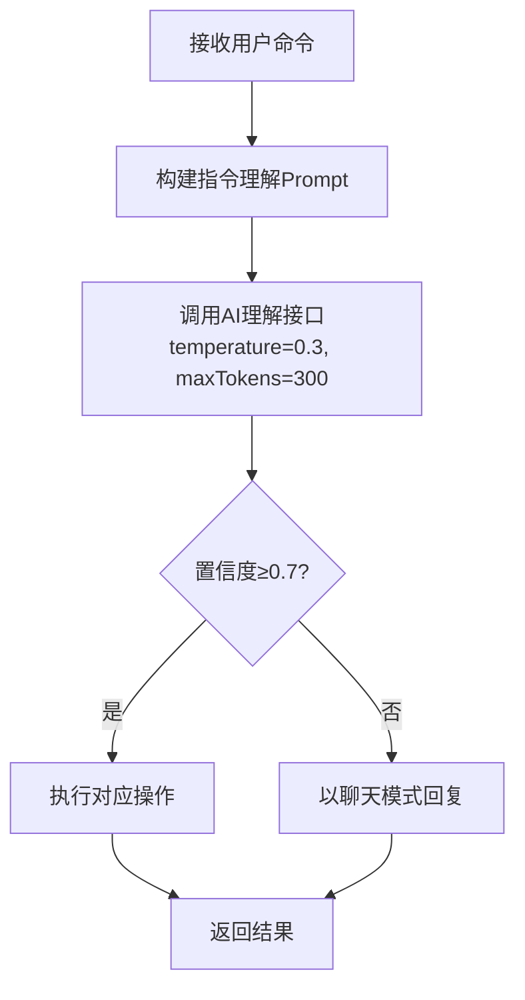
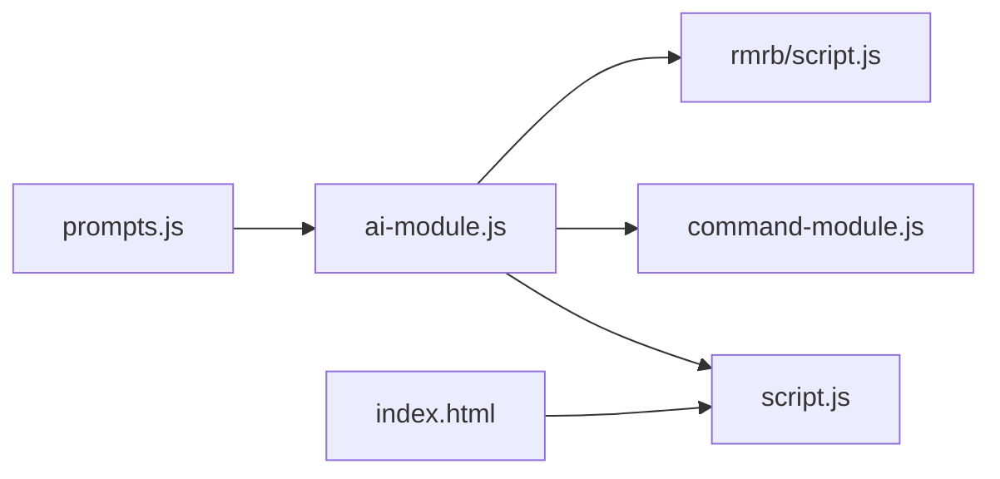

# AI功能参数配置策略

<cite>
**本文引用的文件**
- [ai-module.js](file://ai-module.js)
- [prompts.js](file://prompts.js)
- [script.js](file://script.js)
- [command-module.js](file://command-module.js)
- [README.md](file://README.md)
- [index.html](file://index.html)
- [rmrb/script.js](file://rmrb/script.js)
</cite>

## 目录
1. [引言](#引言)
2. [项目结构](#项目结构)
3. [核心组件](#核心组件)
4. [架构总览](#架构总览)
5. [详细组件分析](#详细组件分析)
6. [依赖关系分析](#依赖关系分析)
7. [性能考量](#性能考量)
8. [故障排查指南](#故障排查指南)
9. [结论](#结论)
10. [附录](#附录)

## 引言
本文件围绕工作与假期管理应用中的AI功能，系统梳理并对比三类典型场景的参数配置策略：
- 摸鱼吉日签：getMoyuFortune（temperature: 1.3, maxTokens: 500）
- 工作总结：generateWorkSummary（temperature: 1.4, maxTokens: 300）
- AI分析：callAIAnalysis（temperature: 1.2, maxTokens: 2000）

同时结合DeepSeek模型特性，解释temperature、maxTokens、topP在不同业务场景下的权衡与设计考量，并提供参数调优指南，帮助开发者依据业务目标选择合适的生成效果。

## 项目结构
该项目采用前端单页应用结构，AI相关能力集中在独立模块中，通过统一的DeepSeek API封装对外暴露。核心文件包括：
- AI模块：封装DeepSeek调用、不同场景的参数配置与兜底策略
- Prompt模板：集中管理各类提示词与兜底文案
- 主应用脚本：初始化界面、事件绑定、触发AI流程
- 指令模块：自然语言意图识别与执行，使用较低temperature以稳定意图判断
- 读报模块：整合人民日报内容并通过AI分析输出结构化报告

图表来源
- [index.html](file://index.html#L430-L485)
- [script.js](file://script.js#L424-L995)
- [command-module.js](file://command-module.js#L182-L259)
- [ai-module.js](file://ai-module.js#L1-L216)
- [prompts.js](file://prompts.js#L1-L159)
- [rmrb/script.js](file://rmrb/script.js#L358-L441)

章节来源
- [README.md](file://README.md#L32-L61)
- [index.html](file://index.html#L430-L485)

## 核心组件
- DeepSeek API封装：统一处理认证、请求体构造、响应解析与错误抛出
- 场景化调用：
  - getMoyuFortune：高temperature增强创意与幽默感，较长maxTokens满足JSON结构化输出
  - generateWorkSummary：更高temperature强调生成多样性，较短maxTokens控制摘要长度
  - callAIAnalysis：适中temperature，较大maxTokens支撑深度分析文本
- 指令理解：processCommand使用低temperature与较小maxTokens，确保意图识别稳定
- Prompt模板与兜底：集中管理提示词与回退文案，保障异常情况下的用户体验

章节来源
- [ai-module.js](file://ai-module.js#L14-L59)
- [ai-module.js](file://ai-module.js#L99-L167)
- [ai-module.js](file://ai-module.js#L169-L204)
- [command-module.js](file://command-module.js#L182-L259)
- [prompts.js](file://prompts.js#L1-L159)

## 架构总览
下图展示了从用户交互到AI生成与回退的整体流程，以及不同场景参数配置的差异。

图表来源
- [script.js](file://script.js#L546-L728)
- [ai-module.js](file://ai-module.js#L99-L167)
- [prompts.js](file://prompts.js#L1-L159)

## 详细组件分析

### 参数配置策略对比
- getMoyuFortune（temperature: 1.3, maxTokens: 500）
  - 设计考量：较高temperature提升创意与幽默感，适合轻松场景；较长maxTokens确保能容纳JSON结构化输出与多条建议
  - 适用场景：摸鱼吉日签，要求生成JSON并包含运势、最佳时间、锦囊
- generateWorkSummary（temperature: 1.4, maxTokens: 300）
  - 设计考量：更高的temperature鼓励多样化的幽默表达；较短maxTokens限制摘要长度，确保信息密度与可读性
  - 适用场景：下班打卡后的幽默总结，强调积极向上与轻松调侃
- callAIAnalysis（temperature: 1.2, maxTokens: 2000）
  - 设计考量：适中temperature兼顾稳定与创造性；较大maxTokens满足深度分析所需的长文本输出
  - 适用场景：读报分析，要求结构化输出与多维度解读

图表来源
- [ai-module.js](file://ai-module.js#L21-L25)
- [ai-module.js](file://ai-module.js#L99-L167)
- [ai-module.js](file://ai-module.js#L169-L204)

章节来源
- [ai-module.js](file://ai-module.js#L99-L167)
- [ai-module.js](file://ai-module.js#L169-L204)
- [prompts.js](file://prompts.js#L1-L159)

### DeepSeek模型特性与参数关系
- temperature：控制采样随机性。较高temperature增加多样性与创造性，适合创意类输出；较低temperature更稳定、确定性强，适合意图识别与结构化输出
- maxTokens：限制最大生成长度。较长maxTokens适合需要充分展开的分析类任务；较短maxTokens适合摘要与结构化输出
- topP：核采样概率质量控制。0.95在保持输出稳定性的同时保留一定随机性，有助于在可控范围内提升多样性

章节来源
- [ai-module.js](file://ai-module.js#L21-L25)

### 场景化调用流程
- 摸鱼吉日签：调用getMoyuFortune，内部使用较高temperature与较长maxTokens，解析JSON并回退兜底
- 工作总结：调用generateWorkSummary，内部使用更高temperature与较短maxTokens，返回简洁幽默的总结
- AI分析：调用callAIAnalysis，内部使用适中temperature与较大maxTokens，输出结构化分析

图表来源
- [script.js](file://script.js#L546-L728)
- [ai-module.js](file://ai-module.js#L99-L167)
- [ai-module.js](file://ai-module.js#L169-L204)

章节来源
- [script.js](file://script.js#L546-L728)
- [ai-module.js](file://ai-module.js#L99-L167)
- [ai-module.js](file://ai-module.js#L169-L204)

### 指令理解与参数策略
- processCommand使用较低temperature与较小maxTokens，确保意图识别稳定可靠
- 当置信度不足时，系统以聊天模式回应，避免误执行

图表来源
- [command-module.js](file://command-module.js#L182-L259)

章节来源
- [command-module.js](file://command-module.js#L182-L259)

### Prompt模板与兜底策略
- Prompt模板集中管理，涵盖摸鱼吉日签、工作总结、读报分析等
- 兜底文案在AI调用失败或解析失败时启用，保证用户体验连续性

章节来源
- [prompts.js](file://prompts.js#L1-L159)

## 依赖关系分析
- ai-module.js对外提供统一的DeepSeek调用入口，被script.js、command-module.js、rmrb/script.js等模块调用
- prompts.js提供统一的提示词与兜底文案，被ai-module.js与业务脚本共同使用
- index.html提供AI设置入口，script.js负责初始化与测试连接

图表来源
- [ai-module.js](file://ai-module.js#L1-L216)
- [prompts.js](file://prompts.js#L1-L159)
- [script.js](file://script.js#L424-L995)
- [command-module.js](file://command-module.js#L182-L259)
- [rmrb/script.js](file://rmrb/script.js#L358-L441)
- [index.html](file://index.html#L430-L485)

章节来源
- [ai-module.js](file://ai-module.js#L1-L216)
- [prompts.js](file://prompts.js#L1-L159)
- [script.js](file://script.js#L424-L995)
- [command-module.js](file://command-module.js#L182-L259)
- [rmrb/script.js](file://rmrb/script.js#L358-L441)
- [index.html](file://index.html#L430-L485)

## 性能考量
- API调用成本：temperature与maxTokens越高，生成长度与计算复杂度越大，需关注响应时间与费用
- 兜底策略：在解析失败或网络异常时快速返回兜底文案，降低用户等待与失败感知
- UI渲染：较长文本输出需注意DOM渲染与滚动性能，必要时采用虚拟滚动或分块渲染

## 故障排查指南
- API密钥缺失：检查设置面板是否保存密钥，或在测试连接时临时保存
- API调用失败：查看状态提示，确认网络连通与服务可用性
- 解析失败：摸鱼吉日签需返回JSON，若解析不到则启用兜底；读报分析失败时使用兜底文案
- 指令理解不稳定：当置信度较低时，系统将以聊天模式回应，避免误执行

章节来源
- [script.js](file://script.js#L424-L491)
- [ai-module.js](file://ai-module.js#L99-L167)
- [ai-module.js](file://ai-module.js#L169-L204)
- [command-module.js](file://command-module.js#L182-L259)

## 结论
通过对三类AI场景的参数配置策略进行系统对比，可以发现：
- 创意与幽默场景（摸鱼吉日签）采用较高temperature与较长maxTokens，配合0.95的topP在稳定与多样性间取得平衡
- 摘要与结构化输出（工作总结）采用更高temperature与较短maxTokens，强调表达多样性与信息密度
- 深度分析（读报分析）采用适中temperature与较大maxTokens，满足长文本输出与结构化呈现
结合指令理解的低temperature策略，整体实现了“稳定意图识别+多样化生成”的协同效果。

## 附录
- 参数调优建议
  - 创意类输出：适当提高temperature，增大maxTokens，保留适度topP
  - 结构化摘要：提高temperature但控制maxTokens，确保长度与可读性
  - 深度分析：适中temperature，较大maxTokens，便于长文本展开
  - 意图识别：低temperature与较小maxTokens，提升稳定性与确定性
- 兜底策略：在解析失败或网络异常时启用，保证用户体验连续性