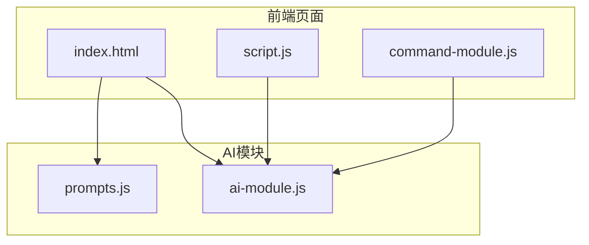
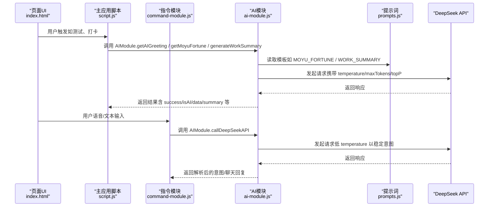
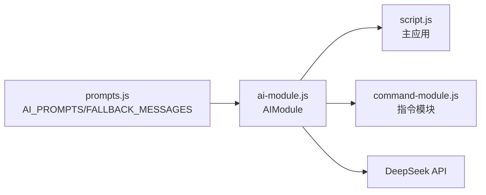

# AI功能实现流程

<cite>
**本文引用的文件**
- [ai-module.js](file://ai-module.js)
- [prompts.js](file://prompts.js)
- [script.js](file://script.js)
- [index.html](file://index.html)
- [command-module.js](file://command-module.js)
</cite>

## 目录
1. [简介](#简介)
2. [项目结构](#项目结构)
3. [核心组件](#核心组件)
4. [架构总览](#架构总览)
5. [详细组件分析](#详细组件分析)
6. [依赖关系分析](#依赖关系分析)
7. [性能考量](#性能考量)
8. [故障排查指南](#故障排查指南)
9. [结论](#结论)
10. [附录](#附录)

## 简介
本文件围绕 ai-module.js 中新增的 AI 功能展开，以 callAIAnalysis 为核心，系统阐述如何通过 promptType 参数调用 window.AI_PROMPTS 中定义的提示词模板，并将用户内容注入 {CONTENT} 占位符完成请求构造；如何配置 API 调用参数（temperature、maxTokens、topP）以优化生成效果；以及异步处理流程：从调用 callDeepSeekAPI 开始，到成功响应的数据提取，再到失败时的错误捕获与兜底文案返回机制。同时，结合 getMoyuFortune 和 generateWorkSummary 的参数配置策略与结果处理逻辑，对比分析不同场景下的调优思路，并强调函数命名规范与模块导出方式（window.AIModule），确保新功能可被主应用 script.js 正确调用。

## 项目结构
AI 功能位于独立模块中，通过全局命名空间 window.AIModule 暴露给主应用脚本使用。提示词模板集中管理在 prompts.js 中，主页面 index.html 引入相关脚本，确保全局可用。

图表来源
- [index.html](file://index.html#L1-L20)
- [script.js](file://script.js#L424-L491)
- [ai-module.js](file://ai-module.js#L1-L60)
- [prompts.js](file://prompts.js#L1-L40)

章节来源
- [index.html](file://index.html#L1-L20)
- [ai-module.js](file://ai-module.js#L1-L60)
- [prompts.js](file://prompts.js#L1-L40)

## 核心组件
- callDeepSeekAPI：封装 DeepSeek API 的调用，负责鉴权、请求体构造、响应校验与错误抛出。
- getAIGreeting：快速问候（不调用 AI），用于加速首屏体验。
- getMoyuFortune：基于提示词模板生成摸鱼吉日签，带 JSON 解析与兜底。
- generateWorkSummary：基于工作数据生成幽默工作总结，带兜底。
- callAIAnalysis：通用分析入口，按 promptType 注入用户内容，调用 DeepSeek 并返回结果或兜底文案。

章节来源
- [ai-module.js](file://ai-module.js#L14-L59)
- [ai-module.js](file://ai-module.js#L66-L93)
- [ai-module.js](file://ai-module.js#L99-L127)
- [ai-module.js](file://ai-module.js#L134-L167)
- [ai-module.js](file://ai-module.js#L175-L204)

## 架构总览
AI 功能在前端以模块化方式组织，通过 window.AIModule 对外提供统一接口。主应用 script.js 在初始化时加载提示词与 AI 模块，并在用户交互（如打卡、测试）时调用 AIModule 的方法。command-module.js 也通过 AIModule 调用大模型进行自然语言指令理解与执行。

图表来源
- [index.html](file://index.html#L1-L20)
- [script.js](file://script.js#L424-L491)
- [command-module.js](file://command-module.js#L185-L259)
- [ai-module.js](file://ai-module.js#L14-L59)
- [prompts.js](file://prompts.js#L1-L40)

## 详细组件分析

### callDeepSeekAPI：API 调用封装
- 功能要点
  - 从本地存储读取 API 密钥，若缺失则抛错。
  - 采用默认参数：temperature、maxTokens、topP，支持外部传参覆盖。
  - 构造消息数组，将 prompt 作为用户消息内容。
  - 校验响应状态码，非 OK 时解析错误信息并抛出。
  - 成功时提取 choices[0].message.content 并 trim 返回。
  - 捕获网络/解析异常并抛出，供上层处理。

- 参数配置策略
  - temperature：越高越“创造性”，越低越“确定性”。
  - maxTokens：控制输出长度，避免过长导致成本上升或截断。
  - topP：核采样概率质量，平衡多样性与稳定性。

- 错误处理
  - 缺失密钥、HTTP 非 OK、JSON 解析失败均抛出，便于上层统一兜底。

章节来源
- [ai-module.js](file://ai-module.js#L14-L59)

### getMoyuFortune：摸鱼吉日签（带兜底）
- 功能要点
  - 从 window.AI_PROMPTS.MOYU_FORTUNE 读取模板。
  - 调用 callDeepSeekAPI，配置 maxTokens 与 temperature。
  - 使用正则匹配 JSON 字符串并解析，返回结构化数据。
  - 解析失败或异常时，返回 window.FALLBACK_MESSAGES.MOYU_FORTUNE。

- 参数配置策略
  - temperature 较高，增强创意与幽默感。
  - maxTokens 适中，确保 JSON 结构完整。

- 结果处理
  - isAI 标志区分 AI 生成与兜底数据，便于 UI 与日志区分。

章节来源
- [ai-module.js](file://ai-module.js#L99-L127)
- [prompts.js](file://prompts.js#L1-L40)

### generateWorkSummary：工作总结（带兜底）
- 功能要点
  - 从 window.AI_PROMPTS.WORK_SUMMARY 读取模板。
  - 将工作数据（上班时间、下班时间、摸鱼次数、日收入）注入模板占位符。
  - 调用 callDeepSeekAPI，配置 maxTokens 与 temperature。
  - 返回纯文本总结，isAI 标志区分 AI 生成与兜底。

- 参数配置策略
  - temperature 更高，鼓励生成更富创意与幽默的总结。
  - maxTokens 适中，控制摘要长度。

- 结果处理
  - 主应用 displayWorkSummary 将结果渲染到页面，同时展示原始数据明细。

章节来源
- [ai-module.js](file://ai-module.js#L134-L167)
- [prompts.js](file://prompts.js#L41-L90)
- [script.js](file://script.js#L3080-L3150)

### callAIAnalysis：通用分析入口（以 NEWS_ANALYSIS 为例）
- 功能要点
  - 通过 promptType 从 window.AI_PROMPTS 中读取模板。
  - 将用户内容注入 {CONTENT} 占位符，构造最终 prompt。
  - 调用 callDeepSeekAPI，配置 maxTokens 与 temperature。
  - 成功返回 {success:true, content, isAI:true}；失败返回 {success:false, content:兜底, isAI:false, error}。

- 参数配置策略
  - temperature 默认适中，兼顾稳定与创造性。
  - maxTokens 默认较大，满足较长新闻分析输出。

- 与主应用集成
  - 主应用 script.js 通过 window.AIModule 调用，返回结果用于 UI 展示或进一步处理。

章节来源
- [ai-module.js](file://ai-module.js#L175-L204)
- [prompts.js](file://prompts.js#L116-L159)

### 主应用集成与调用流程
- 初始化与测试
  - script.js 的 initAISettings 负责加载/保存 API 密钥，并通过 AIModule.getAIGreeting 进行连通性测试。
- 打卡流程
  - 上班打卡：生成问候语，播放特效，调用 AIModule.getMoyuFortune，显示摸鱼吉日签。
  - 下班打卡：生成问候语，播放特效，调用 AIModule.generateWorkSummary，渲染总结与明细。
- 指令理解
  - command-module.js 通过 AIModule.callDeepSeekAPI 理解用户自然语言，返回意图与聊天回复。

章节来源
- [script.js](file://script.js#L424-L491)
- [script.js](file://script.js#L547-L728)
- [command-module.js](file://command-module.js#L185-L259)

## 依赖关系分析
- 模块耦合
  - ai-module.js 依赖 prompts.js 中的模板与兜底文案，通过 window 全局暴露 AIModule。
  - script.js 与 command-module.js 通过 window.AIModule 调用 AI 能力，形成弱耦合。
- 外部依赖
  - DeepSeek API：通过 fetch 发起请求，需配置 Authorization 与模型参数。
- 潜在风险
  - API 密钥缺失会导致调用失败。
  - 网络不稳定或服务端错误需通过兜底策略保证用户体验。

图表来源
- [prompts.js](file://prompts.js#L1-L40)
- [ai-module.js](file://ai-module.js#L206-L216)
- [script.js](file://script.js#L424-L491)
- [command-module.js](file://command-module.js#L185-L259)

章节来源
- [prompts.js](file://prompts.js#L1-L40)
- [ai-module.js](file://ai-module.js#L206-L216)
- [script.js](file://script.js#L424-L491)
- [command-module.js](file://command-module.js#L185-L259)

## 性能考量
- 温度与多样性
  - temperature 越高，生成内容越多样化，适合创意类任务；越低越稳定，适合意图理解与结构化输出。
- Token 控制
  - 合理设置 maxTokens，避免过长输出导致成本上升与延迟增加。
- 兜底策略
  - 在网络异常或解析失败时，快速返回兜底文案，保证交互流畅。
- 并发与节流
  - 对高频调用（如再求一签）可增加节流/防抖，避免频繁请求。

## 故障排查指南
- API 密钥缺失
  - 现象：调用立即抛错。
  - 处理：在设置页保存密钥，或临时写入 localStorage 后重试。
- HTTP 非 OK
  - 现象：响应非 2xx，解析错误信息并抛出。
  - 处理：检查密钥有效性、网络连通性与服务端状态。
- JSON 解析失败（摸鱼吉日签）
  - 现象：无法匹配到 JSON 结构。
  - 处理：返回兜底 JSON 数据，检查模板与模型输出格式。
- UI 渲染异常
  - 现象：找不到 summary-content 或容器元素。
  - 处理：确认 DOM 已挂载，或在显示前确保容器可见。

章节来源
- [ai-module.js](file://ai-module.js#L14-L59)
- [ai-module.js](file://ai-module.js#L99-L127)
- [script.js](file://script.js#L3080-L3150)

## 结论
ai-module.js 通过统一的 AIModule 暴露 AI 能力，结合 prompts.js 的模板与兜底策略，实现了从问候、摸鱼吉日签到工作总结的完整闭环。callAIAnalysis 作为通用入口，展示了如何以 promptType 选择模板、以 {CONTENT} 注入用户内容、以参数调优生成质量，并通过统一的错误兜底保障用户体验。主应用 script.js 与 command-module.js 通过 window.AIModule 无缝集成，形成稳定的前后端协作模式。

## 附录

### API 调用参数配置建议
- 意图理解（低 temperature）
  - temperature：较低（如 0.3），提高确定性，减少歧义。
  - maxTokens：适中（如 300），保证 JSON 结构清晰。
- 创意生成（较高 temperature）
  - temperature：中高（如 1.3~1.4），增强幽默与多样性。
  - maxTokens：较大（如 500~2000），满足长文本输出。
- 稳定输出（中等 temperature）
  - temperature：中等（如 1.2），兼顾稳定与创造性。
  - maxTokens：适中（如 300~500），控制输出长度。

章节来源
- [command-module.js](file://command-module.js#L185-L259)
- [ai-module.js](file://ai-module.js#L99-L127)
- [ai-module.js](file://ai-module.js#L134-L167)
- [ai-module.js](file://ai-module.js#L175-L204)

### 函数命名规范与模块导出
- 命名规范
  - 功能明确、语义化，如 getAIGreeting、getMoyuFortune、generateWorkSummary、callAIAnalysis。
- 模块导出
  - 通过 window.AIModule 暴露，主应用以 window.AIModule.xxx 调用，确保跨模块共享与兼容性。

章节来源
- [ai-module.js](file://ai-module.js#L206-L216)
- [script.js](file://script.js#L424-L491)