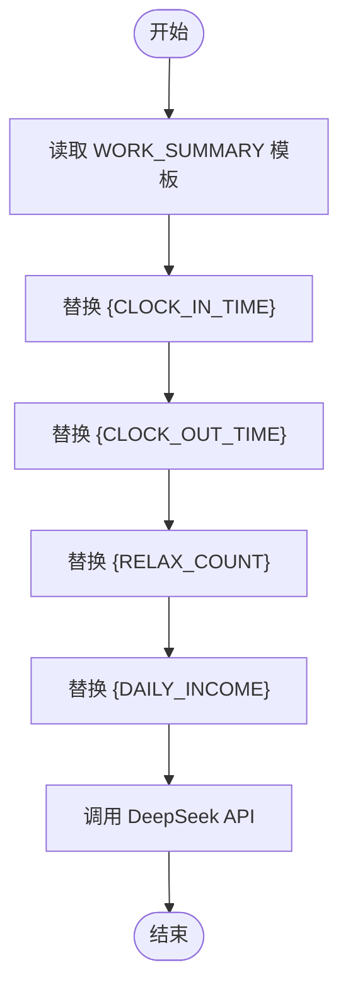

# 提示词模板管理

<cite>
**本文引用的文件**
- [prompts.js](file://prompts.js)
- [ai-module.js](file://ai-module.js)
- [script.js](file://script.js)
- [rmrb/script.js](file://rmrb/script.js)
</cite>

## 目录
1. [简介](#简介)
2. [项目结构](#项目结构)
3. [核心组件](#核心组件)
4. [架构总览](#架构总览)
5. [详细组件分析](#详细组件分析)
6. [依赖关系分析](#依赖关系分析)
7. [性能考量](#性能考量)
8. [故障排查指南](#故障排查指南)
9. [结论](#结论)
10. [附录](#附录)

## 简介
本文件围绕 prompts.js 中的 AI_PROMPTS 对象展开，系统性解析其设计与管理机制，覆盖以下要点：
- 如何通过常量定义统一维护所有 AI 提示词模板（如 MOYU_FORTUNE、WORK_SUMMARY、NEWS_ANALYSIS 等）
- 模板结构设计、占位符（如 {CONTENT}、{CLOCK_IN_TIME} 等）的替换逻辑及运行时注入方式
- 模板对输出格式（JSON/Markdown）、语气风格（幽默/专业）、长度限制等规范的约束
- 结合 callAIAnalysis 函数说明如何按 promptType 动态获取模板并填充用户数据
- 强调模板可扩展性，指导开发者如何新增提示词类型以支持未来功能扩展

## 项目结构
本仓库与提示词模板相关的文件分布如下：
- prompts.js：集中定义 AI_PROMPTS 常量、兜底文案 FALLBACK_MESSAGES 以及兜底消息随机选择器
- ai-module.js：封装 DeepSeek API 调用、问候语、摸鱼吉日签、工作总结、通用 AI 分析等函数
- script.js：主应用脚本，负责打卡流程、展示摸鱼吉日签与工作总结等
- rmrb/script.js：读报模块脚本，演示如何使用 callAIAnalysis 调用 NEWS_ANALYSIS 模板

图表来源
- [prompts.js](file://prompts.js#L1-L159)
- [ai-module.js](file://ai-module.js#L1-L216)
- [script.js](file://script.js#L494-L732)
- [rmrb/script.js](file://rmrb/script.js#L395-L441)

章节来源
- [prompts.js](file://prompts.js#L1-L159)
- [ai-module.js](file://ai-module.js#L1-L216)
- [script.js](file://script.js#L494-L732)
- [rmrb/script.js](file://rmrb/script.js#L395-L441)

## 核心组件
- AI_PROMPTS：统一管理所有提示词模板，采用常量形式集中存放，便于维护与复用
- FALLBACK_MESSAGES：针对不同 promptType 的兜底文案集合，保障网络异常或解析失败时的可用性
- getRandomFallbackMessage：按类型随机返回兜底文案，提升用户体验一致性
- AIModule：对外暴露的 AI 能力封装，包括 DeepSeek API 调用、问候语、摸鱼吉日签、工作总结、通用 AI 分析等

章节来源
- [prompts.js](file://prompts.js#L1-L159)
- [ai-module.js](file://ai-module.js#L1-L216)

## 架构总览
下图展示了从应用层到提示词模板再到 AI 接口的调用链路：

图表来源
- [ai-module.js](file://ai-module.js#L174-L203)
- [prompts.js](file://prompts.js#L1-L120)

章节来源
- [ai-module.js](file://ai-module.js#L174-L203)
- [prompts.js](file://prompts.js#L1-L120)

## 详细组件分析

### AI_PROMPTS 对象与模板设计
- 设计原则
  - 统一管理：将所有提示词模板集中在一个常量对象中，避免散落各处
  - 明确约束：模板内明确写出输出格式、语气风格、长度限制等规范，降低模型输出不确定性
  - 占位符约定：使用大括号占位符（如 {CONTENT}、{CLOCK_IN_TIME}），便于运行时注入
- 模板类型与用途
  - MOYU_FORTUNE：上班打卡后的“摸鱼吉日签”，要求返回 JSON 结构，包含运势、最佳摸鱼时间、摸鱼锦囊
  - WORK_SUMMARY：下班打卡后的“幽默工作总结”，要求包含上班/下班时间、摸鱼次数、当日收入等关键数据
  - NEWS_ANALYSIS：对人民日报要闻进行“经济导向与政策影响”分析，要求返回 Markdown 结构化内容
- 占位符替换策略
  - NEWS_ANALYSIS：使用 {CONTENT} 注入完整新闻内容
  - WORK_SUMMARY：使用 {CLOCK_IN_TIME}、{CLOCK_OUT_TIME}、{RELAX_COUNT}、{DAILY_INCOME} 注入工作数据
  - MOYU_FORTUNE：模板本身为纯文本，返回 JSON，由调用方解析

章节来源
- [prompts.js](file://prompts.js#L1-L120)

### 兜底文案与随机选择
- FALLBACK_MESSAGES：为每种模板提供兜底文案
  - MOYU_FORTUNE：返回 JSON 结构的兜底数据
  - WORK_SUMMARY：返回一段固定文案
  - NEWS_ANALYSIS：返回一组随机提示语
- getRandomFallbackMessage：按类型返回兜底文案，若无匹配则返回默认值，保证稳定性

章节来源
- [prompts.js](file://prompts.js#L122-L159)

### callAIAnalysis 动态模板获取与注入
- 动态获取：通过 window.AI_PROMPTS[promptType] 获取对应模板
- 占位符注入：对 NEWS_ANALYSIS 使用 {CONTENT} 注入内容；对 WORK_SUMMARY 使用多个占位符注入工作数据
- 错误处理：捕获异常后返回兜底文案，同时保留 error 信息以便调试

图表来源
- [ai-module.js](file://ai-module.js#L174-L203)
- [prompts.js](file://prompts.js#L1-L120)

章节来源
- [ai-module.js](file://ai-module.js#L174-L203)

### WORK_SUMMARY 模板的占位符替换逻辑
- 数据来源：调用方传入工作数据（上班时间、下班时间、摸鱼次数、当日收入）
- 替换策略：逐个替换占位符，同时使用正则确保所有同名占位符被替换
- 输出要求：模板要求直接输出总结语句，不返回 JSON

图表来源
- [ai-module.js](file://ai-module.js#L133-L166)
- [prompts.js](file://prompts.js#L27-L48)

章节来源
- [ai-module.js](file://ai-module.js#L133-L166)
- [prompts.js](file://prompts.js#L27-L48)

### MOYU_FORTUNE 模板的 JSON 解析与兜底
- 输出格式：模板要求返回 JSON，包含 fortune、bestTime、tips 字段
- 解析策略：从 API 返回中提取第一个 JSON 片段并解析
- 兜底策略：解析失败或 API 异常时返回 FALLBACK_MESSAGES.MOYU_FORTUNE

图表来源
- [ai-module.js](file://ai-module.js#L98-L126)
- [prompts.js](file://prompts.js#L1-L26)

章节来源
- [ai-module.js](file://ai-module.js#L98-L126)
- [prompts.js](file://prompts.js#L1-L26)

### NEWS_ANALYSIS 模板与 Markdown 输出
- 输出格式：要求返回 Markdown 结构化内容，包含整体政策导向、重点文章解读、投资与决策建议、总结与展望等板块
- 调用方式：在 rmrb/script.js 中通过 callAIAnalysis('NEWS_ANALYSIS', newsContent) 调用
- 展示方式：前端将 Markdown 转换为 HTML 并展示

图表来源
- [rmrb/script.js](file://rmrb/script.js#L395-L441)
- [ai-module.js](file://ai-module.js#L174-L203)
- [prompts.js](file://prompts.js#L49-L120)

章节来源
- [rmrb/script.js](file://rmrb/script.js#L395-L441)
- [ai-module.js](file://ai-module.js#L174-L203)
- [prompts.js](file://prompts.js#L49-L120)

### 主应用中的模板使用（打卡流程）
- 上班打卡：生成问候语后，调用 getMoyuFortune 获取摸鱼吉日签，并将结果持久化到本地存储
- 下班打卡：生成问候语后，调用 displayWorkSummary 展示工作总结

章节来源
- [script.js](file://script.js#L547-L732)
- [ai-module.js](file://ai-module.js#L98-L126)

## 依赖关系分析
- 模块耦合
  - ai-module.js 依赖 prompts.js 中的 AI_PROMPTS 常量与兜底文案
  - rmrb/script.js 依赖 ai-module.js 的 callAIAnalysis 方法
  - script.js 在主应用中调用 AIModule 的多项能力
- 外部依赖
  - DeepSeek API：通过 fetch 调用，需配置 API Key
- 循环依赖
  - 无循环依赖，各模块职责清晰

图表来源
- [prompts.js](file://prompts.js#L1-L159)
- [ai-module.js](file://ai-module.js#L1-L216)
- [script.js](file://script.js#L494-L732)
- [rmrb/script.js](file://rmrb/script.js#L395-L441)

章节来源
- [prompts.js](file://prompts.js#L1-L159)
- [ai-module.js](file://ai-module.js#L1-L216)
- [script.js](file://script.js#L494-L732)
- [rmrb/script.js](file://rmrb/script.js#L395-L441)

## 性能考量
- 模板大小与复杂度：模板应尽量简洁明确，避免过长导致 token 消耗增加
- 占位符替换：批量替换时注意避免重复替换带来的性能损耗，可采用一次性构建最终 prompt 的策略
- API 调用参数：合理设置 temperature、max_tokens 等参数，平衡创意与稳定性
- 兜底策略：兜底文案无需调用 API，可显著降低延迟与失败风险

## 故障排查指南
- 无效的 promptType
  - 现象：抛出“无效的 Prompt 类型”错误
  - 排查：确认传入的 promptType 是否存在于 AI_PROMPTS
- API 密钥缺失
  - 现象：抛出“未配置 API 密钥”错误
  - 排查：在应用设置中正确保存 DeepSeek API Key
- JSON 解析失败（MOYU_FORTUNE）
  - 现象：返回兜底数据并记录错误
  - 排查：检查模板输出是否严格遵循 JSON 规范
- 占位符未替换
  - 现象：模板中出现未替换的占位符
  - 排查：确认调用方是否正确传入工作数据或内容，并检查正则替换逻辑

章节来源
- [ai-module.js](file://ai-module.js#L174-L203)
- [ai-module.js](file://ai-module.js#L98-L126)

## 结论
AI_PROMPTS 通过集中化的常量定义实现了提示词模板的统一管理，配合严格的输出规范与占位符替换机制，有效提升了系统的可维护性与稳定性。callAIAnalysis 等函数以最小耦合的方式按需获取模板并注入数据，既满足现有功能需求，又为未来扩展预留了空间。

## 附录

### 模板规范与占位符一览
- 输出格式
  - MOYU_FORTUNE：要求返回 JSON，字段包含 fortune、bestTime、tips
  - WORK_SUMMARY：直接输出总结语句，不返回 JSON
  - NEWS_ANALYSIS：返回 Markdown 结构化内容
- 语气风格
  - MOYU_FORTUNE：幽默诙谐、积极向上
  - WORK_SUMMARY：风趣幽默、积极正能量
  - NEWS_ANALYSIS：专业、客观、结构化
- 长度限制
  - WORK_SUMMARY：控制在 80-120 字
- 占位符
  - NEWS_ANALYSIS：{CONTENT}
  - WORK_SUMMARY：{CLOCK_IN_TIME}、{CLOCK_OUT_TIME}、{RELAX_COUNT}、{DAILY_INCOME}
  - MOYU_FORTUNE：模板内无占位符，返回 JSON

章节来源
- [prompts.js](file://prompts.js#L1-L120)

### 新增提示词类型的步骤指引
- 在 prompts.js 中新增模板键值对，定义模板字符串与输出规范
- 若需要兜底文案，在 FALLBACK_MESSAGES 中补充对应类型的数据
- 在 ai-module.js 中新增或复用调用函数，按需实现占位符替换与错误兜底
- 在调用方（如 script.js 或 rmrb/script.js）中通过 callAIAnalysis 或自定义函数调用新模板
- 如需随机兜底文案，可在 prompts.js 中完善 getRandomFallbackMessage 的分支逻辑

章节来源
- [prompts.js](file://prompts.js#L1-L159)
- [ai-module.js](file://ai-module.js#L1-L216)