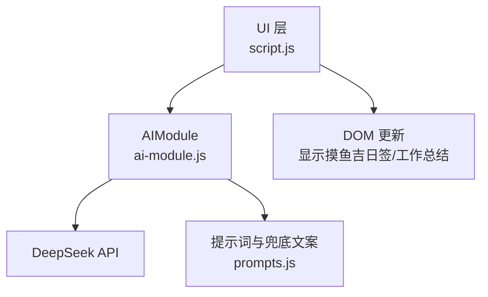
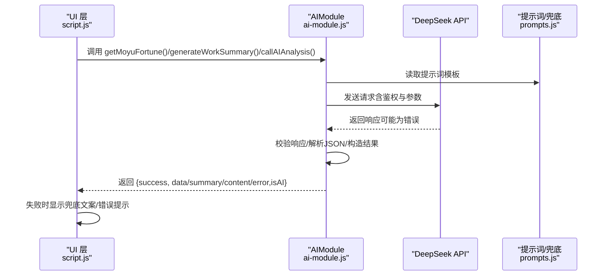
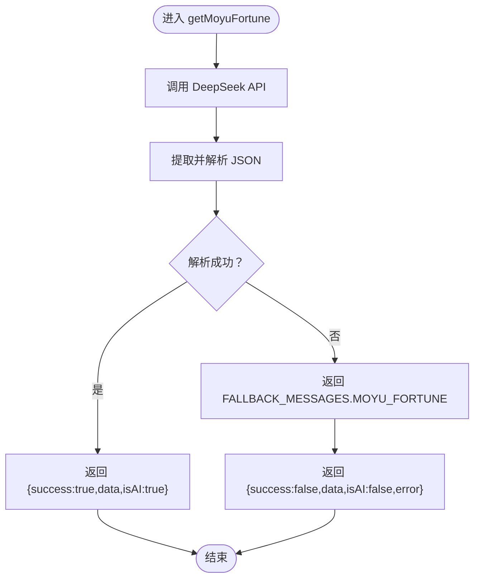
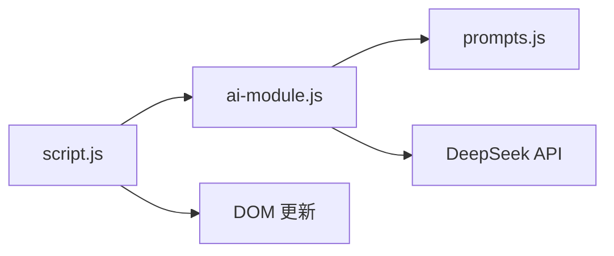

# 错误处理与兜底机制

<cite>
**本文引用的文件**
- [ai-module.js](file://ai-module.js)
- [prompts.js](file://prompts.js)
- [script.js](file://script.js)
</cite>

## 目录
1. [引言](#引言)
2. [项目结构](#项目结构)
3. [核心组件](#核心组件)
4. [架构总览](#架构总览)
5. [详细组件分析](#详细组件分析)
6. [依赖分析](#依赖分析)
7. [性能考量](#性能考量)
8. [故障排查指南](#故障排查指南)
9. [结论](#结论)

## 引言
本文件系统性梳理 AI 模块中的错误处理策略与兜底文案机制，重点覆盖以下函数：
- callDeepSeekAPI：网络请求与 API 错误捕获
- getMoyuFortune：JSON 匹配失败的特殊兜底
- generateWorkSummary：通用失败兜底
- callAIAnalysis：按类型选择兜底文案

同时解析 prompts.js 中 FALLBACK_MESSAGES 的定义与映射关系，以及 getRandomFallbackMessage 如何根据错误类型返回合适备用文案。最后结合 getMoyuFortune 中“JSON 匹配失败”的特殊情况，总结多层防御性编程实践，并提出增强系统鲁棒性的建议（如缓存兜底文案、监控失败率等）。

## 项目结构
AI 相关能力集中在两个文件中：
- ai-module.js：封装 DeepSeek API 调用与多个 AI 功能（摸鱼吉日签、工作总结、通用分析），统一返回 { success, data/summary/content/error, isAI } 结构
- prompts.js：集中管理提示词模板与兜底文案，导出全局常量与随机兜底函数
- script.js：UI 层调用 AIModule 并消费返回结果，负责错误信息展示与回退 UI 呈现

图表来源
- [ai-module.js](file://ai-module.js#L1-L216)
- [prompts.js](file://prompts.js#L1-L159)
- [script.js](file://script.js#L547-L728)

章节来源
- [ai-module.js](file://ai-module.js#L1-L216)
- [prompts.js](file://prompts.js#L1-L159)
- [script.js](file://script.js#L547-L728)

## 核心组件
- callDeepSeekAPI：负责网络请求、鉴权、响应校验与错误上抛；失败时记录日志并抛出异常
- getMoyuFortune：调用 AI 生成 JSON 文案，若 JSON 解析失败则降级为兜底文案
- generateWorkSummary：调用 AI 生成文本总结，失败时返回兜底文案
- callAIAnalysis：按类型选择兜底文案，支持多类型随机兜底
- FALLBACK_MESSAGES：集中定义各类型的兜底文案
- getRandomFallbackMessage：按类型返回兜底文案（数组类型随机选取）

章节来源
- [ai-module.js](file://ai-module.js#L14-L59)
- [ai-module.js](file://ai-module.js#L99-L127)
- [ai-module.js](file://ai-module.js#L134-L167)
- [ai-module.js](file://ai-module.js#L169-L204)
- [prompts.js](file://prompts.js#L122-L158)

## 架构总览
AI 调用链路与错误处理流程如下：

图表来源
- [ai-module.js](file://ai-module.js#L99-L167)
- [prompts.js](file://prompts.js#L1-L159)
- [script.js](file://script.js#L648-L723)

## 详细组件分析

### callDeepSeekAPI：网络异常与 API 错误捕获
- 关键行为
  - 读取本地 API 密钥，缺失时抛出错误
  - 使用 fetch 发起 POST 请求，携带 Authorization 与 JSON Body
  - 若 response.ok 为 false，尝试解析错误体并抛出带消息的错误
  - 成功时解析 JSON 并返回 choices[0].message.content.trim()
  - 捕获异常并记录日志，随后抛出原错误
- 错误类型
  - 无密钥：显式抛错
  - 网络异常/HTTP 错误：通过 response.ok 与 JSON 解析兜底
  - JSON 解析失败：由上层调用处理（例如 getMoyuFortune 的 JSON 匹配失败）
- 返回约定
  - 成功：字符串内容
  - 失败：抛出错误（由上层捕获并转换为 { success: false, error }）

章节来源
- [ai-module.js](file://ai-module.js#L14-L59)

### getMoyuFortune：JSON 匹配失败的特殊兜底
- 关键行为
  - 读取提示词模板并调用 callDeepSeekAPI
  - 使用正则提取响应中最内层 JSON 片段并尝试解析
  - 若解析成功：返回 { success: true, data: parsed, isAI: true }
  - 若解析失败：记录日志并返回 { success: false, data: FALLBACK_MESSAGES.MOYU_FORTUNE, isAI: false, error }
- 多层防御性编程
  - 第一层：callDeepSeekAPI 对网络与 API 错误进行捕获与上抛
  - 第二层：getMoyuFortune 对 JSON 匹配失败进行兜底
  - 第三层：UI 层检测 isAI 与 error 字段，决定是否显示错误提示
- 上层反馈结构
  - 成功：{ success: true, data, isAI: true }
  - 失败：{ success: false, data, isAI: false, error }

图表来源
- [ai-module.js](file://ai-module.js#L99-L127)
- [prompts.js](file://prompts.js#L122-L139)

章节来源
- [ai-module.js](file://ai-module.js#L99-L127)
- [prompts.js](file://prompts.js#L122-L139)

### generateWorkSummary：通用失败兜底
- 关键行为
  - 读取提示词模板并注入工作数据
  - 调用 callDeepSeekAPI 生成总结文本
  - 成功：返回 { success: true, summary, isAI: true }
  - 失败：记录日志并返回 { success: false, summary: FALLBACK_MESSAGES.WORK_SUMMARY, isAI: false, error }
- 上层反馈结构
  - 成功：{ success: true, summary, isAI: true }
  - 失败：{ success: false, summary, isAI: false, error }

章节来源
- [ai-module.js](file://ai-module.js#L134-L167)
- [prompts.js](file://prompts.js#L122-L139)

### callAIAnalysis：按类型选择兜底文案
- 关键行为
  - 校验提示词模板是否存在
  - 插入内容并调用 callDeepSeekAPI
  - 成功：返回 { success: true, content, isAI: true }
  - 失败：记录日志并返回 { success: false, content: getRandomFallbackMessage(type), isAI: false, error }
- 兜底文案选择
  - MOYU_FORTUNE：返回固定 JSON 结构兜底
  - WORK_SUMMARY：返回固定文本兜底
  - 其他类型：从 FALLBACK_MESSAGES[type] 数组中随机选取

章节来源
- [ai-module.js](file://ai-module.js#L169-L204)
- [prompts.js](file://prompts.js#L141-L158)

### FALLBACK_MESSAGES 与 getRandomFallbackMessage
- FALLBACK_MESSAGES 定义
  - MOYU_FORTUNE：JSON 结构兜底（fortune、bestTime、tips）
  - WORK_SUMMARY：固定文本兜底
  - NEWS_ANALYSIS：数组型兜底文案，支持随机选择
- getRandomFallbackMessage
  - MOYU_FORTUNE：返回固定 JSON 结构
  - WORK_SUMMARY：返回固定文本
  - 其他类型：从数组中随机返回一条，否则返回默认文案

章节来源
- [prompts.js](file://prompts.js#L122-L158)

### UI 层消费与错误展示
- getMoyuFortune
  - 若 isAI 为 false 且存在 error：在问候弹窗中显示错误提示
  - 无论成功与否，均调用 displayMoyuFortune 渲染 UI
- displayWorkSummary
  - 调用 AIModule.generateWorkSummary 获取结果
  - 若找不到 summary-content 容器，记录错误日志
  - 渲染总结卡片，优先使用 summaryResult.summary

章节来源
- [script.js](file://script.js#L648-L723)
- [script.js](file://script.js#L3079-L3150)

## 依赖分析
- AIModule 对外暴露函数
  - callDeepSeekAPI：底层网络调用
  - getAIGreeting：无需 AI 的问候语
  - getMoyuFortune：摸鱼吉日签
  - generateWorkSummary：工作总结
  - callAIAnalysis：通用分析
- 依赖关系
  - AIModule 依赖 prompts.js 中的 AI_PROMPTS 与 FALLBACK_MESSAGES
  - UI 层通过 window.AIModule 调用 AIModule
  - UI 层依赖 DOM 元素进行错误提示与内容渲染

图表来源
- [ai-module.js](file://ai-module.js#L1-L216)
- [prompts.js](file://prompts.js#L1-L159)
- [script.js](file://script.js#L547-L728)

章节来源
- [ai-module.js](file://ai-module.js#L1-L216)
- [prompts.js](file://prompts.js#L1-L159)
- [script.js](file://script.js#L547-L728)

## 性能考量
- API 调用成本
  - 每次 AI 生成都会产生网络往返与模型推理成本，建议在 UI 层进行必要的节流与缓存
- JSON 解析与正则匹配
  - getMoyuFortune 使用正则提取最内层 JSON，复杂度与响应长度线性相关；建议限制 maxTokens 与模板输出长度
- UI 渲染
  - 大量 DOM 操作可能引发重排重绘，建议批量更新与最小化渲染范围

[本节为通用建议，不直接分析具体文件]

## 故障排查指南
- 常见错误与定位
  - 未配置 API 密钥：callDeepSeekAPI 抛错；UI 测试按钮会显示错误信息
  - 网络异常/HTTP 错误：callDeepSeekAPI 捕获并抛出；上层转为 { success: false, error }
  - JSON 解析失败：getMoyuFortune 降级为兜底 JSON；UI 层显示错误提示
  - DOM 元素缺失：displayWorkSummary 记录错误日志；检查容器是否存在
- 日志与反馈
  - 所有失败路径均记录 console.error，便于定位问题
  - UI 层根据 success 与 error 字段决定是否展示错误提示

章节来源
- [ai-module.js](file://ai-module.js#L14-L59)
- [ai-module.js](file://ai-module.js#L99-L127)
- [ai-module.js](file://ai-module.js#L134-L167)
- [script.js](file://script.js#L601-L612)
- [script.js](file://script.js#L712-L723)
- [script.js](file://script.js#L3117-L3119)

## 结论
本系统采用“分层兜底”策略：
- 底层：callDeepSeekAPI 统一处理网络与 API 错误，失败时抛出可识别的错误
- 中层：各业务函数针对特定失败场景（如 JSON 解析失败）进行降级
- 上层：UI 层统一消费 { success, data/summary/content/error, isAI } 结构，保证用户体验稳定

为进一步提升鲁棒性，建议：
- 缓存兜底文案：将 FALLBACK_MESSAGES 缓存至内存或本地存储，减少重复计算与跨模块访问
- 失败率监控：在 AIModule 中增加失败计数与上报，辅助定位热点问题
- 重试与退避：对瞬时网络波动增加有限重试与指数退避，避免雪崩
- 响应超时与取消：为 fetch 增加超时与 AbortController，防止长时间阻塞 UI
- 更细粒度的日志：区分网络错误、API 错误、解析错误与业务错误，便于快速定位

[本节为总结性建议，不直接分析具体文件]