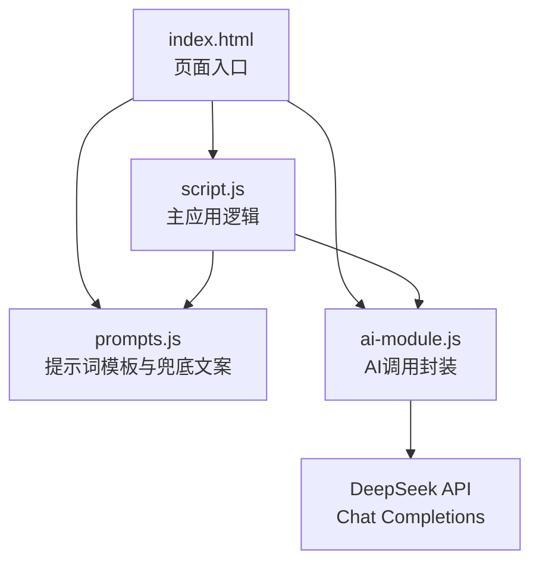
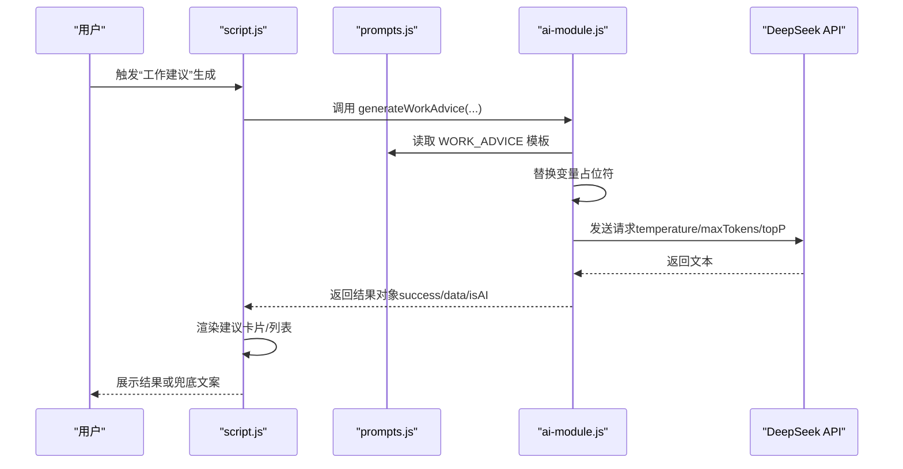
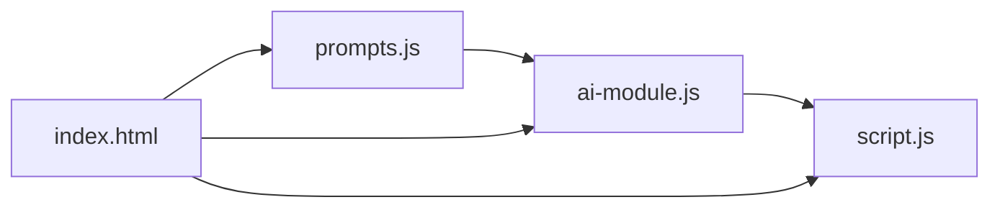

# AI功能扩展实践

<cite>
**本文引用的文件**
- [prompts.js](file://prompts.js)
- [ai-module.js](file://ai-module.js)
- [script.js](file://script.js)
- [index.html](file://index.html)
- [README.md](file://README.md)
</cite>

## 目录
1. [简介](#简介)
2. [项目结构](#项目结构)
3. [核心组件](#核心组件)
4. [架构总览](#架构总览)
5. [详细组件分析](#详细组件分析)
6. [依赖关系分析](#依赖关系分析)
7. [性能考量](#性能考量)
8. [故障排查指南](#故障排查指南)
9. [结论](#结论)
10. [附录](#附录)

## 简介
本指南面向希望在 work-timer 项目中扩展 AI 功能的开发者，围绕 prompts.js 中的提示词模板与 ai-module.js 中的调用封装，系统讲解如何新增 Prompt 类型、在代码中调用新功能、处理 API 响应与错误、配置兜底文案，并最终在主应用中与 UI 和状态管理协同工作。本文以“工作建议”为例，提供从模板定义到前端集成的完整实践路径。

## 项目结构
work-timer 的 AI 相关能力由三部分组成：
- prompts.js：集中管理所有 AI 提示词模板与兜底文案
- ai-module.js：封装 DeepSeek API 调用、错误处理与结果解析
- script.js：主应用入口，负责触发 AI 功能、渲染结果、与 UI 协同

图表来源
- [index.html](file://index.html#L1-L20)
- [script.js](file://script.js#L95-L120)
- [prompts.js](file://prompts.js#L1-L20)
- [ai-module.js](file://ai-module.js#L1-L20)

章节来源
- [index.html](file://index.html#L1-L20)
- [README.md](file://README.md#L32-L49)

## 核心组件
- 提示词模板与兜底文案：统一在 prompts.js 中维护，支持变量占位符替换与随机兜底文案选择。
- AI 调用封装：在 ai-module.js 中封装 DeepSeek API 调用、参数配置与错误处理，提供通用的 callDeepSeekAPI 与基于模板的 callAIAnalysis。
- 主应用集成：在 script.js 中触发 AI 功能，组装数据，调用 AIModule 的方法，渲染 UI 并处理异常。

章节来源
- [prompts.js](file://prompts.js#L1-L159)
- [ai-module.js](file://ai-module.js#L1-L216)
- [script.js](file://script.js#L493-L732)

## 架构总览
下图展示了从用户交互到 AI 生成再到 UI 渲染的关键流程。

图表来源
- [script.js](file://script.js#L3079-L3151)
- [prompts.js](file://prompts.js#L1-L159)
- [ai-module.js](file://ai-module.js#L1-L216)

## 详细组件分析

### 在 prompts.js 中新增 Prompt 模板与兜底文案
- 命名规范
  - 使用全大写常量键名，采用下划线分隔，例如 WORK_ADVICE，与现有模板风格一致。
- 变量占位符
  - 使用花括号包裹的占位符，如 {CONTENT}、{CLOCK_IN_TIME} 等，确保在调用时能被正确替换。
- JSON 格式要求
  - 若模板期望返回结构化 JSON，应在模板中明确要求并限定字段，以便调用方进行解析。
- 兜底文案配置
  - 在 FALLBACK_MESSAGES 中为新增类型提供兜底文案；若为对象型兜底，需与模板字段一一对应；若为字符串或数组，调用方需自行处理。

章节来源
- [prompts.js](file://prompts.js#L1-L159)

### 在 ai-module.js 中调用新 Prompt 类型
- 通用调用接口
  - callAIAnalysis(promptType, content)：适用于需要将外部内容注入模板的场景，内部会读取模板并替换 {CONTENT}。
- 专用生成函数
  - 可参考 generateWorkSummary 的实现，创建 generateWorkAdvice，负责组装数据、调用 callDeepSeekAPI、解析结果并返回统一结构的对象。
- 参数配置
  - temperature、maxTokens、topP：根据生成内容的复杂度与稳定性需求调整。对于创意类建议，可适当提高 temperature；对于结构化输出，可降低 temperature 并增加 maxTokens。

章节来源
- [ai-module.js](file://ai-module.js#L170-L204)
- [ai-module.js](file://ai-module.js#L134-L167)

### 在主应用中集成新 AI 功能
- 触发时机
  - 在 script.js 中为“工作建议”功能绑定 UI 事件，例如点击按钮或打开特定页面时触发。
- 数据组装
  - 从本地存储、时间轴或用户输入中收集必要数据，构造传入 AIModule 的参数对象。
- 结果渲染
  - 参考 displayWorkSummary 的实现，创建 displayWorkAdvice 或在现有容器中渲染建议卡片，支持富文本或列表形式。
- 错误与兜底
  - 若 isAI 为 false 或 error 存在，优先使用兜底文案，保证用户体验稳定。

章节来源
- [script.js](file://script.js#L3079-L3151)
- [script.js](file://script.js#L616-L728)

### 错误处理机制与优化策略
- 网络异常
  - fetch 请求失败或响应非 OK 时，抛出错误并返回兜底文案；调用方应捕获错误并在 UI 中提示。
- API 限流
  - 在 ai-module.js 中对响应状态码进行判断，必要时在调用方进行退避重试或提示用户稍后再试。
- 响应格式错误
  - 对于期望 JSON 的模板，解析失败时回退到兜底文案；对于纯文本模板，直接使用返回内容。
- 参数优化
  - temperature：创意类建议可设为较高值；结构化输出可设为较低值。
  - maxTokens：根据模板长度与预期输出长度合理设置，避免截断。
  - topP：维持在较高水平以提升多样性，同时结合 temperature 控制稳定性。

章节来源
- [ai-module.js](file://ai-module.js#L14-L59)
- [ai-module.js](file://ai-module.js#L170-L204)

### “工作建议”功能实践步骤
- 在 prompts.js 中新增 WORK_ADVICE 模板，明确要求返回 JSON 字段（如建议标题、要点列表），并在 FALLBACK_MESSAGES 中提供兜底对象。
- 在 ai-module.js 中创建 generateWorkAdvice 函数，参考 generateWorkSummary 的实现，组装数据并调用 callDeepSeekAPI，解析 JSON 并返回统一结构。
- 在 script.js 中绑定 UI 事件，调用 generateWorkAdvice，渲染建议卡片，并处理错误与兜底。
- 在 index.html 中预留容器或按钮，确保 UI 与状态管理（如本地存储）协同工作。

章节来源
- [prompts.js](file://prompts.js#L1-L159)
- [ai-module.js](file://ai-module.js#L134-L167)
- [script.js](file://script.js#L3079-L3151)
- [index.html](file://index.html#L123-L163)

## 依赖关系分析
- prompts.js 与 ai-module.js
  - ai-module.js 通过 window.AI_PROMPTS 读取模板，通过 window.FALLBACK_MESSAGES 与 window.getRandomFallbackMessage 获取兜底文案。
- ai-module.js 与 script.js
  - script.js 通过 window.AIModule 调用封装好的 AI 方法，负责数据组装与 UI 渲染。
- index.html
  - 作为页面入口，加载脚本并提供 UI 容器与交互元素。

图表来源
- [index.html](file://index.html#L1-L20)
- [script.js](file://script.js#L95-L120)
- [prompts.js](file://prompts.js#L1-L20)
- [ai-module.js](file://ai-module.js#L1-L20)

章节来源
- [index.html](file://index.html#L1-L20)
- [script.js](file://script.js#L95-L120)
- [prompts.js](file://prompts.js#L1-L20)
- [ai-module.js](file://ai-module.js#L1-L20)

## 性能考量
- 请求频率控制：避免频繁触发 AI 生成，可在 UI 中增加防抖或节流。
- 文本长度与复杂度：合理设置 maxTokens，避免超长输出导致解析与渲染压力。
- 渲染优化：批量 DOM 更新，减少重排重绘；对富文本内容使用 innerHTML 时注意安全性。
- 缓存与兜底：在 UI 层优先展示兜底文案，提升感知性能。

## 故障排查指南
- API 密钥未配置
  - 现象：调用 callDeepSeekAPI 抛出错误。
  - 处理：在设置页输入并保存密钥，再次尝试。
- 响应非 JSON
  - 现象：解析失败，返回兜底文案。
  - 处理：检查模板是否要求返回 JSON，并在模板中明确格式要求。
- 网络超时或限流
  - 现象：fetch 抛错或响应非 OK。
  - 处理：检查网络状态、API 配额，必要时延迟重试。
- UI 不显示结果
  - 现象：容器为空或报错。
  - 处理：确认容器元素存在、AIModule 返回结构正确、渲染逻辑无误。

章节来源
- [ai-module.js](file://ai-module.js#L14-L59)
- [ai-module.js](file://ai-module.js#L170-L204)
- [script.js](file://script.js#L3079-L3151)

## 结论
通过在 prompts.js 中规范定义模板与兜底文案，在 ai-module.js 中封装统一的调用与解析逻辑，并在 script.js 中完成 UI 集成与错误兜底，work-timer 的 AI 能力可以平滑扩展。新增“工作建议”等功能时，遵循本文的命名、占位符、JSON 要求与兜底策略，即可在不破坏现有架构的前提下快速落地。

## 附录
- 参考现有实现
  - 摸鱼吉日签：模板与解析逻辑
  - 工作总结：数据组装与渲染
- API 参数建议
  - temperature：根据稳定性需求在 0.8–1.4 之间调整
  - maxTokens：根据模板与输出长度设置，避免截断
  - topP：维持在 0.9 左右以平衡多样性与稳定性

章节来源
- [prompts.js](file://prompts.js#L1-L159)
- [ai-module.js](file://ai-module.js#L1-L216)
- [script.js](file://script.js#L3026-L3151)