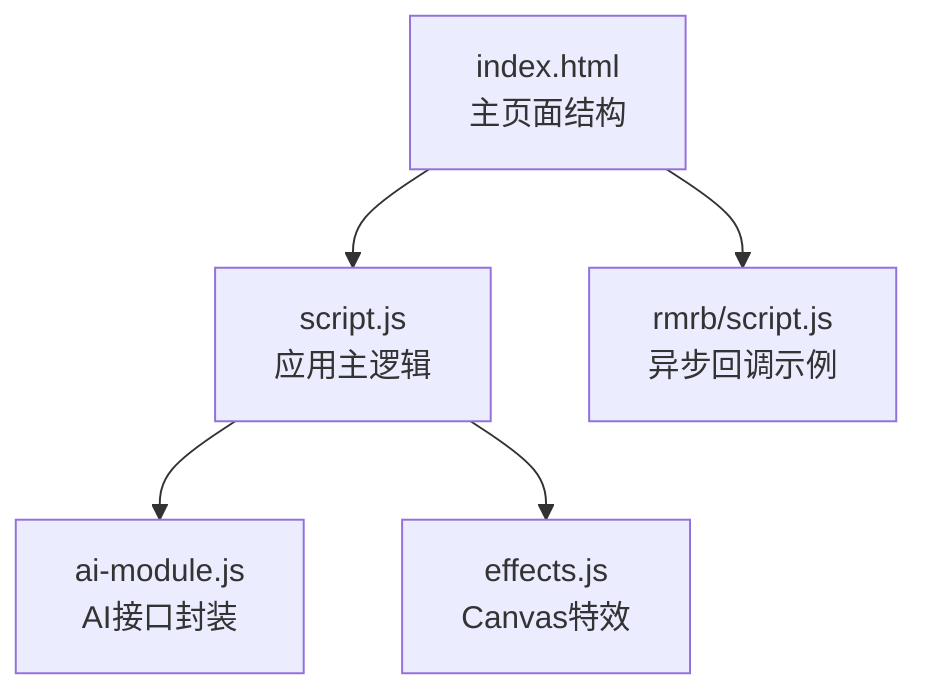
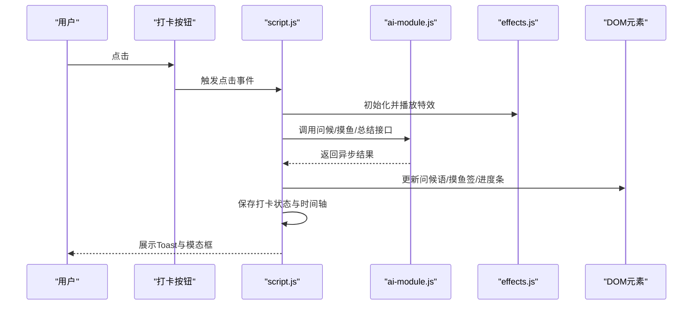
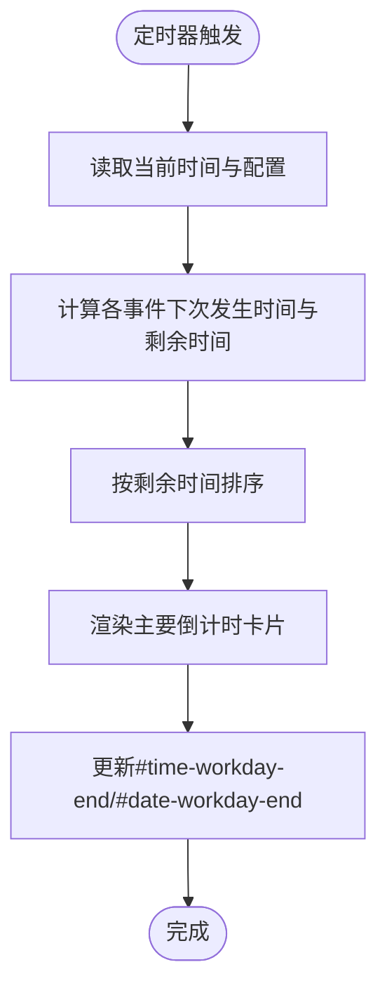
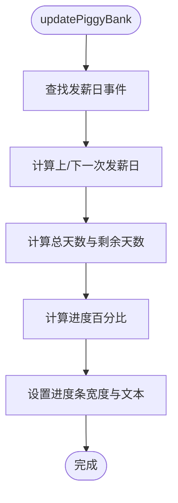
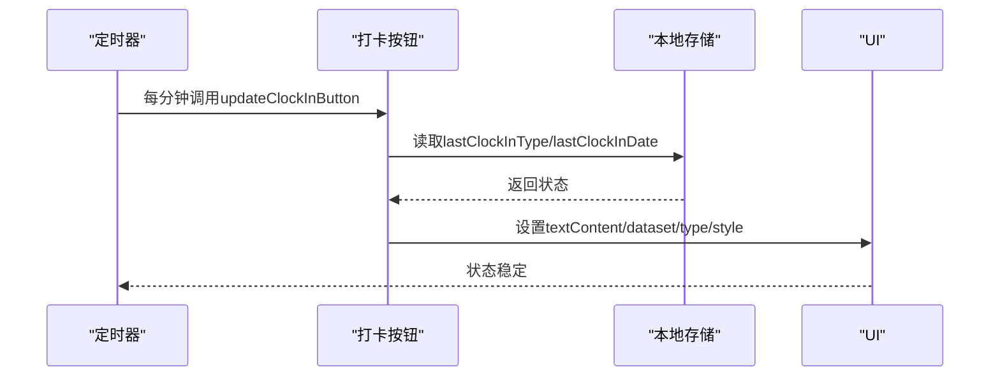
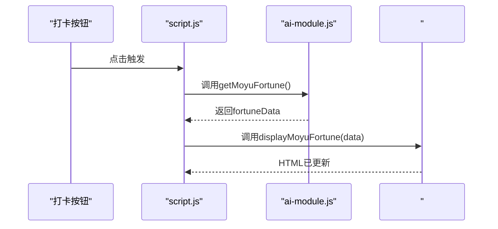
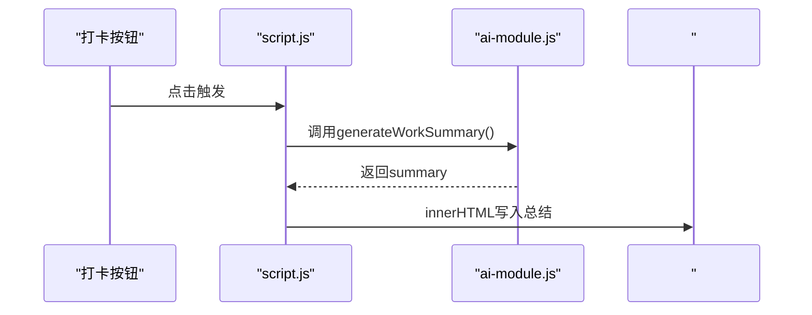
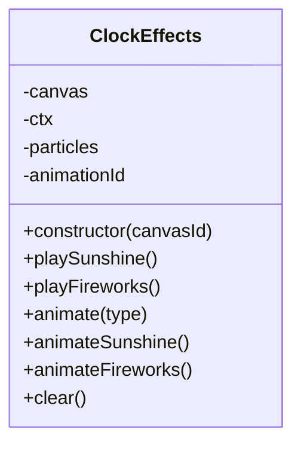
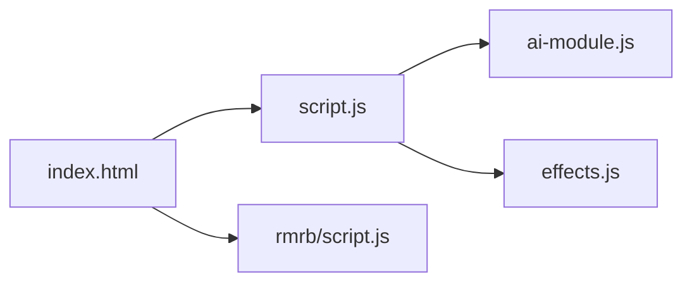

# UI状态管理与更新

<cite>
**本文引用的文件**
- [index.html](file://index.html)
- [script.js](file://script.js)
- [ai-module.js](file://ai-module.js)
- [effects.js](file://effects.js)
- [rmrb/script.js](file://rmrb/script.js)
</cite>

## 目录
1. [引言](#引言)
2. [项目结构](#项目结构)
3. [核心组件](#核心组件)
4. [架构总览](#架构总览)
5. [详细组件分析](#详细组件分析)
6. [依赖关系分析](#依赖关系分析)
7. [性能考量](#性能考量)
8. [故障排查指南](#故障排查指南)
9. [结论](#结论)

## 引言
本文件聚焦于主应用的UI状态管理机制，系统阐述如何通过JavaScript动态更新DOM元素内容，包括倒计时显示（#time-workday-end）、工资进度条（#progress-fill）等。文档覆盖状态更新的触发时机（定时器、用户操作、异步回调），并结合脚本中的updateClockInButton、displayMoyuFortune等函数，展示状态与UI的同步过程。同时强调避免直接操作innerHTML的安全风险，推荐使用textContent和classList等安全API，并提供性能优化建议（如使用requestAnimationFrame进行高频更新，避免不必要的DOM重绘）。

## 项目结构
主应用由一个入口HTML页面与多个脚本模块组成：
- 主页面：index.html，包含倒计时、日历、设置、AI助手、模态框等UI结构
- 主逻辑：script.js，负责应用初始化、事件绑定、定时更新、状态计算与UI同步
- AI模块：ai-module.js，封装DeepSeek API调用与提示词模板
- 特效模块：effects.js，提供打卡时的Canvas粒子动画
- 人民日报模块：rmrb/script.js，演示异步回调驱动的UI更新模式

图表来源
- [index.html](file://index.html#L1-L120)
- [script.js](file://script.js#L90-L160)
- [ai-module.js](file://ai-module.js#L1-L60)
- [effects.js](file://effects.js#L1-L40)
- [rmrb/script.js](file://rmrb/script.js#L1-L40)

章节来源
- [index.html](file://index.html#L1-L120)
- [script.js](file://script.js#L90-L160)

## 核心组件
- UI状态源
  - 本地存储：工作时间、工资、节假日、打卡状态、时间轴等
  - 全局变量：事件集合、工作时间配置、开发者模式、自定义时间
- 更新触发器
  - 定时器：setInterval每秒更新倒计时与当前时间
  - 用户操作：打卡按钮、模态框关闭、日历导航、设置变更
  - 异步回调：AI响应返回（问候语、摸鱼吉日签、工作总结）
- 同步策略
  - 通过DOM API（textContent、style、classList）安全更新UI
  - 避免直接innerHTML注入，降低XSS与DOM破坏风险
  - 使用requestAnimationFrame优化高频动画帧

章节来源
- [script.js](file://script.js#L1-L60)
- [script.js](file://script.js#L1090-L1105)
- [script.js](file://script.js#L1827-L1858)
- [effects.js](file://effects.js#L135-L201)

## 架构总览
主应用采用“状态驱动UI”的模式：
- 状态来自本地存储与全局变量
- 通过定时器与用户交互触发状态计算
- 计算结果映射到DOM节点，完成UI更新
- 异步回调（AI）在Promise链路中更新UI

图表来源
- [script.js](file://script.js#L546-L729)
- [ai-module.js](file://ai-module.js#L61-L127)
- [effects.js](file://effects.js#L25-L62)
- [index.html](file://index.html#L120-L170)

## 详细组件分析

### 倒计时显示（#time-workday-end）
- 触发时机
  - 每秒定时器：setInterval每秒调用updateCountdowns
  - 页面初始化：initApp启动定时器
- 数据来源
  - 事件集合events（含下班时间、周末、发薪日、午饭等）
  - 工作时间配置workTimeConfig
  - 本地存储（节假日、串休上班日）
- 更新流程
  - 计算每个事件的下次发生时间与剩余时间
  - 排序后渲染主要倒计时卡片
  - 更新#time-workday-end、#date-workday-end等节点
- 安全实践
  - 使用textContent设置文本内容
  - 使用style.display控制可见性
  - 使用dataset与title属性传递元数据

图表来源
- [script.js](file://script.js#L1827-L1858)
- [script.js](file://script.js#L1590-L1692)

章节来源
- [script.js](file://script.js#L1090-L1105)
- [script.js](file://script.js#L1827-L1858)
- [script.js](file://script.js#L1590-L1692)

### 工资进度条（#progress-fill）
- 触发时机
  - 每秒定时器：updateCountdowns调用updatePiggyBank
  - 页面初始化：initApp调用updatePiggyBank
- 数据来源
  - 发薪日事件（固定日期或月末）
  - 当前时间与上/下一次发薪日
- 更新流程
  - 计算总天数与剩余天数
  - 计算进度百分比
  - 设置#progress-fill宽度与#progress-text文本

图表来源
- [script.js](file://script.js#L2371-L2399)

章节来源
- [script.js](file://script.js#L2371-L2399)
- [script.js](file://script.js#L1090-L1105)

### 打卡按钮状态（updateClockInButton）
- 触发时机
  - 页面加载后立即更新
  - 每分钟定时器更新
  - 用户点击按钮后即时更新
- 数据来源
  - 本地存储：lastClockInType、lastClockInDate、clockInTime
- 更新流程
  - 根据日期与类型设置按钮文本、dataset.type、禁用状态与透明度
  - 通过textContent与dataset属性驱动UI状态

图表来源
- [script.js](file://script.js#L523-L545)

章节来源
- [script.js](file://script.js#L523-L545)

### 摸鱼吉日签（displayMoyuFortune）
- 触发时机
  - 上班打卡后，AI返回摸鱼吉日签
  - 用户点击“再求一签”
- 数据来源
  - AI返回的fortuneData（运势、最佳时间、锦囊）
- 更新流程
  - 通过displayMoyuFortune重建#moyu-fortune-section的HTML
  - 保存当日运势到本地存储，供header显示

图表来源
- [script.js](file://script.js#L638-L690)
- [script.js](file://script.js#L3026-L3061)
- [ai-module.js](file://ai-module.js#L95-L127)

章节来源
- [script.js](file://script.js#L638-L690)
- [script.js](file://script.js#L3026-L3061)
- [ai-module.js](file://ai-module.js#L95-L127)

### 工作总结（displayWorkSummary）
- 触发时机
  - 下班打卡后，AI生成总结
- 数据来源
  - 本地存储：clockInTime、今日时间轴relaxCount
  - 计算：今日收入（月工资/当月天数）
- 更新流程
  - 调用AIModule.generateWorkSummary
  - 将AI返回的summary写入#summary-content

图表来源
- [script.js](file://script.js#L3080-L3150)
- [ai-module.js](file://ai-module.js#L129-L167)

章节来源
- [script.js](file://script.js#L3080-L3150)
- [ai-module.js](file://ai-module.js#L129-L167)

### Canvas特效（ClockEffects）
- 触发时机
  - 上班打卡：playSunshine
  - 下班打卡：playFireworks
- 更新流程
  - 使用requestAnimationFrame驱动动画循环
  - 清理动画与画布，避免内存泄漏

图表来源
- [effects.js](file://effects.js#L1-L279)

章节来源
- [effects.js](file://effects.js#L1-L279)

### 异步回调驱动的UI更新（rmrb/script.js）
- 示例：fetchTodayNews与renderArticleList
- 触发时机：用户点击“刷新”或选择日期
- 更新流程：异步获取数据后，通过textContent/innerHTML更新列表与模态框

章节来源
- [rmrb/script.js](file://rmrb/script.js#L152-L197)
- [rmrb/script.js](file://rmrb/script.js#L214-L265)
- [rmrb/script.js](file://rmrb/script.js#L319-L356)

## 依赖关系分析
- 主应用对模块的依赖
  - script.js依赖ai-module.js（AI接口）、effects.js（Canvas特效）
  - index.html承载UI结构，script.js在DOMContentLoaded后初始化
- 事件与状态耦合
  - 打卡状态与UI高度耦合，需保证本地存储与DOM一致
  - 定时器与用户交互共同驱动状态更新，避免竞态

图表来源
- [index.html](file://index.html#L1-L120)
- [script.js](file://script.js#L90-L160)
- [ai-module.js](file://ai-module.js#L1-L60)
- [effects.js](file://effects.js#L1-L40)
- [rmrb/script.js](file://rmrb/script.js#L1-L40)

章节来源
- [index.html](file://index.html#L1-L120)
- [script.js](file://script.js#L90-L160)

## 性能考量
- 使用requestAnimationFrame
  - Canvas动画使用requestAnimationFrame替代setTimeout/setInterval，减少掉帧与CPU占用
- 避免频繁重排重绘
  - 合并DOM更新，尽量使用transform/opacity而非改变布局属性
  - 使用classList批量切换CSS类，减少样式计算
- 控制定时器频率
  - 倒计时每秒更新即可，避免更高频率的无意义更新
- 异步批处理
  - 将多个异步回调的结果合并后再统一更新UI，减少多次重绘

章节来源
- [effects.js](file://effects.js#L135-L201)
- [script.js](file://script.js#L1090-L1105)

## 故障排查指南
- 常见问题
  - 打卡按钮状态异常：检查本地存储的lastClockInType/lastClockInDate是否与当前日期匹配
  - 摸鱼吉日签未显示：确认AI返回是否成功，必要时查看兜底逻辑
  - 进度条不更新：确认发薪日事件是否存在，以及当前时间是否在上/下一次发薪日之间
  - Canvas特效不播放：检查Canvas尺寸与requestAnimationFrame是否被清理
- 定位方法
  - 在关键函数处添加日志（如console.log），观察状态流转
  - 使用浏览器开发者工具断点调试，验证DOM更新路径
  - 检查本地存储键值是否正确（如monthlySalary、salaryType、salaryDay）

章节来源
- [script.js](file://script.js#L523-L545)
- [script.js](file://script.js#L3026-L3061)
- [script.js](file://script.js#L2371-L2399)
- [effects.js](file://effects.js#L262-L273)

## 结论
本应用通过“状态驱动UI”的方式，实现了倒计时、工资进度条、打卡状态、摸鱼签与工作总结等多维度的动态更新。定时器、用户操作与异步回调共同构成了状态更新的三大驱动力。在安全方面，优先使用textContent与classList等API，避免直接innerHTML带来的安全风险；在性能方面，采用requestAnimationFrame与合理的更新频率，确保流畅体验。建议在后续迭代中进一步抽象状态更新逻辑，提升可维护性与可测试性。