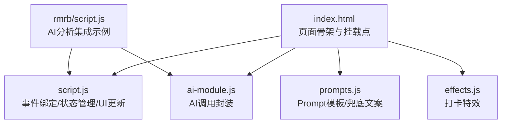
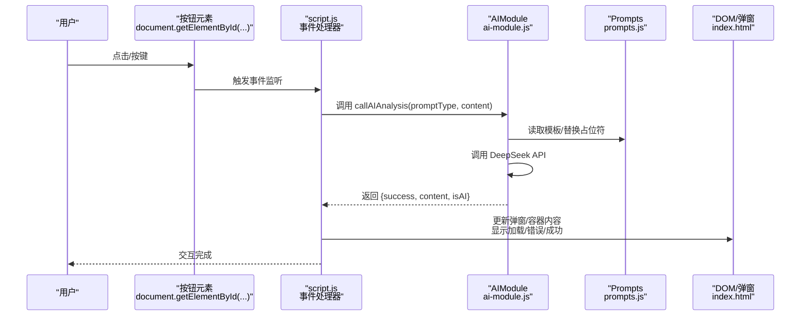
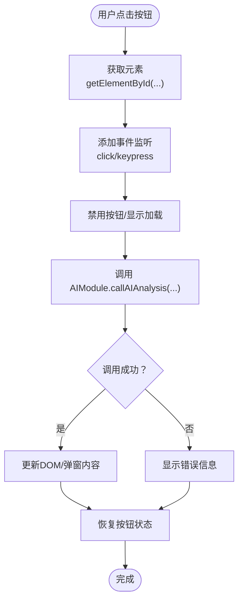
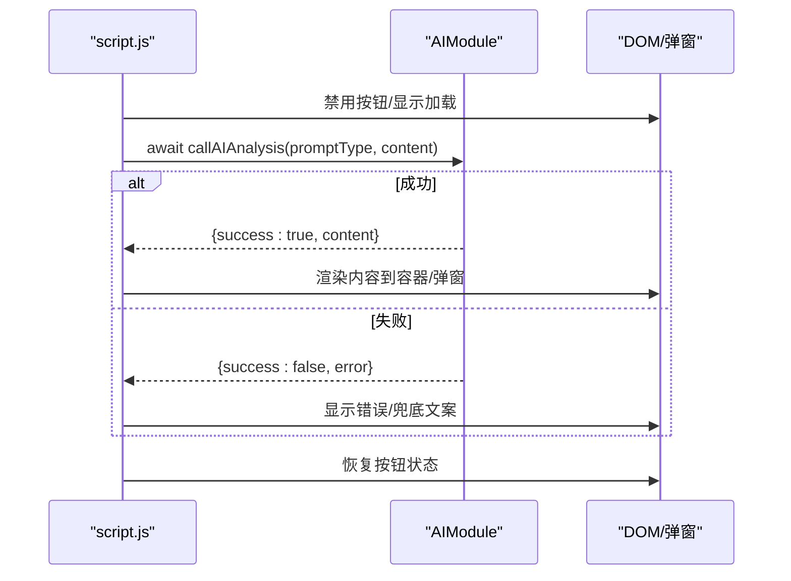
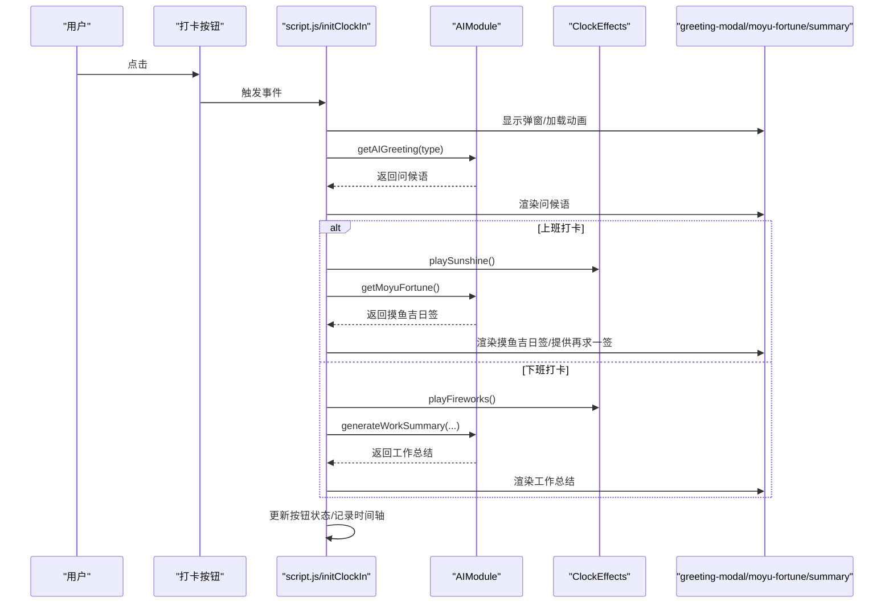
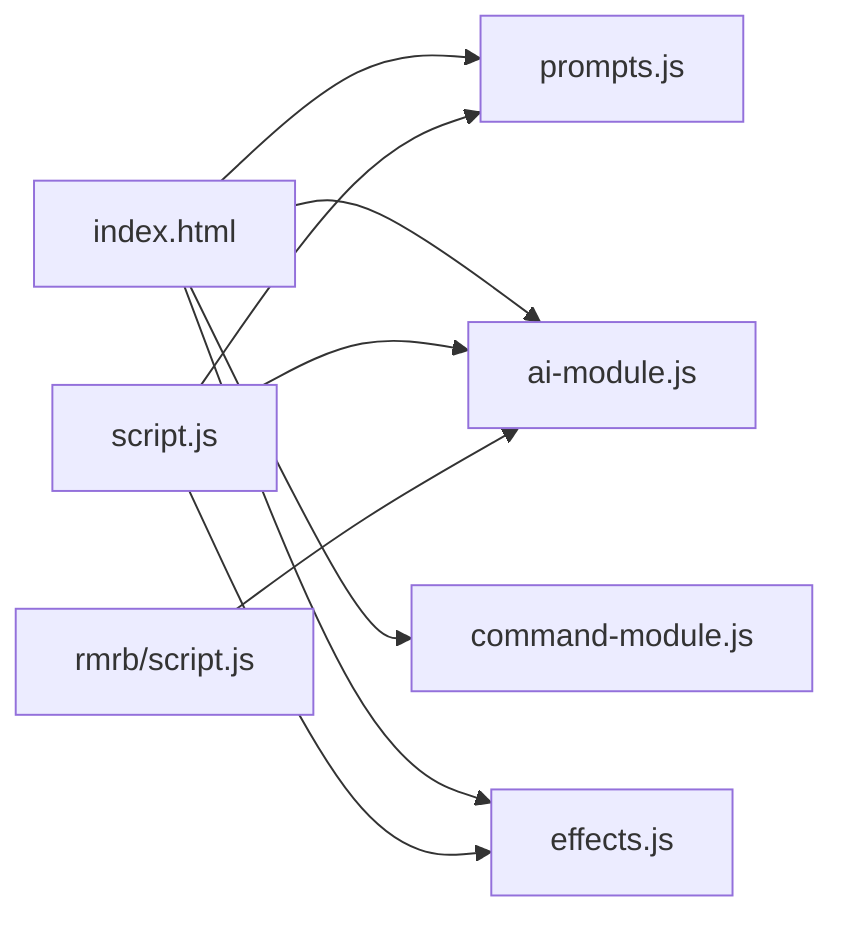

# 前端集成模式

<cite>
**本文引用的文件**
- [script.js](file://script.js)
- [ai-module.js](file://ai-module.js)
- [index.html](file://index.html)
- [prompts.js](file://prompts.js)
- [effects.js](file://effects.js)
- [rmrb/script.js](file://rmrb/script.js)
- [styles.css](file://styles.css)
</cite>

## 目录
1. [简介](#简介)
2. [项目结构](#项目结构)
3. [核心组件](#核心组件)
4. [架构总览](#架构总览)
5. [详细组件分析](#详细组件分析)
6. [依赖关系分析](#依赖关系分析)
7. [性能考量](#性能考量)
8. [故障排查指南](#故障排查指南)
9. [结论](#结论)
10. [附录](#附录)

## 简介
本文件面向希望将新开发的AI功能无缝集成到主应用界面的工程师，基于仓库中现有的脚本与模块，系统讲解如何通过事件监听机制绑定按钮点击等用户交互，触发AI调用；如何在调用 AIModule.callAIAnalysis 后进行UI更新（显示加载状态、禁用重复提交、成功后更新DOM或弹窗展示结果）；如何在现有“打卡”功能中同步调用AI问候语并渲染到页面指定区域；以及如何与现有状态管理协调，避免阻塞主线程、合理使用异步await语法。同时提供HTML结构建议（如预留 result-container 类名用于动态内容插入）、CSS过渡动画建议，确保AI响应展示自然流畅。

## 项目结构
- 主入口页面：index.html 引入 AI 提示词、AI 模块、命令模块、特效模块等脚本，构建整体UI骨架。
- 业务逻辑：script.js 负责页面初始化、标签页切换、侧边栏、番茄钟、AI设置、打卡、时间轴、快捷功能等。
- AI能力：ai-module.js 封装 DeepSeek API 调用、问候语、摸鱼吉日签、工作总结、通用分析接口。
- Prompt与兜底：prompts.js 统一管理 Prompt 模板与兜底文案。
- 特效：effects.js 提供打卡特效（阳光/礼花）。
- 示例集成：rmrb/script.js 展示了如何在“读报分析”场景中调用 AIModule.callAIAnalysis 并更新UI。

图表来源
- [index.html](file://index.html#L1-L120)
- [script.js](file://script.js#L90-L160)
- [ai-module.js](file://ai-module.js#L1-L60)
- [prompts.js](file://prompts.js#L1-L60)
- [effects.js](file://effects.js#L1-L40)
- [rmrb/script.js](file://rmrb/script.js#L330-L420)

章节来源
- [index.html](file://index.html#L1-L120)
- [script.js](file://script.js#L90-L160)

## 核心组件
- 事件监听与交互绑定
  - 使用 document.getElementById 获取元素并添加 click/keypress 等事件监听，贯穿多个功能模块（如设置、侧边栏、番茄钟、AI设置、打卡等）。
- AI模块（AIModule）
  - 提供 callDeepSeekAPI、getAIGreeting、getMoyuFortune、generateWorkSummary、callAIAnalysis 等方法，统一处理API调用、错误兜底与返回结构。
- Prompt与兜底
  - 通过 window.AI_PROMPTS 注入模板，通过 window.FALLBACK_MESSAGES 提供兜底文案，保证网络异常时的可用性。
- 特效模块（ClockEffects）
  - 在打卡场景中播放阳光/礼花特效，增强交互体验。
- 打卡功能
  - 通过 initClockIn 初始化按钮状态与交互，支持“上班/下班/已完成”三种状态，异步获取问候语、摸鱼吉日签、工作总结，并更新弹窗与时间轴。

章节来源
- [script.js](file://script.js#L130-L170)
- [ai-module.js](file://ai-module.js#L169-L215)
- [prompts.js](file://prompts.js#L1-L120)
- [effects.js](file://effects.js#L1-L80)
- [script.js](file://script.js#L493-L732)

## 架构总览
下图展示了从用户交互到AI调用再到UI更新的端到端流程，包括打卡场景与通用分析场景。

图表来源
- [script.js](file://script.js#L922-L1030)
- [ai-module.js](file://ai-module.js#L169-L215)
- [prompts.js](file://prompts.js#L1-L120)
- [rmrb/script.js](file://rmrb/script.js#L395-L441)

## 详细组件分析

### 组件A：事件监听与交互绑定（通用模式）
- 目标：演示如何通过 document.getElementById 获取元素并添加 click/keypress 等事件监听，触发异步AI调用。
- 实现要点
  - 在页面加载后（DOMContentLoaded 或 initXXX 函数中），通过 getElementById 获取按钮/输入框等元素。
  - 为元素添加事件监听器，内部使用 await 调用 AIModule 接口，避免阻塞主线程。
  - 在调用前后分别显示/隐藏加载状态、禁用按钮、更新UI。
- 适用场景
  - 新增“AI分析”按钮：在任意页面（如“读报”、“设置”、“日历”等）添加按钮，绑定 click 事件，调用 AIModule.callAIAnalysis 并将结果渲染到 result-container 或对应弹窗。

图表来源
- [script.js](file://script.js#L130-L170)
- [rmrb/script.js](file://rmrb/script.js#L330-L441)
- [ai-module.js](file://ai-module.js#L169-L215)

章节来源
- [script.js](file://script.js#L130-L170)
- [rmrb/script.js](file://rmrb/script.js#L330-L441)

### 组件B：AIModule.callAIAnalysis 调用与UI更新流程
- 目标：展示调用 AIModule.callAIAnalysis 后的UI更新步骤：显示加载状态、禁用重复提交、成功后更新DOM或弹窗展示结果。
- 实现要点
  - 在事件回调中先禁用按钮、显示“思考中/加载中”状态。
  - await 调用 AIModule.callAIAnalysis，根据返回的 success 字段决定更新路径。
  - 成功时将 content 渲染到指定容器（如 result-container 或弹窗内容区）；失败时显示错误文案并可降级为兜底文案。
  - finally 中恢复按钮状态，避免重复提交。
- 与现有状态管理协调
  - 使用 await 避免阻塞主线程；在弹窗/模态框中使用 show/hide 控制可见性，配合 document.body.style.overflow 控制滚动。
  - 与 Toast、时间轴等已有状态管理协同，避免UI冲突。

图表来源
- [ai-module.js](file://ai-module.js#L169-L215)
- [rmrb/script.js](file://rmrb/script.js#L395-L441)

章节来源
- [ai-module.js](file://ai-module.js#L169-L215)
- [rmrb/script.js](file://rmrb/script.js#L395-L441)

### 组件C：在打卡功能中同步调用AI问候语并渲染
- 目标：在现有打卡流程中，同步调用 AI 问候语并渲染到页面指定区域，同时支持摸鱼吉日签与工作总结。
- 实现要点
  - initClockIn 中根据按钮状态（CLOCK_IN/CLOCK_OUT/FINISHED）决定行为。
  - 点击后立即显示 greeting-modal 弹窗与加载动画，随后异步获取问候语。
  - 上班打卡：生成问候语后，再获取摸鱼吉日签并渲染到指定卡片区域；可提供“再求一签”与“开始摸鱼”等交互。
  - 下班打卡：播放特效后生成工作总结并渲染到 summary-content 容器。
  - 期间通过 localStorage 记录打卡时间与状态，更新按钮外观与状态。
- 与现有状态管理协调
  - 使用 setInterval 定期更新按钮状态，避免重复提交。
  - 使用 ClockEffects 在 canvas 上绘制特效，结束后清理动画资源。
  - 与时间轴 addTimelineEvent 协同，记录打卡事件。

图表来源
- [script.js](file://script.js#L493-L732)
- [ai-module.js](file://ai-module.js#L61-L167)
- [effects.js](file://effects.js#L1-L120)

章节来源
- [script.js](file://script.js#L493-L732)
- [ai-module.js](file://ai-module.js#L61-L167)
- [effects.js](file://effects.js#L1-L120)

### 组件D：与现有状态管理的协调
- 避免阻塞主线程
  - 使用 await 调用异步API，确保UI流畅；在交互过程中禁用按钮并显示加载状态。
- 与Toast、模态框、时间轴等协同
  - Toast用于提示保存/测试/错误信息；模态框用于展示问候语、摸鱼吉日签、工作总结；时间轴用于记录事件。
- 与localStorage协作
  - 记录API Key、打卡状态、摸鱼运势、今日时间轴等，保证跨页面/刷新的数据一致性。

章节来源
- [script.js](file://script.js#L424-L520)
- [script.js](file://script.js#L733-L800)

## 依赖关系分析
- 模块间依赖
  - index.html 引入 prompts.js、ai-module.js、command-module.js、effects.js。
  - script.js 依赖 ai-module.js、effects.js、prompts.js，负责事件绑定与UI更新。
  - rmrb/script.js 依赖 ai-module.js，演示通用分析场景。
- 关键依赖链
  - index.html -> prompts.js/ai-module.js/effects.js -> script.js -> DOM/弹窗
  - rmrb/script.js -> ai-module.js -> DOM/弹窗

图表来源
- [index.html](file://index.html#L1-L20)
- [script.js](file://script.js#L90-L120)
- [rmrb/script.js](file://rmrb/script.js#L1-L20)

章节来源
- [index.html](file://index.html#L1-L20)
- [script.js](file://script.js#L90-L120)
- [rmrb/script.js](file://rmrb/script.js#L1-L20)

## 性能考量
- 避免阻塞主线程
  - 使用 await 异步调用，避免在UI更新前长时间占用主线程。
- 合理使用模态框与遮罩
  - 显示弹窗时设置 document.body.style.overflow='hidden'，关闭时恢复，减少布局抖动。
- Canvas特效
  - ClockEffects 使用 requestAnimationFrame 控制动画帧率，结束后 clear 清理资源，避免内存泄漏。
- 错误兜底
  - AIModule 在网络异常时返回兜底文案，保证用户体验连续性。

章节来源
- [script.js](file://script.js#L546-L732)
- [effects.js](file://effects.js#L200-L279)
- [ai-module.js](file://ai-module.js#L169-L215)

## 故障排查指南
- API密钥未配置
  - 现象：调用 DeepSeek API 抛出“未配置 API 密钥”错误。
  - 处理：在设置页保存密钥并测试连接，status 显示成功后再进行AI调用。
- 网络异常或API返回错误
  - 现象：callAIAnalysis 返回 success=false，content 为兜底文案。
  - 处理：检查网络、API Key有效性；查看错误信息并重试。
- 弹窗无法关闭或遮罩失效
  - 现象：点击弹窗外层或关闭按钮无效。
  - 处理：确认事件绑定是否正确；确保关闭时恢复 document.body.style.overflow。
- Canvas特效不显示
  - 现象：打卡特效未出现。
  - 处理：确认 canvas 元素存在且尺寸正确；检查 playSunshine/playFireworks 是否被调用。

章节来源
- [script.js](file://script.js#L424-L520)
- [ai-module.js](file://ai-module.js#L14-L59)
- [effects.js](file://effects.js#L1-L80)

## 结论
通过现有事件监听机制与AIModule封装，可以将新开发的AI功能以一致的方式无缝集成到主应用界面。关键在于：
- 使用 document.getElementById 获取元素并添加事件监听；
- 在事件回调中 await 调用 AIModule 接口，避免阻塞主线程；
- 在调用前后统一管理加载状态与按钮禁用；
- 将成功结果渲染到指定容器或弹窗，失败时使用兜底文案；
- 与现有状态管理（Toast、模态框、时间轴、localStorage）协同工作；
- 为UI增加过渡动画与视觉反馈，提升用户体验。

## 附录

### HTML结构建议
- 为动态内容预留容器
  - 建议使用类名 result-container 作为通用结果容器，便于统一样式与动画。
  - 打卡场景中，使用 greeting-modal、moyu-fortune-section、clock-out-summary 等容器承载不同阶段的结果。
- 按钮与输入
  - 为AI分析按钮提供明确的id（如 ai-analysis-btn），便于事件绑定。
  - 为输入框提供占位符与回车提交支持（参考AI悬浮窗的回车提交逻辑）。

章节来源
- [index.html](file://index.html#L120-L220)
- [rmrb/script.js](file://rmrb/script.js#L330-L360)

### CSS过渡动画建议
- 弹窗与模态框
  - 使用 .modal.show 控制显隐，配合 transition 实现平滑过渡。
- 按钮与交互反馈
  - 为按钮添加 hover/active 状态，使用 transition 使交互更顺滑。
- 文本与容器
  - 为 result-container、greeting-modal-content、summary-content 等容器添加合适的字体、间距与背景色，确保内容可读性。

章节来源
- [styles.css](file://styles.css#L1277-L1300)
- [styles.css](file://styles.css#L1569-L1620)
- [styles.css](file://styles.css#L1692-L1700)