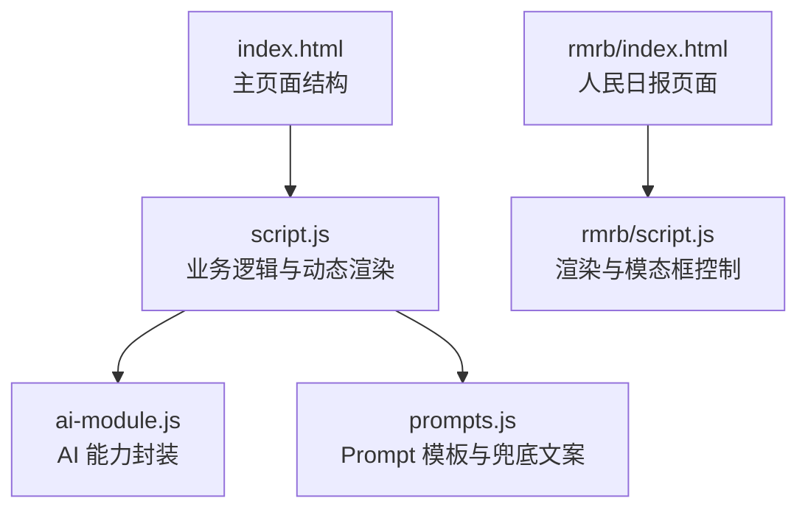
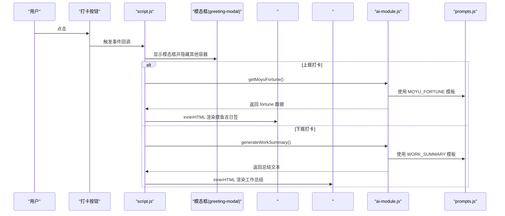
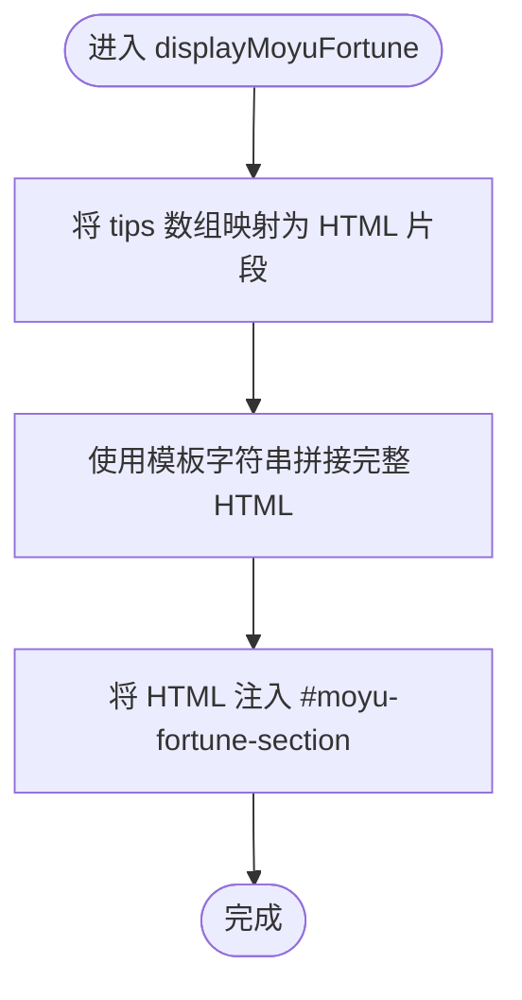
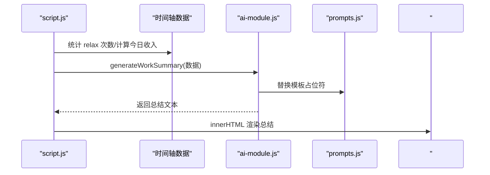
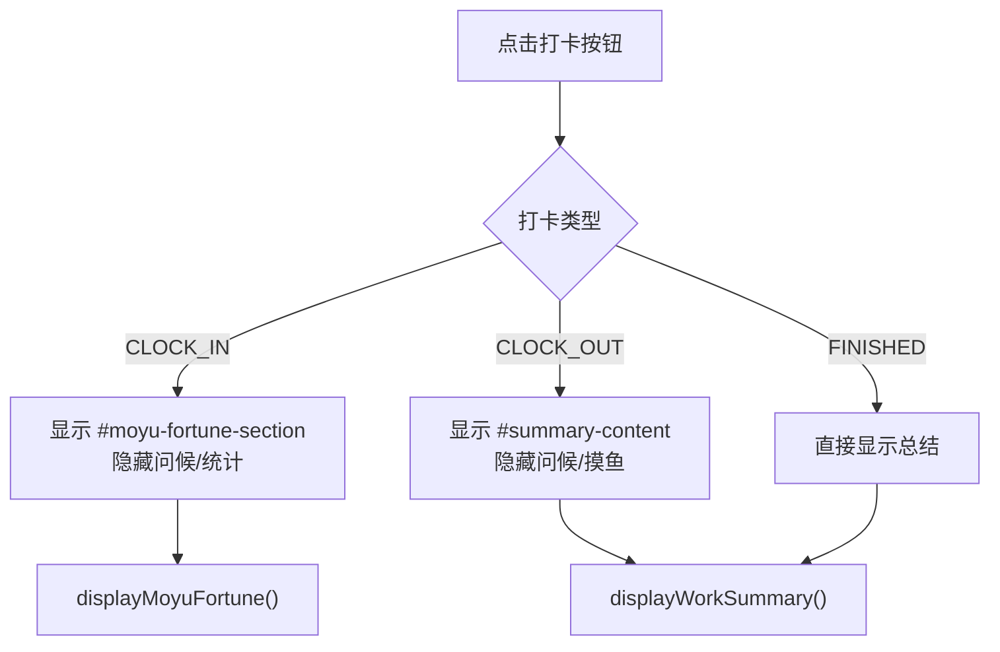
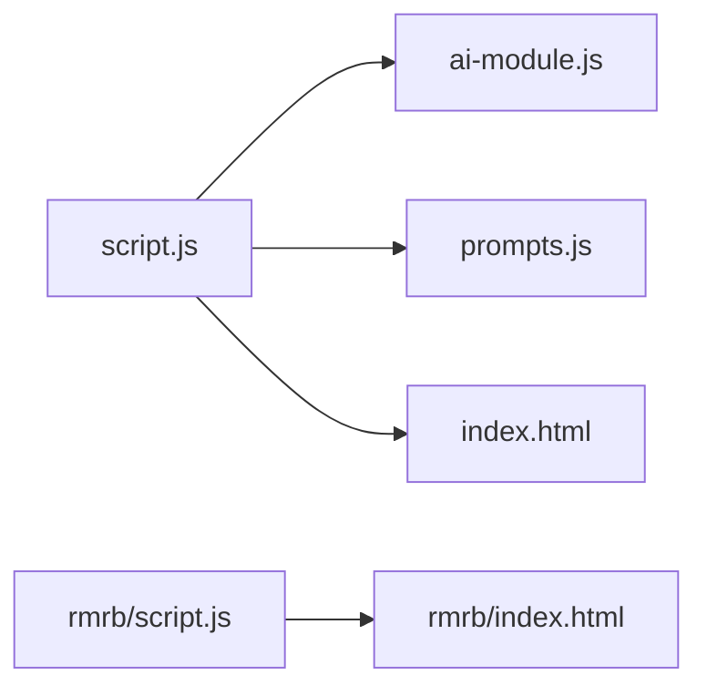

# 动态内容渲染模式

<cite>
**本文引用的文件**
- [index.html](file://index.html)
- [script.js](file://script.js)
- [ai-module.js](file://ai-module.js)
- [prompts.js](file://prompts.js)
- [rmrb/index.html](file://rmrb/index.html)
- [rmrb/script.js](file://rmrb/script.js)
</cite>

## 目录
1. [引言](#引言)
2. [项目结构](#项目结构)
3. [核心组件](#核心组件)
4. [架构总览](#架构总览)
5. [详细组件分析](#详细组件分析)
6. [依赖关系分析](#依赖关系分析)
7. [性能考量](#性能考量)
8. [故障排查指南](#故障排查指南)
9. [结论](#结论)
10. [附录](#附录)

## 引言
本文件聚焦于应用中“动态内容渲染”的实现方式，围绕以下目标展开：
- 基于脚本中的 displayMoyuFortune、generateDailySummary、displayWorkSummary 等函数，说明如何将数据模型转换为 HTML 片段并插入到指定容器（如 #moyu-fortune-section、#summary-content）。
- 分析使用模板字符串构建 DOM 结构的优势与潜在 XSS 风险，强调对用户输入内容的转义处理。
- 结合 index.html 中的模态框结构，展示如何通过控制 display 样式实现内容的条件渲染。
- 提供可复用的渲染函数设计模式，如工厂函数或渲染器类，以支持未来新功能的快速集成。

## 项目结构
本仓库采用多页面/多模块组织方式：
- 主应用入口：index.html 与 script.js，负责整体布局、标签页切换、模态框控制、打卡流程与动态渲染。
- AI 能力：ai-module.js 封装 DeepSeek API 调用；prompts.js 统一管理 Prompt 模板与兜底文案。
- 其他功能模块：例如 rmrb/index.html 与 rmrb/script.js，演示了另一种渲染模式（createElement + innerHTML）。

图表来源
- [index.html](file://index.html#L120-L163)
- [script.js](file://script.js#L581-L732)
- [ai-module.js](file://ai-module.js#L1-L216)
- [prompts.js](file://prompts.js#L1-L159)
- [rmrb/index.html](file://rmrb/index.html#L1-L62)
- [rmrb/script.js](file://rmrb/script.js#L214-L356)

章节来源
- [index.html](file://index.html#L120-L163)
- [script.js](file://script.js#L581-L732)
- [rmrb/index.html](file://rmrb/index.html#L1-L62)
- [rmrb/script.js](file://rmrb/script.js#L214-L356)

## 核心组件
- 动态渲染函数
  - displayMoyuFortune：将 AI 返回的摸鱼吉日签数据渲染到 #moyu-fortune-section。
  - displayWorkSummary：将 AI 生成的工作总结渲染到 #summary-content。
  - generateDailySummary：在非模态场景下生成纯文本摘要（用于日志或提示），也可作为模板参考。
- 模态框与容器
  - greeting-modal：承载打卡问候、摸鱼吉日签与下班总结。
  - #moyu-fortune-section：上班打卡时显示的摸鱼吉日签卡片区域。
  - #summary-content：下班打卡时显示的工作总结区域。
- 条件渲染
  - 通过控制容器 display 样式与 innerHTML 替换，实现“按需显示”和“按需更新”。

章节来源
- [script.js](file://script.js#L3026-L3061)
- [script.js](file://script.js#L3080-L3150)
- [script.js](file://script.js#L734-L778)
- [index.html](file://index.html#L123-L163)

## 架构总览
动态渲染的总体流程如下：
- 用户触发事件（如点击“上班/下班打卡”）。
- 脚本根据状态切换模态框与容器显示。
- 调用 AI 模块获取数据（或使用兜底数据）。
- 使用模板字符串拼接 HTML 并写入对应容器。
- 若出现异常，回退到兜底文案并保证界面稳定。

图表来源
- [script.js](file://script.js#L581-L732)
- [script.js](file://script.js#L3026-L3150)
- [ai-module.js](file://ai-module.js#L95-L167)
- [prompts.js](file://prompts.js#L1-L119)

## 详细组件分析

### 组件A：摸鱼吉日签渲染（displayMoyuFortune）
- 数据来源：AI 返回的 fortuneData（包含 fortune、bestTime、tips）。
- 渲染目标：#moyu-fortune-section。
- 实现要点：
  - 使用模板字符串拼接完整 HTML 片段。
  - 将数组 tips 逐项映射为 HTML 字符串后合并。
  - 通过 innerHTML 直接注入，替换原有内容。
- 容器控制：在显示前将容器 display 设为 block，隐藏问候消息与统计区域。

图表来源
- [script.js](file://script.js#L3026-L3061)

章节来源
- [script.js](file://script.js#L3026-L3061)

### 组件B：工作总结渲染（displayWorkSummary）
- 数据来源：收集当日时间轴中的 relax 事件数量、上下班时间、计算今日收入。
- 渲染目标：#summary-content。
- 实现要点：
  - 调用 AI 生成总结文本（generateWorkSummary）。
  - 使用模板字符串拼接包含“上下班时间、摸鱼次数、今日收入”的 HTML。
  - 通过 innerHTML 注入，覆盖原内容。
- 异常处理：若 AI 失败，回退到兜底文案。

图表来源
- [script.js](file://script.js#L3080-L3150)
- [ai-module.js](file://ai-module.js#L129-L167)
- [prompts.js](file://prompts.js#L27-L47)

章节来源
- [script.js](file://script.js#L3080-L3150)
- [ai-module.js](file://ai-module.js#L129-L167)
- [prompts.js](file://prompts.js#L27-L47)

### 组件C：条件渲染与模态框控制（index.html）
- 模态框结构：greeting-modal 内部包含多个子容器，如 #moyu-fortune-section、#summary-content。
- 控制方式：通过修改容器 display 样式实现“显示/隐藏/切换”。
- 典型流程：
  - 上班打卡：隐藏问候消息与统计区域，显示 #moyu-fortune-section 并注入摸鱼吉日签。
  - 下班打卡：隐藏问候消息与摸鱼区域，显示 #summary-content 并注入工作总结。
  - FINISHED 状态：直接显示总结，无需问候。

图表来源
- [index.html](file://index.html#L123-L163)
- [script.js](file://script.js#L581-L732)

章节来源
- [index.html](file://index.html#L123-L163)
- [script.js](file://script.js#L581-L732)

### 组件D：纯文本摘要生成（generateDailySummary）
- 用途：生成纯文本摘要，适合日志或提示场景。
- 特点：返回字符串而非 HTML，便于在不同上下文中复用。
- 适用：当不需要富文本渲染时，可作为模板参考，指导后续 HTML 渲染函数的设计。

章节来源
- [script.js](file://script.js#L734-L778)

### 组件E：渲染模式对比（模板字符串 vs createElement）
- 模板字符串（本项目主流做法）
  - 优点：易读、易维护、拼接灵活；适合一次性注入复杂 HTML。
  - 风险：若直接拼接用户输入，存在 XSS 风险。
- createElement（rmrb/script.js 示例）
  - 优点：更安全，天然避免 XSS；适合大量节点创建与事件绑定。
  - 风险：代码量较大，可读性略差。

章节来源
- [rmrb/script.js](file://rmrb/script.js#L236-L264)

## 依赖关系分析
- 脚本依赖
  - script.js 依赖 ai-module.js 与 prompts.js，用于调用 AI 与获取模板。
  - index.html 提供 DOM 结构与容器，驱动渲染。
- 模块间耦合
  - ai-module.js 与 prompts.js 通过全局变量交互，降低耦合度。
  - script.js 仅通过 window.AIModule 接口调用，职责清晰。

图表来源
- [script.js](file://script.js#L581-L732)
- [ai-module.js](file://ai-module.js#L1-L216)
- [prompts.js](file://prompts.js#L1-L159)
- [index.html](file://index.html#L120-L163)
- [rmrb/script.js](file://rmrb/script.js#L214-L356)
- [rmrb/index.html](file://rmrb/index.html#L1-L62)

章节来源
- [script.js](file://script.js#L581-L732)
- [ai-module.js](file://ai-module.js#L1-L216)
- [prompts.js](file://prompts.js#L1-L159)
- [index.html](file://index.html#L120-L163)
- [rmrb/script.js](file://rmrb/script.js#L214-L356)
- [rmrb/index.html](file://rmrb/index.html#L1-L62)

## 性能考量
- DOM 操作频率
  - 本项目通过一次性 innerHTML 注入完整 HTML 片段，减少多次小粒度 DOM 修改，提升渲染性能。
- 事件绑定与复用
  - 在模态框打开时才绑定事件，关闭时清理，避免重复绑定导致的性能与内存问题。
- 异步渲染
  - AI 调用异步进行，期间显示加载动画，避免阻塞主线程。
- 缓存与兜底
  - 使用兜底文案与本地缓存（如每日摸鱼运势）减少网络请求与渲染失败概率。

## 故障排查指南
- 常见问题
  - 容器未找到：检查目标元素 ID 是否正确，确认 DOM 已加载。
  - AI 调用失败：检查 API Key 是否配置，网络是否可用。
  - XSS 风险：若后续引入用户输入，务必进行 HTML 转义。
- 排查步骤
  - 打开浏览器开发者工具，查看控制台错误与网络请求。
  - 在 displayMoyuFortune/displayWorkSummary 中断点调试，确认数据结构与注入位置。
  - 检查模态框显示逻辑，确认容器 display 切换顺序。

章节来源
- [script.js](file://script.js#L3080-L3150)
- [ai-module.js](file://ai-module.js#L1-L59)

## 结论
- 本项目采用“模板字符串 + innerHTML”的动态渲染模式，具备易读、易维护的优势，适合快速迭代与原型开发。
- 通过明确的容器控制与模态框结构，实现了清晰的条件渲染与用户体验。
- 面向未来的扩展，建议引入“渲染器类/工厂函数”，统一数据到 HTML 的映射规则，增强可测试性与可维护性。

## 附录

### 设计模式建议：可复用渲染器
- 目标：将“数据模型 -> HTML 片段”的映射抽象为可复用组件，便于新增功能快速集成。
- 方案思路
  - 渲染器类：封装数据校验、模板映射、注入策略与错误处理。
  - 工厂函数：按容器类型返回对应的渲染器实例，支持扩展与替换。
  - 插槽/钩子：允许在渲染前后注入钩子，便于埋点、统计与副作用处理。
- 优势
  - 降低重复代码，统一风格。
  - 易于单元测试与回归验证。
  - 便于团队协作与知识沉淀。

### XSS 防护建议
- 对用户输入进行 HTML 转义，避免直接拼接到模板字符串中。
- 优先使用安全的 DOM API（如 TextNode）插入纯文本。
- 对富文本输入，采用白名单过滤或专用渲染库（如 DOMPurify）。