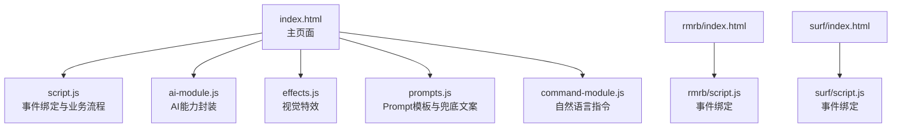
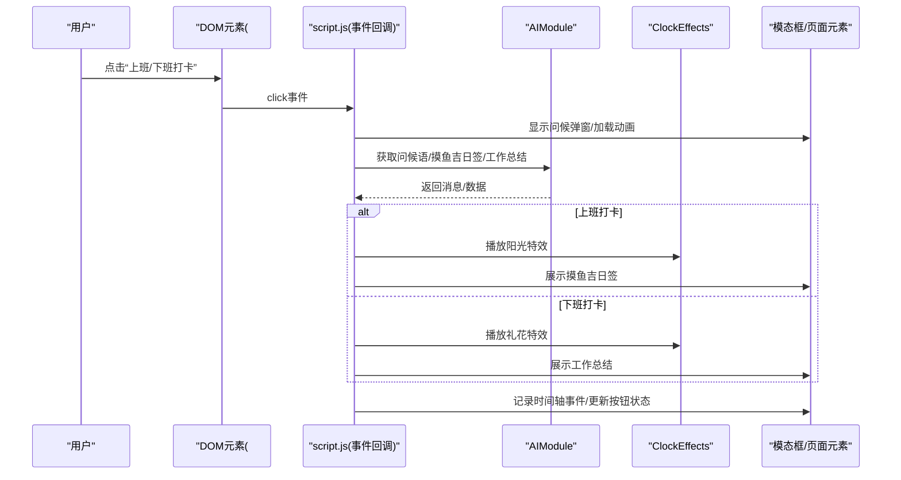
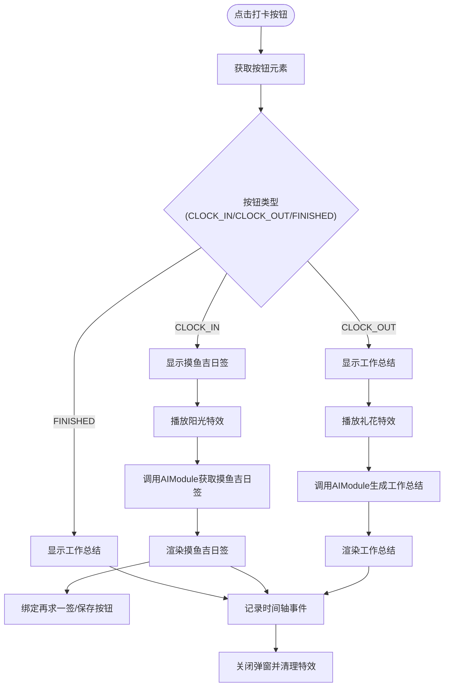
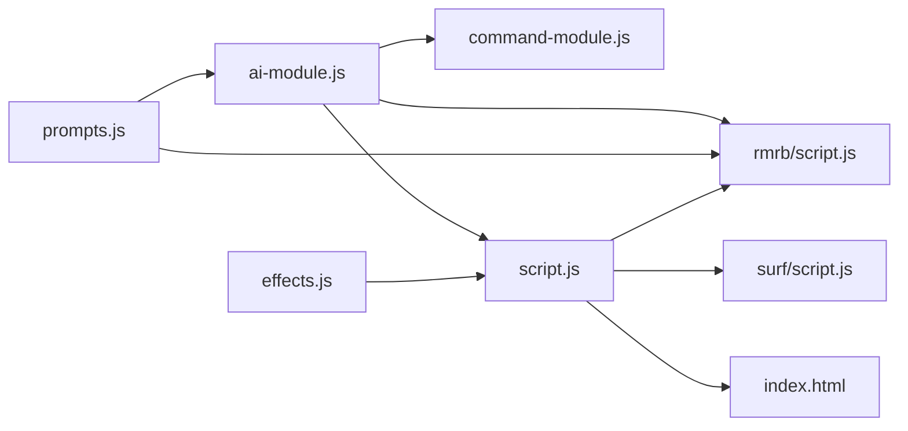

# 用户交互事件绑定

<cite>
**本文引用的文件**
- [index.html](file://index.html)
- [script.js](file://script.js)
- [ai-module.js](file://ai-module.js)
- [effects.js](file://effects.js)
- [prompts.js](file://prompts.js)
- [command-module.js](file://command-module.js)
- [rmrb/index.html](file://rmrb/index.html)
- [rmrb/script.js](file://rmrb/script.js)
- [surf/index.html](file://surf/index.html)
- [surf/script.js](file://surf/script.js)
</cite>

## 目录
1. [简介](#简介)
2. [项目结构](#项目结构)
3. [核心组件](#核心组件)
4. [架构总览](#架构总览)
5. [详细组件分析](#详细组件分析)
6. [依赖关系分析](#依赖关系分析)
7. [性能考量](#性能考量)
8. [故障排查指南](#故障排查指南)
9. [结论](#结论)

## 简介
本文件围绕主应用中的用户交互事件绑定展开，基于脚本文件中的DOM事件监听机制，系统性地说明如何通过document.getElementById或querySelector获取界面元素，并使用addEventListener绑定click、input等事件；结合index.html中的打卡按钮（#clock-in-btn）、设置保存按钮（#update-work-time）等实际元素，演示事件处理函数的注册过程；解释事件回调函数如何与业务逻辑模块（如AIModule、ClockEffects）协同工作，例如在打卡时调用AI问候语生成和视觉特效播放；强调事件解耦设计，避免内存泄漏，确保事件在适当时候被正确移除；提供错误处理建议，如元素未找到时的容错机制。

## 项目结构
主应用由多个页面组成，其中index.html为主入口，script.js负责事件绑定与业务流程；AI相关能力由ai-module.js提供；视觉特效由effects.js提供；自然语言指令由command-module.js提供；rmrb与surf子应用分别在各自页面中绑定事件。

图表来源
- [index.html](file://index.html#L1-L200)
- [script.js](file://script.js#L90-L220)
- [ai-module.js](file://ai-module.js#L1-L216)
- [effects.js](file://effects.js#L1-L120)
- [prompts.js](file://prompts.js#L1-L159)
- [command-module.js](file://command-module.js#L1-L120)
- [rmrb/index.html](file://rmrb/index.html#L1-L62)
- [rmrb/script.js](file://rmrb/script.js#L280-L356)
- [surf/index.html](file://surf/index.html#L1-L54)
- [surf/script.js](file://surf/script.js#L1-L40)

章节来源
- [index.html](file://index.html#L1-L200)
- [script.js](file://script.js#L90-L220)

## 核心组件
- 事件绑定与初始化：在DOMContentLoaded中集中初始化各类交互，包括标签页、侧边栏、番茄钟、AI设置、打卡功能、时间轴、快捷功能、日历事件等。
- 打卡功能：通过#clock-in-btn绑定点击事件，触发问候语生成、特效播放、摸鱼吉日签或工作总结展示，并记录时间轴事件。
- 设置保存：通过#update-work-time绑定点击事件，校验并保存工作时间配置。
- AI设置：通过#save-api-key、#test-api-key、#toggle-api-key绑定事件，实现API Key的保存与连通性测试。
- 番茄钟：通过#open-pomodoro、#start-pomodoro、#cancel-pomodoro、#restart-pomodoro等按钮绑定事件，控制倒计时与UI状态。
- 自然语言指令：通过CommandModule将用户自然语言转化为具体操作，间接驱动事件触发。

章节来源
- [script.js](file://script.js#L90-L220)
- [script.js](file://script.js#L493-L732)
- [script.js](file://script.js#L289-L423)
- [command-module.js](file://command-module.js#L74-L180)

## 架构总览
下图展示了事件绑定与业务模块的协作关系：主应用通过script.js绑定事件，事件回调调用AIModule与ClockEffects，同时维护时间轴与UI状态。

图表来源
- [script.js](file://script.js#L493-L732)
- [ai-module.js](file://ai-module.js#L61-L127)
- [effects.js](file://effects.js#L25-L120)

## 详细组件分析

### 打卡按钮事件绑定与回调
- 元素定位：通过document.getElementById('clock-in-btn')获取按钮元素。
- 事件注册：addEventListener('click', ...)注册点击事件。
- 回调流程：
  - 初始化特效实例ClockEffects('effect-canvas')。
  - 根据按钮状态（CLOCK_IN/CLOCK_OUT/FINISHED）决定行为。
  - 异步获取问候语，显示问候弹窗与加载动画。
  - 上班打卡：播放阳光特效，生成并展示摸鱼吉日签，支持再求一签与保存。
  - 下班打卡：播放礼花特效，生成并展示工作总结。
  - 记录时间轴事件，更新按钮状态与本地存储。
- 错误处理：当AI调用失败时，使用兜底文案；异常捕获后回退到默认总结。
- 解耦与清理：模态框关闭时调用effects.clear()清理动画；定时器在模态关闭时重置；点击外部遮罩或关闭按钮均可关闭弹窗。

图表来源
- [script.js](file://script.js#L493-L732)
- [ai-module.js](file://ai-module.js#L95-L167)
- [effects.js](file://effects.js#L25-L120)

章节来源
- [script.js](file://script.js#L493-L732)

### 设置保存按钮事件绑定
- 元素定位：通过document.getElementById('update-work-time')获取按钮元素。
- 事件注册：addEventListener('click', ...)注册点击事件。
- 回调流程：
  - 校验时间设置的合理性。
  - 保存到localStorage。
  - 隐藏设置弹窗，恢复页面滚动。
  - 显示提示并重新初始化应用。
- 错误处理：未找到元素时，可通过条件判断与容错提示避免崩溃。

章节来源
- [script.js](file://script.js#L133-L155)
- [script.js](file://script.js#L187-L223)

### AI设置事件绑定
- API密钥保存：#save-api-key点击事件，保存至localStorage并显示状态。
- API密钥测试：#test-api-key点击事件，调用AIModule.getAIGreeting('CLOCK_IN')验证连通性。
- 密钥显示切换：#toggle-api-key点击事件，切换密码输入框可见性。
- 错误处理：未输入密钥时提示；测试失败时显示错误信息；异步过程中显示加载状态。

章节来源
- [script.js](file://script.js#L424-L491)
- [ai-module.js](file://ai-module.js#L1-L60)

### 番茄钟事件绑定
- 打开模态：#open-pomodoro点击事件，显示模态框并禁止页面滚动。
- 关闭模态：#close-pomodoro点击事件，清理定时器、重置UI并恢复滚动。
- 快速选择：.quick-btn点击事件，填充自定义时长。
- 开始专注：#start-pomodoro点击事件，校验分钟数并启动倒计时。
- 取消专注：#cancel-pomodoro点击事件，确认后清理定时器并重置UI。
- 再来一次：#restart-pomodoro点击事件，重置UI。
- 错误处理：输入范围校验与提示；定时器清理避免内存泄漏。

章节来源
- [script.js](file://script.js#L289-L423)

### 自然语言指令与事件联动
- 指令理解：processCommand调用AIModule.callDeepSeekAPI理解用户意图，返回JSON。
- 执行动作：executeCommand根据类型模拟点击对应按钮（如#clock-in-btn、#open-pomodoro），从而触发原有事件回调。
- 容错：低置信度时仅聊天不执行；解析失败时回退友好提示。

章节来源
- [command-module.js](file://command-module.js#L182-L259)
- [command-module.js](file://command-module.js#L74-L180)

### 子应用事件绑定示例
- 人民日报（rmrb）：
  - 刷新按钮：#refresh-news点击事件，重新抓取并渲染新闻列表。
  - AI读报：#ai-analysis-btn点击事件，调用AIModule.callAIAnalysis进行分析。
  - 文章点击：文章项点击事件，读取文章内容并展示模态框。
  - 关闭模态：模态点击外部或关闭按钮，统一关闭逻辑。
- 网上冲浪（surf）：
  - 刷新按钮：#refresh-weibo、#refresh-douyin点击事件，分别加载微博与抖音热搜。
  - 点击跳转：热搜项点击事件，打开外链。

章节来源
- [rmrb/script.js](file://rmrb/script.js#L288-L356)
- [rmrb/script.js](file://rmrb/script.js#L358-L418)
- [surf/script.js](file://surf/script.js#L1-L40)
- [surf/script.js](file://surf/script.js#L21-L40)

## 依赖关系分析
- 主应用依赖关系：
  - script.js依赖：ai-module.js（AIModule）、effects.js（ClockEffects）、prompts.js（AI_PROMPTS/FALLBACK_MESSAGES）、command-module.js（自然语言指令）。
  - index.html引入顺序：prompts.js → ai-module.js → command-module.js → effects.js → script.js。
- 子应用依赖关系：
  - rmrb/index.html引入prompts.js与ai-module.js，rmrb/script.js依赖AIModule与DOM元素。
  - surf/index.html轻量依赖，surf/script.js依赖fetch与DOM元素。

图表来源
- [index.html](file://index.html#L1-L12)
- [script.js](file://script.js#L90-L132)
- [ai-module.js](file://ai-module.js#L206-L216)
- [effects.js](file://effects.js#L275-L279)
- [prompts.js](file://prompts.js#L153-L159)
- [rmrb/script.js](file://rmrb/script.js#L468-L474)
- [surf/script.js](file://surf/script.js#L1-L23)

章节来源
- [index.html](file://index.html#L1-L12)
- [script.js](file://script.js#L90-L132)

## 性能考量
- 事件绑定时机：统一在DOMContentLoaded中完成，避免重复绑定与竞态。
- 动画与定时器：ClockEffects在clear()中取消requestAnimationFrame，避免动画资源泄漏；番茄钟在关闭时清理setInterval。
- 异步调用：AIModule对API调用进行节流与错误兜底，减少失败重试带来的抖动。
- UI更新：批量更新DOM前先隐藏/显示容器，减少不必要的重排重绘。

[本节为通用指导，无需列出具体文件来源]

## 故障排查指南
- 元素未找到：
  - 现象：addEventListener报错或空指针。
  - 排查：确认元素ID是否存在；检查页面加载顺序与DOMContentLoaded时机；在绑定前增加存在性判断与容错提示。
- 事件未触发：
  - 现象：点击无反应。
  - 排查：检查事件绑定是否在DOMContentLoaded之后；确认元素未被覆盖或禁用；核对事件类型是否正确。
- 特效不显示：
  - 现象：打卡后无特效。
  - 排查：确认#effect-canvas存在；检查ClockEffects构造参数与resize逻辑；确认弹窗显示后再播放特效。
- AI调用失败：
  - 现象：问候语/摸鱼吉日签/工作总结为空或报错。
  - 排查：检查API Key是否保存；测试连通性；查看兜底文案是否生效；确认网络与跨域代理配置。
- 定时器泄漏：
  - 现象：页面切换后仍持续运行。
  - 排查：确保在关闭模态或页面卸载时清理定时器；在ClockEffects.clear()中取消动画帧。

章节来源
- [script.js](file://script.js#L493-L732)
- [effects.js](file://effects.js#L262-L273)
- [ai-module.js](file://ai-module.js#L1-L60)

## 结论
本项目通过在DOMContentLoaded中集中绑定事件，实现了清晰的解耦与良好的可维护性。事件回调与业务模块（AIModule、ClockEffects）紧密协作，在保证用户体验的同时兼顾了错误处理与资源清理。建议在新增交互时遵循现有模式：先获取元素并做存在性检查，再绑定事件；在回调中优先进行异步调用与UI更新，最后进行资源清理与状态持久化。