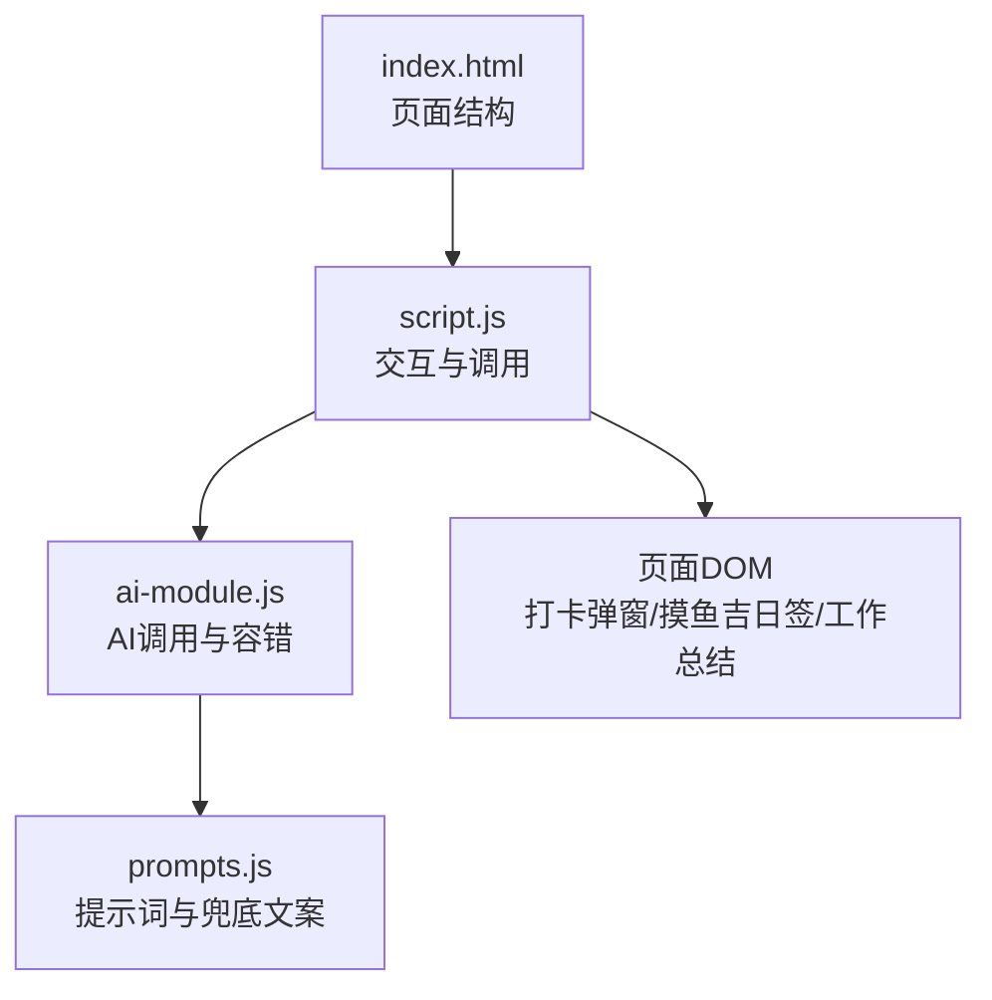
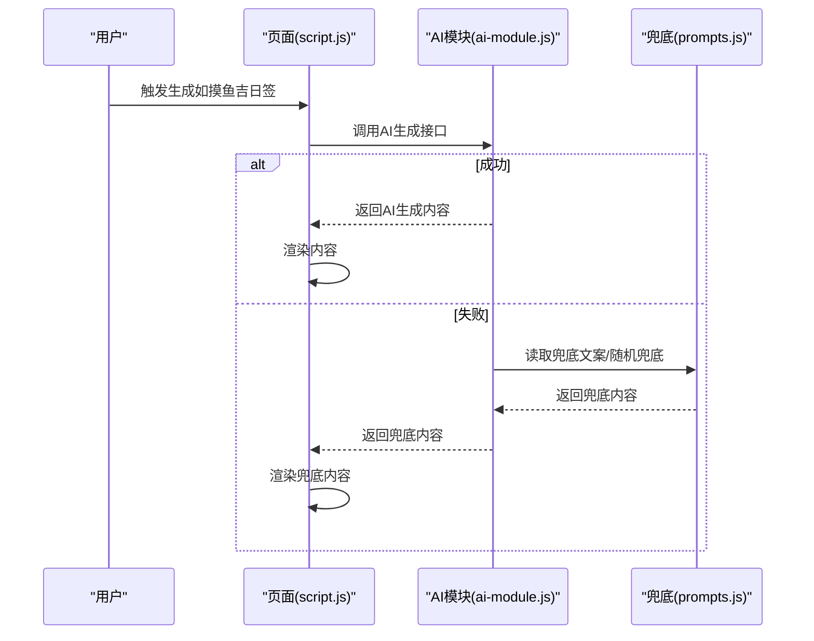
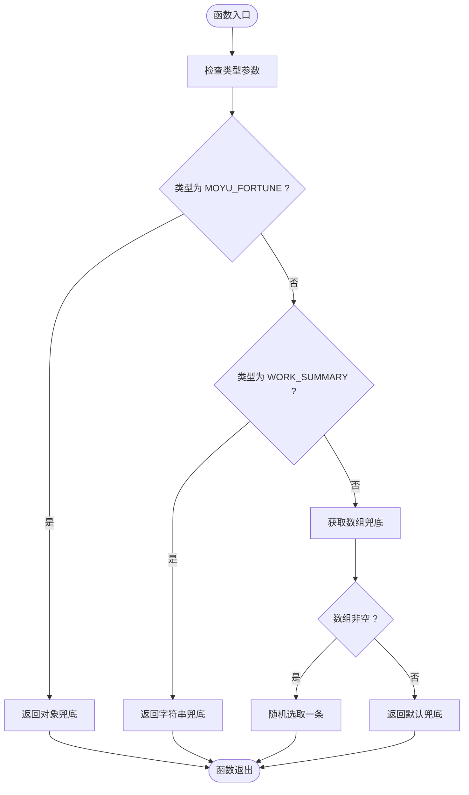
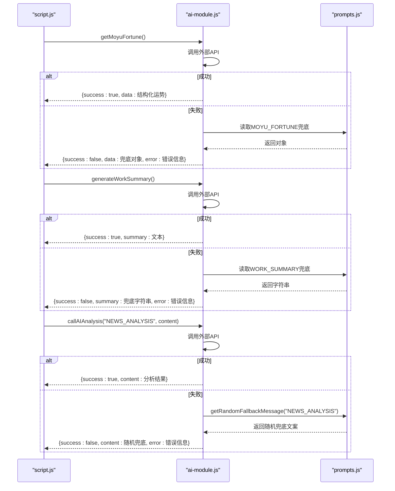

# 兜底策略与容错设计

<cite>
**本文引用的文件**
- [prompts.js](file://prompts.js)
- [ai-module.js](file://ai-module.js)
- [script.js](file://script.js)
- [index.html](file://index.html)
- [README.md](file://README.md)
</cite>

## 目录
1. [引言](#引言)
2. [项目结构](#项目结构)
3. [核心组件](#核心组件)
4. [架构总览](#架构总览)
5. [详细组件分析](#详细组件分析)
6. [依赖关系分析](#依赖关系分析)
7. [性能考量](#性能考量)
8. [故障排查指南](#故障排查指南)
9. [结论](#结论)

## 引言
本文件围绕“兜底策略与容错设计”展开，重点解释 FALLBACK_MESSAGES 对象的作用、不同提示类型（如 MOYU_FORTUNE、WORK_SUMMARY 等）对应的兜底文案设计原则，以及 getRandomFallbackMessage 如何根据类型返回随机或确定性兜底内容，从而在 AI 请求失败或超时的情况下，仍能稳定地提供本地预设的备用内容，提升用户体验的连续性与一致性。

## 项目结构
本项目采用前端单页应用结构，AI 相关能力集中在独立模块中，提示词与兜底文案集中管理，页面交互通过脚本驱动。与兜底策略直接相关的文件包括：
- prompts.js：统一管理 AI 提示词与兜底文案配置，并导出全局方法
- ai-module.js：封装 AI 调用与容错逻辑，失败时回退到兜底文案
- script.js：页面交互入口，负责触发 AI 生成与展示兜底内容
- index.html：页面结构，承载打卡弹窗、摸鱼吉日签与工作总结展示区域

图表来源
- [index.html](file://index.html#L123-L163)
- [script.js](file://script.js#L546-L729)
- [ai-module.js](file://ai-module.js#L95-L204)
- [prompts.js](file://prompts.js#L1-L158)

章节来源
- [README.md](file://README.md#L32-L51)
- [index.html](file://index.html#L123-L163)

## 核心组件
- FALLBACK_MESSAGES：集中存放各类提示类型的兜底文案，确保在网络异常或服务不可用时，仍能提供一致、积极、简洁的本地内容。
- getRandomFallbackMessage：根据类型返回确定性兜底对象（如 MOYU_FORTUNE）或随机兜底文案（如 NEWS_ANALYSIS），保证用户在不同场景下获得稳定体验。
- AI 调用模块（ai-module.js）：在调用外部 API 失败时，统一回退到 FALLBACK_MESSAGES 或随机兜底文案，避免页面空白或错误提示打断流程。

章节来源
- [prompts.js](file://prompts.js#L122-L158)
- [ai-module.js](file://ai-module.js#L95-L204)

## 架构总览
AI 请求失败时的容错流程如下：
- 页面触发 AI 生成（如摸鱼吉日签、工作总结、读报分析）
- 调用 AI 模块发起请求
- 若请求成功，返回 AI 生成内容
- 若请求失败，AI 模块回退到 FALLBACK_MESSAGES 或通过 getRandomFallbackMessage 选择随机兜底文案
- 页面渲染兜底内容，保证交互连续性

图表来源
- [script.js](file://script.js#L638-L729)
- [ai-module.js](file://ai-module.js#L95-L204)
- [prompts.js](file://prompts.js#L122-L158)

## 详细组件分析

### FALLBACK_MESSAGES 设计与类型
- MOYU_FORTUNE：返回结构化对象，包含“运势”“最佳时间”“锦囊”三项，确保页面卡片渲染所需字段完整；类型为对象，便于直接渲染。
- WORK_SUMMARY：返回字符串，作为简洁积极的总结文案，适合在下班打卡时快速展示。
- NEWS_ANALYSIS：返回字符串数组，通过随机选择实现“轮换式”兜底文案，避免单一文案长期重复带来的用户疲劳。

章节来源
- [prompts.js](file://prompts.js#L122-L158)

### 兜底文案设计原则
- 语气一致：所有兜底文案均保持积极、轻松、幽默的风格，与产品“摸鱼”主题契合，降低用户对失败的负面感知。
- 内容简洁：文案长度适中，关键信息突出，便于快速阅读与理解。
- 场景贴合：针对不同提示类型（摸鱼吉日签、工作总结、读报分析）分别设计，确保与页面功能匹配。
- 可扩展性：结构化对象（如 MOYU_FORTUNE）便于后续扩展字段或样式；数组式兜底（NEWS_ANALYSIS）便于持续轮换。

章节来源
- [README.md](file://README.md#L32-L51)
- [prompts.js](file://prompts.js#L122-L158)

### getRandomFallbackMessage 的行为与稳定性
- 确定性返回：当类型为 MOYU_FORTUNE 或 WORK_SUMMARY 时，直接返回对应兜底对象或字符串，保证同一类型在同一时刻的稳定性，避免用户看到“前后不一致”的文案。
- 随机返回：当类型为 NEWS_ANALYSIS 时，从数组中随机选取一条文案，实现“轮换式”兜底，降低重复率，缓解用户疲劳。
- 容错兜底：若传入未知类型或数组为空，则返回默认兜底文案，确保不会出现空值或异常。

图表来源
- [prompts.js](file://prompts.js#L141-L151)

章节来源
- [prompts.js](file://prompts.js#L141-L151)

### AI 调用与兜底回退链路
- 摸鱼吉日签：AI 模块尝试调用外部 API，解析成功则返回结构化数据；失败则回退到 MOYU_FORTUNE 对象兜底，并在页面弹窗中显示错误提示与兜底内容。
- 工作总结：AI 模块在失败时回退到 WORK_SUMMARY 字符串兜底，页面在异常分支中也直接渲染兜底文案，保证下班打卡流程不受影响。
- 读报分析：AI 模块在失败时调用 getRandomFallbackMessage，从 NEWS_ANALYSIS 数组中随机选择一条兜底文案，避免长时间重复。

图表来源
- [script.js](file://script.js#L575-L729)
- [ai-module.js](file://ai-module.js#L95-L204)
- [prompts.js](file://prompts.js#L122-L158)

章节来源
- [script.js](file://script.js#L575-L729)
- [ai-module.js](file://ai-module.js#L95-L204)

### 页面渲染与用户体验
- 打卡弹窗：在 AI 失败时，页面会在弹窗中显示错误提示与兜底文案，同时保留“再求一签”“开始摸鱼”等交互，避免打断用户流程。
- 摸鱼吉日签卡片：即使回退到兜底对象，页面仍能完整渲染“运势”“最佳时间”“锦囊”三列，保证视觉一致性。
- 工作总结：在下班打卡场景，若 AI 失败，页面直接渲染 WORK_SUMMARY 兜底文案，确保用户能及时看到总结。

章节来源
- [index.html](file://index.html#L123-L163)
- [script.js](file://script.js#L638-L729)

## 依赖关系分析
- prompts.js 作为“提示词与兜底文案”的唯一来源，被 ai-module.js 与 script.js 间接依赖。
- ai-module.js 在失败时依赖 prompts.js 的 FALLBACK_MESSAGES 与 getRandomFallbackMessage。
- script.js 依赖 ai-module.js 的生成接口，并在失败分支中直接渲染兜底文案，形成“容错闭环”。

图表来源
- [prompts.js](file://prompts.js#L122-L158)
- [ai-module.js](file://ai-module.js#L95-L204)
- [script.js](file://script.js#L546-L729)

章节来源
- [prompts.js](file://prompts.js#L122-L158)
- [ai-module.js](file://ai-module.js#L95-L204)
- [script.js](file://script.js#L546-L729)

## 性能考量
- 兜底文案均为本地静态数据，无需网络请求，回退路径极快，显著降低失败时的等待与卡顿。
- 随机兜底仅在数组存在时生效，避免无意义的随机选择；默认兜底作为最终兜底，保证稳定性。
- 页面在失败分支中仍维持交互按钮与加载提示，有助于减少用户焦虑，提升感知性能。

## 故障排查指南
- 确认 API 密钥是否正确保存：若未配置密钥，AI 调用会直接抛错并回退到兜底文案。
- 检查网络连通性：若网络异常，AI 调用会失败并触发回退。
- 查看页面错误提示：在摸鱼吉日签或工作总结失败时，页面弹窗会显示错误信息与兜底文案，便于定位问题。
- 更新兜底文案：定期更新 FALLBACK_MESSAGES 中的文案，避免长期重复导致用户疲劳。

章节来源
- [ai-module.js](file://ai-module.js#L14-L59)
- [script.js](file://script.js#L652-L655)

## 结论
通过将 FALLBACK_MESSAGES 与 getRandomFallbackMessage 作为统一的兜底策略，本项目在 AI 请求失败或超时的情况下，能够稳定地提供本地预设的备用内容。MOYU_FORTUNE 与 WORK_SUMMARY 采用确定性兜底，确保同一类型在同一时刻的稳定性；NEWS_ANALYSIS 采用随机兜底，降低重复率，避免用户疲劳。配合页面层面的错误提示与交互按钮，整体用户体验在异常情况下依然保持顺畅与积极。