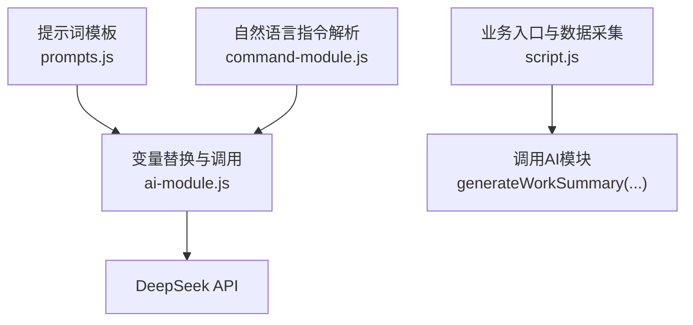
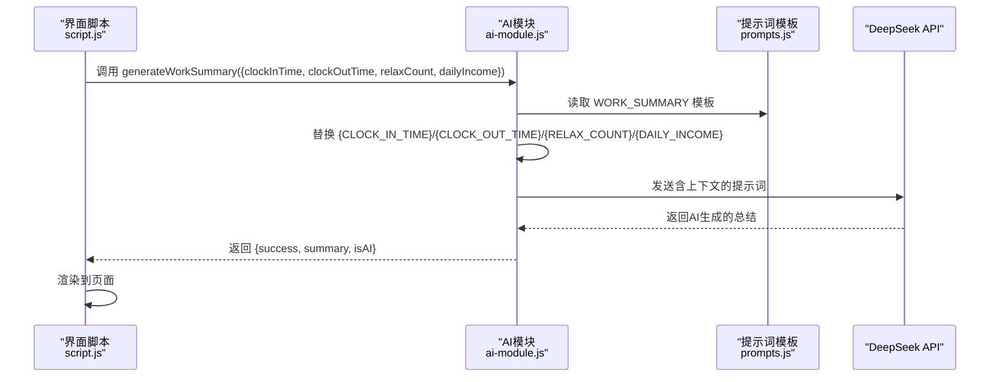
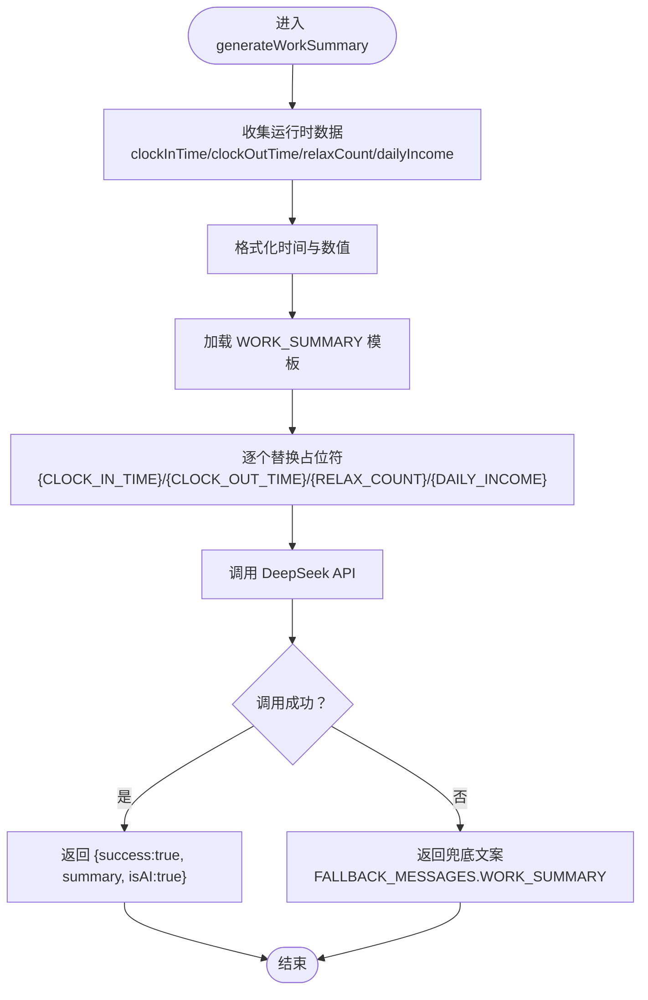
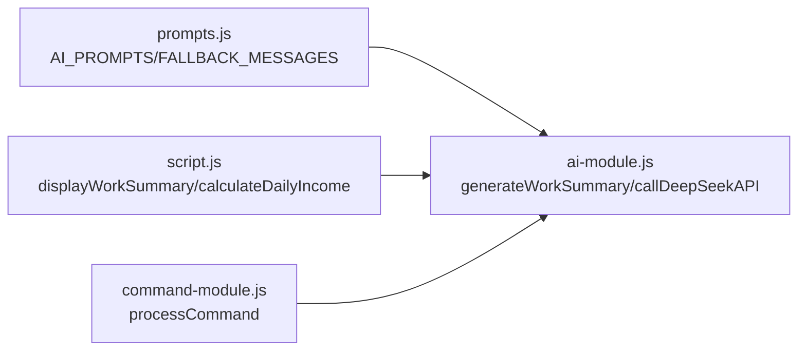

# 变量替换机制

<cite>
**本文引用的文件**
- [ai-module.js](file://ai-module.js)
- [prompts.js](file://prompts.js)
- [script.js](file://script.js)
- [command-module.js](file://command-module.js)
</cite>

## 目录
1. [引言](#引言)
2. [项目结构](#项目结构)
3. [核心组件](#核心组件)
4. [架构总览](#架构总览)
5. [详细组件分析](#详细组件分析)
6. [依赖关系分析](#依赖关系分析)
7. [性能考量](#性能考量)
8. [故障排查指南](#故障排查指南)
9. [结论](#结论)

## 引言
本篇文档围绕提示词模板中的“占位符变量”在运行时的数据注入机制展开，重点解释变量如何在 ai-module.js 中被动态替换，确保上下文信息准确传递给AI模型。我们将结合 WORK_SUMMARY 模板中的实际变量（如 {CLOCK_IN_TIME}、{DAILY_INCOME} 等），说明变量命名应清晰表达语义并与数据源字段保持一致；同时强调替换前必须进行数据校验，避免空值或格式错误导致AI输出异常。

## 项目结构
本仓库采用前端单页应用结构，AI相关能力集中在 ai-module.js 中，提示词模板集中于 prompts.js，业务入口与数据采集在 script.js，自然语言指令解析在 command-module.js。变量替换贯穿“模板 -> 数据 -> API请求”的链路。

图表来源
- [prompts.js](file://prompts.js#L1-L120)
- [ai-module.js](file://ai-module.js#L134-L167)
- [script.js](file://script.js#L3079-L3151)
- [command-module.js](file://command-module.js#L182-L204)

章节来源
- [prompts.js](file://prompts.js#L1-L120)
- [ai-module.js](file://ai-module.js#L134-L167)
- [script.js](file://script.js#L3079-L3151)
- [command-module.js](file://command-module.js#L182-L204)

## 核心组件
- 提示词模板管理：统一存放于 prompts.js，包含 WORK_SUMMARY、NEWS_ANALYSIS 等模板，以及兜底文案 FALLBACK_MESSAGES。
- 变量替换与调用：在 ai-module.js 中，通过字符串替换将运行时数据注入模板，再调用 DeepSeek API。
- 数据采集与组装：在 script.js 中，收集当日打卡时间、摸鱼次数、今日收入等，组装为对象传入 AI 模块。
- 指令解析与注入：command-module.js 将用户自然语言转为结构化意图，并在模板中注入 {COMMAND} 占位符。

章节来源
- [prompts.js](file://prompts.js#L1-L120)
- [ai-module.js](file://ai-module.js#L134-L167)
- [script.js](file://script.js#L3079-L3151)
- [command-module.js](file://command-module.js#L182-L204)

## 架构总览
变量替换在“模板 -> 数据 -> API请求”的主路径中发生，形成如下序列图：

图表来源
- [script.js](file://script.js#L3079-L3151)
- [ai-module.js](file://ai-module.js#L134-L167)
- [prompts.js](file://prompts.js#L27-L47)

## 详细组件分析

### 提示词模板与变量命名规范
- 模板集中管理：WORK_SUMMARY 模板中使用 {CLOCK_IN_TIME}、{CLOCK_OUT_TIME}、{RELAX_COUNT}、{DAILY_INCOME} 等占位符，语义清晰、与数据源字段一一对应。
- 命名一致性：变量名采用全大写+下划线风格，直观表达字段含义；与数据源字段保持一致，降低映射歧义。
- 语义化设计：模板注释明确要求包含所有关键数据，保证上下文完整。

章节来源
- [prompts.js](file://prompts.js#L27-L47)

### 变量替换实现与兜底策略
- 字符串替换：ai-module.js 在 generateWorkSummary 中对模板进行多处替换，既使用一次性替换，也使用全局替换，确保所有占位符被正确替换。
- 兜底机制：若 AI 调用失败或解析异常，返回 FALLBACK_MESSAGES.WORK_SUMMARY，避免空白输出影响用户体验。
- 错误传播：捕获异常并返回 {success:false, isAI:false, error}，便于上层统一处理。

章节来源
- [ai-module.js](file://ai-module.js#L134-L167)
- [prompts.js](file://prompts.js#L120-L159)

### 数据采集与格式化
- 数据来源：script.js 从本地存储与时间轴中收集 clockInTime、relaxCount；通过 calculateDailyIncome 计算今日收入。
- 格式化输出：将时间戳格式化为 HH:mm 字符串，确保与模板期望格式一致；收入保留两位小数。
- 参数组装：将 clockInTime、clockOutTime、relaxCount、dailyIncome 组装为对象传入 AI 模块。

章节来源
- [script.js](file://script.js#L3063-L3151)

### 指令解析中的变量注入
- 模板注入：command-module.js 使用 {COMMAND} 占位符将用户输入注入到 COMMAND_UNDERSTANDING_PROMPT，提升意图识别准确性。
- 结果解析：对模型返回的 JSON 进行提取与解析，若置信度不足则走聊天兜底流程，避免误执行。

章节来源
- [command-module.js](file://command-module.js#L182-L204)

### 变量替换流程图（代码级）

图表来源
- [ai-module.js](file://ai-module.js#L134-L167)
- [prompts.js](file://prompts.js#L27-L47)
- [script.js](file://script.js#L3079-L3151)

## 依赖关系分析
- 模块耦合：
  - ai-module.js 依赖 prompts.js 提供的模板与兜底文案。
  - script.js 依赖 ai-module.js 的 generateWorkSummary 并提供数据。
  - command-module.js 依赖 ai-module.js 的 callDeepSeekAPI，并向其注入用户输入。
- 变量命名与数据源一致性：
  - 模板变量名与数据源字段保持一致，减少映射错误。
  - 替换策略采用“一次性 + 全局”双重保障，避免遗漏。

图表来源
- [prompts.js](file://prompts.js#L1-L159)
- [ai-module.js](file://ai-module.js#L134-L167)
- [script.js](file://script.js#L3079-L3151)
- [command-module.js](file://command-module.js#L182-L204)

## 性能考量
- 模板替换成本低：字符串替换为纯前端操作，开销极小。
- API 调用参数可控：通过 maxTokens、temperature 等参数平衡质量与延迟。
- 兜底策略减少重试：失败时快速返回兜底文案，避免重复调用。

## 故障排查指南
- 空值或格式错误导致输出异常
  - 现象：AI 输出为空白或不符合预期。
  - 排查：确认 clockInTime/clockOutTime/relaxCount/dailyIncome 是否存在且格式正确；必要时增加默认值。
  - 参考实现位置：
    - [变量替换与兜底](file://ai-module.js#L134-L167)
    - [数据采集与格式化](file://script.js#L3079-L3151)
- API 密钥缺失或无效
  - 现象：抛出“未配置 API 密钥”错误。
  - 排查：在设置页保存有效密钥并测试连接。
  - 参考实现位置：
    - [API 调用与错误处理](file://ai-module.js#L14-L59)
    - [AI 设置与测试](file://script.js#L424-L491)
- 指令解析失败或置信度过低
  - 现象：无法识别用户意图或误执行。
  - 排查：检查 {COMMAND} 注入是否完整；适当提高温度或优化提示词。
  - 参考实现位置：
    - [指令模板与解析](file://command-module.js#L182-L204)

章节来源
- [ai-module.js](file://ai-module.js#L14-L59)
- [script.js](file://script.js#L424-L491)
- [command-module.js](file://command-module.js#L182-L204)

## 结论
变量替换机制通过“模板 + 数据 + 替换 + API”的闭环，实现了运行时上下文的精准注入。为确保稳定性与可维护性，建议：
- 保持变量命名语义化与数据源一致；
- 在替换前进行数据校验与格式化；
- 为关键路径提供兜底策略；
- 对外部调用做好错误捕获与降级处理。