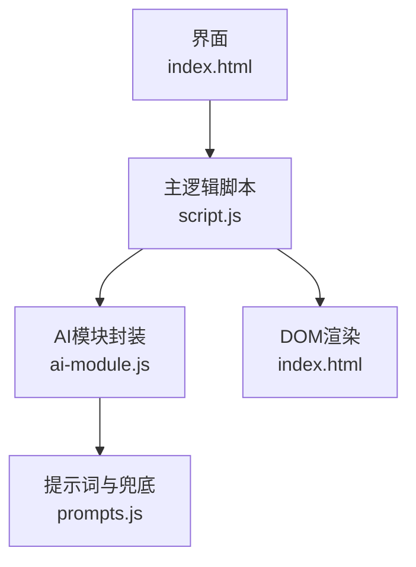
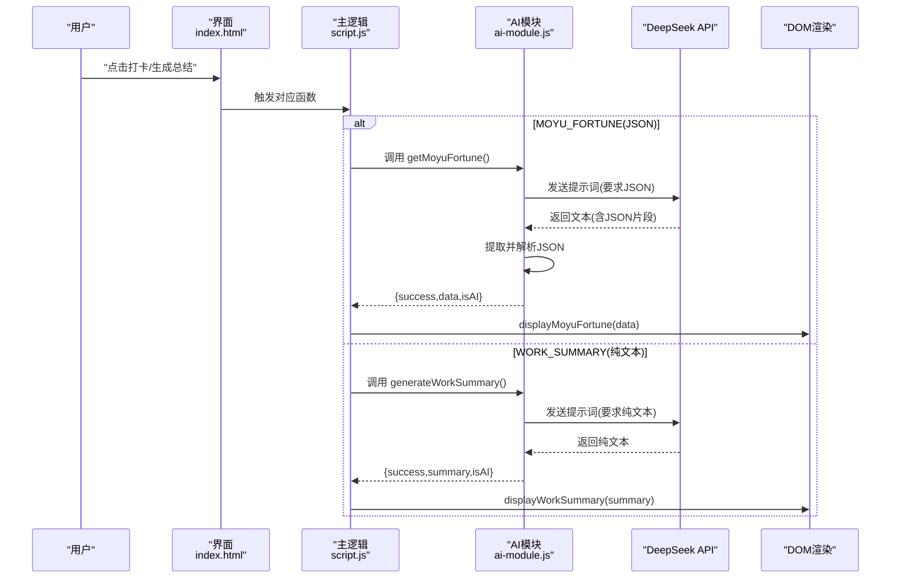
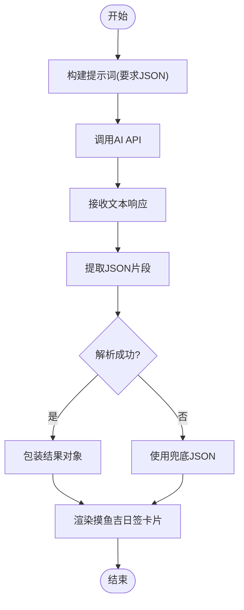
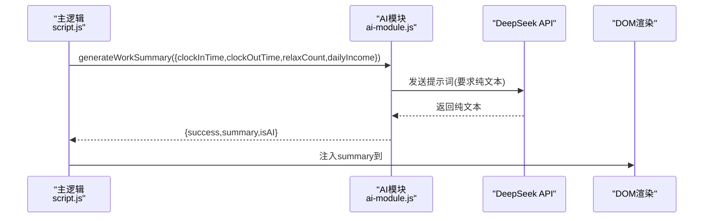
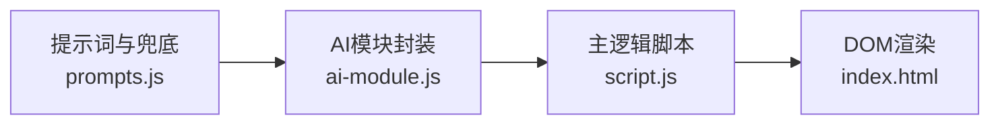

# 响应格式设计

<cite>
**本文引用的文件**
- [ai-module.js](file://ai-module.js)
- [prompts.js](file://prompts.js)
- [script.js](file://script.js)
- [index.html](file://index.html)
- [README.md](file://README.md)
</cite>

## 目录
1. [引言](#引言)
2. [项目结构](#项目结构)
3. [核心组件](#核心组件)
4. [架构总览](#架构总览)
5. [详细组件分析](#详细组件分析)
6. [依赖关系分析](#依赖关系分析)
7. [性能考量](#性能考量)
8. [故障排查指南](#故障排查指南)
9. [结论](#结论)

## 引言
本文件围绕“响应格式设计”这一主题，对比分析项目中两类AI输出形态：MOYU_FORTUNE（要求返回JSON）与WORK_SUMMARY（要求返回纯文本）。我们将从提示词约束、前端解析与渲染、兜底策略、以及可预测输出结构设计等方面展开，帮助读者理解如何通过明确的格式约定与稳健的解析策略，确保前端稳定处理AI响应，避免解析失败与渲染异常。

## 项目结构
该项目采用前端单页应用结构，AI相关逻辑集中在独立模块中，通过统一的提示词模板与API封装，分别面向不同的前端展示需求：
- 提示词与兜底文案集中于提示词模块，便于统一管理与扩展
- AI调用封装提供统一的API访问与错误兜底
- 主界面脚本负责触发AI调用、接收结果并进行渲染

图表来源
- [index.html](file://index.html#L1-L200)
- [script.js](file://script.js#L540-L730)
- [ai-module.js](file://ai-module.js#L1-L60)
- [prompts.js](file://prompts.js#L1-L60)

章节来源
- [README.md](file://README.md#L32-L49)
- [index.html](file://index.html#L1-L200)
- [script.js](file://script.js#L540-L730)
- [ai-module.js](file://ai-module.js#L1-L60)
- [prompts.js](file://prompts.js#L1-L60)

## 核心组件
- 提示词与格式约束：通过提示词模板明确要求AI返回JSON或纯文本，并给出结构化示例，降低歧义
- AI调用封装：统一发起API请求、处理响应、错误兜底与结果包装
- 前端渲染：针对不同格式分别解析与渲染，确保UI稳定呈现

章节来源
- [prompts.js](file://prompts.js#L1-L60)
- [ai-module.js](file://ai-module.js#L95-L167)
- [script.js](file://script.js#L3026-L3150)

## 架构总览
下图展示了从用户触发到最终渲染的关键流程，重点标注了两类输出格式的处理差异。

图表来源
- [script.js](file://script.js#L540-L730)
- [script.js](file://script.js#L3026-L3150)
- [ai-module.js](file://ai-module.js#L95-L167)
- [prompts.js](file://prompts.js#L1-L60)

## 详细组件分析

### MOYU_FORTUNE：要求返回JSON
- 提示词约束：明确要求返回JSON，并给出字段与示例，确保结构可预测
- 响应解析：AI模块从返回文本中提取JSON片段并解析，失败时回退至兜底对象
- 前端渲染：主逻辑将解析后的结构化数据渲染为卡片组件，字段一一对应

图表来源
- [ai-module.js](file://ai-module.js#L95-L167)
- [prompts.js](file://prompts.js#L1-L60)
- [script.js](file://script.js#L3026-L3061)

章节来源
- [ai-module.js](file://ai-module.js#L95-L167)
- [prompts.js](file://prompts.js#L1-L60)
- [script.js](file://script.js#L3026-L3061)

### WORK_SUMMARY：要求返回纯文本
- 提示词约束：明确要求直接输出总结文字，不要JSON格式，长度与风格有要求
- 响应处理：AI模块直接返回纯文本，前端按原样渲染到容器中
- 前端渲染：主逻辑将AI生成的文本注入到“今日工作总结”区域，同时补充关键指标

图表来源
- [ai-module.js](file://ai-module.js#L129-L167)
- [prompts.js](file://prompts.js#L27-L47)
- [script.js](file://script.js#L3079-L3150)

章节来源
- [ai-module.js](file://ai-module.js#L129-L167)
- [prompts.js](file://prompts.js#L27-L47)
- [script.js](file://script.js#L3079-L3150)

### 设计差异对比
- 数据结构与解析复杂度
  - JSON：结构化强，前端需解析与字段映射，但利于组件化渲染与状态管理
  - 纯文本：无需解析，前端直接渲染，但字段抽取需额外逻辑或模板替换
- 错误处理与兜底
  - JSON：通过正则提取+try/catch解析，失败回退至预设兜底对象
  - 纯文本：直接使用AI返回，失败时回退至兜底文案
- 前端渲染策略
  - JSON：字段驱动的卡片渲染，易于扩展字段与样式
  - 纯文本：以容器注入为主，适合自然语言摘要的直接展示

章节来源
- [ai-module.js](file://ai-module.js#L95-L167)
- [prompts.js](file://prompts.js#L1-L60)
- [script.js](file://script.js#L3026-L3150)

## 依赖关系分析
- 提示词模块对外提供统一的提示词与兜底文案，被AI模块与命令模块复用
- AI模块封装API调用与错误兜底，被主逻辑脚本调用
- 主逻辑脚本负责触发AI调用、接收结果并进行渲染

图表来源
- [prompts.js](file://prompts.js#L1-L159)
- [ai-module.js](file://ai-module.js#L1-L60)
- [script.js](file://script.js#L540-L730)
- [index.html](file://index.html#L120-L163)

章节来源
- [prompts.js](file://prompts.js#L1-L159)
- [ai-module.js](file://ai-module.js#L1-L60)
- [script.js](file://script.js#L540-L730)
- [index.html](file://index.html#L120-L163)

## 性能考量
- API调用参数
  - 不同任务采用不同的temperature、max_tokens，平衡创意与稳定性
- 响应解析
  - JSON解析采用正则提取+严格解析，避免全量扫描带来的性能损耗
- 渲染策略
  - 纯文本直接注入，避免额外DOM操作；JSON卡片渲染需注意字段存在性与默认值

章节来源
- [ai-module.js](file://ai-module.js#L14-L59)
- [ai-module.js](file://ai-module.js#L95-L167)
- [script.js](file://script.js#L3026-L3150)

## 故障排查指南
- API密钥缺失
  - 现象：抛出未配置密钥错误
  - 处理：在设置页保存密钥并测试连接
- JSON解析失败
  - 现象：无法解析AI返回的JSON
  - 处理：回退至兜底JSON对象，确认提示词模板中的JSON示例与字段一致
- 纯文本渲染异常
  - 现象：容器不存在或内容为空
  - 处理：检查DOM元素是否存在，确认AI返回文本非空
- 兜底文案生效
  - 现象：AI调用失败或解析失败时显示兜底文案
  - 处理：检查提示词模板与兜底文案配置，确保字段与类型匹配

章节来源
- [ai-module.js](file://ai-module.js#L14-L59)
- [ai-module.js](file://ai-module.js#L95-L167)
- [prompts.js](file://prompts.js#L120-L159)
- [script.js](file://script.js#L3079-L3150)

## 结论
- 在提示词中明确指定输出格式是确保前后端稳定协作的关键：MOYU_FORTUNE要求JSON，便于结构化渲染；WORK_SUMMARY要求纯文本，适合自然语言摘要直接展示
- 通过严格的格式约束、稳健的解析策略与完善的兜底机制，前端能够稳定处理AI响应，避免解析失败与渲染异常
- 设计可预测的输出结构（如字段名、示例、长度限制）有助于前端组件化渲染与长期维护