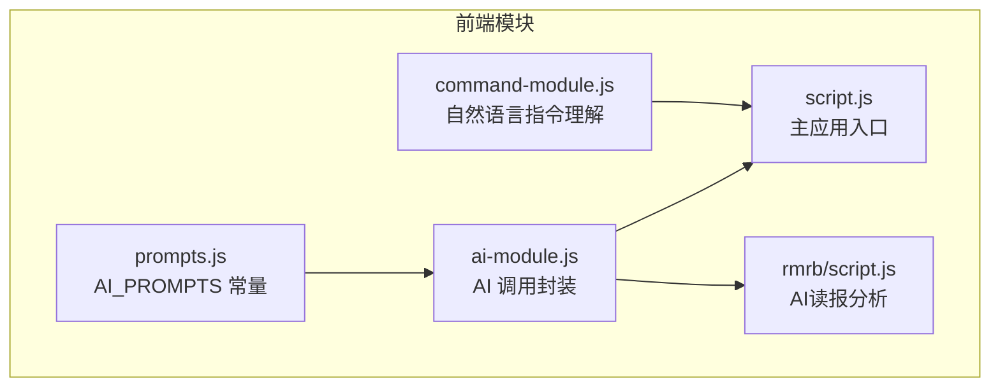
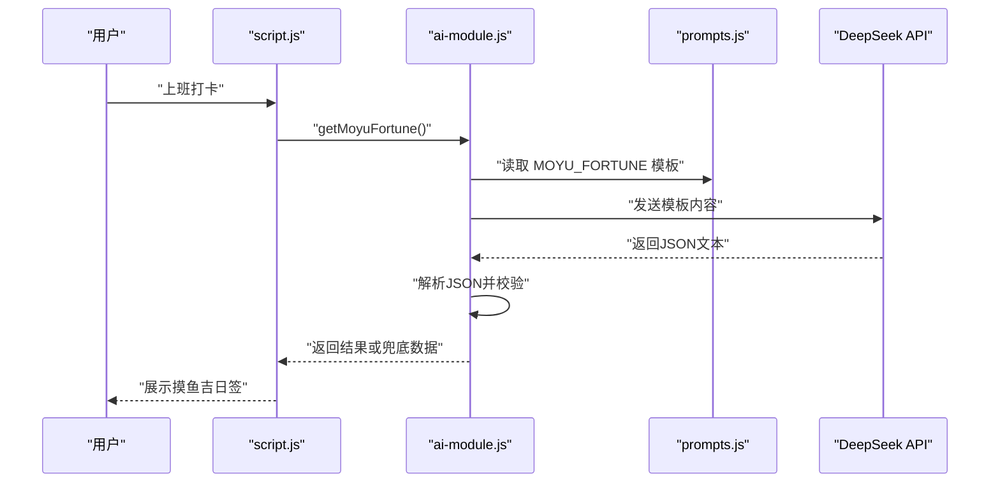
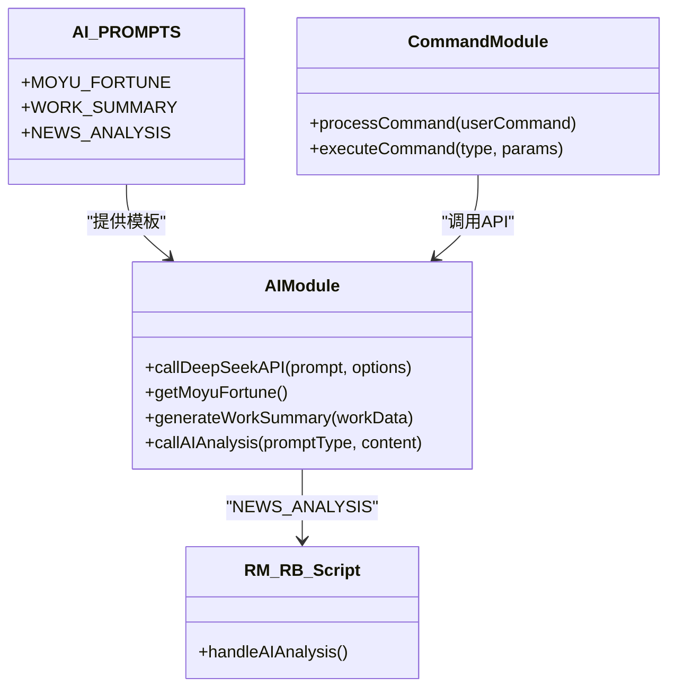
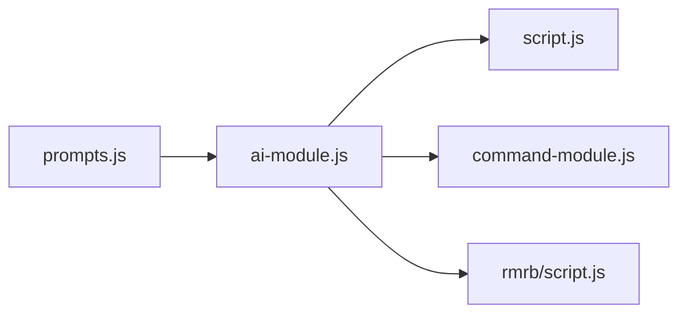

# 提示词结构与规范

<cite>
**本文引用的文件**
- [prompts.js](file://prompts.js)
- [ai-module.js](file://ai-module.js)
- [script.js](file://script.js)
- [command-module.js](file://command-module.js)
- [rmrb/script.js](file://rmrb/script.js)
- [README.md](file://README.md)
- [CHANGELOG.md](file://CHANGELOG.md)
</cite>

## 目录
1. [简介](#简介)
2. [项目结构](#项目结构)
3. [核心组件](#核心组件)
4. [架构总览](#架构总览)
5. [详细组件分析](#详细组件分析)
6. [依赖关系分析](#依赖关系分析)
7. [性能考量](#性能考量)
8. [故障排查指南](#故障排查指南)
9. [结论](#结论)
10. [附录](#附录)

## 简介
本文件围绕 prompts.js 中的 AI_PROMPTS 常量展开，系统阐述其结构设计原则与规范要求，重点包括：
- 命名约定（大写蛇形）的设计动机与一致性要求
- 多行模板字符串的格式化规范（反引号包裹、缩进一致、注释清晰）
- 通过结构化注释定义输出格式、内容风格与长度限制的方法论
- 以 MOYU_FORTUNE 与 WORK_SUMMARY 为例，展示如何在提示词中约束输出形态
- 将 AI 提示词集中管理带来的可维护性与多模块复用优势

## 项目结构
本项目采用前端模块化组织，AI 提示词集中于 prompts.js，AI 调用封装于 ai-module.js，业务入口与交互逻辑位于 script.js，自然语言指令理解位于 command-module.js，新闻分析功能位于 rmrb 子模块。

图表来源
- [prompts.js](file://prompts.js#L1-L159)
- [ai-module.js](file://ai-module.js#L1-L216)
- [command-module.js](file://command-module.js#L1-L313)
- [script.js](file://script.js#L493-L732)
- [rmrb/script.js](file://rmrb/script.js#L358-L418)

章节来源
- [README.md](file://README.md#L1-L125)
- [CHANGELOG.md](file://CHANGELOG.md#L1-L130)

## 核心组件
- AI_PROMPTS 常量：统一存放所有 AI 提示词模板，键名采用大写蛇形命名法，便于跨模块引用与检索。
- FALLBACK_MESSAGES：为不同提示词类型提供兜底文案，确保在网络或模型异常时仍能稳定输出。
- ai-module.js：封装 DeepSeek API 调用、提示词拼装、错误兜底与结果解析。
- command-module.js：将自然语言指令映射为结构化操作，其中也包含独立的指令理解提示模板。
- rmrb/script.js：在“AI读报”场景中调用 AIModule 的通用分析接口，传入 NEWS_ANALYSIS 模板。

章节来源
- [prompts.js](file://prompts.js#L1-L159)
- [ai-module.js](file://ai-module.js#L1-L216)
- [command-module.js](file://command-module.js#L1-L313)
- [rmrb/script.js](file://rmrb/script.js#L358-L418)

## 架构总览
AI 提示词作为“契约式”的输入模板，贯穿从自然语言理解、打卡流程到新闻分析的多个业务场景。其设计遵循“强约束、可复用、易维护”的原则。

图表来源
- [script.js](file://script.js#L547-L728)
- [ai-module.js](file://ai-module.js#L95-L167)
- [prompts.js](file://prompts.js#L1-L120)

## 详细组件分析

### 命名约定与设计原则
- 键名采用大写蛇形命名法（如 MOYU_FORTUNE、WORK_SUMMARY、NEWS_ANALYSIS）。该命名策略的优势在于：
  - 语义明确：通过全大写与下划线分隔，直观表达提示词的功能场景与用途
  - 便于检索：在大型代码库中，统一的命名风格有助于快速定位与引用
  - 降低耦合：键名作为稳定契约，避免硬编码散落各处，提升模块间解耦
  - 与功能场景严格对应：键名直接反映提示词的应用场景，便于维护与扩展

章节来源
- [prompts.js](file://prompts.js#L1-L120)

### 多行模板字符串格式化规范
- 使用反引号包裹多行字符串，确保换行与空白字符保留，便于人类阅读与编辑器语法高亮
- 保持缩进一致：模板字符串内的缩进应与文件层级保持一致，避免出现不必要的空行或混乱缩进
- 注释清晰：在模板中使用结构化注释（如“要求：”、“返回JSON格式：”、“## 输出格式”等）明确约束条件，使提示词具备“契约式”的可读性与可维护性

章节来源
- [prompts.js](file://prompts.js#L1-L120)

### 结构化注释与输出约束
通过结构化注释，提示词模板可以清晰地定义输出格式、内容风格与长度限制。以 MOYU_FORTUNE 与 WORK_SUMMARY 为例：

- MOYU_FORTUNE
  - 输出格式：要求返回 JSON，包含三段关键信息（运势、最佳摸鱼时间、摸鱼锦囊）
  - 内容风格：幽默诙谐、积极向上，语言要接地气
  - 长度与字数：对每段内容给出字数范围（如“15-25字”“15-30字”）
  - 场景融合：鼓励结合办公室日常与工作场景，增强代入感
  - 严格约束：明确只返回 JSON，不得附加其他文字，便于下游解析

- WORK_SUMMARY
  - 输出格式：直接输出总结语句，非 JSON
  - 内容风格：幽默风趣、积极向上
  - 长度限制：控制在 80-120 字之间
  - 数据完整性：必须包含关键数据（上班时间、下班时间、摸鱼次数、今日收入）
  - 示例风格：提供参考示例，鼓励创造性发挥

章节来源
- [prompts.js](file://prompts.js#L1-L120)
- [ai-module.js](file://ai-module.js#L129-L167)

### 兜底文案与错误处理
- FALLBACK_MESSAGES 为不同类型提供兜底文案，确保在 API 调用失败或解析异常时仍能稳定输出
- ai-module.js 在调用 API 失败或解析失败时，回退到 FALLBACK_MESSAGES 对应类型的数据，同时返回 isAI=false 标识，便于 UI 区分真实 AI 产出与兜底文案

章节来源
- [prompts.js](file://prompts.js#L122-L159)
- [ai-module.js](file://ai-module.js#L95-L167)

### 多模块复用与集中管理
- 集中管理的好处：
  - 统一契约：所有提示词模板集中在一处，便于统一审阅与修订
  - 降低重复：避免在多个模块中重复编写相似提示词
  - 易于扩展：新增场景只需在 prompts.js 中追加键值，无需改动调用方
  - 可测试性：集中化的模板更利于编写单元测试与回归验证
- 实际复用场景：
  - 打卡流程：MOYU_FORTUNE 与 WORK_SUMMARY 分别用于上班与下班场景
  - 自然语言指令理解：command-module.js 中的 COMMAND_UNDERSTANDING_PROMPT 作为独立模板
  - 新闻分析：rmrb/script.js 通过 AIModule 调用通用分析接口，传入 NEWS_ANALYSIS 模板

章节来源
- [prompts.js](file://prompts.js#L1-L159)
- [ai-module.js](file://ai-module.js#L170-L204)
- [command-module.js](file://command-module.js#L21-L55)
- [rmrb/script.js](file://rmrb/script.js#L358-L418)

### 类图：提示词与调用链关系

图表来源
- [prompts.js](file://prompts.js#L1-L120)
- [ai-module.js](file://ai-module.js#L1-L216)
- [command-module.js](file://command-module.js#L182-L259)
- [rmrb/script.js](file://rmrb/script.js#L358-L418)

## 依赖关系分析
- prompts.js 与 ai-module.js：ai-module.js 通过 window 全局暴露的 AI_PROMPTS 读取模板，进行参数注入与调用
- ai-module.js 与 script.js：script.js 在打卡流程中调用 AIModule 的方法，展示摸鱼吉日签与工作总结
- ai-module.js 与 command-module.js：command-module.js 通过 AIModule 调用 API，实现自然语言指令理解
- ai-module.js 与 rmrb/script.js：rmrb/script.js 通过 AIModule 调用通用分析接口，传入 NEWS_ANALYSIS 模板

图表来源
- [prompts.js](file://prompts.js#L1-L159)
- [ai-module.js](file://ai-module.js#L1-L216)
- [script.js](file://script.js#L547-L728)
- [command-module.js](file://command-module.js#L182-L259)
- [rmrb/script.js](file://rmrb/script.js#L358-L418)

章节来源
- [prompts.js](file://prompts.js#L1-L159)
- [ai-module.js](file://ai-module.js#L1-L216)
- [script.js](file://script.js#L547-L728)
- [command-module.js](file://command-module.js#L182-L259)
- [rmrb/script.js](file://rmrb/script.js#L358-L418)

## 性能考量
- 模板大小与上下文长度：提示词模板应尽量精简，避免冗余信息导致上下文膨胀，从而增加 Token 消耗与延迟
- 参数注入策略：在 ai-module.js 中对模板进行占位符替换时，建议批量替换并避免重复字符串操作
- 错误兜底：通过 FALLBACK_MESSAGES 提供轻量级兜底文案，减少二次调用与网络开销
- 温度与最大 Token：在不同场景下调优 temperature 与 max_tokens，平衡创造性与稳定性

[本节为通用指导，不直接分析具体文件]

## 故障排查指南
- API 密钥缺失：若未配置 API 密钥，调用将抛出错误；可在设置界面保存密钥后重试
- JSON 解析失败：当 AI 返回非标准 JSON 时，getMoyuFortune 会捕获并回退到兜底数据
- 指令理解低置信度：processCommand 对置信度低于阈值的情况会走聊天模式，避免误执行
- 新闻分析失败：handleAIAnalysis 会在失败时显示错误提示并回退到随机兜底文案

章节来源
- [ai-module.js](file://ai-module.js#L14-L59)
- [ai-module.js](file://ai-module.js#L95-L167)
- [command-module.js](file://command-module.js#L182-L259)
- [rmrb/script.js](file://rmrb/script.js#L358-L418)
- [prompts.js](file://prompts.js#L122-L159)

## 结论
- 命名采用大写蛇形，确保键名与功能场景一一对应，提升可读性与可维护性
- 多行模板字符串以结构化注释定义输出格式、风格与长度，形成“契约式”的提示词规范
- 将提示词集中管理，实现跨模块复用与统一维护，降低重复与耦合风险
- 通过 FALLBACK_MESSAGES 与错误处理机制，保障在异常情况下仍能稳定输出

[本节为总结性内容，不直接分析具体文件]

## 附录
- 术语说明
  - 提示词模板：用于引导大模型生成特定格式与风格输出的结构化文本
  - 兜底文案：在 API 或解析失败时的备用输出，保证用户体验连续性
- 参考文件
  - [README.md](file://README.md#L1-L125)
  - [CHANGELOG.md](file://CHANGELOG.md#L1-L130)

[本节为补充说明，不直接分析具体文件]