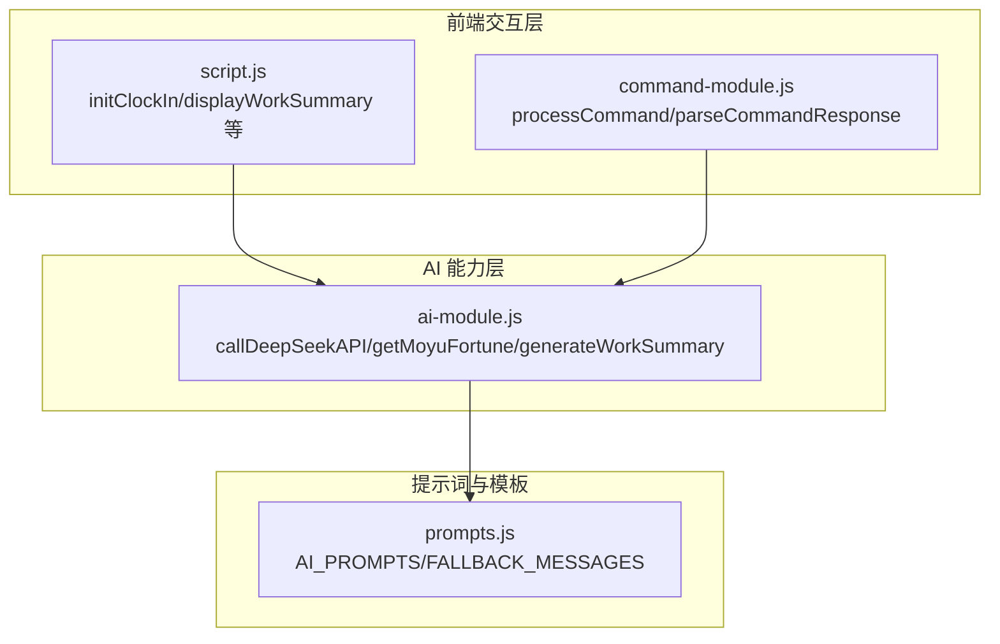
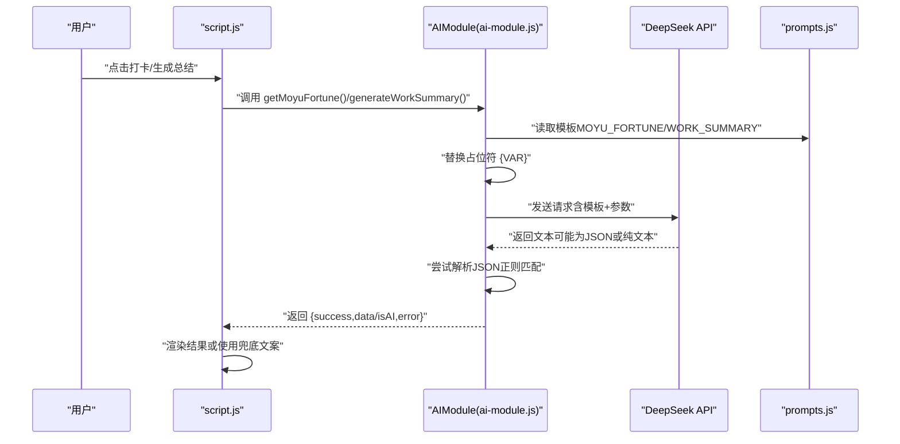
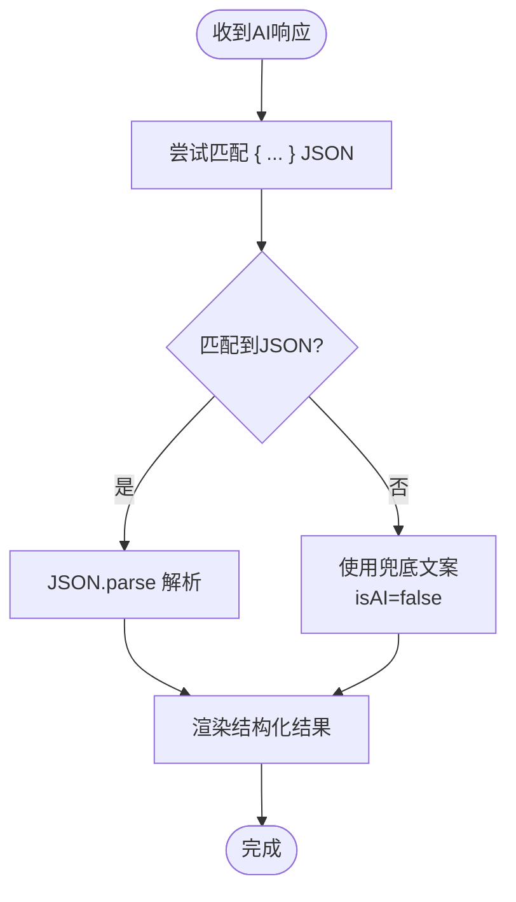
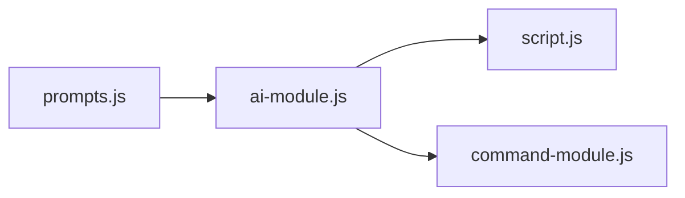

# 提示词设计指南

<cite>
**本文引用的文件**
- [prompts.js](file://prompts.js)
- [ai-module.js](file://ai-module.js)
- [script.js](file://script.js)
- [command-module.js](file://command-module.js)
- [README.md](file://README.md)
</cite>

## 目录
1. [引言](#引言)
2. [项目结构](#项目结构)
3. [核心组件](#核心组件)
4. [架构总览](#架构总览)
5. [详细组件分析](#详细组件分析)
6. [依赖关系分析](#依赖关系分析)
7. [性能考量](#性能考量)
8. [故障排查指南](#故障排查指南)
9. [结论](#结论)
10. [附录](#附录)

## 引言
本指南面向希望在 work-timer 项目中设计与添加新 AI 提示词模板的开发者。文档围绕 prompts.js 文件的结构与规范展开，重点说明：
- AI_PROMPTS 常量的定义方式与注释书写标准
- 模板命名规范（大写蛇形命名法）
- 多行字符串的格式化要求
- 使用 {VARIABLE} 占位符动态注入运行时数据的方法与注意事项
- JSON 格式输出的约束（仅返回纯 JSON，禁止额外文本）
- 不同响应格式（JSON 与纯文本）的设计差异与适用场景
- 如何为新功能设计结构化输出模板，确保前端稳定解析
- 通过注释中的示例风格引导 AI 生成符合预期语气与长度的内容

## 项目结构
work-timer 项目采用“功能模块 + 提示词集中管理”的组织方式：
- 提示词集中管理：prompts.js 统一存放所有 AI 提示词模板与兜底文案
- AI 能力封装：ai-module.js 封装 DeepSeek API 调用、错误处理与通用参数
- 前端集成：script.js 在用户交互流程中调用 AIModule 的方法，拼接模板与占位符，渲染结果
- 指令理解：command-module.js 使用结构化 JSON 输出模板，确保前端可稳定解析

图表来源
- [prompts.js](file://prompts.js#L1-L159)
- [ai-module.js](file://ai-module.js#L1-L216)
- [script.js](file://script.js#L493-L732)
- [command-module.js](file://command-module.js#L1-L313)

章节来源
- [README.md](file://README.md#L32-L49)

## 核心组件
- AI_PROMPTS：集中定义所有提示词模板，包含 MOYU_FORTUNE、WORK_SUMMARY、NEWS_ANALYSIS 等键值对
- FALLBACK_MESSAGES：为每个模板提供兜底文案，确保网络异常或解析失败时仍能稳定返回
- ai-module.js：封装 DeepSeek API 调用、参数配置、错误处理；提供 getMoyuFortune、generateWorkSummary、callAIAnalysis 等方法
- script.js：在打卡流程中调用 AIModule 方法，拼接模板与占位符，渲染结果
- command-module.js：使用结构化 JSON 输出模板，配合 parseCommandResponse 稳定解析

章节来源
- [prompts.js](file://prompts.js#L1-L159)
- [ai-module.js](file://ai-module.js#L1-L216)
- [script.js](file://script.js#L493-L732)
- [command-module.js](file://command-module.js#L1-L313)

## 架构总览
下图展示了从用户触发到 AI 返回并渲染结果的关键流程，涵盖模板拼接、参数注入、JSON 解析与兜底策略。

图表来源
- [ai-module.js](file://ai-module.js#L95-L167)
- [prompts.js](file://prompts.js#L1-L120)
- [script.js](file://script.js#L636-L732)

## 详细组件分析

### prompts.js 结构与规范
- 定义位置与导出
  - AI_PROMPTS 与 FALLBACK_MESSAGES 通过 window 全局暴露，供前端模块直接使用
  - getRandomFallbackMessage 提供随机兜底文案选择逻辑
- 模板命名规范
  - 使用大写蛇形命名法（如 MOYU_FORTUNE、WORK_SUMMARY、NEWS_ANALYSIS），便于统一检索与维护
- 注释书写标准
  - 每个模板均包含“要求”“返回格式”“示例风格”等说明，明确语气、长度、结构与输出格式
  - 对 JSON 输出的约束（仅返回 JSON，不要额外文字）在模板中明确标注
- 多行字符串格式化
  - 使用反引号包裹多行字符串，保留换行与缩进，便于阅读与维护
  - 在需要插入外部数据时，使用 {VARIABLE} 占位符，避免硬编码
- 兜底文案
  - 对不同模板提供对应的 FALLBACK_MESSAGES，确保异常时仍能稳定返回

章节来源
- [prompts.js](file://prompts.js#L1-L159)

### 占位符注入与变量替换
- 注入时机
  - 在调用 AI 之前，将运行时数据替换到模板中
- 替换策略
  - 对于 WORK_SUMMARY，使用多次 replace 将 {CLOCK_IN_TIME}、{CLOCK_OUT_TIME}、{RELAX_COUNT}、{DAILY_INCOME} 等占位符替换为实际值
  - 对于 NEWS_ANALYSIS，使用一次 replace 将 {CONTENT} 插入到模板中
- 注意事项
  - 确保所有占位符在调用前都被替换，避免模板残留
  - 对于 JSON 输出模板，务必保证最终只返回 JSON，不包含任何额外文本

章节来源
- [ai-module.js](file://ai-module.js#L134-L167)
- [ai-module.js](file://ai-module.js#L175-L204)

### JSON 输出约束与解析
- 约束条件
  - 模板中明确要求“只返回JSON，不要有其他文字”
  - 对于需要结构化输出的模板（如 MOYU_FORTUNE），前端通过正则匹配提取 JSON 字符串并解析
- 解析流程
  - AIModule 在收到响应后尝试使用正则匹配 { ... } 形式的 JSON，并进行 JSON.parse
  - 若解析失败，返回兜底数据并标记 isAI=false
- 前端渲染
  - 对于 JSON 模板，前端期望得到结构化的对象；对于纯文本模板，直接渲染文本

图表来源
- [ai-module.js](file://ai-module.js#L95-L127)

章节来源
- [ai-module.js](file://ai-module.js#L95-L127)

### 不同响应格式的设计差异（MOYU_FORTUNE vs WORK_SUMMARY）
- MOYU_FORTUNE（JSON）
  - 输出格式：严格 JSON，包含 fortune、bestTime、tips 三字段
  - 语气与长度：要求积极向上、幽默风趣，长度受字段约束
  - 前端解析：通过 JSON 解析稳定获取对象
- WORK_SUMMARY（纯文本）
  - 输出格式：直接返回一段总结文字，不包含 JSON
  - 语气与长度：要求幽默风趣，长度控制在 80-120 字
  - 前端解析：直接渲染文本，无需 JSON 解析

章节来源
- [prompts.js](file://prompts.js#L6-L25)
- [prompts.js](file://prompts.js#L27-L47)
- [ai-module.js](file://ai-module.js#L134-L167)

### 为新功能设计结构化输出模板的最佳实践
- 明确输出格式
  - 若需要结构化数据，使用 JSON 输出模板并在模板中给出示例结构
  - 若仅需自然语言文本，明确要求“直接输出总结语句，不要额外说明”
- 严格约束
  - 在模板中明确“只返回JSON，不要有其他文字”，避免前端解析失败
- 保持一致性
  - 使用大写蛇形命名法命名模板键
  - 在注释中提供示例风格，指导 AI 生成符合预期语气与长度的内容
- 兜底策略
  - 为新模板提供 FALLBACK_MESSAGES，确保异常时仍能稳定返回
  - 在 AIModule 中增加对应兜底逻辑，避免前端崩溃

章节来源
- [prompts.js](file://prompts.js#L122-L159)
- [ai-module.js](file://ai-module.js#L134-L204)

### 示例风格引导与语气控制
- 在模板注释中提供示例风格，帮助 AI 理解期望的语气与长度
- 对于需要 JSON 输出的模板，提供示例 JSON 结构，降低歧义
- 对于纯文本模板，给出典型长度范围与表达方式，避免过长或过短

章节来源
- [prompts.js](file://prompts.js#L6-L25)
- [prompts.js](file://prompts.js#L27-L47)
- [command-module.js](file://command-module.js#L24-L54)

## 依赖关系分析
- prompts.js 与 ai-module.js
  - ai-module.js 从 window 读取 AI_PROMPTS 并进行占位符替换
  - 对 JSON 模板进行解析，对纯文本模板直接使用
- ai-module.js 与 script.js
  - script.js 在用户交互（如打卡）时调用 AIModule 的方法，渲染结果或兜底文案
- command-module.js 与 ai-module.js
  - command-module.js 使用结构化 JSON 输出模板，通过 parseCommandResponse 稳定解析

图表来源
- [prompts.js](file://prompts.js#L1-L159)
- [ai-module.js](file://ai-module.js#L1-L216)
- [script.js](file://script.js#L493-L732)
- [command-module.js](file://command-module.js#L1-L313)

章节来源
- [prompts.js](file://prompts.js#L1-L159)
- [ai-module.js](file://ai-module.js#L1-L216)
- [script.js](file://script.js#L493-L732)
- [command-module.js](file://command-module.js#L1-L313)

## 性能考量
- API 参数调优
  - 通过 temperature、max_tokens、top_p 等参数平衡稳定性与创造性
  - 对需要结构化输出的场景，适当降低 temperature 以提高确定性
- 文本解析成本
  - JSON 模板使用正则匹配提取 JSON，避免复杂解析逻辑
- 兜底策略
  - 提供 FALLBACK_MESSAGES 与 getRandomFallbackMessage，减少失败重试与错误处理成本

章节来源
- [ai-module.js](file://ai-module.js#L14-L59)
- [ai-module.js](file://ai-module.js#L134-L204)
- [prompts.js](file://prompts.js#L122-L159)

## 故障排查指南
- API 密钥缺失
  - 现象：抛出“未配置 API 密钥”错误
  - 处理：在设置页保存 DeepSeek API Key
- API 请求失败
  - 现象：响应非 2xx 或返回错误信息
  - 处理：检查网络、密钥有效性与服务状态
- JSON 解析失败
  - 现象：无法解析 AI 返回的 JSON
  - 处理：确认模板要求“只返回JSON，不要有其他文字”；必要时启用兜底文案
- 占位符未替换
  - 现象：模板中残留 {VAR}
  - 处理：检查调用处的 replace 逻辑，确保所有占位符都被替换

章节来源
- [ai-module.js](file://ai-module.js#L14-L59)
- [ai-module.js](file://ai-module.js#L95-L127)
- [ai-module.js](file://ai-module.js#L134-L204)
- [script.js](file://script.js#L424-L491)

## 结论
通过统一的提示词模板管理与严格的输出约束，work-timer 实现了稳定的 AI 交互体验。新增模板时，应遵循：
- 大写蛇形命名法
- 明确的注释与示例风格
- 严格的 JSON 输出约束
- 完善的兜底策略
- 前端稳定的解析与渲染

## 附录
- 模板命名建议
  - 使用大写蛇形命名法（如 NEW_TEMPLATE_NAME）
- 占位符规范
  - 使用 {VARIABLE} 形式，确保调用前全部替换
- 输出格式约定
  - JSON 模板：仅返回 JSON，不要额外文本
  - 纯文本模板：直接输出文本，不要 JSON