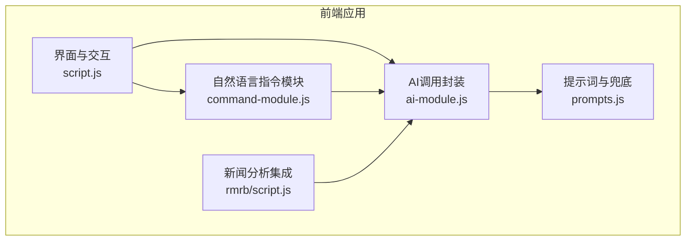
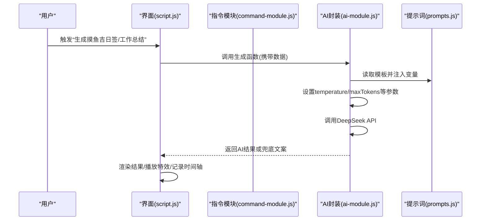
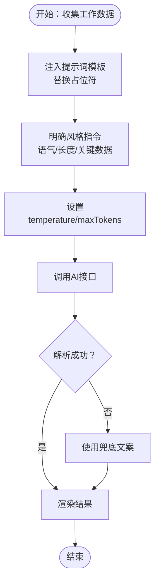
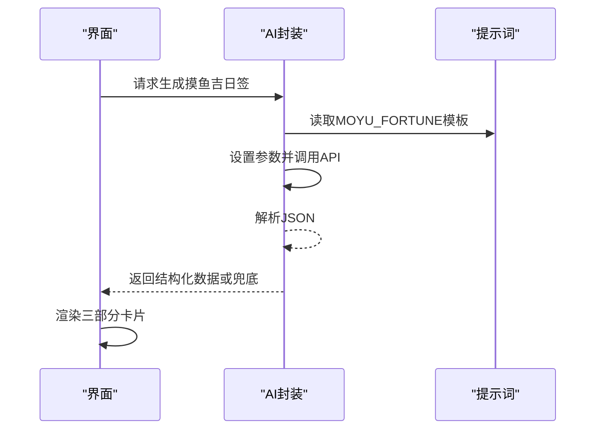
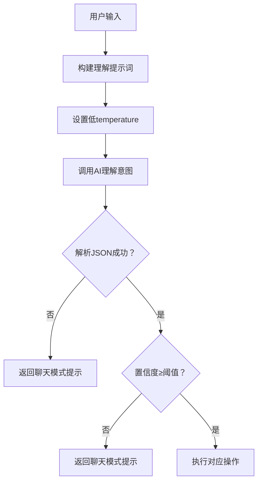
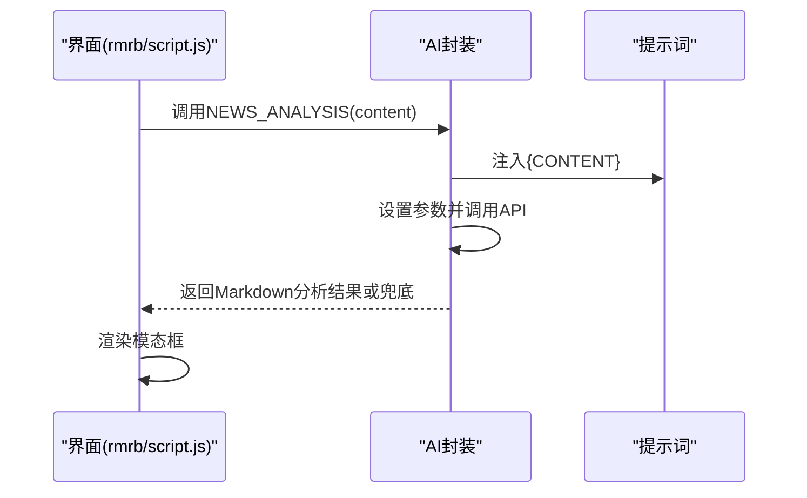
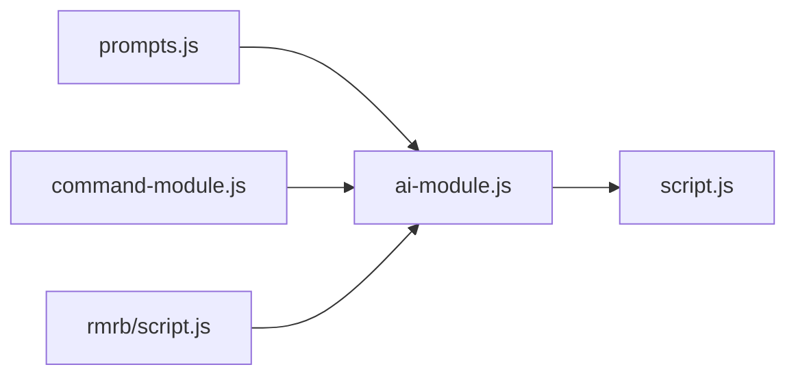

# 提示词风格引导

<cite>
**本文引用的文件**
- [prompts.js](file://prompts.js)
- [ai-module.js](file://ai-module.js)
- [command-module.js](file://command-module.js)
- [script.js](file://script.js)
- [README.md](file://README.md)
- [rmrb/script.js](file://rmrb/script.js)
</cite>

## 目录
1. [引言](#引言)
2. [项目结构](#项目结构)
3. [核心组件](#核心组件)
4. [架构总览](#架构总览)
5. [详细组件分析](#详细组件分析)
6. [依赖关系分析](#依赖关系分析)
7. [性能考量](#性能考量)
8. [故障排查指南](#故障排查指南)
9. [结论](#结论)
10. [附录](#附录)

## 引言
本文件围绕“提示词风格引导”展开，旨在说明如何通过精心设计的提示词模板与参数策略，引导AI生成符合预期语气、长度与关键信息密度的内容。本文以仓库中的“摸鱼吉日签”“工作总结”“新闻分析”等场景为例，系统阐述：
- 示例风格如何塑造输出语气与长度
- 如何在提示词中明确风格指令（如“像朋友间的玩笑”）
- 如何平衡约束与创造性，既保证一致性又保留AI的灵活发挥
- 如何通过参数（如温度、最大令牌数）与兜底策略提升稳定性
- 如何建立持续评估与迭代机制，优化提示词表述

## 项目结构
该项目采用前端模块化组织，AI相关能力集中在独立模块中，通过统一的提示词配置文件集中管理。关键路径如下：
- 提示词与兜底文案：prompts.js
- AI调用封装与生成流程：ai-module.js
- 自然语言指令理解与执行：command-module.js
- 应用入口与交互逻辑：script.js
- 新闻分析集成：rmrb/script.js
- 产品说明：README.md

图表来源
- [script.js](file://script.js#L922-L1030)
- [command-module.js](file://command-module.js#L182-L259)
- [ai-module.js](file://ai-module.js#L1-L216)
- [prompts.js](file://prompts.js#L1-L159)
- [rmrb/script.js](file://rmrb/script.js#L395-L441)

章节来源
- [README.md](file://README.md#L1-L125)

## 核心组件
- 提示词配置与兜底策略：统一管理各类提示词模板与兜底文案，确保在AI异常时仍能提供稳定输出。
- AI调用封装：封装DeepSeek API调用、参数配置、错误兜底与结果解析。
- 自然语言指令模块：将用户自然语言转为结构化意图，支持聊天模式与操作执行。
- 应用交互层：负责触发AI生成、渲染结果、播放特效、记录时间轴等。

章节来源
- [prompts.js](file://prompts.js#L1-L159)
- [ai-module.js](file://ai-module.js#L1-L216)
- [command-module.js](file://command-module.js#L1-L313)
- [script.js](file://script.js#L493-L732)

## 架构总览
下图展示了从用户输入到AI输出的关键流程，以及提示词与参数如何影响最终内容风格与长度。

图表来源
- [script.js](file://script.js#L636-L728)
- [ai-module.js](file://ai-module.js#L95-L167)
- [prompts.js](file://prompts.js#L1-L120)

## 详细组件分析

### 组件A：提示词风格与示例引导（WORK_SUMMARY）
- 示例风格的作用
  - 在提示词中提供示例风格（如“像朋友间的玩笑”），明确语气边界，使AI在幽默与正向之间取得平衡。
  - 示例风格作为参考而非严格模板，允许AI在相同语境下进行创造性发挥，避免生硬刻板。
- 关键数据点的覆盖
  - 提示词明确列出必须包含的数据项（如上班时间、下班时间、摸鱼次数、今日收入），确保输出具备完整信息密度。
- 长度控制
  - 通过“长度控制在XX字”等约束，限制输出长度，保证阅读体验与展示空间的匹配。
- 语气与风格指令
  - “整体风格：幽默诙谐、积极向上”“语言要接地气，像朋友间的玩笑”等指令，为AI提供稳定的风格锚点。
- 参数与稳定性
  - 生成函数中设置更高的temperature与合适的maxTokens，兼顾创造性与可控长度。

图表来源
- [prompts.js](file://prompts.js#L27-L47)
- [ai-module.js](file://ai-module.js#L134-L167)
- [script.js](file://script.js#L3080-L3150)

章节来源
- [prompts.js](file://prompts.js#L27-L47)
- [ai-module.js](file://ai-module.js#L134-L167)
- [script.js](file://script.js#L3080-L3150)

### 组件B：提示词风格与结构化输出（MOYU_FORTUNE）
- 结构化JSON输出
  - 提示词要求返回JSON，包含“运势”“最佳时间”“锦囊”三部分，确保输出结构清晰、便于前端渲染。
- 风格与创意空间
  - 要求“积极向上、幽默诙谐、接地气”，同时允许结合办公室日常与工作场景，鼓励AI在框架内自由发挥。
- 兜底策略
  - 若AI返回非JSON或异常，使用预设兜底JSON，保证界面稳定呈现。

图表来源
- [prompts.js](file://prompts.js#L1-L26)
- [ai-module.js](file://ai-module.js#L95-L127)
- [script.js](file://script.js#L3026-L3061)

章节来源
- [prompts.js](file://prompts.js#L1-L26)
- [ai-module.js](file://ai-module.js#L95-L127)
- [script.js](file://script.js#L3026-L3061)

### 组件C：自然语言指令理解与风格引导（COMMAND_UNDERSTANDING_PROMPT）
- 意图判断与聊天模式
  - 提示词明确区分“操作意图”和“聊天模式”，并给出置信度阈值，低于阈值自动进入聊天模式，避免误执行。
- 风格与友好性
  - 指令模板要求“chat_response要自然友好，不要太正式”，为聊天回复提供风格锚点。
- 参数策略
  - 使用较低temperature，提升意图判断的确定性；同时限制maxTokens，避免冗长输出。

图表来源
- [command-module.js](file://command-module.js#L182-L259)

章节来源
- [command-module.js](file://command-module.js#L182-L259)

### 组件D：新闻分析提示词与结构化输出（NEWS_ANALYSIS）
- 结构化输出要求
  - 提示词要求使用Markdown层级化输出，包含“整体政策导向”“重点文章解读”“投资与决策建议”“风险提示”“总结与展望”等板块，确保输出具备专业性与可读性。
- 数据注入与上下文
  - 将“要闻原文”注入模板，保证分析基于真实数据。
- 参数与兜底
  - 设置较高maxTokens以容纳长文本分析；异常时返回预设兜底文案数组。

图表来源
- [prompts.js](file://prompts.js#L49-L119)
- [ai-module.js](file://ai-module.js#L169-L204)
- [rmrb/script.js](file://rmrb/script.js#L395-L441)

章节来源
- [prompts.js](file://prompts.js#L49-L119)
- [ai-module.js](file://ai-module.js#L169-L204)
- [rmrb/script.js](file://rmrb/script.js#L395-L441)

## 依赖关系分析
- 提示词与生成流程的耦合
  - ai-module.js依赖prompts.js提供的模板与兜底文案；script.js在UI层调用ai-module.js并渲染结果。
- 指令模块与AI的协作
  - command-module.js在理解用户意图后，决定是否调用ai-module.js执行聊天或操作；其自身也依赖ai-module.js的API调用能力。
- 错误与兜底
  - 所有生成函数均包含try/catch与兜底策略，确保在API异常或解析失败时仍能返回稳定内容。

图表来源
- [prompts.js](file://prompts.js#L1-L159)
- [ai-module.js](file://ai-module.js#L1-L216)
- [command-module.js](file://command-module.js#L1-L313)
- [script.js](file://script.js#L922-L1030)
- [rmrb/script.js](file://rmrb/script.js#L395-L441)

章节来源
- [prompts.js](file://prompts.js#L1-L159)
- [ai-module.js](file://ai-module.js#L1-L216)
- [command-module.js](file://command-module.js#L1-L313)
- [script.js](file://script.js#L922-L1030)
- [rmrb/script.js](file://rmrb/script.js#L395-L441)

## 性能考量
- 参数调优
  - 不同任务选择不同temperature与maxTokens：意图理解使用低temperature以提升确定性；生成类任务使用较高temperature以增强创造性；长文本分析适当提高maxTokens。
- 兜底与降级
  - 在API失败或解析失败时，优先使用兜底文案，避免长时间等待与空白界面。
- 渲染与交互
  - 生成过程中显示加载动画与状态提示，改善用户体验；渲染完成后及时清理动画资源。

章节来源
- [ai-module.js](file://ai-module.js#L14-L59)
- [ai-module.js](file://ai-module.js#L95-L167)
- [ai-module.js](file://ai-module.js#L169-L204)
- [command-module.js](file://command-module.js#L182-L259)
- [script.js](file://script.js#L636-L728)

## 故障排查指南
- API密钥未配置
  - 现象：AI助手无法发送消息或生成内容。
  - 处理：在设置页保存DeepSeek API Key，并进行连接测试。
- AI调用失败
  - 现象：生成失败或返回兜底文案。
  - 处理：检查网络与密钥有效性；查看错误信息并重试；必要时降低temperature或缩短maxTokens。
- 解析失败（JSON/Markdown）
  - 现象：无法解析AI返回的JSON或Markdown。
  - 处理：启用兜底文案；检查提示词是否包含明确的输出格式要求；确认占位符替换正确。
- 指令理解不准确
  - 现象：置信度低导致进入聊天模式。
  - 处理：优化自然语言表达；增加示例与风格指令；适当提高置信度阈值或调整temperature。

章节来源
- [script.js](file://script.js#L424-L491)
- [ai-module.js](file://ai-module.js#L95-L167)
- [ai-module.js](file://ai-module.js#L169-L204)
- [command-module.js](file://command-module.js#L182-L259)

## 结论
通过在提示词中明确风格指令、示例风格与关键数据点覆盖，并结合参数调优与兜底策略，可以在保证输出一致性的同时，为AI留出足够的创造性空间。建议建立持续评估与迭代机制：定期对比AI输出与预期目标，收集用户反馈，逐步优化提示词表述与参数配置，从而在“风格一致、信息完整、长度合适”的前提下，持续提升用户体验。

## 附录
- 提示词风格引导清单
  - 明确语气与长度：如“整体风格：幽默诙谐、积极向上”“长度控制在XX字”。
  - 覆盖关键数据点：如“上班时间/下班时间/摸鱼次数/今日收入”等。
  - 示例风格参考：提供示例风格（如“像朋友间的玩笑”），但不强制严格复制。
  - 结构化输出：要求JSON/Markdown等结构化格式，便于解析与渲染。
  - 兜底策略：在异常时返回稳定文案，保证界面可用性。
  - 参数策略：根据任务类型调整temperature与maxTokens，平衡确定性与创造性。
  - 持续评估与迭代：定期评估输出质量，迭代优化提示词表述。