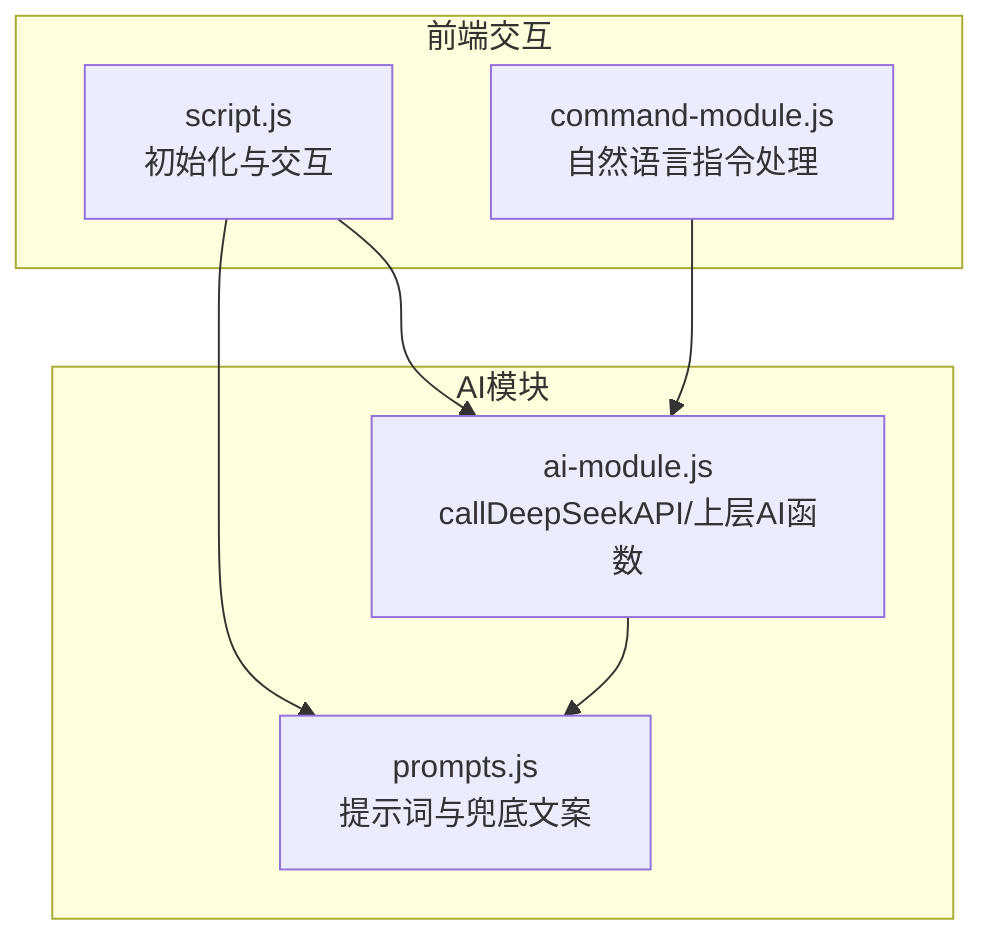
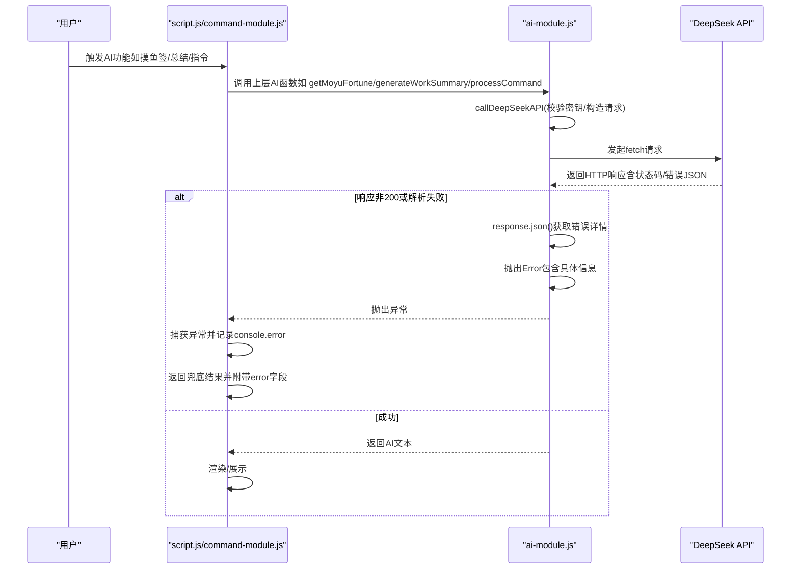
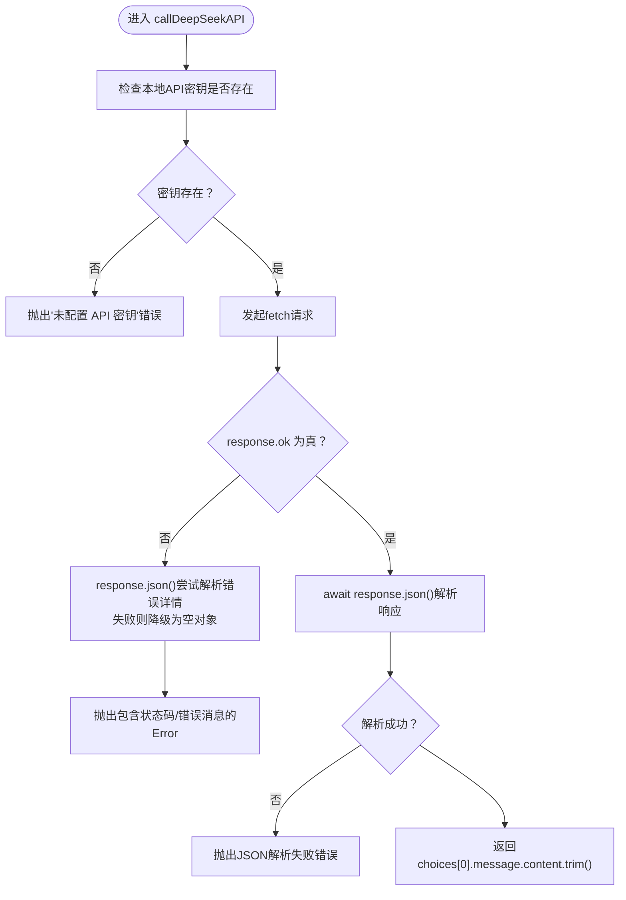
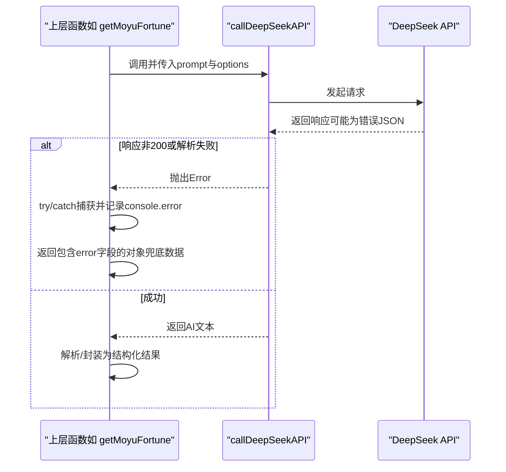
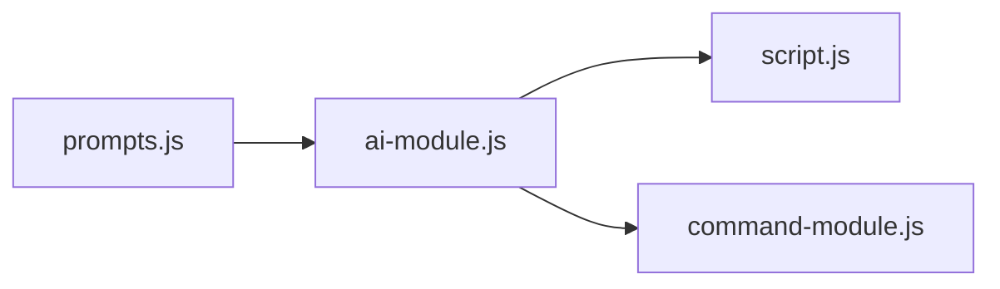

# API调用异常处理

<cite>
**本文引用的文件**
- [ai-module.js](file://ai-module.js)
- [script.js](file://script.js)
- [prompts.js](file://prompts.js)
- [command-module.js](file://command-module.js)
- [README.md](file://README.md)
</cite>

## 目录
1. [简介](#简介)
2. [项目结构](#项目结构)
3. [核心组件](#核心组件)
4. [架构总览](#架构总览)
5. [详细组件分析](#详细组件分析)
6. [依赖关系分析](#依赖关系分析)
7. [性能考量](#性能考量)
8. [故障排查指南](#故障排查指南)
9. [结论](#结论)

## 简介
本文件围绕 work-timer 项目中对 DeepSeek API 的调用失败处理机制展开，重点基于 ai-module.js 中的 callDeepSeekAPI 函数，系统梳理以下方面：
- 如何通过 try-catch 捕获网络请求异常、HTTP 状态码错误以及 JSON 解析失败
- 当 fetch 返回非 200 状态时，如何通过 response.json() 获取错误详情并抛出带有具体信息的 Error 对象
- 异常在调用链中的传递路径：从 callDeepSeekAPI 抛出异常，到 getMoyuFortune、generateWorkSummary、callAIAnalysis 等上层函数捕获并记录 console.error 日志
- 异常信息如何被封装进返回对象的 error 字段，供前端展示给用户
- 常见故障排查策略与改进建议（如 API 密钥无效、网络超时、服务不可用等），并建议增加重试与断线检测以提升健壮性

## 项目结构
work-timer 采用模块化组织，AI 相关逻辑集中在 ai-module.js，前端交互入口在 script.js，提示词与兜底文案在 prompts.js，自然语言指令处理在 command-module.js。下图展示了与 API 调用异常处理相关的关键文件与职责映射。

图表来源
- [script.js](file://script.js#L424-L491)
- [command-module.js](file://command-module.js#L182-L259)
- [ai-module.js](file://ai-module.js#L1-L216)
- [prompts.js](file://prompts.js#L1-L159)

章节来源
- [README.md](file://README.md#L1-L125)
- [script.js](file://script.js#L424-L491)
- [command-module.js](file://command-module.js#L182-L259)
- [ai-module.js](file://ai-module.js#L1-L216)
- [prompts.js](file://prompts.js#L1-L159)

## 核心组件
- callDeepSeekAPI：封装 DeepSeek API 调用，负责密钥校验、请求发送、状态码与 JSON 解析错误处理、异常日志与抛出
- getMoyuFortune/generateWorkSummary/callAIAnalysis：上层 AI 业务函数，调用 callDeepSeekAPI 并在异常时记录日志、返回兜底结果并携带 error 字段
- prompts.js：集中管理提示词与兜底文案，为上层函数提供模板与回退数据
- script.js/command-module.js：前端入口与自然语言指令处理，触发 AI 能力并展示结果或错误

章节来源
- [ai-module.js](file://ai-module.js#L1-L216)
- [prompts.js](file://prompts.js#L1-L159)
- [script.js](file://script.js#L595-L794)
- [command-module.js](file://command-module.js#L182-L259)

## 架构总览
下图展示了从用户触发到 AI 返回的调用链路，以及异常在各层的传播与兜底策略。

图表来源
- [ai-module.js](file://ai-module.js#L14-L59)
- [script.js](file://script.js#L595-L794)
- [command-module.js](file://command-module.js#L182-L259)

## 详细组件分析

### callDeepSeekAPI 异常处理机制
- 密钥校验：若本地未保存密钥，立即抛出错误，阻止无效请求
- 网络请求：使用 fetch 发送 POST 请求，包含 Authorization 与 JSON 负载
- HTTP 状态码错误：当 response.ok 为假时，尝试 response.json() 获取错误详情；若解析失败则降级为空对象，最终抛出包含状态码或错误消息的 Error
- JSON 解析失败：在 response.ok 为真时，仍需 await response.json()，若解析失败将被捕获并重新抛出
- 异常日志：统一在 catch 中记录 console.error，并再次抛出原错误，以便上层函数捕获

图表来源
- [ai-module.js](file://ai-module.js#L14-L59)

章节来源
- [ai-module.js](file://ai-module.js#L14-L59)

### 上层函数的异常捕获与兜底
- getMoyuFortune：调用 callDeepSeekAPI 生成摸鱼签，随后从返回文本中匹配并解析 JSON；若无法解析，抛出错误并返回兜底数据，同时将 error 字段写入返回对象，前端可直接展示
- generateWorkSummary：调用 callDeepSeekAPI 生成总结，异常时返回兜底文案并携带 error 字段
- callAIAnalysis：调用 callDeepSeekAPI 生成分析内容，异常时返回兜底文案并携带 error 字段
- command-module.js：processCommand 调用 callDeepSeekAPI 理解用户指令，异常时返回聊天式兜底并携带 error 字段

图表来源
- [ai-module.js](file://ai-module.js#L99-L167)
- [command-module.js](file://command-module.js#L182-L259)

章节来源
- [ai-module.js](file://ai-module.js#L99-L167)
- [command-module.js](file://command-module.js#L182-L259)

### 错误信息在前端的呈现
- 脚本初始化与测试：initAISettings 在测试 API 连接时，若上层返回对象包含 error 字段，前端会将其拼接到状态提示中，供用户感知
- 打卡流程：在 getMoyuFortune 或 generateWorkSummary 异常时，前端会在对应区域显示错误提示或兜底文案，保证用户体验连续性

章节来源
- [script.js](file://script.js#L424-L491)
- [script.js](file://script.js#L595-L794)

## 依赖关系分析
- ai-module.js 作为底层 API 调用封装，被 script.js 与 command-module.js 的多个上层函数依赖
- prompts.js 为上层函数提供提示词模板与兜底文案，间接参与异常时的数据回退
- 调用链耦合度低：上层函数通过 AIModule 的公共接口调用，便于替换与扩展

图表来源
- [ai-module.js](file://ai-module.js#L1-L216)
- [script.js](file://script.js#L424-L491)
- [command-module.js](file://command-module.js#L182-L259)
- [prompts.js](file://prompts.js#L1-L159)

章节来源
- [ai-module.js](file://ai-module.js#L1-L216)
- [script.js](file://script.js#L424-L491)
- [command-module.js](file://command-module.js#L182-L259)
- [prompts.js](file://prompts.js#L1-L159)

## 性能考量
- 网络请求与 JSON 解析：每次调用均进行 fetch 与 JSON 解析，建议在高频调用场景下引入轻量缓存或节流
- 异常路径：异常时会记录日志并返回兜底数据，避免阻塞主流程，但频繁异常仍会影响用户体验，建议配合重试与断线检测
- 前端渲染：在异常时仍需进行 DOM 更新（显示兜底文案），注意避免不必要的重绘

[本节为通用性能讨论，不直接分析具体文件]

## 故障排查指南
- API 密钥无效
  - 现象：调用前即抛出“未配置 API 密钥”错误
  - 排查：确认 localStorage 中是否存在 deepseekApiKey；在设置页保存密钥并测试连接
  - 建议：在前端显式提示“请先配置 API Key”，并在必要时引导跳转至设置页
  - 章节来源
    - [ai-module.js](file://ai-module.js#L14-L20)
    - [script.js](file://script.js#L424-L491)

- HTTP 状态码错误（如 401/403/429/5xx）
  - 现象：response.ok 为假，通过 response.json() 获取错误详情并抛出包含状态码或错误消息的 Error
  - 排查：检查密钥有效性、配额与速率限制、服务可用性
  - 建议：在上层函数中区分错误类型并提示用户（如“密钥无效”“请求过于频繁”“服务暂时不可用”）
  - 章节来源
    - [ai-module.js](file://ai-module.js#L47-L51)

- JSON 解析失败
  - 现象：response.ok 为真但 response.json() 抛错，导致上层抛出解析失败错误
  - 排查：确认 API 返回格式符合预期；检查网络代理或中间件是否篡改响应
  - 建议：在上层函数中对返回文本进行更宽松的解析（如正则提取 JSON 片段），并记录原始响应便于调试
  - 章节来源
    - [ai-module.js](file://ai-module.js#L52-L54)

- 网络超时/连接中断
  - 现象：fetch 抛出网络异常，被 catch 捕获并重新抛出
  - 排查：检查网络连通性、DNS 解析、代理设置
  - 建议：增加 fetch 超时控制与指数退避重试；在 UI 层提示“网络不稳定，请稍后重试”
  - 章节来源
    - [ai-module.js](file://ai-module.js#L54-L59)

- 上层业务异常（如 JSON 匹配失败）
  - 现象：getMoyuFortune 无法从返回文本中匹配到 JSON，抛出“无法解析AI返回的JSON”
  - 排查：检查提示词模板是否要求返回纯 JSON；确认 API 返回稳定性
  - 建议：在上层函数中增加更鲁棒的文本解析与容错策略，并记录原始响应
  - 章节来源
    - [ai-module.js](file://ai-module.js#L108-L118)

- 前端展示异常信息
  - 现象：上层函数返回对象包含 error 字段，前端将其显示为用户提示
  - 建议：在 UI 中区分“警告/错误/提示”三类信息，避免误导用户
  - 章节来源
    - [script.js](file://script.js#L595-L794)

## 结论
work-timer 对 DeepSeek API 的异常处理遵循“尽早校验、明确错误、统一日志、优雅兜底”的原则。callDeepSeekAPI 通过 try-catch 与 response.json() 获取错误详情，上层函数在捕获异常后记录日志并返回包含 error 字段的兜底结果，保证前端体验的连续性。为进一步提升健壮性，建议：
- 在 fetch 层增加超时控制与指数退避重试
- 在 UI 层区分错误类型并提供可操作的提示
- 在上层函数中增强对返回文本的解析容错能力
- 增加断线检测与离线缓存策略，改善弱网环境下的用户体验