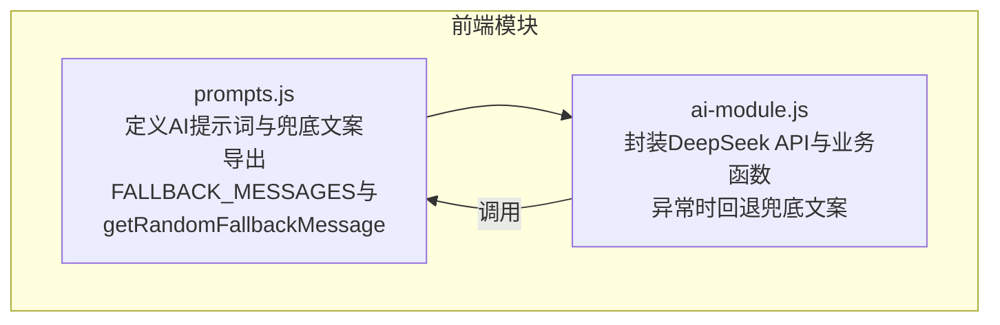
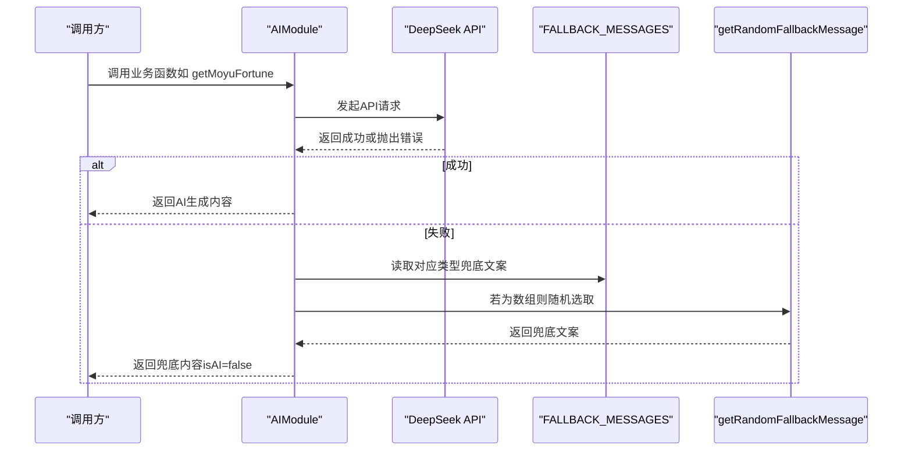
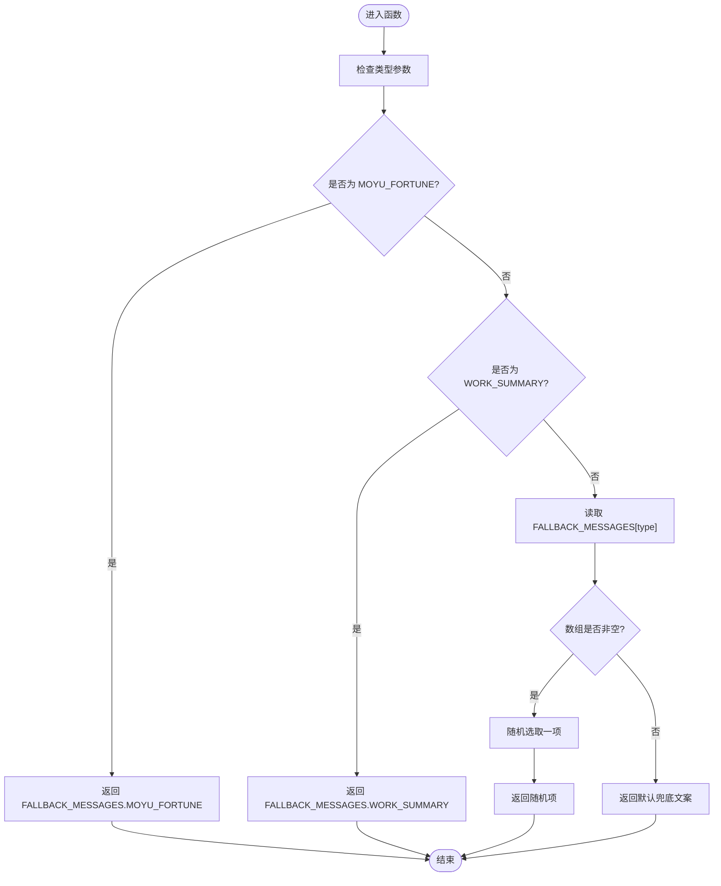
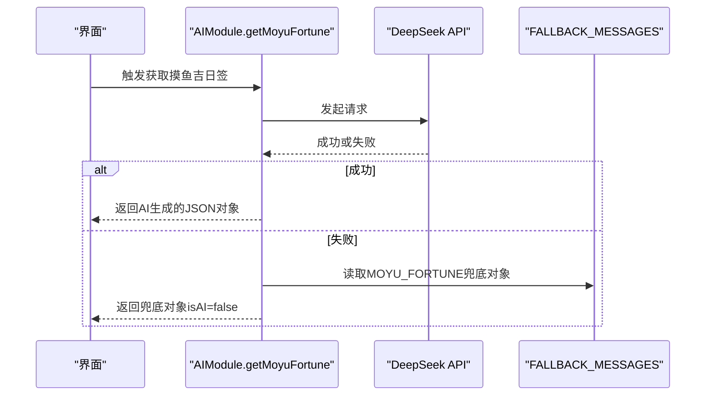
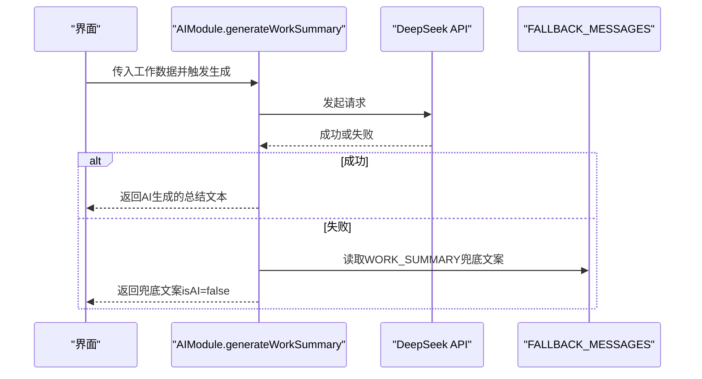
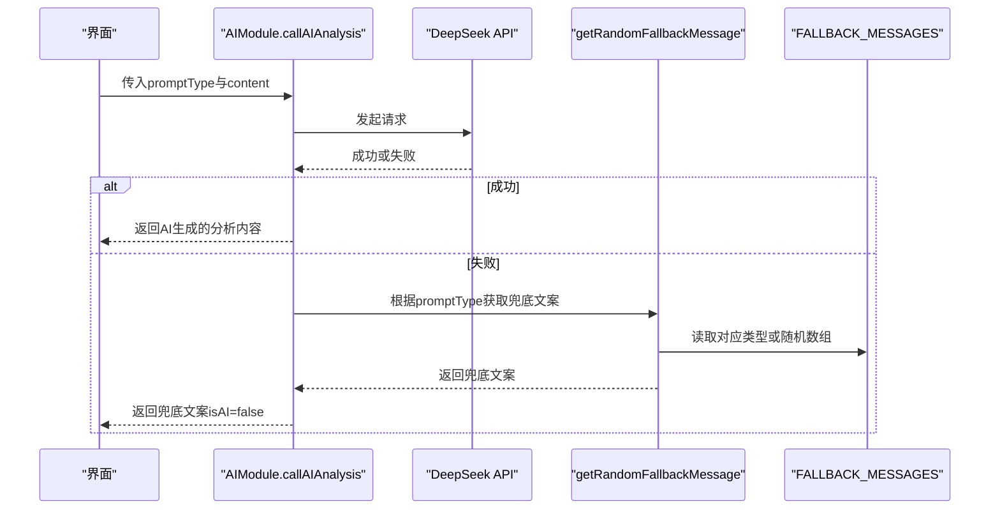
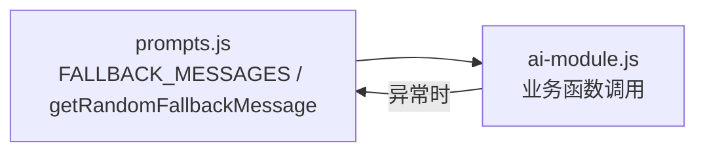

# 兜底文案系统实现

<cite>
**本文引用的文件**
- [prompts.js](file://prompts.js)
- [ai-module.js](file://ai-module.js)
- [README.md](file://README.md)
</cite>

## 目录
1. [引言](#引言)
2. [项目结构](#项目结构)
3. [核心组件](#核心组件)
4. [架构总览](#架构总览)
5. [详细组件分析](#详细组件分析)
6. [依赖关系分析](#依赖关系分析)
7. [性能考量](#性能考量)
8. [故障排查指南](#故障排查指南)
9. [结论](#结论)
10. [附录](#附录)

## 引言
本文件围绕 work-timer 项目中的“兜底文案系统”展开，基于 prompts.js 中定义的 FALLBACK_MESSAGES 对象，系统性说明三类兜底策略：
- MOYU_FORTUNE：固定 JSON 结构，确保界面渲染兼容性
- WORK_SUMMARY：静态文案，保证信息完整性
- NEWS_ANALYSIS：随机数组，提供动态感与等待体验

同时结合 ai-module.js 中 getMoyuFortune 和 callAIAnalysis 的 catch 块，解释如何通过 getRandomFallbackMessage(type) 获取对应类型的替代内容；并深入解析 getRandomFallbackMessage 的分支逻辑：对特定类型直接返回预设值，对数组类型随机选取，以及默认兜底“打卡成功！”的价值。

## 项目结构
本项目围绕前端模块化组织，其中与兜底文案系统直接相关的关键文件如下：
- prompts.js：集中管理 AI 提示词与兜底文案，导出全局可用的 FALLBACK_MESSAGES 与 getRandomFallbackMessage
- ai-module.js：封装 DeepSeek API 调用与业务函数，包括 getMoyuFortune、generateWorkSummary、callAIAnalysis，并在异常时回退到兜底文案

图表来源
- [prompts.js](file://prompts.js#L122-L159)
- [ai-module.js](file://ai-module.js#L95-L204)

章节来源
- [prompts.js](file://prompts.js#L1-L159)
- [ai-module.js](file://ai-module.js#L1-L216)

## 核心组件
- FALLBACK_MESSAGES（兜底文案配置）
  - MOYU_FORTUNE：对象结构，包含 fortune、bestTime、tips 字段，用于界面 JSON 渲染
  - WORK_SUMMARY：字符串，作为静态总结文案
  - NEWS_ANALYSIS：字符串数组，用于随机返回不同等待文案
- getRandomFallbackMessage(type)：根据类型选择兜底策略，若无匹配则随机取数组项，否则返回默认兜底文案

章节来源
- [prompts.js](file://prompts.js#L122-L159)

## 架构总览
兜底文案系统在调用链中的位置如下：
- 调用方（业务函数）：getMoyuFortune、generateWorkSummary、callAIAnalysis
- 异常捕获：在各自的 try/catch 块中处理错误
- 回退策略：优先使用 FALLBACK_MESSAGES 对应类型；若为数组则随机选取；若仍为空则使用默认兜底文案

图表来源
- [ai-module.js](file://ai-module.js#L95-L204)
- [prompts.js](file://prompts.js#L122-L159)

## 详细组件分析

### 兜底文案配置（FALLBACK_MESSAGES）
- MOYU_FORTUNE
  - 设计目标：确保界面 JSON 结构稳定，避免因 AI 返回不稳定导致渲染失败
  - 文案结构：包含 fortune、bestTime、tips 字段，字段类型与长度均受约束，利于前端稳定渲染
- WORK_SUMMARY
  - 设计目标：保证关键信息完整（如“今天辛苦了”、“一天的工作圆满完成”等），即使 AI 不可用也能传达基本情感与总结
- NEWS_ANALYSIS
  - 设计目标：通过数组形式提供多个等待文案，增加动态感与用户耐心，避免长时间无反馈的不适

章节来源
- [prompts.js](file://prompts.js#L122-L139)

### 兜底文案获取函数（getRandomFallbackMessage）
- 分支逻辑
  - 类型为 MOYU_FORTUNE：直接返回 FALLBACK_MESSAGES.MOYU_FORTUNE（对象）
  - 类型为 WORK_SUMMARY：直接返回 FALLBACK_MESSAGES.WORK_SUMMARY（字符串）
  - 其他类型（如 NEWS_ANALYSIS）：取 FALLBACK_MESSAGES[type] 数组，随机选取一项；若数组为空则返回默认兜底文案
- 默认兜底文案
  - “打卡成功！”作为最终兜底，确保任何异常情况下都能给用户一个确定的、积极的反馈

图表来源
- [prompts.js](file://prompts.js#L141-L151)

章节来源
- [prompts.js](file://prompts.js#L141-L151)

### 业务函数中的兜底调用

#### getMoyuFortune（摸鱼吉日签）
- 正常流程：构造提示词，调用 DeepSeek API，尝试解析返回的 JSON，成功后返回 AI 数据
- 异常流程：捕获错误后，返回 FALLBACK_MESSAGES.MOYU_FORTUNE，并标记 isAI=false，同时保留 error 信息

图表来源
- [ai-module.js](file://ai-module.js#L95-L127)
- [prompts.js](file://prompts.js#L122-L132)

章节来源
- [ai-module.js](file://ai-module.js#L95-L127)
- [prompts.js](file://prompts.js#L122-L132)

#### generateWorkSummary（工作总结）
- 正常流程：将工作数据注入模板，调用 DeepSeek API，返回总结文本
- 异常流程：捕获错误后，返回 FALLBACK_MESSAGES.WORK_SUMMARY，并标记 isAI=false

图表来源
- [ai-module.js](file://ai-module.js#L129-L167)
- [prompts.js](file://prompts.js#L133-L133)

章节来源
- [ai-module.js](file://ai-module.js#L129-L167)
- [prompts.js](file://prompts.js#L133-L133)

#### callAIAnalysis（新闻分析）
- 正常流程：根据 promptType 选择模板，替换内容后调用 DeepSeek API
- 异常流程：捕获错误后，调用 getRandomFallbackMessage(promptType)，返回随机兜底文案，并标记 isAI=false

图表来源
- [ai-module.js](file://ai-module.js#L169-L204)
- [prompts.js](file://prompts.js#L134-L139)
- [prompts.js](file://prompts.js#L141-L151)

章节来源
- [ai-module.js](file://ai-module.js#L169-L204)
- [prompts.js](file://prompts.js#L134-L151)

### 不同类型兜底策略对比
- MOYU_FORTUNE（固定 JSON 结构）
  - 优势：界面渲染稳定，字段齐全，便于前端直接消费
  - 适用场景：需要结构化数据的 UI 组件
- WORK_SUMMARY（静态文案）
  - 优势：信息完整、情感积极，无需解析即可直接展示
  - 适用场景：总结类文案，强调可读性与情绪价值
- NEWS_ANALYSIS（随机数组）
  - 优势：动态感强，避免长时间等待的单调感
  - 适用场景：异步加载、网络延迟或服务不可用时的过渡文案

章节来源
- [prompts.js](file://prompts.js#L122-L139)

## 依赖关系分析
- ai-module.js 依赖 prompts.js：
  - 使用 window.AI_PROMPTS 作为提示词模板来源
  - 在异常路径中使用 window.FALLBACK_MESSAGES 与 window.getRandomFallbackMessage
- prompts.js 暴露全局接口：
  - FALLBACK_MESSAGES：提供三类兜底文案
  - getRandomFallbackMessage：统一兜底策略入口

图表来源
- [prompts.js](file://prompts.js#L122-L159)
- [ai-module.js](file://ai-module.js#L95-L204)

章节来源
- [prompts.js](file://prompts.js#L122-L159)
- [ai-module.js](file://ai-module.js#L95-L204)

## 性能考量
- 兜底文案均为本地静态资源，无需网络请求，回退路径开销极低
- 对数组类型的随机选择为 O(1) 操作，不会引入额外性能负担
- 通过默认兜底文案“打卡成功！”确保最短路径返回，减少 UI 卡顿感知

[本节为通用性能讨论，不直接分析具体文件]

## 故障排查指南
- 症状：摸鱼吉日签或工作总结无法显示
  - 检查：确认 API 密钥是否配置；查看控制台错误信息
  - 处理：若捕获到异常，系统会自动回退到 FALLBACK_MESSAGES 对应类型；若仍为空，则返回默认兜底文案
- 症状：新闻分析长时间无响应
  - 检查：网络状态与 API 可用性
  - 处理：异常时调用 getRandomFallbackMessage(promptType) 返回随机等待文案，提升用户耐心
- 建议：在 UI 层对 isAI=false 的回退内容进行明确标识，帮助用户理解当前为兜底状态

章节来源
- [ai-module.js](file://ai-module.js#L95-L204)
- [prompts.js](file://prompts.js#L122-L159)

## 结论
兜底文案系统通过“固定结构 + 静态文案 + 随机数组”的组合策略，在不同场景下分别实现了界面兼容、信息完整与动态体验的平衡。配合 ai-module.js 的异常捕获与统一回退入口，系统在面对网络波动、API 失败或解析异常时，仍能持续提供稳定、积极的用户反馈，显著提升了用户体验的连续性与韧性。

## 附录
- 扩展建议
  - 多语言支持：为 FALLBACK_MESSAGES 增加多语言键值，按用户语言环境动态选择
  - 可配置化管理：将兜底文案存储在配置中心或本地持久化，允许用户自定义或禁用某些类型
  - 语义化兜底：针对不同错误类型（网络、解析、权限）提供差异化兜底文案，提升可解释性

章节来源
- [README.md](file://README.md#L1-L125)