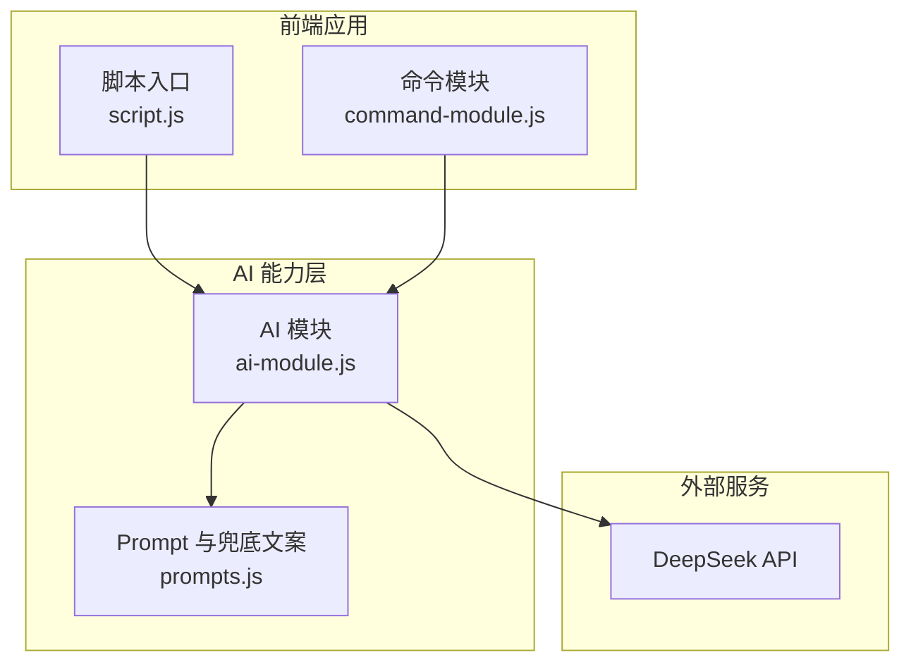
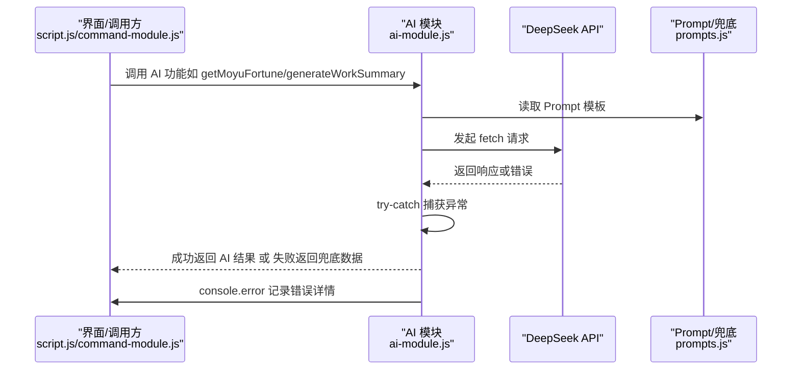
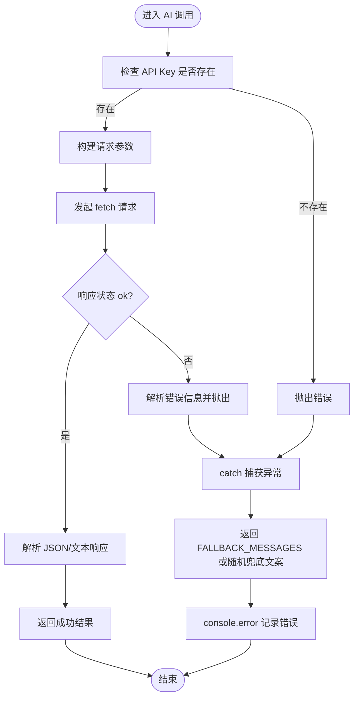
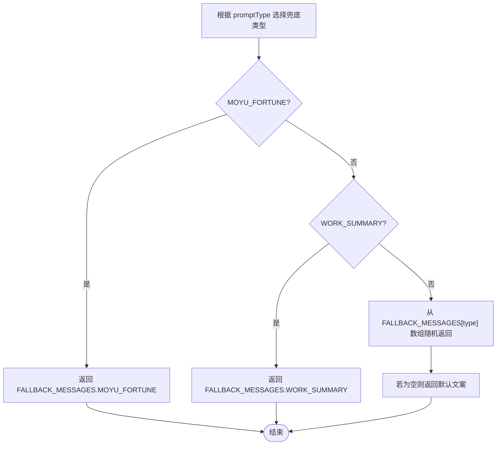
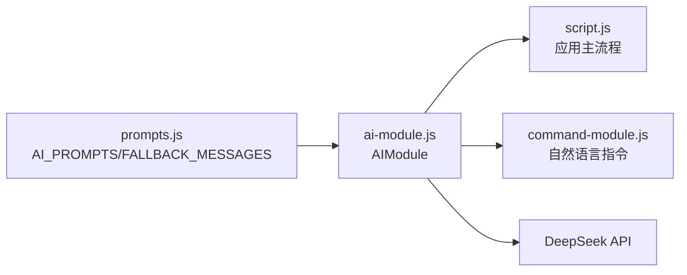

# 错误处理与兜底机制

<cite>
**本文引用的文件**
- [ai-module.js](file://ai-module.js)
- [prompts.js](file://prompts.js)
- [script.js](file://script.js)
- [command-module.js](file://command-module.js)
- [README.md](file://README.md)
</cite>

## 目录
1. [引言](#引言)
2. [项目结构](#项目结构)
3. [核心组件](#核心组件)
4. [架构总览](#架构总览)
5. [详细组件分析](#详细组件分析)
6. [依赖关系分析](#依赖关系分析)
7. [性能考量](#性能考量)
8. [故障排查指南](#故障排查指南)
9. [结论](#结论)

## 引言
本文件围绕 work-timer 项目中 AI 功能的健壮性保障机制展开，重点说明在网络异常、API 限流、响应超时等常见故障下的捕获与兜底策略。通过对 ai-module.js 中的 try-catch 结构与 fetch 失败处理逻辑进行分析，结合 prompts.js 中的 FALLBACK_MESSAGES 预设文案体系，解释如何在用户体验与系统稳定性之间取得平衡，确保即使 AI 服务不可用，核心功能仍可正常运行。同时提供监控日志建议，指导开发者通过 console.error 记录异常以便排查问题。

## 项目结构
work-timer 的 AI 功能主要分布在以下文件：
- ai-module.js：封装 DeepSeek API 调用、AI 功能入口与错误兜底
- prompts.js：统一管理 Prompt 模板与兜底文案
- script.js：应用主流程，调用 AIModule 并处理 UI 展示与错误回退
- command-module.js：自然语言指令理解与执行，同样采用兜底策略
- README.md：产品说明，体现 v1.3.3 新增的 AI 能力

图表来源
- [ai-module.js](file://ai-module.js#L1-L216)
- [prompts.js](file://prompts.js#L1-L159)
- [script.js](file://script.js#L547-L728)
- [command-module.js](file://command-module.js#L182-L259)

章节来源
- [README.md](file://README.md#L32-L61)

## 核心组件
- AI 模块（ai-module.js）
  - 封装 DeepSeek API 调用，统一处理鉴权、参数、响应与错误
  - 提供多个 AI 功能入口：问候语、摸鱼吉日签、工作总结、通用分析
  - 在每个入口函数内使用 try-catch 捕获异常，并在失败时返回兜底数据
- Prompt 与兜底文案（prompts.js）
  - 统一管理 AI 提示词模板
  - 定义 FALLBACK_MESSAGES 对象，为关键 AI 功能提供预设回复
  - 提供 getRandomFallbackMessage(type) 按类型返回合适的替代内容
- 应用主流程（script.js）
  - 在打卡、生成总结等关键路径中调用 AIModule
  - 当 AI 失败时，使用兜底文案与本地存储数据维持 UI 正常
  - 记录关键日志，便于排查
- 命令模块（command-module.js）
  - 自然语言指令理解与执行，同样在调用 AIModule 时采用兜底策略
  - 对解析失败与执行失败进行统一错误处理

章节来源
- [ai-module.js](file://ai-module.js#L14-L59)
- [prompts.js](file://prompts.js#L122-L158)
- [script.js](file://script.js#L547-L728)
- [command-module.js](file://command-module.js#L182-L259)

## 架构总览
AI 功能的调用链路与错误处理遵循“统一入口 + 统一兜底”的设计原则：
- 统一入口：AIModule 封装 fetch，集中处理鉴权、参数、响应与错误
- 统一兜底：prompts.js 定义 FALLBACK_MESSAGES，AIModule 在失败时返回预设文案
- 统一日志：各模块在失败处使用 console.error 记录错误上下文

图表来源
- [ai-module.js](file://ai-module.js#L14-L59)
- [prompts.js](file://prompts.js#L1-L121)
- [script.js](file://script.js#L647-L661)
- [command-module.js](file://command-module.js#L182-L259)

## 详细组件分析

### AI 模块的错误捕获与兜底策略
- DeepSeek API 调用封装
  - 鉴权：从本地存储读取 API Key，缺失时抛出错误
  - 参数：支持 temperature、maxTokens、topP 等可选配置
  - 响应校验：非 ok 状态时解析错误信息并抛出
  - 异常处理：捕获并记录错误，向上抛出以便上层兜底
- 入口函数的兜底策略
  - getMoyuFortune：解析 JSON 失败时返回 FALLBACK_MESSAGES.MOYU_FORTUNE
  - generateWorkSummary：返回 FALLBACK_MESSAGES.WORK_SUMMARY
  - callAIAnalysis：返回 getRandomFallbackMessage(promptType)
  - getAIGreeting：不调用 AI，直接返回固定文案（性能优先）

图表来源
- [ai-module.js](file://ai-module.js#L14-L59)
- [ai-module.js](file://ai-module.js#L99-L127)
- [ai-module.js](file://ai-module.js#L129-L167)
- [ai-module.js](file://ai-module.js#L169-L204)

章节来源
- [ai-module.js](file://ai-module.js#L14-L59)
- [ai-module.js](file://ai-module.js#L99-L127)
- [ai-module.js](file://ai-module.js#L129-L167)
- [ai-module.js](file://ai-module.js#L169-L204)

### 兜底文案系统设计与使用
- FALLBACK_MESSAGES 的设计
  - MOYU_FORTUNE：返回包含 fortune、bestTime、tips 的 JSON 结构
  - WORK_SUMMARY：返回一段固定文案
  - NEWS_ANALYSIS：返回随机文案数组，用于动态兜底
- getRandomFallbackMessage 的策略
  - 针对 MOYU_FORTUNE 与 WORK_SUMMARY 直接返回对应预设
  - 其他类型从数组中随机选择一条，无匹配时返回默认文案

图表来源
- [prompts.js](file://prompts.js#L122-L158)

章节来源
- [prompts.js](file://prompts.js#L122-L158)

### 不同功能的容错策略
- 摸鱼吉日签（JSON 兜底）
  - AI 返回 JSON：解析成功则使用 AI 数据
  - 解析失败或异常：返回 FALLBACK_MESSAGES.MOYU_FORTUNE，并在 UI 层显示错误提示
- 工作总结（文本兜底）
  - AI 返回文本：直接使用
  - 异常：返回 FALLBACK_MESSAGES.WORK_SUMMARY，并在 UI 层降级显示
- 通用分析（随机文案兜底）
  - AI 返回文本：直接使用
  - 异常：返回随机文案数组中的某一条，避免长时间等待
- 问候语（不调用 AI）
  - 直接返回固定文案，避免网络波动影响首屏体验

章节来源
- [ai-module.js](file://ai-module.js#L99-L127)
- [ai-module.js](file://ai-module.js#L129-L167)
- [ai-module.js](file://ai-module.js#L169-L204)
- [script.js](file://script.js#L647-L661)
- [script.js](file://script.js#L647-L724)

### 用户体验与系统稳定性的平衡
- 降低首屏等待：问候语不调用 AI，确保打卡弹窗快速出现
- 逐步降级：AI 失败时立即回退到兜底文案，UI 保持可交互
- 保留关键数据：即使 AI 失败，也从本地存储读取必要数据（如上班时间）用于展示
- 反馈与提示：在 UI 层显示错误提示与加载状态，提升透明度

章节来源
- [ai-module.js](file://ai-module.js#L66-L93)
- [script.js](file://script.js#L547-L728)

## 依赖关系分析
- AIModule 依赖 prompts.js 提供的模板与兜底文案
- script.js 与 command-module.js 作为调用方，依赖 AIModule 的统一入口
- fetch 失败与解析失败在 AIModule 内部被捕获并统一兜底

图表来源
- [prompts.js](file://prompts.js#L1-L159)
- [ai-module.js](file://ai-module.js#L1-L216)
- [script.js](file://script.js#L547-L728)
- [command-module.js](file://command-module.js#L182-L259)

章节来源
- [prompts.js](file://prompts.js#L1-L159)
- [ai-module.js](file://ai-module.js#L1-L216)
- [script.js](file://script.js#L547-L728)
- [command-module.js](file://command-module.js#L182-L259)

## 性能考量
- 问候语不调用 AI，显著降低首屏等待时间
- 适度降低温度与令牌上限，有助于控制响应时间与成本
- 兜底文案本地化，避免重复网络请求
- UI 层采用渐进式加载与占位符，改善感知性能

## 故障排查指南
- 常见问题定位
  - API Key 缺失：检查本地存储是否存在 deepseekApiKey
  - 网络异常：查看 fetch 抛出的错误信息
  - 响应解析失败：检查 AI 返回格式是否符合预期
- 日志记录建议
  - 在 AIModule 的 try-catch 中记录错误详情
  - 在应用主流程中记录关键步骤与错误提示
  - 在命令模块中记录解析失败与执行失败
- 排查步骤
  - 打开浏览器控制台，查看 console.error 输出
  - 检查本地存储中的 API Key 与关键数据
  - 确认网络连通性与 API 服务状态

章节来源
- [ai-module.js](file://ai-module.js#L55-L59)
- [ai-module.js](file://ai-module.js#L118-L126)
- [ai-module.js](file://ai-module.js#L158-L166)
- [ai-module.js](file://ai-module.js#L195-L203)
- [script.js](file://script.js#L601-L612)
- [script.js](file://script.js#L647-L661)
- [command-module.js](file://command-module.js#L68-L72)
- [command-module.js](file://command-module.js#L250-L259)

## 结论
work-timer 的 AI 功能通过“统一入口 + 统一兜底 + 统一日志”的设计，在网络异常、API 限流、响应超时等故障下实现了稳健的容错能力。prompts.js 中的 FALLBACK_MESSAGES 为关键功能提供了预设回复，配合 AIModule 的 try-catch 与随机兜底策略，确保即使 AI 服务不可用，核心功能仍可正常运行，用户体验不受影响。建议在生产环境中持续完善日志采集与告警，以便快速定位与解决问题。