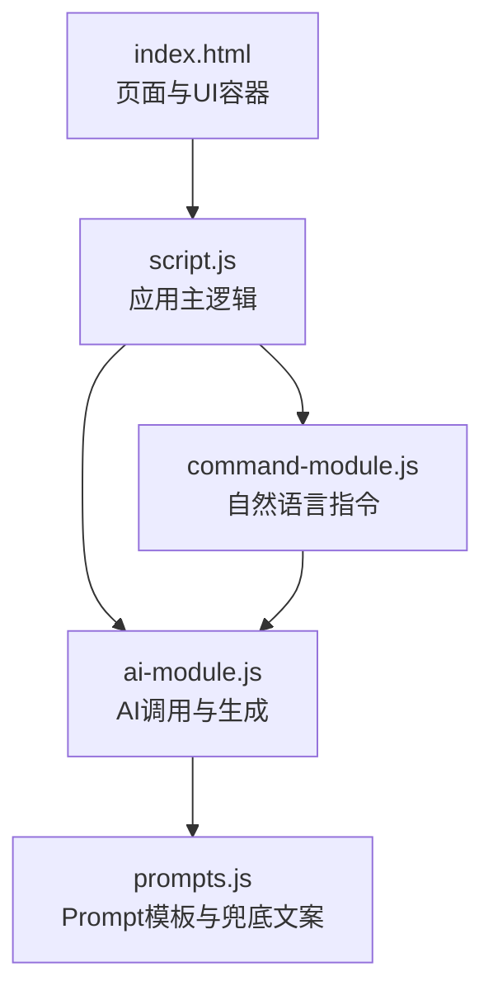
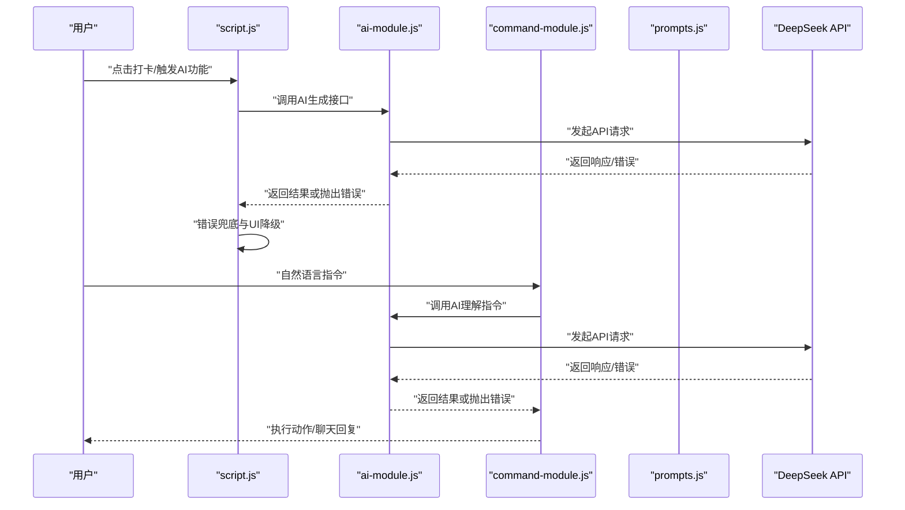
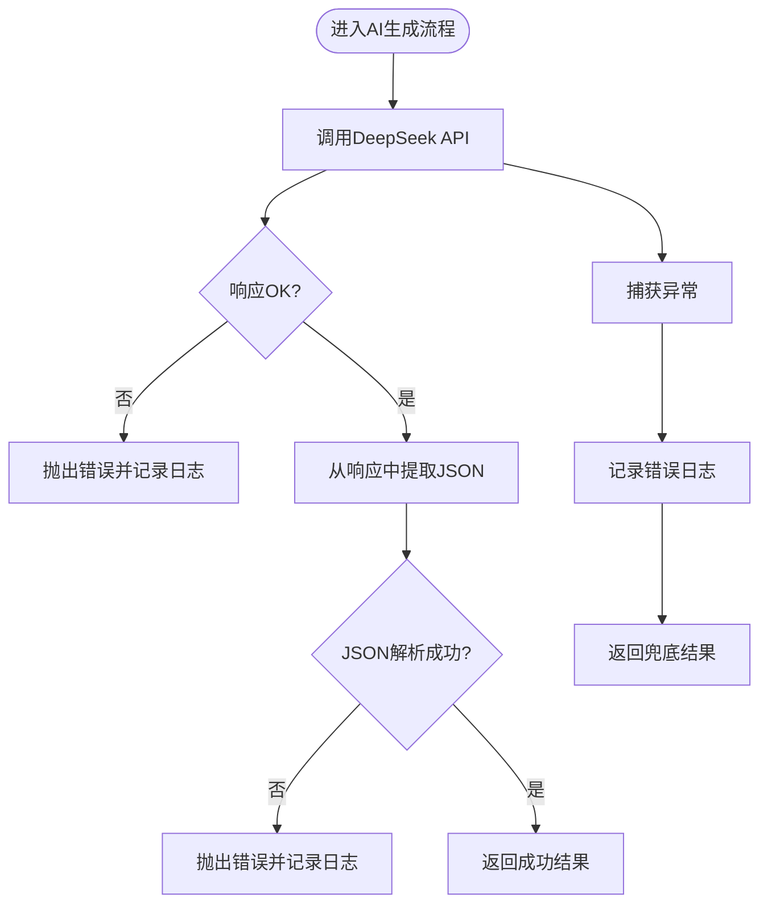
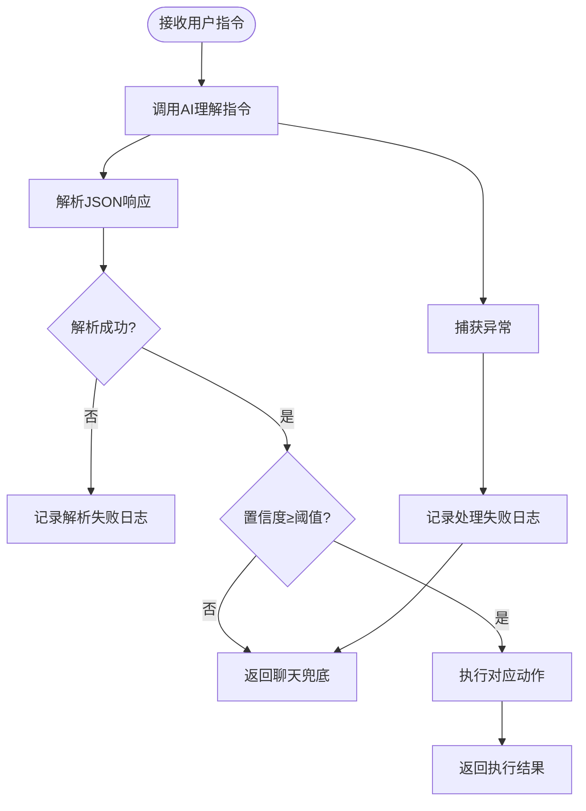
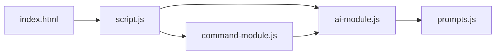

# 错误日志与监控建议

<cite>
**本文引用的文件**
- [ai-module.js](file://ai-module.js)
- [command-module.js](file://command-module.js)
- [prompts.js](file://prompts.js)
- [script.js](file://script.js)
- [index.html](file://index.html)
- [README.md](file://README.md)
</cite>

## 目录
1. [引言](#引言)
2. [项目结构](#项目结构)
3. [核心组件](#核心组件)
4. [架构总览](#架构总览)
5. [详细组件分析](#详细组件分析)
6. [依赖关系分析](#依赖关系分析)
7. [性能考量](#性能考量)
8. [故障排查指南](#故障排查指南)
9. [结论](#结论)
10. [附录](#附录)

## 引言
本文件围绕 work-timer 项目中的错误日志记录现状与监控优化展开，重点分析 AI 相关模块（AI 调用、摸鱼吉日签、工作总结、指令解析）在 API 调用失败、JSON 解析异常、Prompt 类型无效等关键节点的日志覆盖情况；并指出当前仅依赖浏览器控制台输出的局限性，提出引入结构化日志系统、持久化存储与可视化监控的改进建议，以提升问题诊断效率与用户体验。

## 项目结构
work-timer 采用前端单页应用结构，核心功能集中在主页面脚本与若干模块脚本中：
- 主页面与挂载点：index.html 中定义了 AI 助手浮动面板、打卡弹窗、时间轴模态等 UI 容器
- AI 能力模块：ai-module.js 封装 DeepSeek API 调用与多个 AI 生成流程
- 指令理解模块：command-module.js 负责自然语言指令的理解与执行
- Prompt 与兜底文案：prompts.js 提供 AI Prompt 模板与兜底消息
- 应用主逻辑：script.js 负责页面初始化、打卡流程、时间轴与特效等

图表来源
- [index.html](file://index.html#L1-L200)
- [script.js](file://script.js#L1-L120)
- [ai-module.js](file://ai-module.js#L1-L60)
- [command-module.js](file://command-module.js#L1-L60)
- [prompts.js](file://prompts.js#L1-L40)

章节来源
- [index.html](file://index.html#L1-L200)
- [README.md](file://README.md#L1-L125)

## 核心组件
- AI 能力模块（ai-module.js）：封装 DeepSeek API 调用、摸鱼吉日签生成、工作总结生成、通用 AI 分析等
- 指令理解模块（command-module.js）：解析用户自然语言、判断意图、执行对应操作
- Prompt 与兜底文案（prompts.js）：统一管理 AI Prompt 模板与兜底文本
- 应用主逻辑（script.js）：页面初始化、打卡流程、时间轴与特效、错误兜底显示

章节来源
- [ai-module.js](file://ai-module.js#L1-L216)
- [command-module.js](file://command-module.js#L1-L313)
- [prompts.js](file://prompts.js#L1-L159)
- [script.js](file://script.js#L1-L200)

## 架构总览
AI 与指令模块在关键路径上均存在错误捕获与兜底策略，当前错误信息主要通过 console 输出并在 UI 层进行降级展示。下图展示了从用户交互到 AI 生成再到错误兜底的关键流程。

图表来源
- [script.js](file://script.js#L540-L730)
- [ai-module.js](file://ai-module.js#L14-L59)
- [command-module.js](file://command-module.js#L185-L259)
- [prompts.js](file://prompts.js#L1-L120)

## 详细组件分析

### AI 能力模块（ai-module.js）错误路径与日志覆盖
- API 调用失败：在请求响应非 OK 或网络异常时抛出错误，并在 catch 中输出错误日志
- JSON 解析异常：在从 AI 返回文本中提取 JSON 并解析失败时抛出错误，输出错误日志
- Prompt 类型无效：在调用通用分析接口时，若传入的 promptType 不存在，抛出错误，输出错误日志
- 兜底策略：所有错误均返回包含 success、isAI、error 字段的对象，UI 层可据此降级显示兜底文案

图表来源
- [ai-module.js](file://ai-module.js#L27-L59)
- [ai-module.js](file://ai-module.js#L100-L127)
- [ai-module.js](file://ai-module.js#L134-L167)
- [ai-module.js](file://ai-module.js#L175-L204)

章节来源
- [ai-module.js](file://ai-module.js#L27-L59)
- [ai-module.js](file://ai-module.js#L100-L127)
- [ai-module.js](file://ai-module.js#L134-L167)
- [ai-module.js](file://ai-module.js#L175-L204)

### 指令理解模块（command-module.js）错误路径与日志覆盖
- 指令解析失败：在解析大模型返回的 JSON 时，若匹配不到 JSON 或解析异常，输出错误日志
- 指令处理失败：在执行命令过程中发生异常，输出错误日志并返回聊天兜底
- 置信度不足：当置信度低于阈值时，返回聊天回复而非执行操作，避免误操作

图表来源
- [command-module.js](file://command-module.js#L56-L72)
- [command-module.js](file://command-module.js#L185-L259)

章节来源
- [command-module.js](file://command-module.js#L56-L72)
- [command-module.js](file://command-module.js#L185-L259)

### Prompt 与兜底文案（prompts.js）
- 统一管理 AI Prompt 模板与兜底文案，为 AI 生成提供稳定输入与降级输出
- 在 AI 生成失败时，UI 层可直接使用兜底文案，减少用户感知到的异常

章节来源
- [prompts.js](file://prompts.js#L1-L159)

### 应用主逻辑（script.js）中的错误兜底与日志
- 打卡流程中对“显示工作总结”等环节进行 try/catch 包裹，失败时降级为兜底文案并记录错误日志
- 在关键步骤打印调试日志，辅助定位问题

章节来源
- [script.js](file://script.js#L587-L613)
- [script.js](file://script.js#L699-L724)

## 依赖关系分析
- script.js 依赖 ai-module.js 与 command-module.js，分别用于 AI 生成与自然语言指令处理
- ai-module.js 依赖 prompts.js 提供的 Prompt 模板
- command-module.js 也依赖 ai-module.js 进行指令理解与执行
- index.html 作为页面入口，挂载各模块脚本并提供 UI 容器

图表来源
- [index.html](file://index.html#L1-L20)
- [script.js](file://script.js#L1-L20)
- [ai-module.js](file://ai-module.js#L1-L20)
- [command-module.js](file://command-module.js#L1-L20)
- [prompts.js](file://prompts.js#L1-L20)

章节来源
- [index.html](file://index.html#L1-L20)
- [script.js](file://script.js#L1-L20)
- [ai-module.js](file://ai-module.js#L1-L20)
- [command-module.js](file://command-module.js#L1-L20)
- [prompts.js](file://prompts.js#L1-L20)

## 性能考量
- 当前错误日志以 console 输出为主，未做结构化与持久化，不利于长期分析与回溯
- 在高频调用场景下，大量错误日志可能导致控制台膨胀与性能开销
- 建议引入结构化日志与限流策略，避免日志风暴

## 故障排查指南
- API 调用失败
  - 现象：AI 生成失败，UI 展示兜底文案
  - 排查要点：确认 API 密钥是否配置、网络连通性、响应状态码与错误信息
  - 参考路径：[ai-module.js](file://ai-module.js#L27-L59)
- JSON 解析异常
  - 现象：从 AI 返回文本中提取 JSON 失败
  - 排查要点：检查 AI 返回格式是否符合预期、正则匹配是否准确
  - 参考路径：[ai-module.js](file://ai-module.js#L100-L127)
- Prompt 类型无效
  - 现象：调用通用分析接口时报错
  - 排查要点：确认传入的 promptType 是否存在于 Prompt 模板集合
  - 参考路径：[ai-module.js](file://ai-module.js#L175-L188)，[prompts.js](file://prompts.js#L1-L120)
- 指令解析失败
  - 现象：解析大模型返回 JSON 失败
  - 排查要点：检查 AI 返回是否包含 JSON、正则匹配范围
  - 参考路径：[command-module.js](file://command-module.js#L56-L72)
- 指令处理失败
  - 现象：执行命令过程异常
  - 排查要点：检查 DOM 元素是否存在、事件绑定是否生效
  - 参考路径：[command-module.js](file://command-module.js#L185-L259)

章节来源
- [ai-module.js](file://ai-module.js#L27-L59)
- [ai-module.js](file://ai-module.js#L100-L127)
- [ai-module.js](file://ai-module.js#L175-L188)
- [command-module.js](file://command-module.js#L56-L72)
- [command-module.js](file://command-module.js#L185-L259)
- [prompts.js](file://prompts.js#L1-L120)

## 结论
当前项目在 AI 生成与指令处理的关键节点具备基础的错误捕获与兜底策略，但错误日志主要依赖浏览器控制台输出，缺乏结构化、持久化与可视化监控。建议引入结构化日志系统，将错误类型、时间戳、上下文信息（如 promptType）持久化存储，并在设置页面新增“错误日志”查看入口，辅以错误计数器与频率限制，防止日志风暴，同时提供一键反馈通道以加速问题修复。

## 附录

### 当前日志覆盖范围与信息粒度
- API 调用失败：记录错误对象，便于定位响应状态与错误消息
- JSON 解析异常：记录解析失败原因，便于检查返回格式
- Prompt 类型无效：记录无效类型，便于校验调用方参数
- 指令解析失败：记录解析异常，便于检查 AI 返回格式
- 指令处理失败：记录执行异常，便于检查 DOM 与事件绑定

章节来源
- [ai-module.js](file://ai-module.js#L55-L59)
- [ai-module.js](file://ai-module.js#L118-L127)
- [ai-module.js](file://ai-module.js#L158-L167)
- [ai-module.js](file://ai-module.js#L195-L204)
- [command-module.js](file://command-module.js#L68-L72)
- [command-module.js](file://command-module.js#L250-L259)

### 建议的结构化日志与监控方案
- 结构化日志字段
  - 时间戳：精确到毫秒
  - 错误类型：API 调用失败、JSON 解析异常、Prompt 类型无效、指令解析失败、指令处理失败
  - 上下文信息：promptType、用户操作类型（如打卡、指令）、响应状态码、错误消息摘要
  - 设备与环境：UA、页面路径、开发者模式开关
- 存储与上报
  - 本地持久化：localStorage 或 IndexedDB，限制最大条数与大小
  - 轻量级上报：在设置页面提供“上传错误日志”按钮，将近期日志打包上报至后端
- 可视化监控
  - 设置页面新增“错误日志”入口，支持筛选、排序、导出
  - 错误计数器：按类型统计近 1 小时错误次数，超过阈值时提示用户
  - 频率限制：同一错误类型在短时间内去重上报，避免日志风暴
- 一键反馈
  - 在错误日志详情页提供“一键反馈”按钮，自动填充错误信息与上下文，提交到问题跟踪系统

[本节为概念性建议，不直接分析具体源文件，故无章节来源]