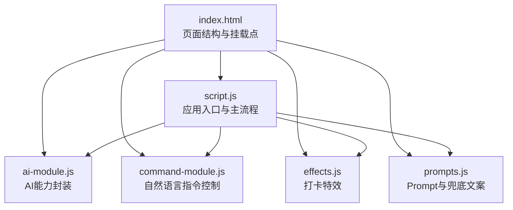
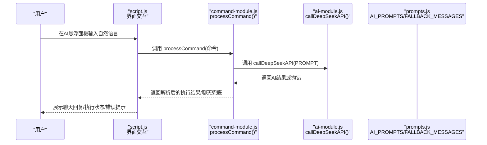
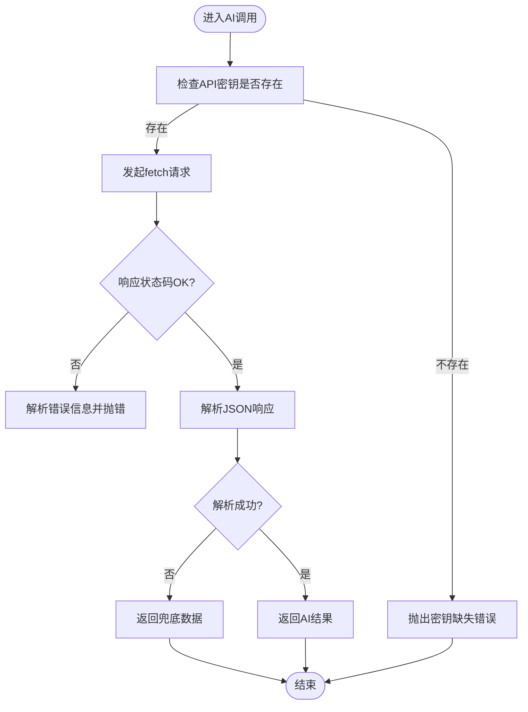
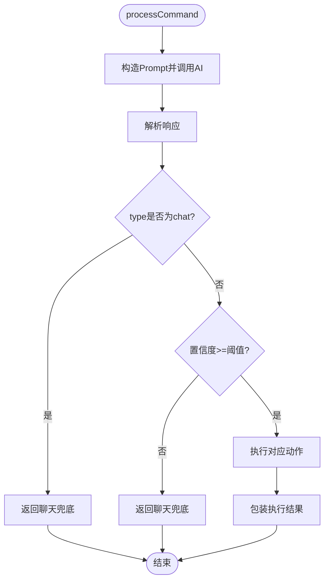
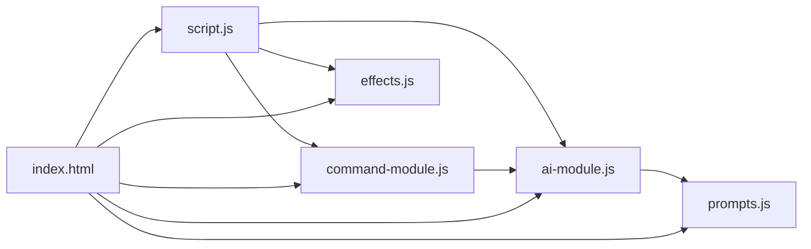

# 代码修改规范与稳定性保障

<cite>
**本文引用的文件**
- [ai-module.js](file://ai-module.js)
- [command-module.js](file://command-module.js)
- [prompts.js](file://prompts.js)
- [script.js](file://script.js)
- [effects.js](file://effects.js)
- [index.html](file://index.html)
- [README.md](file://README.md)
</cite>

## 目录
1. [引言](#引言)
2. [项目结构](#项目结构)
3. [核心组件](#核心组件)
4. [架构总览](#架构总览)
5. [详细组件分析](#详细组件分析)
6. [依赖关系分析](#依赖关系分析)
7. [性能考量](#性能考量)
8. [故障排查指南](#故障排查指南)
9. [结论](#结论)
10. [附录](#附录)

## 引言
本文件面向二次开发者，旨在建立work-timer项目的代码修改最佳实践，确保在扩展功能的同时不破坏系统稳定性。重点围绕模块化原则、错误边界处理、边界情况策略、性能优化、测试建议以及基于localStorage的功能开关控制等方面，提供可操作的规范与流程。

## 项目结构
work-timer采用前端单页应用结构，核心逻辑集中在脚本文件中，AI与自然语言指令分别由独立模块封装并通过全局命名空间暴露接口。页面结构由HTML组织，样式与交互通过脚本驱动。

图表来源
- [index.html](file://index.html#L1-L120)
- [script.js](file://script.js#L1-L120)
- [ai-module.js](file://ai-module.js#L1-L40)
- [command-module.js](file://command-module.js#L1-L40)
- [effects.js](file://effects.js#L1-L40)
- [prompts.js](file://prompts.js#L1-L40)

章节来源
- [index.html](file://index.html#L1-L120)
- [README.md](file://README.md#L1-L125)

## 核心组件
- AI模块（ai-module.js）：封装DeepSeek API调用、问候语生成、摸鱼吉日签、工作总结生成、通用AI分析等能力，并通过全局对象导出。
- 指令模块（command-module.js）：解析用户自然语言，判断意图与置信度，执行对应动作，同时支持聊天模式兜底。
- Prompt与兜底（prompts.js）：集中管理AI提示词模板与兜底文案，提供随机兜底消息能力。
- 应用主流程（script.js）：页面初始化、事件绑定、打卡流程、AI设置、时间轴与统计、特效播放等。
- 特效模块（effects.js）：Canvas绘制的打卡特效，包括阳光与礼花两类动画。
- 页面结构（index.html）：挂载点、悬浮AI面板、模态窗口、标签页与设置区域。

章节来源
- [ai-module.js](file://ai-module.js#L1-L216)
- [command-module.js](file://command-module.js#L1-L313)
- [prompts.js](file://prompts.js#L1-L159)
- [script.js](file://script.js#L1-L200)
- [effects.js](file://effects.js#L1-L120)
- [index.html](file://index.html#L1-L120)

## 架构总览
AI与指令模块通过全局命名空间对外暴露方法，应用主流程在需要时调用这些方法并处理返回结果。Prompts模块提供统一的提示词与兜底文案，确保在AI调用失败时仍能提供稳定体验。

图表来源
- [script.js](file://script.js#L990-L1030)
- [command-module.js](file://command-module.js#L182-L259)
- [ai-module.js](file://ai-module.js#L14-L59)
- [prompts.js](file://prompts.js#L1-L120)

## 详细组件分析

### AI模块（ai-module.js）修改规范
- 模块化原则
  - 不要在模块内部直接读写全局变量，所有外部依赖通过参数注入或通过导出的接口访问（例如API密钥从localStorage读取，但不直接在模块内写入，统一由设置页处理）。
  - 新增能力优先新增函数，避免修改既有函数签名与行为，确保向后兼容。
- 错误边界处理
  - 所有异步调用必须包含try-catch，捕获并抛出有意义的错误信息，避免吞掉异常导致调试困难。
  - 对fetch响应进行严格校验，非2xx时解析错误信息并抛出，确保上层能感知失败原因。
- 边界情况策略
  - API密钥缺失：在调用前显式检查并抛出明确错误，避免静默失败。
  - 网络超时/响应异常：在调用层提供兜底返回，返回对象包含success=false与error字段，UI据此降级显示。
  - JSON解析失败：对AI返回的JSON进行安全匹配与解析，失败时返回兜底数据。
- 性能与节流
  - 高频触发事件中避免直接调用AI API，建议通过节流/防抖限制调用频率。
  - 对UI渲染与DOM更新进行最小化，避免不必要的重排重绘。
- 测试建议
  - 为每个新增AI能力编写手动测试用例：正常流程（含不同温度、maxTokens）、异常流程（无密钥、网络失败、响应格式异常）、兜底流程。

图表来源
- [ai-module.js](file://ai-module.js#L14-L59)

章节来源
- [ai-module.js](file://ai-module.js#L1-L216)

### 指令模块（command-module.js）修改规范
- 模块化原则
  - 不直接操作DOM，仅通过传入的参数与回调进行交互；执行动作时通过window对象调用已有方法（如switchTab），避免耦合到具体实现细节。
  - 新增指令类型时，仅在常量与执行映射中追加，不修改既有分支逻辑。
- 错误边界处理
  - 对parseCommandResponse进行健壮性处理，失败时返回null并上抛，由processCommand统一兜底。
  - 对executeCommand的执行结果进行统一包装，确保返回对象包含success/executed/message等字段。
- 边界情况策略
  - 低置信度：当置信度低于阈值时，进入聊天模式兜底，避免误执行。
  - 未知指令：统一返回“未知”分支，避免崩溃。
  - 置信度阈值：建议通过配置项管理，便于灰度调整。
- 性能与节流
  - 指令处理为一次性操作，无需节流；但若接入高频触发入口，应在调用方进行节流。
- 测试建议
  - 编写多轮对话测试：高置信度指令、低置信度聊天、未知指令、解析失败等场景。

图表来源
- [command-module.js](file://command-module.js#L182-L259)

章节来源
- [command-module.js](file://command-module.js#L1-L313)

### Prompt与兜底（prompts.js）扩展规范
- 模块化原则
  - 新增Prompt模板时，遵循现有格式，确保返回结构一致；兜底文案按类型维护，避免分散在各处。
- 错误边界处理
  - 解析AI返回的JSON时，先做正则匹配再解析，失败时返回兜底对象。
- 边界情况策略
  - 无效Prompt类型：在调用侧抛错并返回兜底，避免空指针。
- 测试建议
  - 针对不同Prompt模板，验证返回结构与兜底路径。

章节来源
- [prompts.js](file://prompts.js#L1-L159)

### 应用主流程（script.js）集成规范
- 模块化原则
  - 通过window对象调用模块方法，避免直接引入模块内部实现，降低耦合。
  - 打卡流程中，先显示UI再触发AI调用，避免阻塞用户交互。
- 错误边界处理
  - 对AI调用失败进行捕获并降级显示，同时保留错误信息以便调试。
  - 对DOM操作进行存在性检查，避免空引用。
- 边界情况策略
  - FINISHED状态：直接生成工作总结并降级兜底。
  - 开发者模式：通过localStorage切换，注意清理与重载逻辑。
- 性能与节流
  - 定时器与高频更新尽量合并，减少重复渲染。
  - 特效播放前先清空动画，避免残留粒子影响性能。
- 测试建议
  - 编写完整流程测试：上班打卡→摸鱼吉日签→再求一签→保存→下班打卡→工作总结→时间轴记录。

章节来源
- [script.js](file://script.js#L493-L732)
- [script.js](file://script.js#L990-L1030)

### 特效模块（effects.js）修改规范
- 模块化原则
  - Canvas动画作为独立类，通过构造函数初始化，避免污染全局作用域。
  - 动画生命周期清晰：clear/resize/animate，确保每次播放前清理。
- 性能考量
  - 使用requestAnimationFrame优化动画流畅度；过滤失效粒子，避免无限增长。
  - 阴影与渐变绘制尽量批量处理，减少多次ctx调用。
- 测试建议
  - 验证不同分辨率下的缩放与动画效果；验证clear后内存释放。

章节来源
- [effects.js](file://effects.js#L1-L279)

## 依赖关系分析
- 模块间依赖
  - script.js依赖ai-module.js与command-module.js提供的全局方法。
  - ai-module.js依赖prompts.js中的提示词与兜底文案。
  - command-module.js依赖ai-module.js的API调用能力。
  - index.html负责加载各模块脚本并提供挂载点。
- 耦合与内聚
  - 模块职责清晰：AI、指令、特效、主流程分离良好，内聚度高。
  - 外部依赖通过window对象暴露，降低直接导入耦合。
- 循环依赖
  - 未发现循环依赖迹象；若新增模块，需避免双向依赖。

图表来源
- [index.html](file://index.html#L1-L120)
- [script.js](file://script.js#L1-L120)
- [ai-module.js](file://ai-module.js#L1-L40)
- [command-module.js](file://command-module.js#L1-L40)
- [effects.js](file://effects.js#L1-L40)
- [prompts.js](file://prompts.js#L1-L40)

章节来源
- [index.html](file://index.html#L1-L120)
- [script.js](file://script.js#L1-L120)

## 性能考量
- 避免在高频触发事件中调用AI API
  - 建议对用户输入进行节流/防抖，减少API调用次数。
  - 对UI更新进行批处理，合并多次DOM变更。
- 优化DOM操作
  - 使用DocumentFragment或一次性innerHTML替换，减少重排重绘。
  - Canvas动画使用requestAnimationFrame，及时清理失效粒子。
- 资源与缓存
  - 合理使用localStorage缓存静态配置，避免重复计算。
  - 对图片与字体资源进行懒加载与缓存策略。

[本节为通用性能建议，不直接分析具体文件]

## 故障排查指南
- API密钥缺失
  - 现象：调用AI时报错或返回兜底。
  - 处理：确认设置页已保存密钥，或在调用前显式检查。
- 网络超时/响应异常
  - 现象：fetch失败或响应非JSON。
  - 处理：捕获异常并返回兜底；检查服务端状态码与错误信息。
- 解析失败
  - 现象：AI返回文本中找不到JSON。
  - 处理：使用正则提取JSON片段并解析，失败则返回兜底。
- 指令解析失败
  - 现象：parseCommandResponse返回null。
  - 处理：processCommand返回聊天兜底并记录rawResponse便于调试。
- 特效播放异常
  - 现象：Canvas未显示或动画卡顿。
  - 处理：检查Canvas尺寸与resize事件；确保clear后再播放；限制粒子数量。

章节来源
- [ai-module.js](file://ai-module.js#L14-L59)
- [command-module.js](file://command-module.js#L182-L259)
- [effects.js](file://effects.js#L1-L120)

## 结论
通过坚持模块化、严格的错误边界与边界情况处理、合理的性能优化策略以及完善的测试流程，可以在不破坏系统稳定性的前提下安全地扩展work-timer的功能。建议在每次改动后进行回归测试，并利用localStorage的功能开关进行灰度发布与快速回滚。

[本节为总结性内容，不直接分析具体文件]

## 附录

### 基于localStorage的功能开关控制（灰度与回滚）
- 开关思路
  - 使用localStorage存储功能开关键值，如“feature_moyu_fortune”，默认false，开启后为true。
  - 在调用路径中读取开关值，决定是否启用新功能或降级到旧实现。
  - 通过设置页或开发者模式临时切换开关，便于灰度发布与快速回滚。
- 实施建议
  - 为每个新功能定义独立开关键，避免相互影响。
  - 在入口处集中读取与校验，统一降级策略。
  - 记录开关变更日志，便于审计与回溯。

[本节为通用实践建议，不直接分析具体文件]