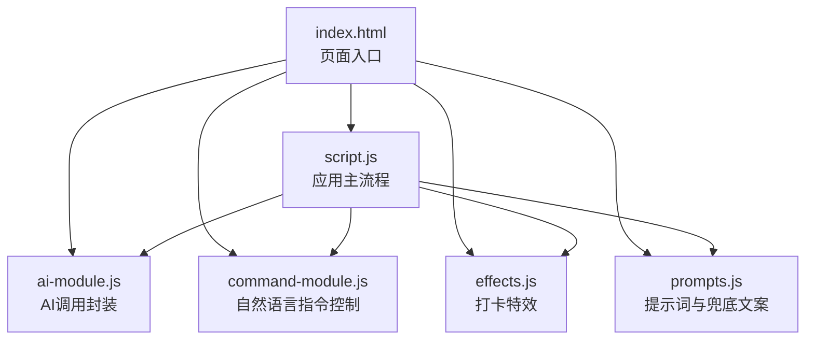
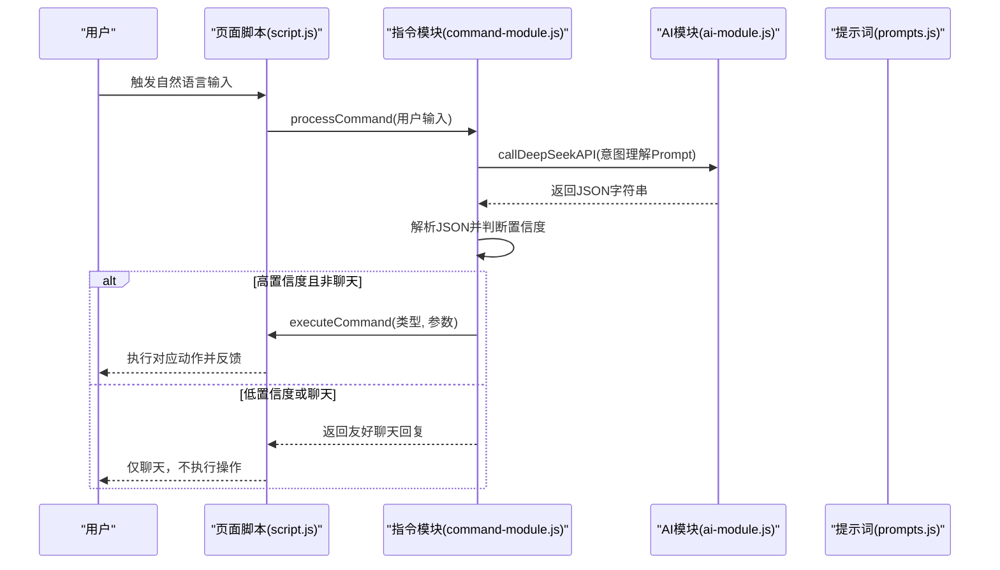
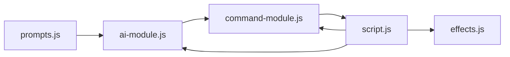

# 开发最佳实践

<cite>
**本文引用的文件**
- [README.md](file://README.md)
- [index.html](file://index.html)
- [script.js](file://script.js)
- [ai-module.js](file://ai-module.js)
- [prompts.js](file://prompts.js)
- [command-module.js](file://command-module.js)
- [effects.js](file://effects.js)
- [styles.css](file://styles.css)
</cite>

## 目录
1. [引言](#引言)
2. [项目结构](#项目结构)
3. [核心组件](#核心组件)
4. [架构总览](#架构总览)
5. [详细组件分析](#详细组件分析)
6. [依赖关系分析](#依赖关系分析)
7. [性能考量](#性能考量)
8. [故障排查指南](#故障排查指南)
9. [结论](#结论)
10. [附录](#附录)

## 引言
本指南面向希望在现有工作计时器项目基础上进行二次开发的工程师，重点围绕以下目标展开：
- 在 prompts.js 中安全地添加新的提示词模板
- 在 ai-module.js 中实现新的 AI 调用方法
- 在 command-module.js 中新增自然语言指令类型与处理逻辑
- 通过可复用的模式与兜底策略，确保修改不影响系统稳定性
- 强调错误处理、边界情况与性能优化的编码规范

## 项目结构
该项目采用前端单页应用结构，核心入口为 index.html，脚本与样式分别由 script.js、ai-module.js、command-module.js、effects.js、prompts.js 等模块组成。AI 功能与自然语言指令控制位于独立模块中，通过全局命名空间暴露给页面脚本使用。

图表来源
- [index.html](file://index.html#L1-L40)
- [script.js](file://script.js#L90-L130)
- [ai-module.js](file://ai-module.js#L1-L40)
- [command-module.js](file://command-module.js#L1-L40)
- [effects.js](file://effects.js#L1-L20)
- [prompts.js](file://prompts.js#L1-L20)

章节来源
- [index.html](file://index.html#L1-L40)
- [script.js](file://script.js#L90-L130)

## 核心组件
- AI 功能模块（ai-module.js）
  - 提供 DeepSeek API 调用封装、问候语生成、摸鱼吉日签、工作总结生成、通用分析调用等方法，并提供兜底策略与错误处理。
- 提示词与兜底文案（prompts.js）
  - 统一管理 AI 提示词模板与兜底文案，支持随机兜底消息选择。
- 自然语言指令控制（command-module.js）
  - 定义指令类型、意图理解 Prompt、解析与执行逻辑，支持聊天模式与低置信度回退。
- 应用主流程（script.js）
  - 负责页面初始化、标签页切换、打卡流程、时间轴与番茄钟等业务逻辑；与 AI 与指令模块通过全局命名空间交互。
- 打卡特效（effects.js）
  - 提供 Canvas 动画特效，增强打卡体验。

章节来源
- [ai-module.js](file://ai-module.js#L1-L60)
- [prompts.js](file://prompts.js#L1-L40)
- [command-module.js](file://command-module.js#L1-L40)
- [script.js](file://script.js#L490-L730)
- [effects.js](file://effects.js#L1-L40)

## 架构总览
AI 与自然语言指令作为横切关注点，通过全局命名空间注入到页面脚本中，形成“提示词驱动 + 意图理解 + 执行动作”的闭环。

图表来源
- [command-module.js](file://command-module.js#L182-L259)
- [ai-module.js](file://ai-module.js#L14-L59)
- [prompts.js](file://prompts.js#L1-L40)

## 详细组件分析

### 在 prompts.js 中添加新的提示词模板
- 设计原则
  - 模板必须明确输出格式（如 JSON 或纯文本），并在注释中说明字段含义与长度约束。
  - 为每个新模板提供兜底文案（FALLBACK_MESSAGES），确保网络异常或解析失败时仍能返回稳定内容。
  - 使用 window.getRandomFallbackMessage(type) 机制统一随机兜底，避免分散逻辑。
- 实施步骤
  - 在 AI_PROMPTS 中新增键值对，键名为大写常量（如 NEW_ANALYSIS），值为完整 Prompt 文本。
  - 在 FALLBACK_MESSAGES 中为该类型补充兜底对象或数组。
  - 如需随机兜底，确保 getRandomFallbackMessage(type) 能正确返回对应兜底。
- 错误与边界
  - 若 AI 返回非预期格式，解析失败时应降级到兜底文案，避免抛出异常导致 UI 卡死。
  - 对于需要参数替换的模板，确保替换占位符与实际传参一致，防止空值污染输出。
- 性能与稳定性
  - 兜底文案尽量轻量，避免复杂计算。
  - 控制 Prompt 长度，避免超限或成本过高。

章节来源
- [prompts.js](file://prompts.js#L1-L159)

### 在 ai-module.js 中实现新的 AI 调用方法
- 设计原则
  - 保持与现有 API 调用一致的签名与返回结构（success、content/data/isAI/error）。
  - 统一错误处理：捕获异常、记录日志、返回兜底或错误信息。
  - 为新方法提供合理的 temperature、max_tokens 等参数配置，兼顾质量与成本。
- 实施步骤
  - 在 callDeepSeekAPI 中校验 API Key 并构造请求体，遵循现有头部与消息结构。
  - 新增方法（如 generateXxx）：拼装 Prompt（可复用 window.AI_PROMPTS），调用 callDeepSeekAPI，解析响应并包装为统一结果对象。
  - 在 try/catch 中处理网络错误、HTTP 非 OK、JSON 解析失败等情况，必要时降级到兜底。
  - 在 window.AIModule 中导出新方法，供页面脚本调用。
- 安全与健壮性
  - 不在前端打印敏感信息（如 API Key）。
  - 对外部输入进行最小化信任假设，必要时在调用前做简单校验。
- 性能优化
  - 对频繁调用的方法，考虑缓存短期结果（如问候语），避免重复请求。
  - 控制并发，避免短时间内大量请求导致限流。

章节来源
- [ai-module.js](file://ai-module.js#L1-L216)

### 在 command-module.js 中新增指令类型与处理逻辑
- 设计原则
  - 指令类型常量集中管理，便于维护与查找。
  - 意图理解 Prompt 明确列出可用操作、返回 JSON 字段与置信度阈值，确保模型输出可解析。
  - 执行函数内对 DOM 元素存在性与状态进行检查，避免空引用。
- 实施步骤
  - 在 COMMAND_TYPES 中新增枚举值（如 new_action）。
  - 在 COMMAND_UNDERSTANDING_PROMPT 中补充该指令的示例与参数说明。
  - 在 executeCommand 的 actions 映射中新增分支，读取 params.tab 等参数，触发对应 UI 行为。
  - 在 processCommand 中处理解析失败、低置信度与聊天模式，确保用户体验稳定。
- 错误与边界
  - 解析 JSON 失败时返回聊天回复，避免中断流程。
  - 对低置信度（confidence < 0.7）直接走聊天通道，降低误操作风险。
- 性能与稳定性
  - 对 UI 操作（如点击按钮）采用异步与延时策略，确保模态框渲染后再触发子动作。
  - 使用 getActionName/getTabName 统一文案，避免硬编码。

章节来源
- [command-module.js](file://command-module.js#L1-L313)

### 与页面脚本的集成与安全修改建议
- 全局命名空间
  - ai-module.js 与 command-module.js 通过 window.AIModule 与 window.CommandModule 暴露接口，script.js 通过这些命名空间调用 AI 与指令功能。
- 修改策略
  - 不直接改动全局对象结构，优先在模块内部扩展，保持对外接口稳定。
  - 对外暴露的导出对象（如 window.AIModule）保持向后兼容，新增方法不改变既有方法签名。
- 稳定性保障
  - 在 script.js 的打卡流程中，对 AI 调用失败采用兜底文案与降级 UI，避免阻塞主流程。
  - 对 DOM 操作增加存在性检查与状态判断，避免在页面未就绪时触发。

章节来源
- [index.html](file://index.html#L1-L20)
- [script.js](file://script.js#L490-L730)
- [ai-module.js](file://ai-module.js#L206-L216)
- [command-module.js](file://command-module.js#L305-L313)

## 依赖关系分析
- 模块耦合
  - script.js 依赖 ai-module.js 与 command-module.js 的全局接口，同时依赖 effects.js 的 Canvas 动画。
  - ai-module.js 依赖 prompts.js 的提示词与兜底文案。
  - command-module.js 依赖 ai-module.js 的 DeepSeek 调用能力。
- 外部依赖
  - DeepSeek API（通过 fetch 调用），需配置 API Key。
  - 浏览器环境（DOM、Canvas、localStorage、fetch）。

图表来源
- [ai-module.js](file://ai-module.js#L1-L40)
- [prompts.js](file://prompts.js#L1-L40)
- [command-module.js](file://command-module.js#L1-L40)
- [script.js](file://script.js#L490-L730)
- [effects.js](file://effects.js#L1-L40)

章节来源
- [ai-module.js](file://ai-module.js#L1-L40)
- [prompts.js](file://prompts.js#L1-L40)
- [command-module.js](file://command-module.js#L1-L40)
- [script.js](file://script.js#L490-L730)
- [effects.js](file://effects.js#L1-L40)

## 性能考量
- API 调用
  - 控制 temperature、max_tokens，避免过长输出与高成本调用。
  - 对高频调用（如问候语）考虑短期缓存，减少重复请求。
- DOM 与动画
  - effects.js 使用 requestAnimationFrame 与 Canvas 绘制，注意在窗口 resize 时重设画布尺寸，避免过度重绘。
- 错误与回退
  - 通过兜底文案与降级 UI 保证用户体验，避免长时间等待或空白状态。
- 资源加载
  - index.html 中按需引入模块脚本，避免不必要的资源占用。

章节来源
- [ai-module.js](file://ai-module.js#L14-L59)
- [effects.js](file://effects.js#L1-L40)
- [index.html](file://index.html#L1-L20)

## 故障排查指南
- API Key 未配置
  - 现象：调用 AI 方法抛出“未配置 API 密钥”错误。
  - 处理：在设置页保存 API Key，并通过“测试连接”验证连通性。
- API 请求失败
  - 现象：HTTP 非 OK 或响应体无 error 字段。
  - 处理：捕获错误并返回兜底文案，同时在控制台输出详细错误信息。
- 指令解析失败
  - 现象：模型返回非 JSON 或字段缺失。
  - 处理：parseCommandResponse 失败时走聊天模式，提示用户重新表述。
- 低置信度
  - 现象：confidence < 0.7。
  - 处理：返回友好聊天回复，避免误执行。
- DOM 元素不存在
  - 现象：executeCommand 中找不到按钮或模态框。
  - 处理：增加存在性检查与状态判断，避免空引用。

章节来源
- [ai-module.js](file://ai-module.js#L14-L59)
- [command-module.js](file://command-module.js#L56-L110)
- [command-module.js](file://command-module.js#L182-L259)
- [script.js](file://script.js#L546-L730)

## 结论
通过对 prompts.js、ai-module.js、command-module.js 的模块化设计与兜底策略，项目实现了稳定的 AI 能力扩展与自然语言指令控制。遵循本文的扩展流程与最佳实践，可以在不破坏系统稳定性的前提下，持续增强 AI 与语音交互能力，提升用户体验与产品价值。

## 附录
- 开发与调试建议
  - 在本地启用开发者模式与自定义时间，便于模拟不同场景。
  - 使用浏览器开发者工具监控网络请求与 Canvas 性能。
- 样式与交互
  - 通过 styles.css 统一样式规范，确保新增组件与现有主题一致。
- 文档与知识
  - 参考 README.md 了解产品定位与功能范围，指导二次开发方向。

章节来源
- [README.md](file://README.md#L1-L125)
- [styles.css](file://styles.css#L1-L120)