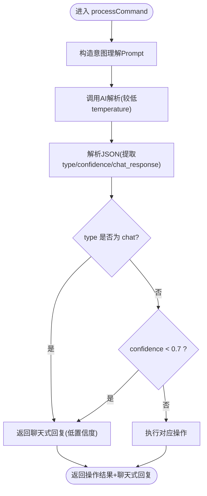

# 低置信度处理机制

<cite>
**本文引用的文件**
- [command-module.js](file://command-module.js)
- [ai-module.js](file://ai-module.js)
- [prompts.js](file://prompts.js)
- [script.js](file://script.js)
- [index.html](file://index.html)
- [effects.js](file://effects.js)
</cite>

## 目录
1. [引言](#引言)
2. [项目结构](#项目结构)
3. [核心组件](#核心组件)
4. [架构总览](#架构总览)
5. [详细组件分析](#详细组件分析)
6. [依赖关系分析](#依赖关系分析)
7. [性能考量](#性能考量)
8. [故障排查指南](#故障排查指南)
9. [结论](#结论)

## 引言
本节围绕 work-timer 中“基于置信度阈值”的容错机制展开，重点解释 processCommand 函数中 CONFIDENCE_THRESHOLD = 0.7 的设计原理与实践意义。该机制旨在当 AI 模型对用户意图识别的置信度低于阈值时，系统不执行任何实际操作，而以“聊天式回复”代替，从而避免因模糊指令导致的误操作（如下班打卡误触发），显著提升用户体验与安全性。

## 项目结构
work-timer 的自然语言指令处理链路由前端脚本驱动，核心流程包括：
- 用户在悬浮窗输入自然语言指令
- 调用命令模块的 processCommand 进行意图解析与执行
- 若置信度低于阈值，仅返回聊天式回复；否则执行对应操作
- AI 模块负责调用外部大模型接口，并提供兜底策略
- Prompts 模块统一管理各类 Prompt 模板与兜底文案
- 主页面脚本负责初始化与 UI 交互

图表来源
- [index.html](file://index.html#L48-L66)
- [script.js](file://script.js#L922-L1030)
- [command-module.js](file://command-module.js#L182-L259)
- [ai-module.js](file://ai-module.js#L14-L59)

章节来源
- [index.html](file://index.html#L48-L66)
- [script.js](file://script.js#L922-L1030)
- [command-module.js](file://command-module.js#L182-L259)
- [ai-module.js](file://ai-module.js#L14-L59)

## 核心组件
- 命令模块（command-module.js）
  - 定义 COMMAND_TYPES、COMMAND_UNDERSTANDING_PROMPT
  - 实现 parseCommandResponse、executeCommand、processCommand
  - 关键逻辑：置信度阈值判断与低置信度聊天回复
- AI 模块（ai-module.js）
  - 封装 DeepSeek API 调用，提供 temperature、maxTokens 等参数
  - 提供 callAIAnalysis、generateWorkSummary 等分析与生成能力
- Prompt 模板（prompts.js）
  - 统一管理各类 Prompt 模板与兜底文案
- 主页面脚本（script.js）
  - 初始化 AI 助手悬浮窗，接收 processCommand 返回结果并渲染状态
- 效果模块（effects.js）
  - 提供打卡特效，配合 UI 增强体验

章节来源
- [command-module.js](file://command-module.js#L1-L313)
- [ai-module.js](file://ai-module.js#L1-L216)
- [prompts.js](file://prompts.js#L1-L159)
- [script.js](file://script.js#L922-L1030)
- [effects.js](file://effects.js#L1-L279)

## 架构总览
下图展示了从用户输入到最终执行或聊天回复的关键路径，以及置信度阈值在其中的作用。

图表来源
- [script.js](file://script.js#L922-L1030)
- [command-module.js](file://command-module.js#L182-L259)
- [ai-module.js](file://ai-module.js#L14-L59)

## 详细组件分析

### 置信度阈值与低置信度聊天回复
- 设计原理
  - 通过在 Prompt 中要求模型输出“type”、“confidence”、“chat_response”等字段，使系统具备“意图识别+置信度+聊天回复”的闭环能力
  - CONFIDENCE_THRESHOLD = 0.7 的设定，既保证高置信度场景下的自动化执行，又能在模糊场景下以聊天式回复兜底，避免误操作
- 关键实现
  - processCommand 在解析到 JSON 后，若 parsed.confidence < 0.7，则直接返回低置信度聊天回复，且 executed=false
  - 若 parsed.type === 'chat'，同样以聊天模式返回，executed=false
  - 若置信度足够，则调用 executeCommand 执行对应操作，并返回操作名称与聊天式回复
- 低置信度友好回复定制
  - 低置信度时的 chat_response 来源于模型返回的 parsed.chat_response 或兜底文案
  - 可通过调整 COMMAND_UNDERSTANDING_PROMPT 中的规则与模板，引导模型在低置信度场景下输出更自然友好的聊天回复
- 温度参数与识别灵敏度
  - processCommand 使用较低 temperature（如 0.3）以获得更确定的意图解析
  - 其他 AI 生成场景（如摸鱼吉日签、工作总结）使用较高 temperature（如 1.3/1.4）以提升创意与多样性
  - 可根据场景灵活调整 temperature：越需要稳定意图识别，越降低 temperature；越需要创意表达，越高 temperature

图表来源
- [command-module.js](file://command-module.js#L182-L259)

章节来源
- [command-module.js](file://command-module.js#L182-L259)

### 执行器与页面交互
- executeCommand 根据命令类型触发页面交互（如打卡、打开番茄钟、切换标签页、摸鱼记录等）
- 主页面脚本在收到结果后，若 executed=true 则显示“已执行：操作名称”，若 lowConfidence=true 则显示“理解为：聊天模式”

图表来源
- [script.js](file://script.js#L922-L1030)
- [command-module.js](file://command-module.js#L77-L181)

章节来源
- [script.js](file://script.js#L922-L1030)
- [command-module.js](file://command-module.js#L77-L181)

### AI 模块与温度参数
- AI 模块封装 DeepSeek API 调用，支持 temperature、maxTokens、topP 等参数
- 不同场景采用不同 temperature：
  - 意图解析：temperature=0.3（稳定）
  - 摸鱼吉日签：temperature=1.3（创意）
  - 工作总结：temperature=1.4（创意）
- 通过在调用处传参，可灵活平衡“识别灵敏度与准确率”

章节来源
- [ai-module.js](file://ai-module.js#L14-L59)
- [ai-module.js](file://ai-module.js#L100-L167)

### Prompt 模板与兜底文案
- prompts.js 统一管理各类 Prompt 模板与兜底文案
- 当 AI 生成失败时，AI 模块提供兜底文案，保证系统稳定性
- 低置信度场景下的友好回复可通过 Prompt 指导模型输出更自然的聊天语句

章节来源
- [prompts.js](file://prompts.js#L1-L159)
- [ai-module.js](file://ai-module.js#L95-L167)

## 依赖关系分析
- 命令模块依赖 AI 模块进行意图解析与调用外部模型
- 主页面脚本依赖命令模块的返回结果进行 UI 更新与状态提示
- 效果模块与页面交互无直接耦合，但与打卡流程存在视觉联动

图表来源
- [command-module.js](file://command-module.js#L182-L259)
- [ai-module.js](file://ai-module.js#L14-L59)
- [script.js](file://script.js#L922-L1030)

章节来源
- [command-module.js](file://command-module.js#L182-L259)
- [ai-module.js](file://ai-module.js#L14-L59)
- [script.js](file://script.js#L922-L1030)

## 性能考量
- 低 temperature（如 0.3）有助于提升意图解析的确定性，减少误判，但可能牺牲少量创意
- 高 temperature（如 1.3/1.4）提升生成内容的多样性，适合非操作类场景
- 建议在“意图解析”场景维持较低 temperature，在“创意生成”场景适当提高
- 控制 maxTokens 与 topP 可进一步平衡响应速度与质量

[本节为通用指导，无需列出章节来源]

## 故障排查指南
- 如何在控制台输出 parsed 对象以便分析模型判断过程
  - 在 processCommand 中解析到 parsed 后，可在调试阶段将 parsed 输出到控制台，便于观察 confidence、type、chat_response 等字段
  - 示例路径参考：[command-module.js](file://command-module.js#L194-L259)
- 常见问题与定位
  - 模型未返回有效 JSON：parseCommandResponse 会返回 null，processCommand 将返回兜底聊天回复
  - 置信度过低：返回低置信度聊天回复，executed=false
  - 执行失败：executeCommand 返回失败信息，processCommand 返回错误提示
  - AI 调用异常：AI 模块捕获错误并返回兜底文案，主页面脚本显示错误状态
- 开发者模式与自定义时间
  - 通过设置面板开启开发者模式与自定义时间，便于在特定时间点验证流程
  - 参考路径：[index.html](file://index.html#L414-L441)，[script.js](file://script.js#L922-L1030)

章节来源
- [command-module.js](file://command-module.js#L194-L259)
- [ai-module.js](file://ai-module.js#L14-L59)
- [index.html](file://index.html#L414-L441)
- [script.js](file://script.js#L922-L1030)

## 结论
work-timer 通过“置信度阈值 + 聊天式兜底”的机制，有效提升了自然语言指令系统的鲁棒性与用户体验。CONFIDENCE_THRESHOLD = 0.7 的设定在“高置信度自动执行”与“低置信度安全兜底”之间取得平衡，既能满足高效操作，又能避免误触发风险。通过合理调整 temperature 与 Prompt 模板，可进一步优化识别灵敏度与准确率，满足不同场景需求。