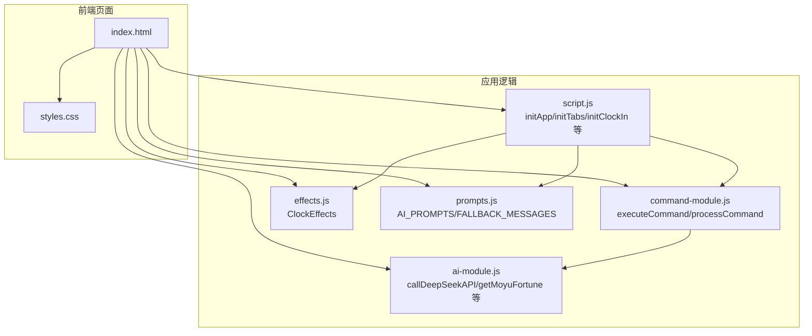
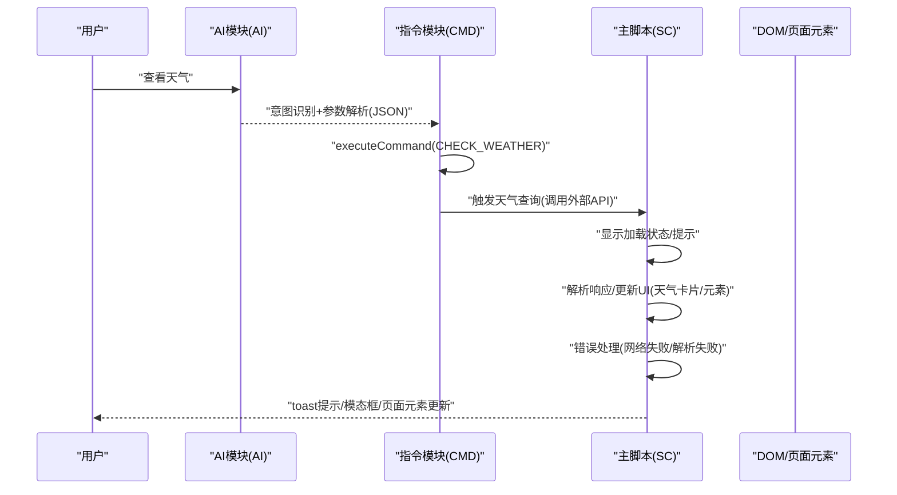
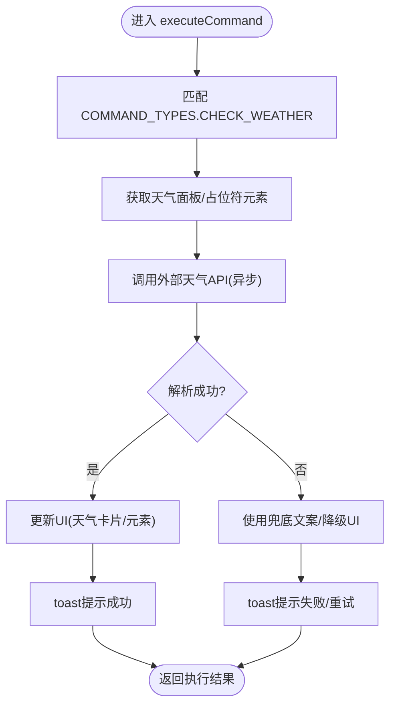
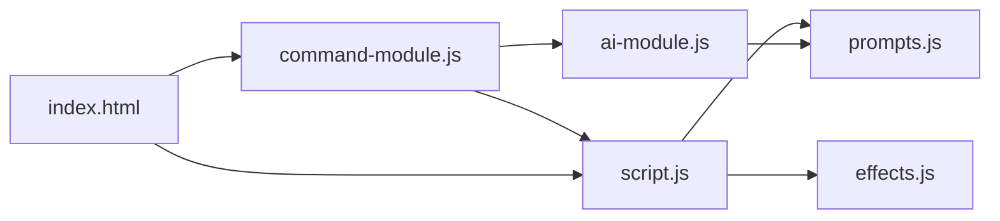

# 执行逻辑实现

<cite>
**本文引用的文件**
- [command-module.js](file://command-module.js)
- [script.js](file://script.js)
- [index.html](file://index.html)
- [ai-module.js](file://ai-module.js)
- [effects.js](file://effects.js)
- [styles.css](file://styles.css)
- [prompts.js](file://prompts.js)
</cite>

## 目录
1. [简介](#简介)
2. [项目结构](#项目结构)
3. [核心组件](#核心组件)
4. [架构总览](#架构总览)
5. [详细组件分析](#详细组件分析)
6. [依赖关系分析](#依赖关系分析)
7. [性能考量](#性能考量)
8. [故障排查指南](#故障排查指南)
9. [结论](#结论)
10. [附录](#附录)

## 简介
本文围绕如何在 executeCommand 函数中实现新指令的执行逻辑展开，以新增“查看天气”指令为例，系统讲解：
- 在 actions 对象中添加 COMMAND_TYPES.CHECK_WEATHER 对应的执行函数
- 异步调用外部天气 API 的处理流程
- 解析响应数据并更新 UI（弹出天气卡片或修改页面元素）
- 错误处理与网络失败时的降级方案
- 通过 document.getElementById 或自定义事件触发相关功能
- 与现有系统集成的规范（如使用 window.showToast 提示信息，或调用 script.js 中的状态管理函数）

同时，本文提供完整的代码示例路径，涵盖加载状态、成功反馈与失败重试机制，帮助开发者快速、安全地扩展自然语言指令系统。

## 项目结构
该项目采用前端单页应用结构，核心模块包括：
- 自然语言指令控制模块：负责意图识别、指令解析与执行
- AI 模块：封装外部 API 调用与兜底策略
- 主应用脚本：负责页面初始化、事件绑定、状态管理与 UI 更新
- 效果模块：提供打卡特效渲染
- Prompt 配置：统一管理 AI 提示词与兜底文案
- 样式与模板：提供 UI 组件与交互样式

图表来源
- [index.html](file://index.html#L1-L120)
- [command-module.js](file://command-module.js#L1-L120)
- [script.js](file://script.js#L90-L160)
- [ai-module.js](file://ai-module.js#L1-L60)
- [effects.js](file://effects.js#L1-L40)
- [prompts.js](file://prompts.js#L1-L40)

章节来源
- [index.html](file://index.html#L1-L120)
- [command-module.js](file://command-module.js#L1-L120)
- [script.js](file://script.js#L90-L160)

## 核心组件
- 自然语言指令控制模块（command-module.js）
  - 定义 COMMAND_TYPES 枚举与意图识别 Prompt
  - 实现 executeCommand(actions 映射) 与 processCommand（含置信度与聊天模式）
  - 提供 showToast 封装，兼容 window.showToast
- 主应用脚本（script.js）
  - 页面初始化、标签页切换、打卡流程、时间轴与 AI 功能集成
  - 提供 toast 提示、模态框控制、事件派发等
- AI 模块（ai-module.js）
  - 封装 DeepSeek API 调用，统一错误处理与兜底策略
  - 提供 getMoyuFortune/generateWorkSummary 等业务方法
- 效果模块（effects.js）
  - 提供 Canvas 动画特效（打卡特效），供脚本调用
- Prompt 配置（prompts.js）
  - 统一管理 AI 提示词与兜底文案，便于扩展与维护

章节来源
- [command-module.js](file://command-module.js#L1-L120)
- [script.js](file://script.js#L90-L160)
- [ai-module.js](file://ai-module.js#L1-L60)
- [effects.js](file://effects.js#L1-L40)
- [prompts.js](file://prompts.js#L1-L40)

## 架构总览
自然语言指令处理流程（以“查看天气”为例）：

图表来源
- [command-module.js](file://command-module.js#L180-L260)
- [script.js](file://script.js#L990-L1030)
- [ai-module.js](file://ai-module.js#L1-L60)

## 详细组件分析

### 在 executeCommand 中新增“查看天气”指令
目标：在 actions 对象中添加 COMMAND_TYPES.CHECK_WEATHER 对应的执行函数，实现以下能力：
- 触发外部天气 API 查询
- 解析响应并更新 UI（弹出天气卡片或修改页面元素）
- 错误处理与降级（网络失败时的兜底提示）
- 与现有系统集成（window.showToast、script.js 状态管理）

实现步骤与要点：
1. 在 COMMAND_TYPES 中新增 CHECK_WEATHER
2. 在 actions 映射中添加对应执行函数
3. 在执行函数中：
   - 通过 document.getElementById 获取 UI 元素（如天气面板、占位符）
   - 调用外部天气 API（可参考 ai-module.js 的 fetch 模式）
   - 解析响应并更新 DOM（如填充温度、天气图标、体感等）
   - 使用 window.showToast 提示加载/成功/失败状态
   - 若失败，使用兜底文案或降级 UI（如显示“暂无数据”）
4. 在 processCommand 中确保置信度阈值与聊天模式兼容

图表来源
- [command-module.js](file://command-module.js#L74-L120)
- [script.js](file://script.js#L990-L1030)
- [ai-module.js](file://ai-module.js#L1-L60)

章节来源
- [command-module.js](file://command-module.js#L74-L120)
- [script.js](file://script.js#L990-L1030)

### 外部天气 API 的异步处理与解析
- 调用方式：可参考 ai-module.js 的 callDeepSeekAPI 模式，使用 fetch 发起请求，统一处理响应与错误
- 参数与配置：根据实际天气 API 文档设置请求头、超时、重试等
- 响应解析：从响应中提取温度、天气状况、体感、风速等字段，映射到 UI 占位符
- UI 更新：通过 document.getElementById 获取面板元素，设置文本/类名/图标等

章节来源
- [ai-module.js](file://ai-module.js#L1-L60)
- [index.html](file://index.html#L1-L120)

### 错误处理与降级方案
- 网络失败：捕获异常，使用兜底文案（如“网络不佳，暂无天气数据”），并通过 window.showToast 提示
- 解析失败：当响应非预期格式时，回退到预设的兜底结构
- 重试机制：在 UI 中提供“重试”按钮，再次发起请求；或在脚本中实现指数退避重试
- 降级 UI：若面板不存在，可在页面其他区域显示天气摘要，或通过 toast 提示

章节来源
- [ai-module.js](file://ai-module.js#L1-L60)
- [command-module.js](file://command-module.js#L294-L304)

### 与现有系统集成规范
- 提示信息：优先调用 window.showToast，若未定义则回退到控制台日志
- 状态管理：可复用 script.js 中的 toast、模态框、标签页切换等通用方法
- 事件触发：通过 document.getElementById 获取元素并触发 click 或设置 innerHTML
- 兜底策略：参考 prompts.js 中的 FALLBACK_MESSAGES，确保在异常情况下仍能给用户稳定反馈

章节来源
- [command-module.js](file://command-module.js#L294-L304)
- [prompts.js](file://prompts.js#L120-L159)
- [script.js](file://script.js#L90-L160)

### 示例：新增“查看天气”的完整实现路径
以下为新增“查看天气”指令的实现路径指引（不直接展示代码内容）：
- 在 COMMAND_TYPES 中新增枚举值：参考 [command-module.js](file://command-module.js#L7-L19)
- 在 actions 映射中添加执行函数：参考 [command-module.js](file://command-module.js#L74-L120)
- 在执行函数中调用外部天气 API 并更新 UI：参考 [ai-module.js](file://ai-module.js#L1-L60) 与 [index.html](file://index.html#L1-L120)
- 使用 window.showToast 提示状态：参考 [command-module.js](file://command-module.js#L294-L304)
- 在 processCommand 中确保置信度与聊天模式：参考 [command-module.js](file://command-module.js#L180-L260)
- 在主脚本中提供 toast 与 UI 控制：参考 [script.js](file://script.js#L90-L160)

章节来源
- [command-module.js](file://command-module.js#L7-L19)
- [command-module.js](file://command-module.js#L74-L120)
- [command-module.js](file://command-module.js#L180-L260)
- [command-module.js](file://command-module.js#L294-L304)
- [ai-module.js](file://ai-module.js#L1-L60)
- [index.html](file://index.html#L1-L120)
- [script.js](file://script.js#L90-L160)

## 依赖关系分析
- command-module.js 依赖：
  - ai-module.js：用于调用外部 API（DeepSeek）与兜底策略
  - script.js：依赖主应用的 UI 控件与状态管理（如 showToast、标签页切换）
  - index.html：提供 DOM 元素与页面结构
- script.js 依赖：
  - effects.js：打卡特效
  - prompts.js：AI 提示词与兜底文案
- ai-module.js 依赖：
  - localStorage：读取 API Key
  - prompts.js：统一的 Prompt 模板

图表来源
- [command-module.js](file://command-module.js#L1-L120)
- [script.js](file://script.js#L90-L160)
- [ai-module.js](file://ai-module.js#L1-L60)
- [effects.js](file://effects.js#L1-L40)
- [prompts.js](file://prompts.js#L1-L40)
- [index.html](file://index.html#L1-L120)

章节来源
- [command-module.js](file://command-module.js#L1-L120)
- [script.js](file://script.js#L90-L160)
- [ai-module.js](file://ai-module.js#L1-L60)
- [effects.js](file://effects.js#L1-L40)
- [prompts.js](file://prompts.js#L1-L40)
- [index.html](file://index.html#L1-L120)

## 性能考量
- 异步调用外部 API 时，建议：
  - 设置合理的超时与重试策略，避免阻塞 UI
  - 使用节流/防抖减少频繁请求
  - 缓存近期天气数据，降低重复请求
- UI 更新：
  - 优先批量更新 DOM，减少重排与重绘
  - 使用 requestAnimationFrame 优化动画与特效
- 错误处理：
  - 降级路径应快速返回，避免长时间等待
  - 使用轻量级兜底文案，减少解析成本

## 故障排查指南
- 指令未执行
  - 检查 processCommand 是否正确解析 JSON 并达到置信度阈值
  - 确认 executeCommand 的 actions 映射是否存在对应键
  - 参考：[command-module.js](file://command-module.js#L180-L260)
- 天气 API 调用失败
  - 检查网络连通性与 API Key 配置
  - 查看 ai-module.js 的错误分支与兜底策略
  - 参考：[ai-module.js](file://ai-module.js#L1-L60)
- UI 未更新
  - 确认 DOM 元素 ID 是否存在，是否在页面中渲染
  - 检查样式是否遮挡或 display:none
  - 参考：[index.html](file://index.html#L1-L120)
- 提示信息未显示
  - 确认 window.showToast 是否定义，否则回退到控制台日志
  - 参考：[command-module.js](file://command-module.js#L294-L304)

章节来源
- [command-module.js](file://command-module.js#L180-L260)
- [command-module.js](file://command-module.js#L294-L304)
- [ai-module.js](file://ai-module.js#L1-L60)
- [index.html](file://index.html#L1-L120)

## 结论
通过在 executeCommand 的 actions 对象中新增 COMMAND_TYPES.CHECK_WEATHER，并遵循统一的异步调用、解析与 UI 更新规范，即可安全、稳定地扩展“查看天气”等新指令。配合 window.showToast、兜底文案与降级 UI，能够在网络异常或解析失败时仍为用户提供良好体验。建议在实现过程中严格遵循现有模块边界与依赖关系，确保扩展与维护的一致性。

## 附录
- 相关实现路径参考：
  - 指令类型定义与执行映射：[command-module.js](file://command-module.js#L7-L19), [command-module.js](file://command-module.js#L74-L120)
  - 意图识别与执行流程：[command-module.js](file://command-module.js#L180-L260)
  - 外部 API 调用封装：[ai-module.js](file://ai-module.js#L1-L60)
  - 页面初始化与 UI 控制：[script.js](file://script.js#L90-L160)
  - 提示信息封装：[command-module.js](file://command-module.js#L294-L304)
  - 样式与组件结构：[styles.css](file://styles.css#L1-L120), [index.html](file://index.html#L1-L120)