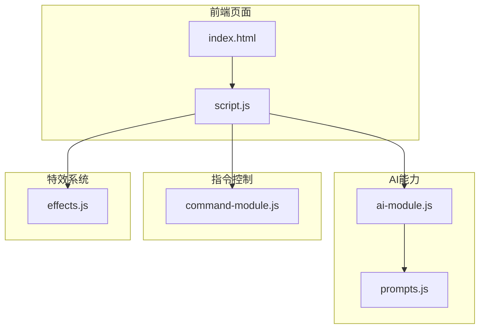
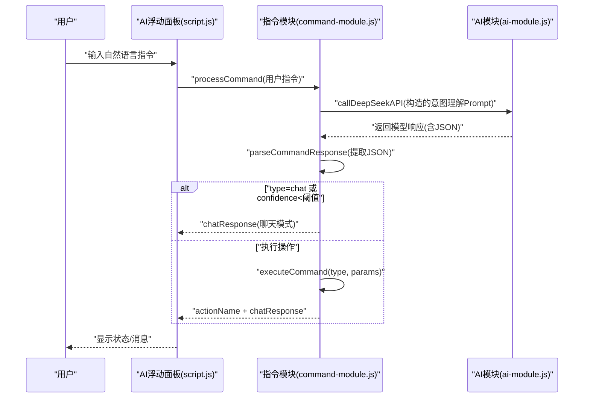
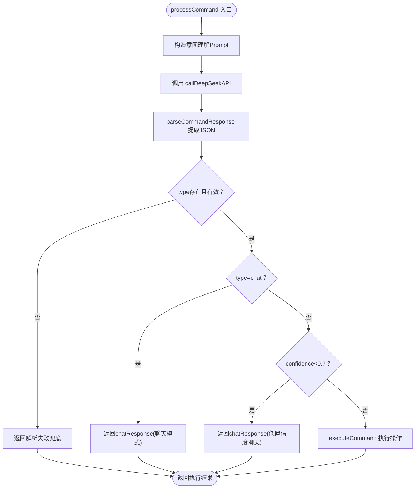
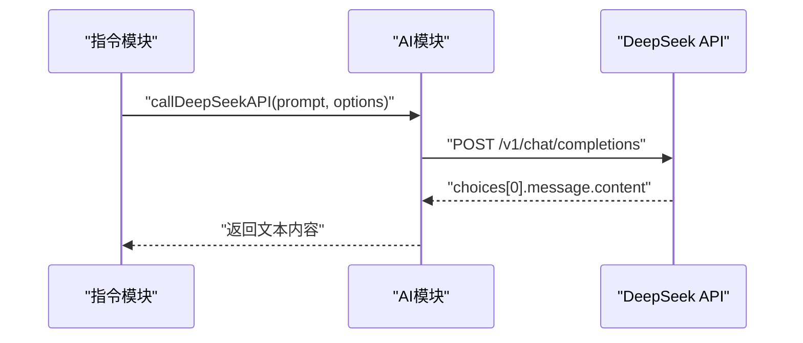
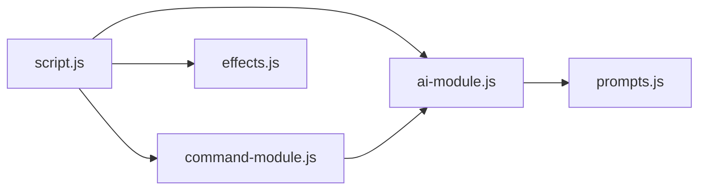

# 指令测试实践

<cite>
**本文引用的文件**
- [index.html](file://index.html)
- [script.js](file://script.js)
- [ai-module.js](file://ai-module.js)
- [command-module.js](file://command-module.js)
- [prompts.js](file://prompts.js)
- [effects.js](file://effects.js)
- [README.md](file://README.md)
- [TEST_CHECKLIST_v1.3.3.md](file://TEST_CHECKLIST_v1.3.3.md)
- [test_checklist.md](file://test_checklist.md)
</cite>

## 目录
1. [简介](#简介)
2. [项目结构](#项目结构)
3. [核心组件](#核心组件)
4. [架构总览](#架构总览)
5. [详细组件分析](#详细组件分析)
6. [依赖关系分析](#依赖关系分析)
7. [性能考量](#性能考量)
8. [故障排查指南](#故障排查指南)
9. [结论](#结论)
10. [附录](#附录)

## 简介
本指南面向新增自然语言指令的扩展测试实践，覆盖从用户输入到AI解析、置信度判断、执行与反馈的全链路验证。文档特别提供针对“天气”类新指令的测试方法，包括：
- 使用不同表达方式测试新指令（如“今天天气怎么样”、“外面热吗”、“要下雨了吗”），观察是否能正确解析为 CHECK_WEATHER 类型；
- 利用浏览器开发者工具监控 API 请求（检查 callDeepSeekAPI 调用）、查看控制台日志（parseCommandResponse 解析结果）以及调试 executeCommand 执行路径；
- 模拟低置信度场景（手动修改返回 JSON 中的 confidence 值）验证系统是否正确降级为聊天模式；
- 进行回归测试，确保新指令不影响原有功能。

## 项目结构
本项目采用前端单页应用结构，AI 与指令处理分别由独立模块提供能力，主页面通过脚本模块集成并驱动交互。

图表来源
- [index.html](file://index.html#L1-L120)
- [script.js](file://script.js#L950-L1030)
- [ai-module.js](file://ai-module.js#L1-L60)
- [command-module.js](file://command-module.js#L1-L60)
- [prompts.js](file://prompts.js#L1-L40)
- [effects.js](file://effects.js#L1-L40)

章节来源
- [index.html](file://index.html#L1-L120)
- [script.js](file://script.js#L950-L1030)

## 核心组件
- AI 模块（ai-module.js）：封装 DeepSeek API 调用、问候语、摸鱼吉日签、工作总结、通用分析等能力；提供 callDeepSeekAPI 作为统一入口。
- 指令模块（command-module.js）：定义 COMMAND_TYPES、构建 COMMAND_UNDERSTANDING_PROMPT、解析 parseCommandResponse、执行 executeCommand、processCommand 主流程。
- 提示词模块（prompts.js）：集中管理 AI PROMPT，包括摸鱼吉日签、工作总结、新闻分析等模板。
- 主脚本（script.js）：集成 AI 与指令模块，挂载到全局 window，处理 AI 助手面板交互、状态展示与错误处理。
- 特效模块（effects.js）：提供打卡特效（阳光/礼花）渲染与动画循环。

章节来源
- [ai-module.js](file://ai-module.js#L1-L120)
- [command-module.js](file://command-module.js#L1-L120)
- [prompts.js](file://prompts.js#L1-L80)
- [script.js](file://script.js#L990-L1030)
- [effects.js](file://effects.js#L1-L80)

## 架构总览
下面的序列图展示了“用户输入 → AI 解析 → 置信度判断 → 执行/聊天反馈”的端到端流程。

图表来源
- [script.js](file://script.js#L990-L1030)
- [command-module.js](file://command-module.js#L182-L259)
- [ai-module.js](file://ai-module.js#L14-L59)

章节来源
- [script.js](file://script.js#L990-L1030)
- [command-module.js](file://command-module.js#L182-L259)
- [ai-module.js](file://ai-module.js#L14-L59)

## 详细组件分析

### 指令模块（command-module.js）
- 指令类型定义：包含 clock_in、clock_out、start_pomodoro、pause_pomodoro、show_timeline、show_calendar、switch_tab、relax、show_settings、chat、unknown 等。
- 意图理解 Prompt：包含操作类型清单、用户输入占位、JSON 输出格式约束、置信度与聊天回复字段。
- 解析流程：parseCommandResponse 通过正则提取 JSON 片段并解析，失败时返回空。
- 执行流程：executeCommand 根据类型映射到 DOM 操作（如点击按钮、切换标签页），并返回执行结果与消息。
- 置信度与聊天模式：processCommand 在解析后判断 type 是否为 chat，或 confidence 是否低于 0.7，决定是否执行操作或仅聊天。

图表来源
- [command-module.js](file://command-module.js#L182-L259)

章节来源
- [command-module.js](file://command-module.js#L1-L120)
- [command-module.js](file://command-module.js#L182-L259)

### AI 模块（ai-module.js）
- callDeepSeekAPI：统一发起 DeepSeek API 请求，校验响应与错误，返回 choices[0].message.content。
- getAIGreeting/getMoyuFortune/generateWorkSummary/callAIAnalysis：基于 prompts.js 的模板拼装 Prompt 并调用 API，失败时返回兜底文案。
- 错误处理：捕获异常并抛出，供上层模块处理。

图表来源
- [ai-module.js](file://ai-module.js#L14-L59)

章节来源
- [ai-module.js](file://ai-module.js#L1-L120)

### 提示词模块（prompts.js）
- 统一管理 AI_PROMPTS：包括 MOYU_FORTUNE、WORK_SUMMARY、NEWS_ANALYSIS 等模板。
- FALLBACK_MESSAGES：提供兜底文案，用于 AI 失败时回退。
- getRandomFallbackMessage：按类型返回随机兜底文案。

章节来源
- [prompts.js](file://prompts.js#L1-L120)

### 主脚本（script.js）
- 初始化 AI 设置、打卡、时间轴、标签页、快捷功能等。
- 挂载 CommandModule 与 AIModule 到全局 window，供 UI 交互使用。
- 处理 AI 助手面板的发送按钮事件：调用 processCommand，展示 chatResponse 与执行状态，处理错误与按钮状态恢复。

章节来源
- [script.js](file://script.js#L990-L1030)

### 特效模块（effects.js）
- 提供 ClockEffects 类，实现 Canvas 动画（阳光/礼花），用于打卡场景的视觉反馈。
- 与 script.js 的打卡流程配合，增强用户体验。

章节来源
- [effects.js](file://effects.js#L1-L120)

## 依赖关系分析
- 指令模块依赖 AI 模块提供的 callDeepSeekAPI 与统一的错误处理。
- 主脚本依赖指令模块与 AI 模块，负责 UI 交互与状态展示。
- 提示词模块为 AI 模块提供 Prompt 模板，间接影响指令模块的 Prompt 构造。
- 特效模块与主脚本联动，用于打卡场景的动画效果。

图表来源
- [script.js](file://script.js#L990-L1030)
- [command-module.js](file://command-module.js#L182-L259)
- [ai-module.js](file://ai-module.js#L14-L59)
- [prompts.js](file://prompts.js#L1-L40)
- [effects.js](file://effects.js#L1-L40)

章节来源
- [script.js](file://script.js#L990-L1030)
- [command-module.js](file://command-module.js#L182-L259)
- [ai-module.js](file://ai-module.js#L14-L59)
- [prompts.js](file://prompts.js#L1-L40)
- [effects.js](file://effects.js#L1-L40)

## 性能考量
- 指令模块在 processCommand 中使用较低 temperature（0.3）以提升意图判断稳定性。
- AI 模块在多个场景使用合理的 maxTokens 与 temperature，平衡准确性与成本。
- 特效模块使用 requestAnimationFrame 控制动画帧，避免频繁重绘导致卡顿。
- 建议在新增指令时保持 Prompt 简洁、参数可控，避免过长的上下文增加延迟。

章节来源
- [command-module.js](file://command-module.js#L188-L192)
- [ai-module.js](file://ai-module.js#L14-L59)
- [effects.js](file://effects.js#L136-L200)

## 故障排查指南

### 如何监控 API 请求
- 打开浏览器开发者工具的 Network 面板，过滤 XHR/Fetch 请求，观察 callDeepSeekAPI 是否发出 POST 请求至 /v1/chat/completions。
- 确认请求头包含 Authorization: Bearer <your-api-key>，并检查响应状态码与返回内容。
- 若出现错误，查看控制台错误堆栈与响应体中的 error 字段。

章节来源
- [ai-module.js](file://ai-module.js#L14-L59)

### 如何查看解析与执行路径
- 在 script.js 的 AI 助手面板事件中，processCommand 调用后会打印 chatResponse 与执行状态，可在 Console 中查看。
- 在 command-module.js 的 parseCommandResponse 中，若解析失败会输出错误日志，便于定位模型返回格式问题。
- 在 executeCommand 中，根据类型映射到具体 DOM 操作，可通过断点或日志确认是否触发。

章节来源
- [script.js](file://script.js#L990-L1030)
- [command-module.js](file://command-module.js#L59-L72)
- [command-module.js](file://command-module.js#L77-L180)

### 如何模拟低置信度场景
- 方法一：直接修改模型返回的 JSON，将 confidence 设为小于 0.7，观察系统是否返回 chatResponse 并标记 lowConfidence。
- 方法二：在本地调试时，拦截或伪造 callDeepSeekAPI 的返回，构造包含 type 与 confidence 的 JSON，验证 processCommand 的分支逻辑。
- 注意：低置信度不会执行操作，仅返回聊天回复，这是预期行为。

章节来源
- [command-module.js](file://command-module.js#L216-L231)

### 如何进行回归测试
- 使用现有测试清单覆盖核心功能：打卡按钮状态、特效播放、时间轴记录、设置保存等。
- 新增指令后，至少执行以下回归项：
  - 指令解析与执行：确保原指令仍可正常工作（如上班/下班打卡、番茄钟、切换标签页等）。
  - 聊天模式：低置信度与 chat 类型应稳定降级为聊天。
  - 错误兜底：网络异常或模型返回异常时，应返回兜底文案并提示用户。
  - UI 状态：发送按钮禁用/恢复、状态提示、消息展示均正常。

章节来源
- [TEST_CHECKLIST_v1.3.3.md](file://TEST_CHECKLIST_v1.3.3.md#L136-L145)
- [test_checklist.md](file://test_checklist.md#L1-L38)

## 结论
通过本指南，你可以系统地验证新增自然语言指令的解析与执行链路，确保在高置信度时正确执行操作，在低置信度或聊天场景时优雅降级为聊天模式，并通过浏览器开发者工具与测试清单完成回归验证，从而保证新功能不影响既有体验。

## 附录

### 新增“天气”类指令的测试步骤
- 准备不同表达方式的输入：
  - “今天天气怎么样”
  - “外面热吗”
  - “要下雨了吗”
- 在 AI 助手面板输入上述语句，观察：
  - 是否返回 type=chat 或其他类型；
  - confidence 是否高于阈值；
  - 是否执行了对应操作（如打开日历/天气卡片等）；
  - 若为聊天模式，是否返回友好的 chatResponse。
- 使用 Network 面板确认 callDeepSeekAPI 是否被调用；
- 使用 Console 查看 parseCommandResponse 的解析结果与 processCommand 的分支逻辑；
- 若需模拟低置信度，可临时修改返回 JSON 的 confidence 值，验证降级为聊天模式的行为；
- 完成回归测试，确保新增指令不影响打卡、番茄钟、时间轴等原有功能。

章节来源
- [command-module.js](file://command-module.js#L182-L259)
- [ai-module.js](file://ai-module.js#L14-L59)
- [script.js](file://script.js#L990-L1030)
- [README.md](file://README.md#L1-L125)