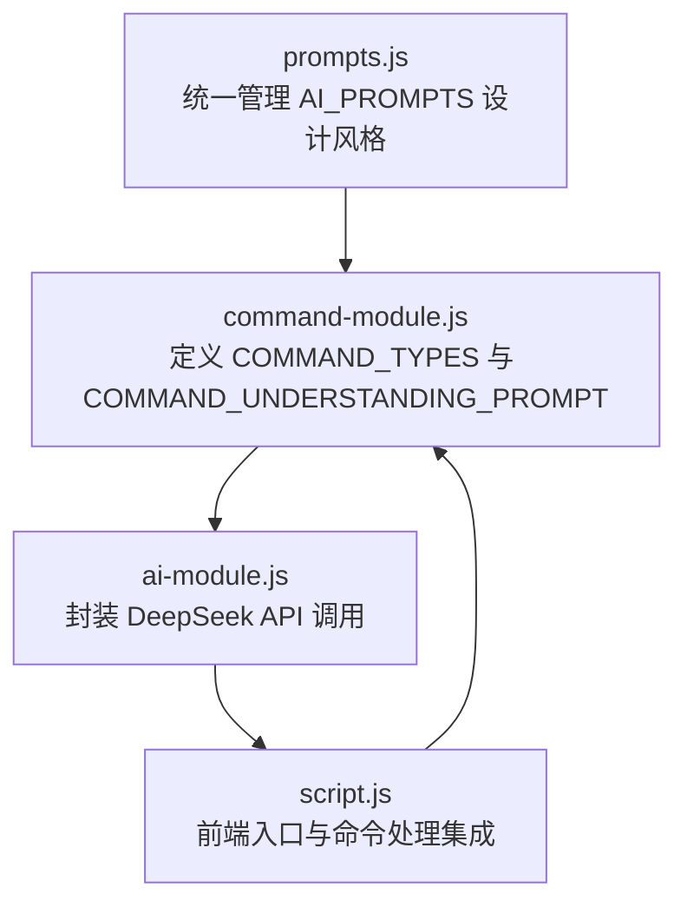
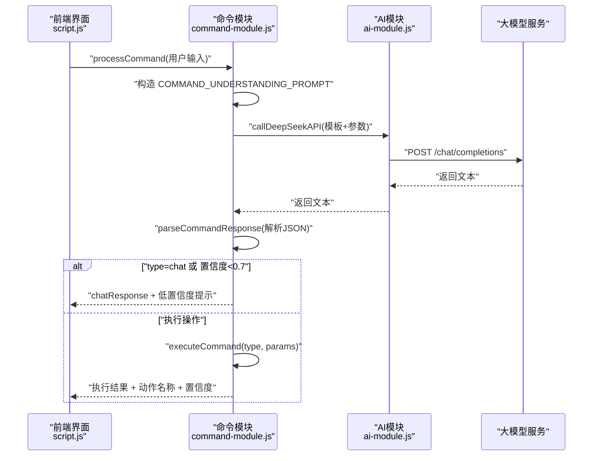
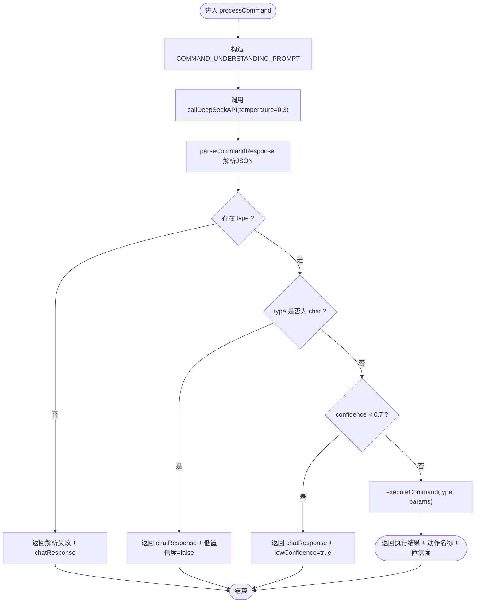
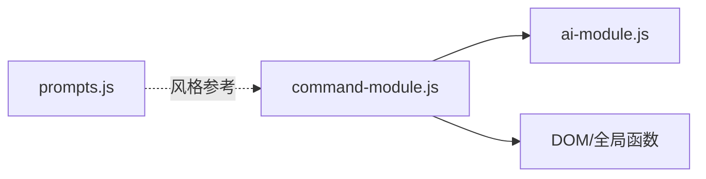

# 指令理解提示词修改

<cite>
**本文引用的文件**
- [command-module.js](file://command-module.js)
- [prompts.js](file://prompts.js)
- [ai-module.js](file://ai-module.js)
- [script.js](file://script.js)
- [README.md](file://README.md)
</cite>

## 目录
1. [引言](#引言)
2. [项目结构](#项目结构)
3. [核心组件](#核心组件)
4. [架构总览](#架构总览)
5. [详细组件分析](#详细组件分析)
6. [依赖关系分析](#依赖关系分析)
7. [性能考量](#性能考量)
8. [故障排查指南](#故障排查指南)
9. [结论](#结论)
10. [附录](#附录)

## 引言
本文件围绕如何修改命令理解提示词模板以支持新增指令展开，重点基于 command-module.js 中的 COMMAND_UNDERSTANDING_PROMPT 模板，说明如何在“可用操作类型列表”中添加新指令条目，并强调示例语句的多样性与自然性，以提升大模型对意图识别的准确性。同时解释为何在调用时将 temperature 设为 0.3（降低随机性），以及如何通过边界案例测试提示词的有效性，并与 prompts.js 中其他 AI_PROMPTS 的设计风格保持一致。

## 项目结构
本仓库与“指令理解提示词修改”相关的文件主要包括：
- command-module.js：定义 COMMAND_TYPES、COMMAND_UNDERSTANDING_PROMPT 模板、解析与执行流程
- prompts.js：统一管理 AI_PROMPTS（含风格、格式、占位符等），作为提示词工程风格参考
- ai-module.js：封装 DeepSeek API 调用，提供 temperature、maxTokens 等参数配置
- script.js：前端入口，集成命令处理流程，展示执行结果与状态
- README.md：产品背景与功能概述

图表来源
- [command-module.js](file://command-module.js#L1-L312)
- [prompts.js](file://prompts.js#L1-L159)
- [ai-module.js](file://ai-module.js#L1-L216)
- [script.js](file://script.js#L990-L1030)

章节来源
- [command-module.js](file://command-module.js#L1-L312)
- [prompts.js](file://prompts.js#L1-L159)
- [ai-module.js](file://ai-module.js#L1-L216)
- [script.js](file://script.js#L990-L1030)
- [README.md](file://README.md#L1-L125)

## 核心组件
- COMMAND_TYPES：集中定义所有可执行指令类型，用于在执行阶段映射到具体动作
- COMMAND_UNDERSTANDING_PROMPT：指令理解提示词模板，包含“可用操作类型列表”“用户输入占位符”“JSON 输出约束”“重要规则”等
- processCommand：调用大模型、解析响应、置信度阈值判断、执行动作与反馈
- ai-module.js：统一的 DeepSeek API 调用封装，支持 temperature、maxTokens 等参数
- prompts.js：提供 AI_PROMPTS 的设计风格参考，包括占位符、输出格式、风格约束等

章节来源
- [command-module.js](file://command-module.js#L1-L312)
- [ai-module.js](file://ai-module.js#L1-L216)
- [prompts.js](file://prompts.js#L1-L159)

## 架构总览
下图展示了从前端输入到大模型推理再到执行动作的完整链路，以及提示词模板与执行逻辑的关系。

图表来源
- [command-module.js](file://command-module.js#L182-L259)
- [ai-module.js](file://ai-module.js#L14-L59)
- [script.js](file://script.js#L990-L1030)

## 详细组件分析

### 指令理解提示词模板（COMMAND_UNDERSTANDING_PROMPT）结构
- 模板位置与职责
  - 定义角色与任务：理解用户自然语言并判断是否需要执行操作
  - 列举可用操作类型：包含编号、英文类型、中文描述与示例
  - 用户输入占位符：{COMMAND}
  - 输出约束：必须返回 JSON，包含 type、confidence、params、chat_response
  - 重要规则：高置信度仅用于明确操作；闲聊设为 chat；chat_response 自然友好；只返回 JSON

- 修改要点
  - 在“可用操作类型列表”中新增一行，格式为“序号. 英文类型 - 中文描述（例如：...）”
  - 示例语句应覆盖多种表达方式，如“开始番茄钟”“启动专注时间”“开始工作25分钟”等，以提升泛化能力
  - 输出 JSON 的字段与约束保持不变，确保解析逻辑稳定

- temperature=0.3 的原因
  - 降低随机性，使模型在“意图判断与分类”任务上更稳定、更确定，从而提升置信度的区分度
  - 在命令理解这类结构化任务中，较低温度通常能带来更一致的输出

- 置信度阈值与聊天模式
  - 当置信度低于 0.7 时，系统不执行操作，转为聊天模式并提示“不太确定”的友好回复
  - 当 type 为 chat 时，也直接走聊天模式，不执行操作

章节来源
- [command-module.js](file://command-module.js#L21-L54)
- [command-module.js](file://command-module.js#L182-L259)

### 如何为 CHECK_WEATHER 添加新指令条目
- 在“可用操作类型列表”中新增一行，例如：
  - “11. check_weather - 查看天气（例如：今天天气如何、天气预报、外面下雨了吗）”
- 示例语句应多样化，覆盖“天气如何”“天气预报”“下雨了吗”“今天冷吗”“明天会晴吗”等常见表达
- 保持输出 JSON 的字段与约束不变，确保解析逻辑不受影响

- 注意事项
  - 若 check_weather 需要参数（如城市），可在 params 中扩展，但需同步更新 executeCommand 的分支与解析逻辑
  - 若无参数，保持 params 为空对象即可

章节来源
- [command-module.js](file://command-module.js#L21-L54)
- [command-module.js](file://command-module.js#L182-L259)

### 提示词工程一致性（与 prompts.js 对齐）
- prompts.js 的设计风格强调：
  - 明确的角色设定与任务边界
  - 清晰的输出格式约束（如 JSON、Markdown）
  - 占位符替换策略（如 {CONTENT}、{CLOCK_IN_TIME} 等）
  - 风格与语气要求（如 MOYU_FORTUNE 的幽默风趣）

- 与 COMMAND_UNDERSTANDING_PROMPT 的一致性建议
  - 保持角色与任务边界清晰（“理解用户意图并判断是否执行操作”）
  - 明确输出格式约束（只返回 JSON，包含 type/confidence/params/chat_response）
  - 使用占位符 {COMMAND} 表达用户输入
  - 重要规则以“重要规则”小节列出，便于模型遵循

章节来源
- [prompts.js](file://prompts.js#L1-L159)
- [command-module.js](file://command-module.js#L21-L54)

### 测试提示词有效性的方法
- 使用边界案例验证置信度输出
  - 模糊表述：如“我饿了”“今天怎么样”“能帮我做点什么吗”，期望置信度低于 0.7，系统走聊天模式
  - 明确操作：如“开始番茄钟”“查看时间轴”“切换到日历”，期望置信度高于 0.7，系统执行对应动作
  - 多样化表达：同一操作的不同说法，验证模型的泛化能力
- 前端集成验证
  - 在 script.js 中调用 window.CommandModule.processCommand，观察 chatResponse、executed、lowConfidence 等字段
  - 通过 UI 展示“已执行：动作名称”“理解为：聊天模式”等状态

章节来源
- [command-module.js](file://command-module.js#L182-L259)
- [script.js](file://script.js#L990-L1030)

### 执行流程与错误处理
- 解析与执行
  - parseCommandResponse：从大模型返回文本中提取 JSON
  - executeCommand：根据 COMMAND_TYPES 映射到具体动作，返回 success/message
- 错误处理
  - 解析失败：返回 chatResponse 并附带原始响应
  - 调用 API 失败：捕获异常并返回友好提示
  - 未知类型：返回 UNKNOWN 的默认消息

图表来源
- [command-module.js](file://command-module.js#L182-L259)

章节来源
- [command-module.js](file://command-module.js#L59-L72)
- [command-module.js](file://command-module.js#L182-L259)

## 依赖关系分析
- command-module.js 依赖
  - ai-module.js：通过 window.AIModule 调用 DeepSeek API
  - DOM/全局函数：如 switchTab、showToast 等
- prompts.js 与 command-module.js 的关系
  - prompts.js 提供统一的提示词工程风格参考，command-module.js 的 COMMAND_UNDERSTANDING_PROMPT 应遵循类似的“角色+约束+占位符”的结构化风格

图表来源
- [command-module.js](file://command-module.js#L182-L259)
- [ai-module.js](file://ai-module.js#L1-L216)
- [prompts.js](file://prompts.js#L1-L159)

章节来源
- [command-module.js](file://command-module.js#L182-L259)
- [ai-module.js](file://ai-module.js#L1-L216)
- [prompts.js](file://prompts.js#L1-L159)

## 性能考量
- temperature=0.3 的选择
  - 降低随机性，提升意图判断稳定性，有助于置信度分布更清晰，减少误判
- 前端交互
  - 在 script.js 中对按钮状态进行禁用/启用与文案切换，避免重复提交
  - 通过 showToast 或 UI 状态提示反馈执行结果

章节来源
- [command-module.js](file://command-module.js#L182-L259)
- [script.js](file://script.js#L990-L1030)

## 故障排查指南
- API 密钥未配置
  - ai-module.js 在调用前检查 localStorage 中的 deepseekApiKey，未配置会抛错
- 解析失败
  - parseCommandResponse 仅提取首个 JSON 匹配，若返回非标准 JSON，将解析失败
- 置信度过低
  - 当 confidence < 0.7 时，系统不会执行操作，而是返回聊天回复
- 未知类型
  - executeCommand 未匹配到类型时，返回 UNKNOWN 的默认消息

章节来源
- [ai-module.js](file://ai-module.js#L14-L59)
- [command-module.js](file://command-module.js#L59-L72)
- [command-module.js](file://command-module.js#L182-L259)

## 结论
- 修改 COMMAND_UNDERSTANDING_PROMPT 以支持新指令的关键在于：在“可用操作类型列表”中新增条目、提供多样化的示例语句、保持输出 JSON 的约束不变
- temperature=0.3 用于降低随机性，提升意图识别的稳定性与置信度区分度
- 通过边界案例（模糊表述、明确操作、多样化表达）测试提示词有效性，并在前端集成中观察 chatResponse、executed、lowConfidence 等反馈
- 与 prompts.js 的设计风格保持一致，有助于统一提示词工程实践

## 附录
- 相关文件路径与关键行号
  - COMMAND_TYPES 定义：[command-module.js](file://command-module.js#L7-L19)
  - COMMAND_UNDERSTANDING_PROMPT 模板：[command-module.js](file://command-module.js#L21-L54)
  - processCommand 调用与解析：[command-module.js](file://command-module.js#L182-L259)
  - ai-module.js API 调用封装：[ai-module.js](file://ai-module.js#L14-L59)
  - prompts.js 设计风格参考：[prompts.js](file://prompts.js#L1-L159)
  - 前端集成与状态展示：[script.js](file://script.js#L990-L1030)