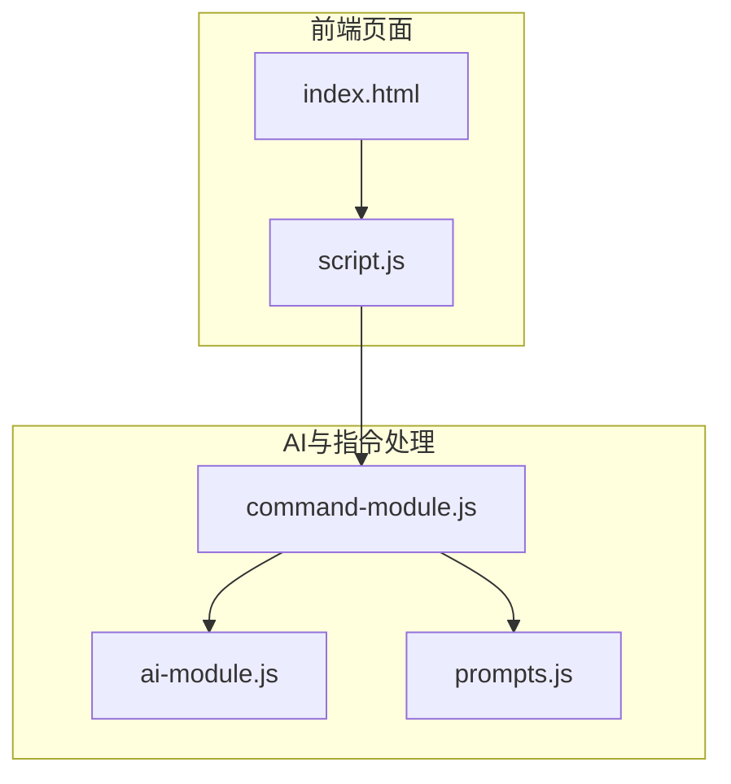
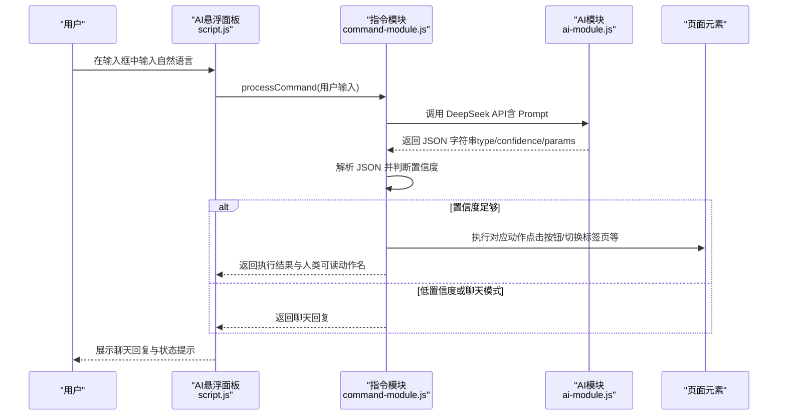
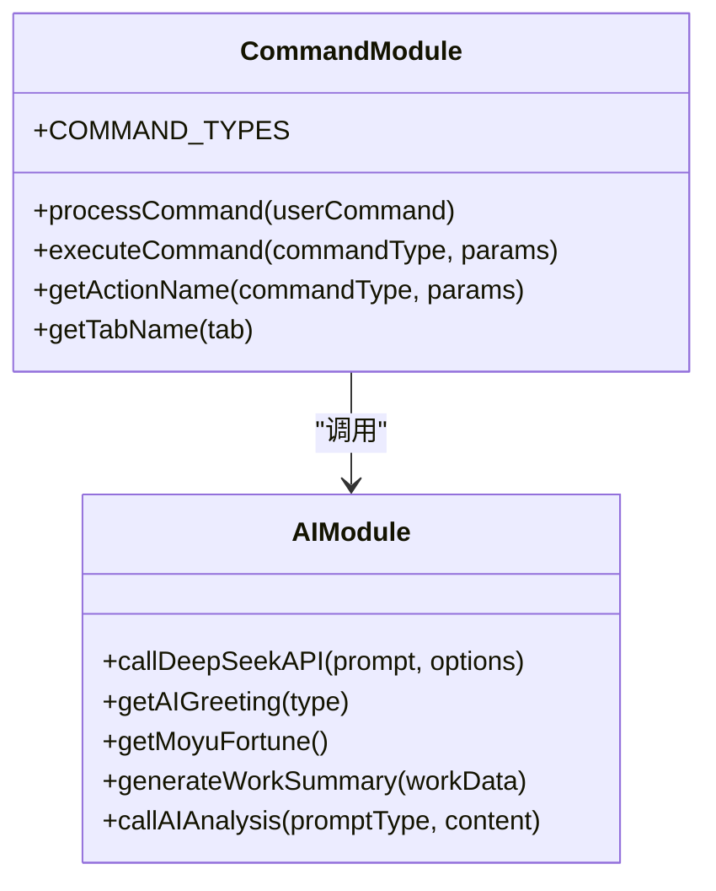
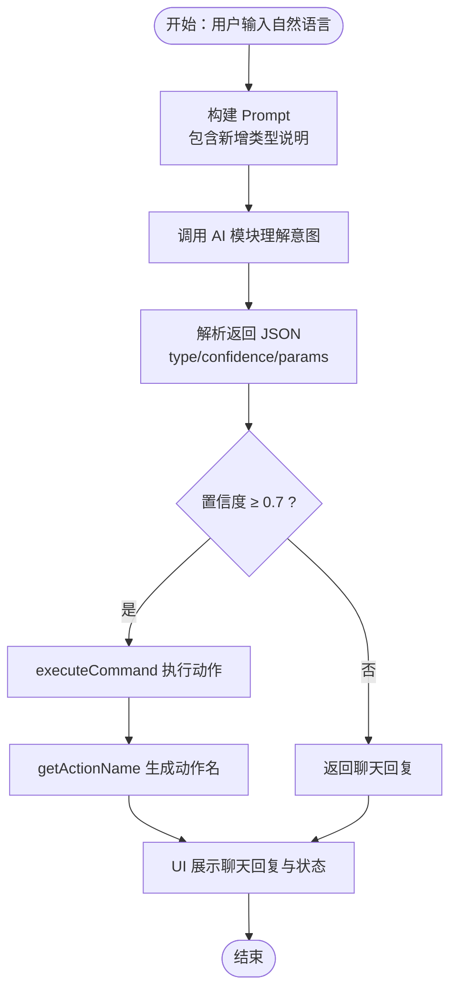
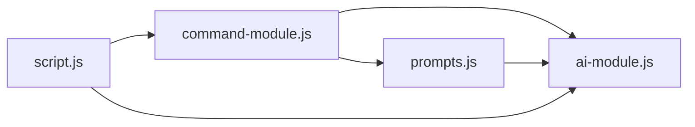

# 指令类型扩展

<cite>
**本文引用的文件**
- [command-module.js](file://command-module.js)
- [script.js](file://script.js)
- [ai-module.js](file://ai-module.js)
- [prompts.js](file://prompts.js)
- [index.html](file://index.html)
- [README.md](file://README.md)
</cite>

## 目录
1. [简介](#简介)
2. [项目结构](#项目结构)
3. [核心组件](#核心组件)
4. [架构总览](#架构总览)
5. [详细组件分析](#详细组件分析)
6. [依赖关系分析](#依赖关系分析)
7. [性能考量](#性能考量)
8. [故障排查指南](#故障排查指南)
9. [结论](#结论)
10. [附录](#附录)

## 简介
本文件面向希望在 work-timer 中扩展自然语言指令类型的开发者，系统讲解如何在 command-module.js 的 COMMAND_TYPES 枚举中新增指令类型，并确保该类型在整个系统中唯一且可识别；同时说明新增类型如何参与 processCommand 流程，以及如何避免命名冲突。文档还提供新增“查看天气”“开始会议”等示例的步骤说明与对比路径，并讨论如何通过 TypeScript 或 JSDoc 增强类型安全（若未来引入）。

## 项目结构
work-timer 采用前端单页应用结构，AI 指令处理位于 command-module.js，与脚本入口 script.js 的 AI 悬浮面板交互，AI 能力由 ai-module.js 调用 DeepSeek API，Prompt 模板集中于 prompts.js，页面结构由 index.html 提供。

图表来源
- [index.html](file://index.html#L1-L65)
- [script.js](file://script.js#L922-L1030)
- [command-module.js](file://command-module.js#L1-L313)
- [ai-module.js](file://ai-module.js#L1-L216)
- [prompts.js](file://prompts.js#L1-L159)

章节来源
- [index.html](file://index.html#L1-L65)
- [script.js](file://script.js#L922-L1030)
- [command-module.js](file://command-module.js#L1-L313)
- [ai-module.js](file://ai-module.js#L1-L216)
- [prompts.js](file://prompts.js#L1-L159)

## 核心组件
- COMMAND_TYPES：集中定义所有可执行的自然语言指令类型，作为系统内唯一标识符。
- processCommand：接收用户输入，调用 AI 模块理解意图，解析返回的 JSON，按置信度决定执行或聊天模式。
- executeCommand：根据指令类型映射到具体 UI 行为（如点击按钮、切换标签页、添加时间轴事件等）。
- getActionName/getTabName：用于状态提示与用户反馈的人类可读名称。
- initCommandControl：在页面中初始化 AI 悬浮面板，绑定输入与发送事件，调用 CommandModule.processCommand 并展示结果。

章节来源
- [command-module.js](file://command-module.js#L6-L179)
- [command-module.js](file://command-module.js#L182-L259)
- [command-module.js](file://command-module.js#L261-L292)
- [script.js](file://script.js#L922-L1030)

## 架构总览
自然语言指令从 UI 输入到执行的关键链路如下：

图表来源
- [script.js](file://script.js#L980-L1030)
- [command-module.js](file://command-module.js#L182-L259)
- [ai-module.js](file://ai-module.js#L14-L59)

章节来源
- [script.js](file://script.js#L980-L1030)
- [command-module.js](file://command-module.js#L182-L259)
- [ai-module.js](file://ai-module.js#L14-L59)

## 详细组件分析

### COMMAND_TYPES 枚举与命名规范
- 枚举位置：command-module.js 中的常量对象，键名为大写蛇形（如 CLOCK_IN、SHOW_CALENDAR），值为小写蛇形字符串（如 "clock_in"、"show_calendar"）。
- 命名规范建议：
  - 键名：全大写蛇形（如 CHECK_WEATHER、START_MEETING），便于在代码中静态引用。
  - 值：全小写蛇形（如 "check_weather"、"start_meeting"），与 AI Prompt 中的 type 字段一致。
- 唯一性要求：键名必须全局唯一，避免与现有枚举冲突；值也应唯一，确保与 AI 返回的 type 匹配。

章节来源
- [command-module.js](file://command-module.js#L6-L19)

### 新增指令类型：以“查看天气”为例
- 第一步：在 COMMAND_TYPES 中新增键值对
  - 键名：CHECK_WEATHER（全大写蛇形）
  - 值：check_weather（全小写蛇形）
  - 参考路径：[command-module.js](file://command-module.js#L6-L19)
- 第二步：在 COMMAND_UNDERSTANDING_PROMPT 中增加该类型说明
  - 在可用操作类型列表中添加“check_weather - 查看天气”
  - 参考路径：[command-module.js](file://command-module.js#L24-L54)
- 第三步：在 executeCommand 的 actions 映射中添加对应行为
  - 若无特定 UI 元素，可选择模拟点击或切换到“网上冲浪”标签页（如 surf）
  - 参考路径：[command-module.js](file://command-module.js#L77-L179)
- 第四步：在 getActionName 中添加人类可读名称
  - 参考路径：[command-module.js](file://command-module.js#L261-L278)
- 第五步：在 getTabName 中如需支持参数（如 tab），保持与 switch_tab 的参数约定一致
  - 参考路径：[command-module.js](file://command-module.js#L280-L292)

章节来源
- [command-module.js](file://command-module.js#L6-L19)
- [command-module.js](file://command-module.js#L24-L54)
- [command-module.js](file://command-module.js#L77-L179)
- [command-module.js](file://command-module.js#L261-L278)
- [command-module.js](file://command-module.js#L280-L292)

### 新增指令类型：以“开始会议”为例
- 第一步：在 COMMAND_TYPES 中新增键值对
  - 键名：START_MEETING
  - 值：start_meeting
  - 参考路径：[command-module.js](file://command-module.js#L6-L19)
- 第二步：在 COMMAND_UNDERSTANDING_PROMPT 中添加说明
  - 参考路径：[command-module.js](file://command-module.js#L24-L54)
- 第三步：在 executeCommand 中添加行为
  - 可模拟点击“网上冲浪”或“开始番茄钟”按钮，或切换到“settings”进行会议准备
  - 参考路径：[command-module.js](file://command-module.js#L77-L179)
- 第四步：在 getActionName 中添加人类可读名称
  - 参考路径：[command-module.js](file://command-module.js#L261-L278)
- 第五步：如需参数（如会议时长），保持与 switch_tab 的 params.tab 约定一致
  - 参考路径：[command-module.js](file://command-module.js#L138-L153)

章节来源
- [command-module.js](file://command-module.js#L6-L19)
- [command-module.js](file://command-module.js#L24-L54)
- [command-module.js](file://command-module.js#L77-L179)
- [command-module.js](file://command-module.js#L261-L278)
- [command-module.js](file://command-module.js#L138-L153)

### processCommand 流程与置信度控制
- 调用 AI 模块理解用户输入，返回 JSON（包含 type、confidence、params、chat_response）。
- 若 type 为 chat 或置信度低于阈值（0.7），返回聊天模式结果；否则执行对应动作。
- 执行完成后返回动作名称与聊天回复，供 UI 展示。
- 参考路径：
  - [command-module.js](file://command-module.js#L182-L259)
  - [ai-module.js](file://ai-module.js#L14-L59)

章节来源
- [command-module.js](file://command-module.js#L182-L259)
- [ai-module.js](file://ai-module.js#L14-L59)

### 与 UI 的集成方式
- script.js 中的 initCommandControl 初始化 AI 悬浮面板，绑定输入与发送事件，调用 window.CommandModule.processCommand，并根据返回结果展示聊天回复与状态提示。
- 参考路径：
  - [script.js](file://script.js#L922-L1030)
  - [index.html](file://index.html#L47-L65)

章节来源
- [script.js](file://script.js#L922-L1030)
- [index.html](file://index.html#L47-L65)

### 类图：指令模块关键类与方法

图表来源
- [command-module.js](file://command-module.js#L1-L313)
- [ai-module.js](file://ai-module.js#L1-L216)

章节来源
- [command-module.js](file://command-module.js#L1-L313)
- [ai-module.js](file://ai-module.js#L1-L216)

### 流程图：新增“查看天气”指令的处理流程

图表来源
- [command-module.js](file://command-module.js#L24-L54)
- [command-module.js](file://command-module.js#L182-L259)
- [command-module.js](file://command-module.js#L77-L179)
- [command-module.js](file://command-module.js#L261-L278)
- [ai-module.js](file://ai-module.js#L14-L59)

章节来源
- [command-module.js](file://command-module.js#L24-L54)
- [command-module.js](file://command-module.js#L182-L259)
- [command-module.js](file://command-module.js#L77-L179)
- [command-module.js](file://command-module.js#L261-L278)
- [ai-module.js](file://ai-module.js#L14-L59)

## 依赖关系分析
- command-module.js 依赖：
  - window.AIModule（ai-module.js）：调用 DeepSeek API。
  - window.switchTab（script.js）：切换标签页。
  - DOM 元素：按钮、模态框等（如 clock-in-btn、open-pomodoro、open-timeline 等）。
- script.js 依赖：
  - window.CommandModule（command-module.js）：处理自然语言指令。
  - window.AIModule（ai-module.js）：测试 API Key、获取问候语等。
- ai-module.js 依赖：
  - localStorage 中的 deepseekApiKey。
  - prompts.js 中的 AI_PROMPTS。
- prompts.js 依赖：
  - FALLBACK_MESSAGES 作为兜底文案。

图表来源
- [script.js](file://script.js#L922-L1030)
- [command-module.js](file://command-module.js#L1-L313)
- [ai-module.js](file://ai-module.js#L1-L216)
- [prompts.js](file://prompts.js#L1-L159)

章节来源
- [script.js](file://script.js#L922-L1030)
- [command-module.js](file://command-module.js#L1-L313)
- [ai-module.js](file://ai-module.js#L1-L216)
- [prompts.js](file://prompts.js#L1-L159)

## 性能考量
- 置信度阈值（0.7）用于降低误执行概率，平衡准确性与交互体验。
- executeCommand 中对 DOM 元素存在性与可见性进行检查，避免无效点击。
- AI 调用使用 localStorage 中的 API Key，避免重复传参带来的开销。
- 建议：
  - 新增类型时尽量复用现有 UI 行为，减少 DOM 查询与操作。
  - 对高频动作（如切换标签页）可缓存 DOM 引用，避免重复查询。

章节来源
- [command-module.js](file://command-module.js#L182-L259)
- [command-module.js](file://command-module.js#L77-L179)

## 故障排查指南
- 未配置 API Key
  - 现象：AI 悬浮面板提示请先配置 API Key，并自动跳转到设置页。
  - 处理：在设置页保存 DeepSeek API Key。
  - 参考路径：[script.js](file://script.js#L980-L1000)
- AI 返回 JSON 解析失败
  - 现象：parseCommandResponse 返回 null，processCommand 返回错误提示。
  - 处理：检查 COMMAND_UNDERSTANDING_PROMPT 是否严格返回 JSON，或在 ai-module.js 中增加更健壮的 JSON 提取逻辑。
  - 参考路径：[command-module.js](file://command-module.js#L59-L72)
- 未知指令类型
  - 现象：executeCommand 未匹配到类型，返回“未知指令”。
  - 处理：确认 COMMAND_TYPES 中键名与值是否正确，且与 Prompt 中 type 一致。
  - 参考路径：[command-module.js](file://command-module.js#L177-L179)
- 置信度过低
  - 现象：processCommand 返回聊天回复而非执行动作。
  - 处理：优化 Prompt 或增加示例，提高 AI 对新类型的识别。
  - 参考路径：[command-module.js](file://command-module.js#L217-L231)

章节来源
- [script.js](file://script.js#L980-L1000)
- [command-module.js](file://command-module.js#L59-L72)
- [command-module.js](file://command-module.js#L177-L179)
- [command-module.js](file://command-module.js#L217-L231)

## 结论
通过在 COMMAND_TYPES 中定义唯一且规范的指令类型，并在 COMMAND_UNDERSTANDING_PROMPT 中明确其语义，在 executeCommand 中映射到具体 UI 行为，在 getActionName 中提供人类可读名称，即可在不破坏现有架构的前提下平滑扩展新的自然语言指令。务必遵循命名规范与唯一性原则，确保与 AI Prompt 的 type 保持一致，并在 UI 集成处做好置信度控制与错误兜底。

## 附录

### 新增“查看天气”的步骤清单
- 在 COMMAND_TYPES 中新增键值对（键名全大写蛇形，值全小写蛇形）
  - 参考路径：[command-module.js](file://command-module.js#L6-L19)
- 在 COMMAND_UNDERSTANDING_PROMPT 中添加该类型说明
  - 参考路径：[command-module.js](file://command-module.js#L24-L54)
- 在 executeCommand 的 actions 中添加对应行为（如切换到 surf 或模拟点击）
  - 参考路径：[command-module.js](file://command-module.js#L77-L179)
- 在 getActionName 中添加人类可读名称
  - 参考路径：[command-module.js](file://command-module.js#L261-L278)
- 在 UI 中验证：通过 AI 悬浮面板输入“查看天气”，确认聊天回复与状态提示正常
  - 参考路径：[script.js](file://script.js#L980-L1030)

章节来源
- [command-module.js](file://command-module.js#L6-L19)
- [command-module.js](file://command-module.js#L24-L54)
- [command-module.js](file://command-module.js#L77-L179)
- [command-module.js](file://command-module.js#L261-L278)
- [script.js](file://script.js#L980-L1030)

### 新增“开始会议”的步骤清单
- 在 COMMAND_TYPES 中新增键值对
  - 参考路径：[command-module.js](file://command-module.js#L6-L19)
- 在 COMMAND_UNDERSTANDING_PROMPT 中添加该类型说明
  - 参考路径：[command-module.js](file://command-module.js#L24-L54)
- 在 executeCommand 的 actions 中添加行为（如切换到 settings 或 surf）
  - 参考路径：[command-module.js](file://command-module.js#L77-L179)
- 在 getActionName 中添加人类可读名称
  - 参考路径：[command-module.js](file://command-module.js#L261-L278)
- 在 UI 中验证：通过 AI 悬浮面板输入“开始会议”，确认聊天回复与状态提示正常
  - 参考路径：[script.js](file://script.js#L980-L1030)

章节来源
- [command-module.js](file://command-module.js#L6-L19)
- [command-module.js](file://command-module.js#L24-L54)
- [command-module.js](file://command-module.js#L77-L179)
- [command-module.js](file://command-module.js#L261-L278)
- [script.js](file://script.js#L980-L1030)

### 类型安全增强建议（未来引入 TypeScript/JSDoc）
- 使用 TypeScript：
  - 定义 COMMAND_TYPES 的联合类型（如 "clock_in" | "show_calendar" | "check_weather" | "start_meeting"）。
  - 为 executeCommand 的 commandType 参数使用该联合类型，避免传入非法值。
  - 为 params 定义接口（如 SwitchTabParams），约束 params.tab 的取值范围。
- 使用 JSDoc：
  - 为 COMMAND_TYPES 添加注释说明每个键的含义与返回值格式。
  - 为 processCommand/addMessage 等函数添加参数与返回值注释，提升可读性与 IDE 支持。
- 优势：
  - 编译期发现类型错误，减少运行时风险。
  - 提升代码可维护性与团队协作效率。

章节来源
- [command-module.js](file://command-module.js#L6-L19)
- [command-module.js](file://command-module.js#L77-L179)
- [command-module.js](file://command-module.js#L261-L278)
- [README.md](file://README.md#L1-L125)