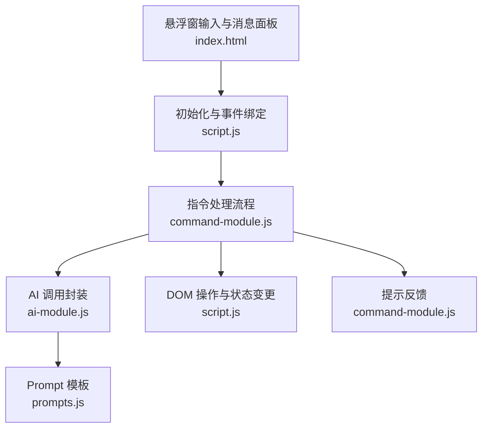
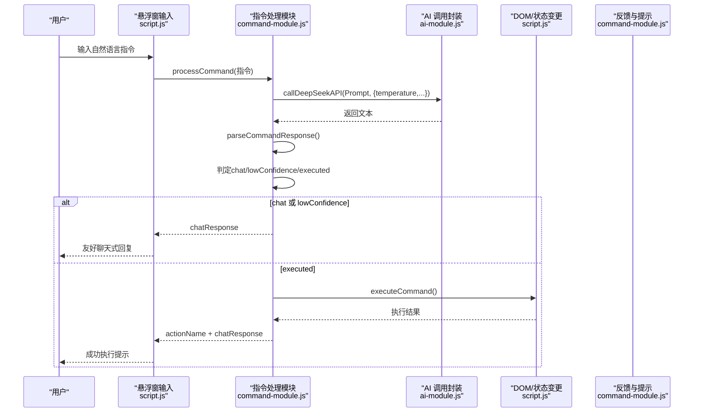
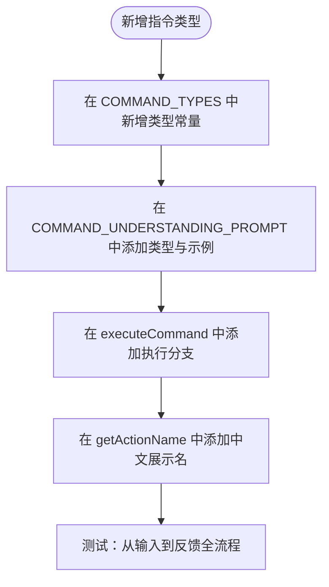
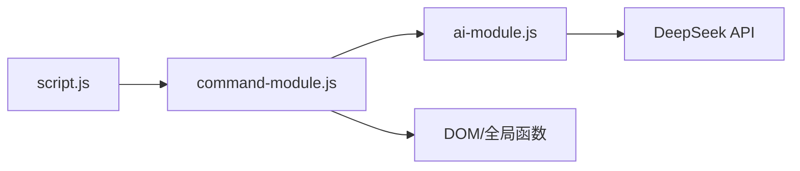

# 指令系统扩展实践

<cite>
**本文引用的文件**
- [command-module.js](file://command-module.js)
- [ai-module.js](file://ai-module.js)
- [script.js](file://script.js)
- [index.html](file://index.html)
- [prompts.js](file://prompts.js)
- [README.md](file://README.md)
- [docs/AI_COMMAND_DEMO.md](file://docs/AI_COMMAND_DEMO.md)
</cite>

## 目录
1. [引言](#引言)
2. [项目结构](#项目结构)
3. [核心组件](#核心组件)
4. [架构总览](#架构总览)
5. [详细组件分析](#详细组件分析)
6. [依赖关系分析](#依赖关系分析)
7. [性能考量](#性能考量)
8. [故障排查指南](#故障排查指南)
9. [结论](#结论)
10. [附录](#附录)

## 引言
本文件面向希望扩展 work-timer 自然语言指令控制系统的工程师与产品同学，围绕 command-module.js 的核心机制，系统讲解如何新增指令类型、修改理解 Prompt、实现执行逻辑、处理低置信度场景以及测试完整流程。我们将以“查看天气”为例，演示从用户输入到 AI 解析再到 UI 更新或 API 调用的全过程，并强调置信度阈值与 temperature 参数在准确性与稳定性中的作用。

## 项目结构
work-timer 的自然语言指令控制采用“前端 UI + 指令模块 + AI 模块”的分层设计：
- UI 层：悬浮窗输入框与消息面板位于 index.html，脚本初始化在 script.js 中完成。
- 指令层：command-module.js 定义指令类型、理解 Prompt、解析响应、执行动作与流程控制。
- AI 层：ai-module.js 封装 DeepSeek API 调用，提供温度、最大 token 等参数配置。
- 提示词层：prompts.js 管理各类 AI Prompt，供其他模块复用。
- 文档与示例：docs/AI_COMMAND_DEMO.md 提供典型场景与扩展建议。

图表来源
- [index.html](file://index.html#L48-L100)
- [script.js](file://script.js#L922-L1030)
- [command-module.js](file://command-module.js#L182-L259)
- [ai-module.js](file://ai-module.js#L14-L59)
- [prompts.js](file://prompts.js#L1-L159)

章节来源
- [index.html](file://index.html#L1-L200)
- [script.js](file://script.js#L922-L1030)
- [README.md](file://README.md#L1-L125)

## 核心组件
- 指令类型枚举：在 COMMAND_TYPES 中集中定义可执行的指令类型，如 clock_in、start_pomodoro、show_timeline 等。
- 理解 Prompt 模板：COMMAND_UNDERSTANDING_PROMPT 用于引导大模型识别意图、置信度与聊天模式。
- 响应解析：parseCommandResponse 从大模型返回文本中提取 JSON。
- 执行器：executeCommand 将指令类型映射到具体的 DOM 操作或状态变更。
- 流程控制器：processCommand 负责调用 AI、解析、置信度判定、执行与反馈。
- UI 集成：initCommandControl 在 UI 层绑定输入、发送、状态提示与错误处理。

章节来源
- [command-module.js](file://command-module.js#L7-L19)
- [command-module.js](file://command-module.js#L21-L54)
- [command-module.js](file://command-module.js#L59-L72)
- [command-module.js](file://command-module.js#L77-L180)
- [command-module.js](file://command-module.js#L182-L259)
- [script.js](file://script.js#L922-L1030)

## 架构总览
下图展示了从用户输入到执行反馈的完整链路，包括温度参数、置信度阈值与聊天兜底策略。

图表来源
- [script.js](file://script.js#L922-L1030)
- [command-module.js](file://command-module.js#L182-L259)
- [ai-module.js](file://ai-module.js#L14-L59)

## 详细组件分析

### 1) 新增指令类型：以 CHECK_WEATHER 为例
- 步骤一：在 COMMAND_TYPES 中新增类型常量
  - 参考路径：[command-module.js](file://command-module.js#L7-L19)
  - 建议命名：CHECK_WEATHER，语义清晰，与现有风格一致。
- 步骤二：在 COMMAND_UNDERSTANDING_PROMPT 中增加该类型及其示例
  - 参考路径：[command-module.js](file://command-module.js#L21-L54)
  - 在“可用的操作类型”列表中添加对应条目，例如“11. check_weather - 查看天气（例如：今天天气怎么样、今天天气如何）”
  - 在“重要规则”中补充：若用户仅询问天气，应设置为 chat 模式并返回友好回复；仅当明确“查询天气”等操作意图时才设置高置信度。
- 步骤三：在 executeCommand 的 actions 映射中实现执行逻辑
  - 参考路径：[command-module.js](file://command-module.js#L77-L180)
  - 新增分支：case COMMAND_TYPES.CHECK_WEATHER
  - 执行策略建议：
    - 若已有天气 API 能力：调用接口获取数据，解析后更新 UI（如弹窗或卡片），并返回成功消息。
    - 若暂无 API：返回“chat_response”友好提示，例如“我暂时无法访问天气数据，但你可以去窗外看看或打开手机天气应用哦~”
  - 注意：不要直接在 executeCommand 中发起网络请求，建议通过 window.AIModule 或独立服务模块封装，保持职责分离。
- 步骤四：在 getActionName 中添加中文展示名
  - 参考路径：[command-module.js](file://command-module.js#L261-L278)
  - 为 CHECK_WEATHER 添加“查看天气”等可读名称，便于 UI 展示。

图表来源
- [command-module.js](file://command-module.js#L7-L19)
- [command-module.js](file://command-module.js#L21-L54)
- [command-module.js](file://command-module.js#L77-L180)
- [command-module.js](file://command-module.js#L261-L278)

章节来源
- [command-module.js](file://command-module.js#L7-L19)
- [command-module.js](file://command-module.js#L21-L54)
- [command-module.js](file://command-module.js#L77-L180)
- [command-module.js](file://command-module.js#L261-L278)

### 2) 修改 COMMAND_UNDERSTANDING_PROMPT 模板
- 目标：让大模型能准确识别“查看天气”类意图，并区分聊天与操作。
- 关键点：
  - 在“可用的操作类型”中新增条目，列举常见口语化表达（如“今天天气怎么样”“今天天气如何”“帮我查天气”等）。
  - 在“重要规则”中强调：仅当用户明确表达“查询天气”“查看天气”等操作意图时，才设置高置信度（>0.7）；否则一律视为 chat 模式。
  - 为 chat_response 设计自然、友好的回复，避免生硬或技术术语。
- 参考路径：
  - [command-module.js](file://command-module.js#L21-L54)

章节来源
- [command-module.js](file://command-module.js#L21-L54)

### 3) 实现 executeCommand 的执行逻辑
- 结构要点：
  - 使用 switch/case 或对象映射（actions）将指令类型映射到具体 DOM 操作。
  - 对于“查看天气”：
    - 若具备天气 API：调用接口，解析数据，更新 UI（如弹窗、卡片或 toast），返回成功消息。
    - 若不具备 API：返回 chat_response，提示用户通过其他渠道获取天气信息。
  - 对于已有指令（如 start_pomodoro、show_timeline 等）可参考其模式：先触发 UI 打开，再通过 setTimeout 等策略触发子控件点击或状态更新。
- 参考路径：
  - [command-module.js](file://command-module.js#L77-L180)

章节来源
- [command-module.js](file://command-module.js#L77-L180)

### 4) 置信度阈值与 temperature 参数
- 置信度阈值：
  - 在 processCommand 中，CONFIDENCE_THRESHOLD 默认为 0.7。低于阈值时，系统不执行操作，而是返回 chat_response 并标记 lowConfidence。
  - 参考路径：[command-module.js](file://command-module.js#L217-L231)
- temperature 控制：
  - 在调用 AI 时，processCommand 传入 {temperature: 0.3}，以降低随机性，提升意图识别的确定性。
  - 参考路径：[command-module.js](file://command-module.js#L188-L192)
  - 在 ai-module.js 中，callDeepSeekAPI 默认 temperature=1.2，用于通用对话；而 processCommand 专门传入更低温度以稳定意图识别。
  - 参考路径：[ai-module.js](file://ai-module.js#L14-L59)
- 调整建议：
  - 若发现“查看天气”等指令经常被误判为 chat，可适当提高 temperature（如 0.4~0.5），同时在 Prompt 中强化操作意图关键词。
  - 若识别过于“固执”，可降低 temperature（如 0.2），允许一定灵活性。

章节来源
- [command-module.js](file://command-module.js#L188-L192)
- [command-module.js](file://command-module.js#L217-L231)
- [ai-module.js](file://ai-module.js#L14-L59)

### 5) 处理低置信度与聊天兜底
- 低置信度流程：
  - 当 parsed.confidence < 0.7 时，返回 {executed:false, lowConfidence:true, chatResponse:...}，UI 展示“理解为：聊天模式”等提示。
  - 参考路径：[command-module.js](file://command-module.js#L217-L231)
- 聊天兜底：
  - 若 parsed.type 为 chat，直接返回 chatResponse，不执行任何操作。
  - 参考路径：[command-module.js](file://command-module.js#L206-L215)
- UI 层反馈：
  - initCommandControl 在收到结果后，若 executed=false 且 lowConfidence=true，显示“💬 理解为：聊天模式”等状态提示。
  - 参考路径：[script.js](file://script.js#L998-L1012)

章节来源
- [command-module.js](file://command-module.js#L206-L231)
- [script.js](file://script.js#L998-L1012)

### 6) 从输入到执行的完整示例：查看天气
- 用户输入：“今天天气怎么样”
- 理解阶段：
  - processCommand 构造 Prompt 并调用 AI，期望返回包含 type、confidence、params、chat_response 的 JSON。
  - 若 Prompt 已正确添加 CHECK_WEATHER 条目，且用户表达明确，type 可能为 CHECK_WEATHER，confidence ≥ 0.7。
- 执行阶段：
  - executeCommand 根据类型执行：若具备天气 API，更新 UI；否则返回 chat_response。
- 反馈阶段：
  - UI 展示 chatResponse 或“✅ 已执行：查看天气”等状态提示。
- 参考路径：
  - [command-module.js](file://command-module.js#L182-L259)
  - [script.js](file://script.js#L998-L1012)

章节来源
- [command-module.js](file://command-module.js#L182-L259)
- [script.js](file://script.js#L998-L1012)

### 7) UI 集成与交互
- 悬浮窗输入与发送：
  - initCommandControl 负责绑定输入框、发送按钮、回车提交、状态提示等。
  - 参考路径：[script.js](file://script.js#L922-L1030)
- DOM 操作与状态变更：
  - executeCommand 中的 click、setTimeout 等模式可作为“查看天气”等 UI 更新的参考。
  - 参考路径：[command-module.js](file://command-module.js#L97-L110)
- 提示反馈：
  - showToast 用于统一提示，processCommand 也支持 chatResponse 的直接反馈。
  - 参考路径：[command-module.js](file://command-module.js#L294-L303)

章节来源
- [script.js](file://script.js#L922-L1030)
- [command-module.js](file://command-module.js#L97-L110)
- [command-module.js](file://command-module.js#L294-L303)

## 依赖关系分析
- 模块耦合：
  - command-module.js 依赖 window.AIModule（ai-module.js）进行 AI 调用。
  - command-module.js 依赖 DOM 元素与全局函数（如 switchTab、showToast）。
  - script.js 依赖 window.CommandModule（command-module.js）进行 UI 集成。
- 外部依赖：
  - DeepSeek API（通过 ai-module.js）。
  - 本地存储（localStorage）用于 API Key、打卡状态、时间轴等。
- 潜在循环依赖：
  - 当前结构清晰，未见循环依赖迹象。

图表来源
- [script.js](file://script.js#L922-L1030)
- [command-module.js](file://command-module.js#L182-L259)
- [ai-module.js](file://ai-module.js#L14-L59)

章节来源
- [script.js](file://script.js#L922-L1030)
- [command-module.js](file://command-module.js#L182-L259)
- [ai-module.js](file://ai-module.js#L14-L59)

## 性能考量
- 温度与稳定性平衡：较低 temperature（如 0.3）有助于稳定意图识别，但可能降低多样性；可根据指令复杂度动态调整。
- 响应解析健壮性：parseCommandResponse 通过正则提取 JSON，建议在 Prompt 中严格约束输出格式，减少解析失败概率。
- UI 交互优化：在执行前禁用发送按钮、显示“思考中…”状态，避免重复提交；执行后及时恢复按钮状态。
- 错误降级：当 API 调用失败或未配置 API Key 时，提供明确提示并引导用户前往设置页。

[本节为通用指导，无需列出具体文件来源]

## 故障排查指南
- 未配置 API Key
  - 现象：发送按钮被禁用，UI 提示“请先在设置中配置 DeepSeek API Key”，并自动跳转设置页。
  - 参考路径：[script.js](file://script.js#L983-L992)
- AI 返回非 JSON
  - 现象：parseCommandResponse 解析失败，processCommand 返回“未能理解你的意思，请重新表述”。
  - 参考路径：[command-module.js](file://command-module.js#L59-L72)
- 低置信度被判定为聊天
  - 现象：返回 chatResponse，UI 显示“理解为：聊天模式”。
  - 参考路径：[command-module.js](file://command-module.js#L217-L231)
- 执行失败或不可用
  - 现象：executeCommand 返回失败消息（如“当前不能执行”“无法打开日历”等），UI 显示错误状态。
  - 参考路径：[command-module.js](file://command-module.js#L77-L180)

章节来源
- [script.js](file://script.js#L983-L992)
- [command-module.js](file://command-module.js#L59-L72)
- [command-module.js](file://command-module.js#L217-L231)
- [command-module.js](file://command-module.js#L77-L180)

## 结论
通过在 COMMAND_TYPES 中新增类型、完善 COMMAND_UNDERSTANDING_PROMPT、在 executeCommand 中实现 UI 更新或 API 调用，并结合置信度阈值与 temperature 参数的协同控制，work-timer 的自然语言指令系统可以稳定地扩展新能力。对于“查看天气”这类场景，建议优先以聊天兜底为主，逐步接入真实天气 API，确保用户体验与系统鲁棒性。

[本节为总结性内容，无需列出具体文件来源]

## 附录

### A. 新增指令的完整测试清单
- Prompt 与示例
  - 在 COMMAND_UNDERSTANDING_PROMPT 中添加 CHECK_WEATHER 条目与示例输入。
  - 参考路径：[command-module.js](file://command-module.js#L21-L54)
- 指令类型与执行
  - 在 COMMAND_TYPES 中新增 CHECK_WEATHER。
  - 在 executeCommand 中添加对应分支，实现 UI 更新或 API 调用。
  - 参考路径：[command-module.js](file://command-module.js#L7-L19)
  - 参考路径：[command-module.js](file://command-module.js#L77-L180)
- 流程与反馈
  - 在 processCommand 中确认置信度阈值与 chat_response 行为。
  - 参考路径：[command-module.js](file://command-module.js#L188-L192)
  - 参考路径：[command-module.js](file://command-module.js#L217-L231)
- UI 集成
  - 在 initCommandControl 中验证发送按钮状态、chatResponse 展示与低置信度提示。
  - 参考路径：[script.js](file://script.js#L998-L1012)
- API Key 与兜底
  - 确认未配置 API Key 时的提示与跳转逻辑。
  - 参考路径：[script.js](file://script.js#L983-L992)

章节来源
- [command-module.js](file://command-module.js#L7-L19)
- [command-module.js](file://command-module.js#L21-L54)
- [command-module.js](file://command-module.js#L77-L180)
- [command-module.js](file://command-module.js#L188-L192)
- [command-module.js](file://command-module.js#L217-L231)
- [script.js](file://script.js#L983-L992)
- [script.js](file://script.js#L998-L1012)

### B. 参考文档与示例
- 指令演示文档：包含典型场景、技术架构与扩展建议。
  - 参考路径：[docs/AI_COMMAND_DEMO.md](file://docs/AI_COMMAND_DEMO.md#L1-L148)
- 产品说明：了解整体功能与版本演进。
  - 参考路径：[README.md](file://README.md#L1-L125)

章节来源
- [docs/AI_COMMAND_DEMO.md](file://docs/AI_COMMAND_DEMO.md#L1-L148)
- [README.md](file://README.md#L1-L125)