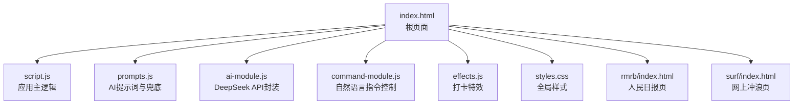
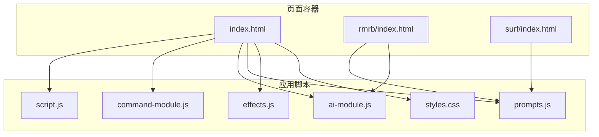
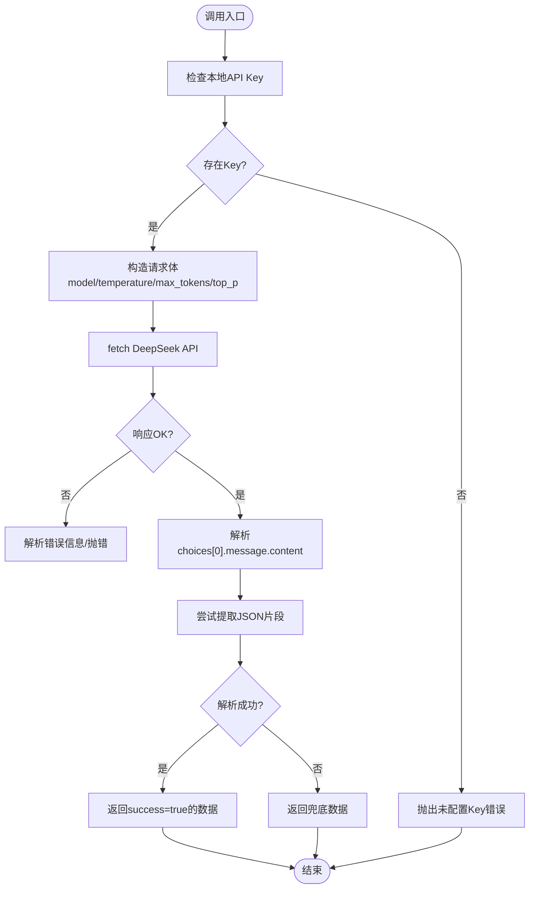
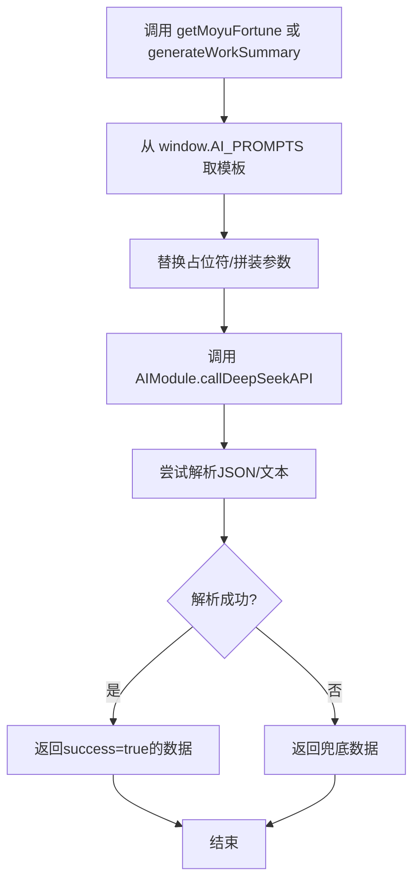
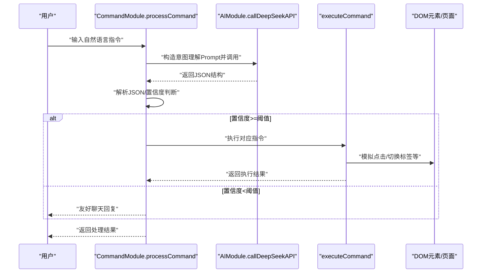
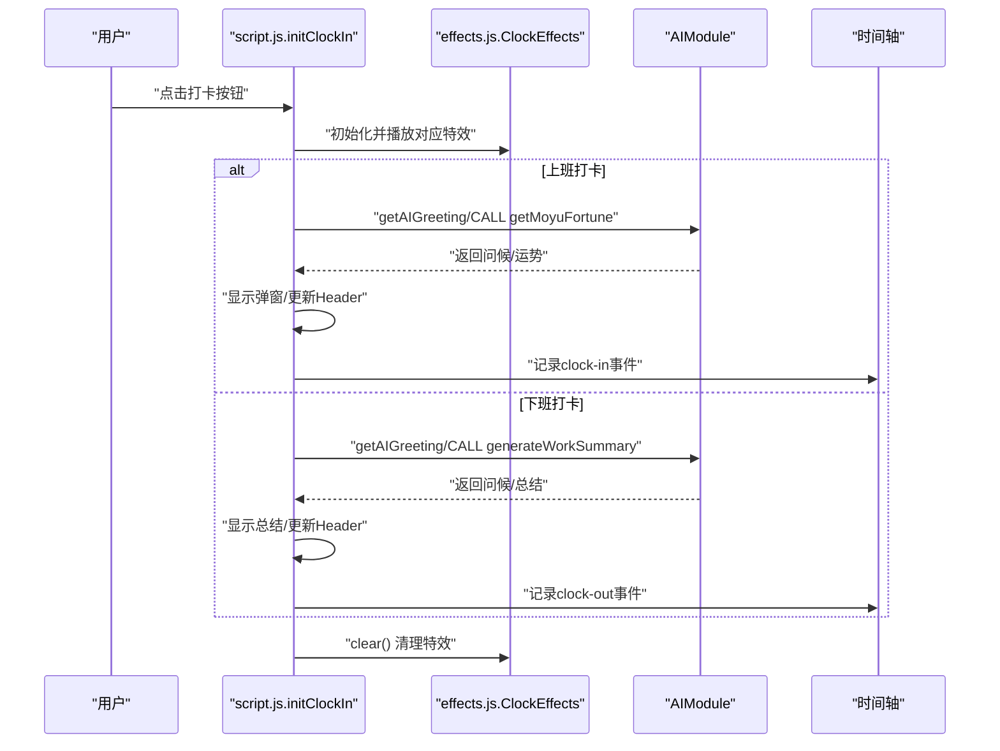
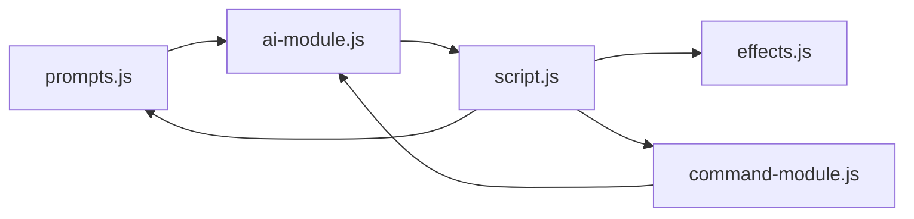

# 开发者指南

<cite>
**本文引用的文件**
- [README.md](file://README.md)
- [CHANGELOG.md](file://CHANGELOG.md)
- [index.html](file://index.html)
- [script.js](file://script.js)
- [ai-module.js](file://ai-module.js)
- [command-module.js](file://command-module.js)
- [prompts.js](file://prompts.js)
- [effects.js](file://effects.js)
- [styles.css](file://styles.css)
- [rmrb/index.html](file://rmrb/index.html)
- [surf/index.html](file://surf/index.html)
- [TEST_CHECKLIST_v1.3.3.md](file://TEST_CHECKLIST_v1.3.3.md)
</cite>

## 目录
1. [简介](#简介)
2. [项目结构](#项目结构)
3. [核心组件](#核心组件)
4. [架构总览](#架构总览)
5. [详细组件分析](#详细组件分析)
6. [依赖关系分析](#依赖关系分析)
7. [性能考量](#性能考量)
8. [调试指南](#调试指南)
9. [测试策略](#测试策略)
10. [编码规范与贡献流程](#编码规范与贡献流程)
11. [结论](#结论)

## 简介
本指南面向二次开发者，帮助快速理解 Work Timer 的代码结构、模块职责与扩展方法。项目围绕“打卡+AI”“工资计算+收入展示”“打卡特效”“自然语言指令控制”等核心能力构建，采用前端纯静态资源方案，数据持久化于浏览器本地存储。文档将从文件组织、模块边界、数据流、处理逻辑、集成点、错误处理与性能特征等方面进行系统梳理，并提供调试技巧、测试策略与贡献流程建议。

## 项目结构
项目采用“根页面 + 多模块脚本 + 子页面 iframe”的组织方式：
- 根页面 index.html 引入全局脚本与样式，承载主应用生命周期与 UI 容器。
- 主应用逻辑集中在 script.js，负责初始化、事件绑定、状态管理、AI/特效集成等。
- AI 相关能力拆分为独立模块：ai-module.js（API 调用与兜底）、prompts.js（统一管理提示词与兜底文案）。
- 自然语言指令控制模块 command-module.js，负责意图识别、置信度判断与动作执行。
- 打卡特效 effects.js 封装 Canvas 动画，提供阳光与礼花两类特效。
- 子页面 rmrb/index.html、surf/index.html 作为功能页，各自引入 prompts.js、ai-module.js 并挂载独立逻辑。
- 样式 styles.css 提供全局与页面级样式，支持响应式与主题变量。

图表来源
- [index.html](file://index.html#L1-L120)
- [script.js](file://script.js#L90-L155)
- [prompts.js](file://prompts.js#L1-L60)
- [ai-module.js](file://ai-module.js#L1-L60)
- [command-module.js](file://command-module.js#L1-L60)
- [effects.js](file://effects.js#L1-L40)
- [rmrb/index.html](file://rmrb/index.html#L1-L30)
- [surf/index.html](file://surf/index.html#L1-L20)

章节来源
- [index.html](file://index.html#L1-L120)
- [README.md](file://README.md#L1-L125)

## 核心组件
- 应用主逻辑（script.js）
  - 生命周期：DOM 加载后初始化标签页、侧边栏、番茄钟、AI 设置、打卡、时间轴、指令控制、快捷功能、日历事件。
  - 状态管理：工作时间配置、节假日与串休配置、开发者模式与自定义时间、今日时间轴、月工资与日薪计算。
  - 交互事件：打卡按钮、番茄钟模态、时间轴弹窗、侧边栏与底部导航切换、设置页更新。
  - AI 集成：打卡问候、摸鱼吉日签、工作总结生成、AI 分析（新闻页）。
  - 特效集成：Canvas 初始化与动画播放。
- AI 模块（ai-module.js）
  - DeepSeek API 调用封装，统一请求头、参数与错误处理。
  - 提供打卡问候、摸鱼吉日签、工作总结生成、通用 AI 分析等接口。
  - 兜底策略：解析失败或网络异常时回退到预设兜底文案。
- 提示词与兜底（prompts.js）
  - 统一管理 AI 提示词模板（JSON/文本），并提供兜底文案与随机兜底消息选择。
- 指令控制（command-module.js）
  - 定义可执行指令类型与意图判断 Prompt。
  - 解析大模型返回的 JSON，基于置信度决定执行或聊天模式。
  - 将自然语言映射到 DOM 操作（如点击按钮、切换标签页）。
- 特效模块（effects.js）
  - ClockEffects 类封装 Canvas 动画：阳光特效（飘落光点+光晕）与礼花特效（爆炸+重力轨迹）。
  - 使用 requestAnimationFrame，自动清理过期粒子，避免内存泄漏。

章节来源
- [script.js](file://script.js#L90-L155)
- [script.js](file://script.js#L493-L732)
- [ai-module.js](file://ai-module.js#L1-L216)
- [prompts.js](file://prompts.js#L1-L159)
- [command-module.js](file://command-module.js#L1-L313)
- [effects.js](file://effects.js#L1-L279)

## 架构总览
整体采用“页面容器 + 模块化脚本 + 本地存储”的前端架构。AI 能力通过全局 window 对象暴露给各模块；自然语言指令控制模块通过 AIModule 调用 API；特效模块通过 Canvas 在打卡弹窗中渲染。

图表来源
- [index.html](file://index.html#L1-L120)
- [rmrb/index.html](file://rmrb/index.html#L1-L30)
- [surf/index.html](file://surf/index.html#L1-L20)
- [script.js](file://script.js#L90-L155)
- [command-module.js](file://command-module.js#L1-L60)
- [ai-module.js](file://ai-module.js#L1-L60)
- [prompts.js](file://prompts.js#L1-L60)
- [effects.js](file://effects.js#L1-L40)
- [styles.css](file://styles.css#L1-L60)

## 详细组件分析

### 组件A：AI 模块（ai-module.js）
- 职责边界
  - 仅负责与 DeepSeek API 通信，屏蔽网络错误与解析异常。
  - 不直接操作 DOM，通过返回结构化结果供上层消费。
- 关键函数
  - callDeepSeekAPI：统一请求封装，读取本地 API Key，设置温度、最大 Token 等参数。
  - getAIGreeting：简化版问候（不调用 AI），用于快速路径。
  - getMoyuFortune：调用 PROMPT_MOYU_FORTUNE，解析 JSON 并兜底。
  - generateWorkSummary：拼装占位符后调用 PROMPT_WORK_SUMMARY，兜底文案。
  - callAIAnalysis：通用分析入口，按 promptType 插入内容，兜底随机文案。
- 错误处理
  - API 响应非 OK 时抛错并记录；JSON 解析失败或 AI 返回非预期时回退兜底。
- 性能与复杂度
  - fetch 为 O(1)，JSON 解析与正则匹配为 O(n)（n 为响应长度）。
  - 通过兜底策略降低失败概率，提升用户体验。

图表来源
- [ai-module.js](file://ai-module.js#L14-L59)
- [ai-module.js](file://ai-module.js#L95-L167)
- [ai-module.js](file://ai-module.js#L169-L204)

章节来源
- [ai-module.js](file://ai-module.js#L1-L216)

### 组件B：提示词与兜底（prompts.js）
- 职责边界
  - 统一管理所有 AI 提示词模板与兜底文案，供全局使用。
- 关键结构
  - AI_PROMPTS：包含 MOYU_FORTUNE、WORK_SUMMARY、NEWS_ANALYSIS 等模板。
  - FALLBACK_MESSAGES：针对不同类型提供兜底数据结构。
  - getRandomFallbackMessage：按类型返回随机兜底文案。
- 扩展建议
  - 新增提示词类型时，同时补充兜底文案与随机兜底逻辑，确保稳定性。

图表来源
- [prompts.js](file://prompts.js#L1-L120)
- [ai-module.js](file://ai-module.js#L95-L167)

章节来源
- [prompts.js](file://prompts.js#L1-L159)

### 组件C：自然语言指令控制（command-module.js）
- 职责边界
  - 将自然语言转换为结构化指令，判断置信度，执行对应 DOM 操作或聊天回复。
- 关键流程
  - processCommand：构造意图理解 Prompt，调用 AIModule，解析 JSON，按置信度分流。
  - executeCommand：将指令类型映射到具体 UI 操作（如点击按钮、切换标签页、触发摸鱼）。
  - 置信度阈值：低于阈值时仅聊天，避免误操作。
- 与主应用集成
  - 通过 window.AIModule 调用 AI，通过 window.switchTab 与 DOM 元素交互。

图表来源
- [command-module.js](file://command-module.js#L182-L259)
- [command-module.js](file://command-module.js#L77-L180)
- [ai-module.js](file://ai-module.js#L14-L59)

章节来源
- [command-module.js](file://command-module.js#L1-L313)

### 组件D：打卡与特效（script.js + effects.js）
- 职责边界
  - script.js：负责打卡按钮状态、弹窗、时间轴记录、工资计算、AI 生成与展示。
  - effects.js：负责 Canvas 动画，提供 playSunshine 与 playFireworks。
- 关键流程
  - 上班打卡：播放阳光特效，生成摸鱼吉日签，支持“再求一签”与“开始摸鱼”。
  - 下班打卡：播放礼花特效，生成工作总结，记录时间轴事件。
  - 特效：自动清理过期粒子，避免内存泄漏；Canvas 尺寸随窗口变化。

图表来源
- [script.js](file://script.js#L493-L732)
- [effects.js](file://effects.js#L1-L120)
- [ai-module.js](file://ai-module.js#L61-L167)

章节来源
- [script.js](file://script.js#L493-L732)
- [effects.js](file://effects.js#L1-L279)

### 组件E：页面与子页（index.html、rmrb/index.html、surf/index.html）
- 职责边界
  - index.html：主应用容器，包含侧边栏、底部导航、AI 悬浮窗、打卡弹窗、番茄钟、时间轴等。
  - rmrb/index.html：人民日报阅读与 AI 分析页，引入 prompts.js 与 ai-module.js。
  - surf/index.html：网上冲浪页，展示热搜榜单。
- 依赖关系
  - 通过 script 标签引入全局脚本与样式，形成统一的 UI 与交互体验。

章节来源
- [index.html](file://index.html#L1-L120)
- [rmrb/index.html](file://rmrb/index.html#L1-L30)
- [surf/index.html](file://surf/index.html#L1-L20)

## 依赖关系分析
- 模块耦合
  - script.js 与 effects.js：通过构造函数实例化特效对象，耦合度低，职责清晰。
  - script.js 与 ai-module.js：通过 window.AIModule 调用，解耦良好。
  - command-module.js 与 ai-module.js：通过 window.AIModule 调用，形成弱耦合。
  - prompts.js 与 ai-module.js：通过全局对象共享，避免直接文件依赖。
- 外部依赖
  - DeepSeek API：通过 fetch 调用，需本地存储 API Key。
  - 浏览器 Canvas：用于高性能动画。
- 潜在风险
  - 全局对象污染：通过 window.AIModule、window.CommandModule、window.AI_PROMPTS 等暴露，需注意命名冲突。
  - 置信度阈值：若阈值设置不当可能导致误执行或误判聊天。

图表来源
- [prompts.js](file://prompts.js#L1-L60)
- [ai-module.js](file://ai-module.js#L1-L60)
- [script.js](file://script.js#L90-L155)
- [command-module.js](file://command-module.js#L1-L60)
- [effects.js](file://effects.js#L1-L40)

章节来源
- [script.js](file://script.js#L90-L155)
- [command-module.js](file://command-module.js#L1-L60)
- [ai-module.js](file://ai-module.js#L1-L60)
- [prompts.js](file://prompts.js#L1-L60)
- [effects.js](file://effects.js#L1-L40)

## 性能考量
- Canvas 动画
  - 使用 requestAnimationFrame 控制帧率，避免 setInteval。
  - 自动清理过期粒子，避免内存泄漏。
- fetch 请求
  - 统一参数与错误处理，避免重复请求与异常风暴。
- 本地存储
  - localStorage 读写为 O(1)，注意避免存储超大数据。
- UI 交互
  - 按需渲染（如时间轴、日历），减少不必要的 DOM 操作。

章节来源
- [effects.js](file://effects.js#L135-L273)
- [ai-module.js](file://ai-module.js#L14-L59)
- [script.js](file://script.js#L90-L155)

## 调试指南
- 浏览器开发者工具
  - Console：查看 AI 调用错误、特效日志、时间轴记录。
  - Network：检查 DeepSeek API 请求与响应，确认 Authorization 与返回码。
  - Elements：验证 DOM 操作（如点击按钮、切换标签页）是否生效。
  - Application/Storage：检查 localStorage 中的配置与数据（如 monthlySalary、moyuFortune_日期）。
- 关键断点建议
  - ai-module.js：callDeepSeekAPI 请求构造与响应解析处。
  - command-module.js：processCommand 的 JSON 解析与置信度判断处。
  - script.js：initClockIn 的打卡状态更新与特效播放处。
  - effects.js：animateSunshine/animateFireworks 的粒子过滤与绘制处。
- 常见问题定位
  - API Key 未配置：检查 localStorage 中 deepseekApiKey 是否存在。
  - 置信度不足：查看 processCommand 返回 details 中的 confidence 与 threshold。
  - 特效不显示：检查 canvas 尺寸与 resize 事件是否触发。

章节来源
- [ai-module.js](file://ai-module.js#L14-L59)
- [command-module.js](file://command-module.js#L182-L259)
- [script.js](file://script.js#L493-L732)
- [effects.js](file://effects.js#L1-L120)

## 测试策略
- 覆盖范围
  - 首次设置、摸鱼吉日签、工资计算、特效系统、设置页面、数据持久化、UI/UX、兼容性、边界情况、回归测试。
- 关键测试点
  - 首次设置：工作时间、月工资保存与读取。
  - 摸鱼吉日签：问候弹窗、阳光特效、JSON 解析、再求一签、Header 展示、时间轴记录。
  - 工资计算：日薪计算、收入展示、AI 总结、兜底文案。
  - 特效系统：Canvas 初始化、requestAnimationFrame、粒子清理、关闭弹窗时清理。
  - 设置页面：月工资输入、保存、读取、开发者模式与自定义时间。
  - 数据持久化：localStorage 存储、按日期隔离、刷新不丢失。
  - UI/UX：样式分区、响应式布局、弹窗交互。
  - 兼容性：主流浏览器与移动端。
  - 边界情况：未设置月工资默认值、未打上班卡、无摸鱼记录、AI 超时/失败降级。
- 测试清单参考
  - 依据 TEST_CHECKLIST_v1.3.3.md 的测试项逐项核验，确保回归稳定。

章节来源
- [TEST_CHECKLIST_v1.3.3.md](file://TEST_CHECKLIST_v1.3.3.md#L1-L178)

## 编码规范与贡献流程
- 文件组织规范
  - 模块化：每个功能拆分为独立 JS 文件，通过全局 window 对象暴露必要接口。
  - 提示词集中：prompts.js 统一管理模板与兜底文案。
  - 页面与子页：index.html 为主容器，rmrb/surf 作为 iframe 页面，避免重复逻辑。
- 命名与职责
  - 函数命名清晰表达意图（如 getMoyuFortune、generateWorkSummary、playSunshine）。
  - 模块职责单一：AI 封装、提示词、指令控制、特效、主逻辑分离。
- 错误处理
  - 统一捕获与记录，提供兜底文案，避免前端崩溃。
- 提交流程建议
  - 功能开发：先在本地分支完成单元测试与集成测试，再提交 PR。
  - 变更说明：更新 CHANGELOG.md 与 README.md，确保文档同步。
  - 代码审查：关注模块耦合、全局对象使用、错误处理与性能影响。

章节来源
- [CHANGELOG.md](file://CHANGELOG.md#L1-L130)
- [README.md](file://README.md#L1-L125)

## 结论
Work Timer 以模块化与本地存储为核心，结合 AI 与特效能力，提供了良好的二次开发基础。开发者可在不破坏既有功能的前提下，通过新增提示词类型、扩展命令解析、优化特效与交互等方式进行扩展。建议遵循本文的模块边界、调试与测试策略，确保扩展的稳定性与一致性。